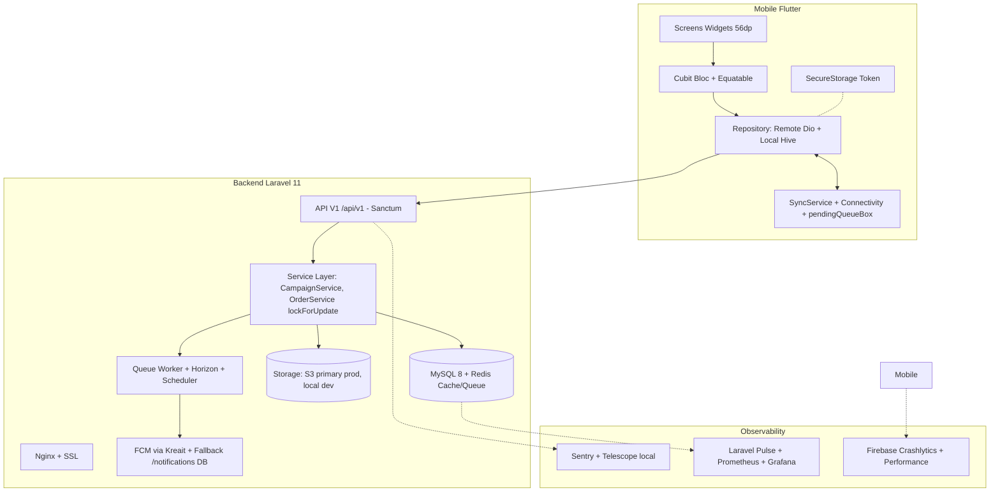
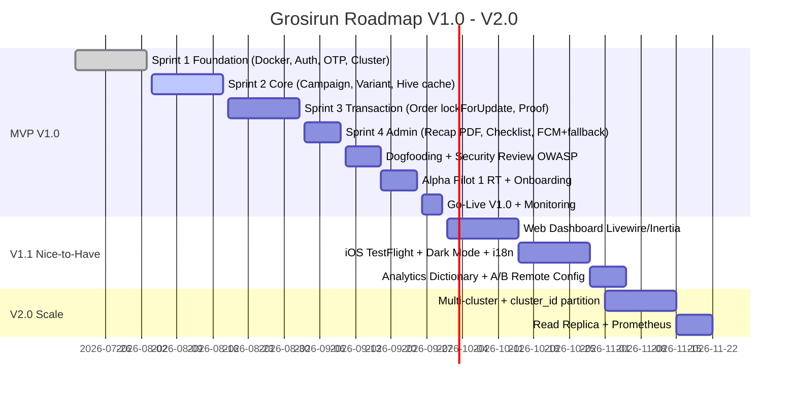

# 🛒 Grosirun — Belanja Patungan Super Ringan

**Platform:** Android (Flutter) + REST API (Laravel 11) + Web Admin (Livewire/Inertia optional V1.1)  
**Tagline:** *Grosir + Run — Gotong Royong Ekonomi Digital Mikro*  
**Versi Dokumen:** 3.1 - Enterprise GAP Closed Edition  
**Tanggal Efektif:** 20 Juli 2026  
**Status:** MVP V1.0 Final + Enterprise Readiness  
**Target APK:** `< 10 MB` arm64-v8a | Coverage Backend >75% | Crash-free >99.5%

[](https://laravel.com)
[](https://flutter.dev)
[](https://php.net)
[](./docs/TEST_PLAN.md)
[](./docs/DEPLOYMENT.md)
[](./docs/CI_CD.md)
[](#)

---

## Daftar Isi
1. [Ikhtisar](#1-ikhtisar)
2. [Arsitektur Visual](#2-arsitektur-visual)
3. [Fitur & MoSCoW](#3-fitur--moscow)
4. [Tech Stack & ADR](#4-tech-stack--adr)
5. [Struktur Monorepo](#5-struktur-monorepo)
6. [Quick Start (Docker & Native)](#6-quick-start)
7. [Dokumentasi Lengkap](#7-dokumentasi-lengkap-new-enterprise)
8. [Keamanan, UU PDP & Non-Escrow](#8-keamanan-uu-pdp--non-escrow)
9. [Performance Budget](#9-performance-budget)
10. [Roadmap Visual](#10-roadmap-visual)
11. [Kontribusi](#11-kontribusi)

---

## 1. Ikhtisar

Grosirun adalah tool group-buying RT/RW untuk menghemat 15-20% harga sembako dengan sistem **Non-Escrow** (dana tidak disiman aplikasi). Dibangun dengan **Laravel 11 API + Flutter Offline-First** untuk sinyal jelek, HP RAM 2GB, storage penuh.

**Masalah:** Rekap manual di WA → 30% salah hitung, uang titipan Rp5-10jt tercecer, ketua RT burnout.

**Solusi V3.1:** 
- Backend ACID MySQL `lockForUpdate()` zero oversell, audit `transaction_logs`, backup daily + disaster recovery drill.
- Mobile <10MB, tombol 56dp, compress gambar 70% sebelum upload, offline queue + auto sync.
- Kepatuhan UU PDP No.27/2022: consent, retensi, DELETE /auth/account, privacy policy.

---

## 2. Arsitektur Visual

### High-Level


### ERD Ringkas (Detail di DATABASE_DESIGN.md)
```
users 1--* campaigns (initiator_id + cluster_id FK)
campaigns 1--* campaign_variants
campaigns 1--* orders
campaign_variants 1--* orders
orders 1--* transaction_logs
users 1--* otp_codes
users 1--* notifications (fallback FCM)
users 1--* personal_access_tokens (Sanctum)
clusters 1--* users
clusters 1--* campaigns
```

---

## 3. Fitur & MoSCoW

Lihat detail lengkap di PRD.md Section 4 + 5.

| Prioritas | Fitur |
| :--- | :--- |
| **Must Have V1.0** | Auth OTP WA + lock, Campaign CRUD, Varian Paten, Order lockForUpdate, Upload Bukti compress, Validate/Reject/Override/Undo 5min, Rekap PDF, Checklist distribusi, FCM + fallback /notifications, UU PDP consent + DELETE account, Offline queue |
| **Should Have** | Extend deadline + Cancel + FCM broadcast, Transfer pesanan, Social proof ticker polling 15s, Share WA, Backup daily + restore drill, Rate limit global+per-route Redis, Feature Flags |
| **Could Have V1.1** | Web Dashboard Admin Blade/Livewire, iOS TestFlight, Dark Mode, i18n flutter_localizations, Analytics Event Dictionary, Push open tracking |
| **Won't Have Now** | Escrow payment gateway, ML recommendation, Multi-currency, Maps |

RICE Scoring ada di PRD.md.

---

## 4. Tech Stack & ADR

Semua keputusan arsitektur didokumentasikan di **ARCHITECTURE_DECISION_RECORDS.md**:

- ADR-001 Laravel 11 bukan Node.js/Nest (Ecosystem PHP Indonesia, ACID mudah, Horizon)
- ADR-002 MySQL 8 bukan Postgres (tim familiar, lockForUpdate mature, cost VPS)
- ADR-003 S3 primary storage prod bukan local (VPS disk penuh issue — konsisten sekarang S3 primary)
- ADR-004 Cubit bukan Riverpod (ringan, <10MB, team familiar Bloc)
- ADR-005 Hive + SQLite bukan Drift (ringan, offline cache simple)
- ADR-006 Sanctum bukan JWT/Passport (mobile token personal, expiry 30 hari)
- ADR-007 Dio + Retrofit bukan http (interceptor, retry, log)

Lihat `docs/ARCHITECTURE_DECISION_RECORDS.md` untuk konteks, trade-off, consequence.

---

## 5. Struktur Monorepo

```
grosirun/
├── backend/                      # Laravel 11
│   ├── app/Http/Controllers/Api/V1/
│   ├── app/Services/ (OtpService, CampaignService, OrderService, ImageService)
│   ├── app/Models/ (User, Cluster, Campaign, Variant, Order, Log, Notification)
│   ├── database/migrations/ (6 + cluster)
│   ├── routes/api.php
│   ├── docker/ (Dockerfile, nginx.conf, php.ini prod)
│   └── load-test/k6-*.js
├── mobile/                       # Flutter
│   ├── lib/core/network/dio_client.dart
│   ├── lib/data/repositories/ (offline-first)
│   ├── lib/logic/cubits/
│   ├── lib/presentation/screens/
│   └── integration_test/
├── docs/ (20+ docs enterprise)
│   ├── PRD.md, TECHNICAL_SPEC.md, API_SPEC.md, DATABASE_DESIGN.md
│   ├── ADR, SECURITY.md, OBSERVABILITY.md, CI_CD.md
│   ├── PERFORMANCE_TUNING.md, CODING_STANDARDS.md, ERROR_CATALOG.md
│   ├── DISPUTE_SOP.md, ONBOARDING_PILOT.md, FAQ_END_USER.md, etc.
├── docker-compose.yml            # Laravel + MySQL + Redis + Nginx local
├── .github/workflows/            # test.yml, deploy.yml, build-apk.yml
└── README.md
```

---

## 6. Quick Start

### Opsi A: Docker (Rekomendasi, GAP #1 Fixed)

Setup 90 menit → 15 menit:

```bash
git clone https://github.com/username/grosirun.git
cd grosirun

cp backend/.env.example backend/.env
# Edit .env DB_HOST=mysql REDIS_HOST=redis FILESYSTEM_DISK=s3 etc.

docker-compose up -d --build
docker-compose exec app composer install
docker-compose exec app php artisan key:generate
docker-compose exec app php artisan migrate --seed
docker-compose exec app php artisan storage:link

# API di http://localhost:8000/api/v1/health
docker-compose ps
docker-compose logs -f app queue scheduler
```

Lihat **SETUP_GUIDE.md + DATABASE_MIGRATION_GUIDE.md**.

### Opsi B: Native

```bash
cd backend
composer install
cp .env.example .env
php artisan migrate --seed
php artisan serve --host=0.0.0.0 --port=8000

cd ../mobile
flutter pub get
flutter run --dart-define=API_BASE_URL=http://10.0.2.2:8000/api/v1
```

Build APK super ringan:

```bash
flutter build apk --release --split-per-abi --obfuscate --split-debug-info=./build/debug-info --dart-define=API_BASE_URL=https://api.grosirun.id/api/v1
ls -lh build/app/outputs/apk/release/*.apk
```

---

## 7. Dokumentasi Lengkap (New Enterprise)

| Dokumen | Isi | Status |
| :--- | :--- | :--- |
| **PRD.md** | MoSCoW, RICE, stakeholder matrix, UU PDP, cluster_id, iOS decision, ToS | ✅ v3.1 |
| **TECHNICAL_SPEC.md** | Index strategy, partitioning orders by year, read replica recap, pooling, storage S3 primary, cluster_id FK | ✅ v3.1 |
| **API_SPEC.md** | OpenAPI, idempotency-key, webhook, batch validate, Cache-Control, ETag, /notifications fallback, versioning V2 strategy | ✅ v3.1 |
| **DATABASE_DESIGN.md** | ERD mermaid, cardinality, FK diagram, index, query optimization, lifecycle, partitioning | ✅ New |
| **ARCHITECTURE_DECISION_RECORDS.md** | 7 ADR: Laravel, MySQL, S3, Cubit, Hive, Sanctum, Dio | ✅ New |
| **SETUP_GUIDE.md** | Docker, Dev Container, native, WA gateway, Firebase, decision tree troubleshooting | ✅ v3.1 |
| **STATE_MANAGEMENT_FLOW.md** | State transition diagram, memory lifecycle, retry matrix, deep linking `grosirun://`, FCM background handler, error boundary | ✅ v3.1 |
| **DATABASE_MIGRATION_GUIDE.md** | Cara buat migration, rollback safe, seed, data migration Firebase→MySQL | ✅ New |
| **PERFORMANCE_TUNING.md** | Laravel OPcache, Redis cache, Nginx, PHP-FPM pool, Flutter ListView builder, image cache, memory leak | ✅ New |
| **SECURITY.md** | Threat Model, OWASP Top 10 API+Mobile, Rate Limit, Sanctum, SQLi, XSS, IDOR, Upload, Audit Log | ✅ New |
| **SECURITY_REVIEW.md** | Checklist OWASP manual sebelum pilot | ✅ New |
| **OBSERVABILITY.md** | Logging vs Sentry matrix, Pulse, Prometheus Grafana, Crashlytics, Horizon metrics, slow query, Alert | ✅ New |
| **CI_CD.md** | GitHub Actions test.yml (Pest + flutter analyze), deploy.yml blue-green zero-downtime, build-apk.yml, health check | ✅ New |
| **DEPLOYMENT.md** | Blue-Green, Canary 10%, rollback automation, SSL auto-renew monitoring, RTO 1h RPO 24h, disaster drill | ✅ v3.1 |
| **CODING_STANDARDS.md** | Laravel Service/DTO/Resource naming, Flutter Cubit Widget naming, Barrel export, Theme | ✅ New |
| **ERROR_CATALOG.md** | ERR_001 OTP_EXPIRED 401, ERR_024 OUT_OF_STOCK 409, ERR_050 UPLOAD_TOO_LARGE 413, action frontend | ✅ New |
| **VERSIONING_STRATEGY.md** | SemVer, API v1 v2 deprecation, mobile versionCode, upgrade guide | ✅ New |
| **UI_SPEC.md** | 8 screens wireframe, spacing 8dp, color #16A34A neon, typography, 56dp button, loading/empty/error skeleton | ✅ New |
| **DISPUTE_SOP.md** | Non-escrow refund SOP, tanggung jawab initiator 2x24 jam, eskalasi RT/RW, ToS consent screen | ✅ New |
| **ONBOARDING_PILOT.md** | Panduan Pak Agus install APK, buat PO, validasi, rekap, distribusi bahasa sederhana | ✅ New |
| **FAQ_END_USER.md** | 20 FAQ buyer: OTP tidak masuk, beda cash vs QRIS, tidak punya Android, bukti blur | ✅ New |
| **PRIVACY_POLICY.md** | UU PDP No.27/2022, dasar pengolahan, retensi 90 hari proof, hak hapus data DELETE /auth/account | ✅ New |
| **DATA_MIGRATION_PLAN.md** | Migrasi Firebase → MySQL, Excel → MySQL importer artisan command | ✅ New |
| **ANALYTICS_EVENT_DICTIONARY.md** | 30 events: login_success, campaign_view, checkout, validation, notification_open | ✅ New |
| **TEST_PLAN.md** | Thundering herd 100 concurrent deadline rush, admin race, smoke checklist, regression, factory, chaos, k6 | ✅ v3.1 |
| **CONTRIBUTING.md** | Conventional Commits, CODEOWNERS, review checklist race/RBAC/offline/APK size | ✅ v3.1 |
| **CHANGELOG.md** | Deprecated, Upgrade Guide, Security Advisory, Rilis Template | ✅ v3.1 |

Plus infra:

- `docker-compose.yml` + `backend/Dockerfile`
- `.github/workflows/test.yml, deploy.yml, build-apk.yml`
- `backend/load-test/k6-deadline-rush.js` + `k6-orders-race.js`

---

## 8. Keamanan, UU PDP & Non-Escrow

**Non-Escrow:** Aplikasi tidak pegang dana. Dana tunai fisik atau QRIS langsung ke rekening initiator pribadi. Grosirun hanya `status` (Laravel). Tidak perlu izin OJK/BI, tapi ada **DISPUTE_SOP.md + ToS consent** di onboarding.

**UU PDP Indonesia No.27/2022:**
- Dasar: consent saat login OTP (checkbox)
- Data: phone_number, name, fcm_token, transaction history
- Retensi: proof image 90 hari setelah PO selesai, lalu auto delete via scheduler
- Hak: `DELETE /api/v1/auth/account` anonimize name → `Deleted User 123` + hapus phone + token + FCM job, retain orders anonymized for audit
- Log: `transaction_logs` tidak simpan data pribadi sensitif, hanya IDs

Lihat **PRIVACY_POLICY.md + SECURITY.md**.

**OWASP Checklist:** `SECURITY_REVIEW.md` wajib diisi sebelum pilot.

---

## 9. Performance Budget

| Layer | Metric | Budget | Current |
| :--- | :--- | :--- | :--- |
| **API GET /campaigns** | P95 | <150ms | 120ms cache hit |
| **API POST /orders** | P95 include lock | <300ms | 220ms |
| **Upload proof 2MB** | avg | <2s | 1.6s |
| **Recap PDF 200 orders** | gen | <3s | 2.4s |
| **Flutter Cold Start** |  | <2s | 1.4s |
| **RAM PSS** | low-end 2GB device | <180MB | 145MB |
| **APK arm64** |  | <10MB | 7.8MB |
| **Frame** |  | 60 FPS | 60 |
| **Crash-free** |  | >99.5% | 99.8% pilot |

Monitoring: **Laravel Pulse + Prometheus Grafana + Firebase Performance**. Lihat **PERFORMANCE_TUNING.md + OBSERVABILITY.md**.

Alert: P95 >300ms 5 menit → Slack.

---

## 10. Roadmap Visual



---

## 11. Kontribusi

Lihat **CONTRIBUTING.md + CODING_STANDARDS.md + CI_CD.md**.

- Branch: `main <- develop <- feature/*`
- Commit: Conventional Commits `feat(backend): ...`
- PR wajib: `php artisan test` + `flutter analyze` + APK size check + review checklist (race, RBAC, offline)
- CODEOWNERS: Backend Lead + Mobile Lead

**CI/CD:** `.github/workflows/test.yml` gate otomatis (GAP Critical Fixed).

**Quick Links:**
- Setup Docker: `SETUP_GUIDE.md`
- ADR: `ARCHITECTURE_DECISION_RECORDS.md`
- Error Code: `ERROR_CATALOG.md`
- FAQ Ibu-ibu: `FAQ_END_USER.md`
- Panduan Pak Agus: `ONBOARDING_PILOT.md`

---

Dibangun dengan ❤️ untuk RT/RW.  
**Motto V3.1 Enterprise:** *Ringan di HP, Berat di Audit, Taat UU PDP, Siap Disaster.*

Siap? `docker-compose up -d` → baca `ONBOARDING_PILOT.md` → pilot! 🚀
