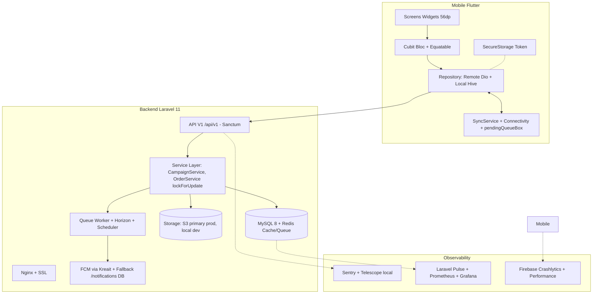
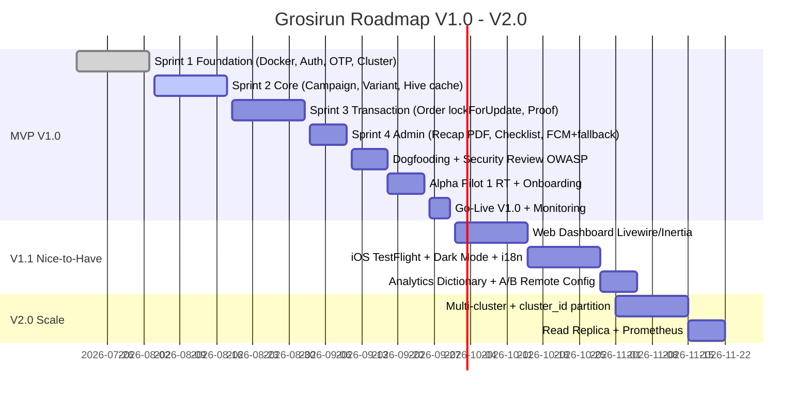

# 🛒 Grosirun — Belanja Patungan Super Ringan

**Platform:** Android (Flutter) + REST API (Laravel 11) + Web Admin (Livewire/Inertia optional V1.1)  
**Tagline:** *Grosir + Run — Gotong Royong Ekonomi Digital Mikro*  
**Versi Dokumen:** 3.1 - Enterprise GAP Closed Edition  
**Tanggal Efektif:** 20 Juli 2026  
**Status Dokumentasi:** Final
**Status Implementasi:** Belum Dimulai
**Target Release:** MVP V1.0
**Target APK:** `< 10 MB` arm64-v8a | Coverage Backend ≥80% | Crash-free >99.5%

[](https://laravel.com)
[](https://flutter.dev)
[](https://php.net)
[](./docs/TEST_PLAN.md)
[](./docs/DEPLOYMENT.md)
[](#status)
[](#)


📚 **[Indeks Dokumentasi, urutan membaca, glossary, dan traceability](docs/README.md)**
---

## Daftar Isi
1. [Ikhtisar](#1-ikhtisar)
2. [Arsitektur Visual](#2-arsitektur-visual)
3. [Fitur & MoSCoW](#3-fitur--moscow)
4. [Tech Stack & ADR](#4-tech-stack--adr)
5. [Struktur Monorepo](#5-struktur-monorepo)
6. [Quick Start (Docker & Native)](#6-quick-start)
7. [Dokumentasi Lengkap](#7-dokumentasi-lengkap-new-enterprise)
8. [Keamanan, UU PDP & Non-Escrow](#8-keamanan-uu-pdp--non-escrow)
9. [Performance Budget](#9-performance-budget)
10. [Roadmap Visual](#10-roadmap-visual)
11. [Kontribusi](#11-kontribusi)

---

## 1. Ikhtisar

Grosirun adalah tool group-buying RT/RW untuk menghemat 15-20% harga sembako dengan sistem **Non-Escrow** (dana tidak disiman aplikasi). Dibangun dengan **Laravel 11 API + Flutter Offline-First** untuk sinyal jelek, HP RAM 2GB, storage penuh.

**Masalah:** Rekap manual di WA → 30% salah hitung, uang titipan Rp5-10jt tercecer, ketua RT burnout.

**Solusi V3.1:**
- Empat role utama: Pembeli (`buyer`), Inisiator (`initiator`), Penjual (`seller`), dan Admin aplikasi (`admin`), dengan dukungan multi-role.
- Alur penawaran-ke-campaign: Penjual membuat penawaran supplier; Inisiator membuat campaign dari penawaran aktif dan tersimpan sebagai snapshot.
- Purchase order menghubungkan campaign Inisiator dengan fulfillment Penjual tanpa membuka data pribadi Pembeli.
- Backend ACID MySQL `lockForUpdate()` mencegah oversell, dengan audit `transaction_logs`, backup harian, dan disaster recovery drill.
- Mobile ringan, kompresi gambar sebelum upload, offline queue, dan sinkronisasi otomatis.
- Kepatuhan UU PDP No.27/2022: consent, retensi, penghapusan akun, serta pemisahan data Pembeli dan Penjual.

---

## 2. Arsitektur Visual

### High-Level


### ERD Ringkas (Detail di [TECHNICAL_SPEC.md](docs/TECHNICAL_SPEC.md))
```
users 1--* campaigns (initiator_id + cluster_id FK)
campaigns 1--* campaign_variants
campaigns 1--* orders
campaign_variants 1--* orders
orders 1--* transaction_logs
users 1--* otp_codes
users 1--* notifications (fallback FCM)
users 1--* personal_access_tokens (Sanctum)
clusters 1--* users
clusters 1--* campaigns
```

---

## 3. Fitur & MoSCoW

Lihat detail lengkap di [PRD.md](docs/PRD.md) Section 4 + 5.

| Prioritas | Fitur |
| :--- | :--- |
| **Must Have V1.0** | Auth OTP WA + lock, Campaign CRUD, Varian Paten, Order lockForUpdate, Upload Bukti compress, Validate/Reject/Override/Undo 5min, Rekap PDF, Checklist distribusi, FCM + fallback /notifications, UU PDP consent + DELETE account, Offline queue |
| **Should Have** | Extend deadline + Cancel + FCM broadcast, Transfer pesanan, Social proof ticker polling 15s, Share WA, Backup daily + restore drill, Rate limit global+per-route Redis, Feature Flags |
| **Could Have V1.1** | Web Dashboard Admin Blade/Livewire, iOS TestFlight, Dark Mode, i18n flutter_localizations, Analytics Event Dictionary, Push open tracking |
| **Won't Have Now** | Escrow payment gateway, ML recommendation, Multi-currency, Maps |

RICE Scoring ada di [PRD.md](docs/PRD.md).

---

## 4. Tech Stack & ADR

Semua keputusan arsitektur didokumentasikan di **[ARCHITECTURE_DECISION_RECORDS.md](docs/ARCHITECTURE_DECISION_RECORDS.md)**:

- ADR-001 Laravel 11 bukan Node.js/Nest (Ecosystem PHP Indonesia, ACID mudah, Horizon)
- ADR-002 MySQL 8 bukan Postgres (tim familiar, lockForUpdate mature, cost VPS)
- ADR-003 S3 primary storage prod bukan local (VPS disk penuh issue — konsisten sekarang S3 primary)
- ADR-004 Cubit bukan Riverpod (ringan, <10MB, team familiar Bloc)
- ADR-005 Hive + SQLite bukan Drift (ringan, offline cache simple)
- ADR-006 Sanctum bukan JWT/Passport (mobile token personal, expiry 30 hari)
- ADR-007 Dio + Retrofit bukan http (interceptor, retry, log)

Lihat `docs/ARCHITECTURE_DECISION_RECORDS.md` untuk konteks, trade-off, consequence.

---

## 5. Struktur Monorepo

```
grosirun/
├── backend/                      # Laravel 11
│   ├── app/Http/Controllers/Api/V1/
│   ├── app/Services/ (OtpService, CampaignService, OrderService, ImageService)
│   ├── app/Models/ (User, Cluster, Campaign, Variant, Order, Log, Notification)
│   ├── database/migrations/ (6 + cluster)
│   ├── routes/api.php
│   ├── docker/ (Dockerfile, nginx.conf, php.ini prod)
│   └── load-test/k6-*.js
├── mobile/                       # Flutter
│   ├── lib/core/network/dio_client.dart
│   ├── lib/data/repositories/ (offline-first)
│   ├── lib/logic/cubits/
│   ├── lib/presentation/screens/
│   └── integration_test/
├── docs/ (17 dokumen domain + 1 indeks)
│   ├── PRD.md, TECHNICAL_SPEC.md, API_SPEC.md
│   ├── ADR, SECURITY.md, OBSERVABILITY.md, [Deployment §2](docs/DEPLOYMENT.md#2-ci-quality-gates--build-pipelines)
│   ├── OBSERVABILITY.md bagian 3 dan 7 — Performance Engineering, DEVELOPMENT_GUIDE.md, API_SPEC.md bagian 1.4 — Format dan Katalog Error
│   ├── [User Guide §7–8](docs/USER_GUIDE.md#7-komplain-refund-dan-dispute-operations), USER_GUIDE.md, etc.
├── docker-compose.yml            # Laravel + MySQL + Redis + Nginx local
├── .github/workflows/            # test.yml, deploy.yml, build-apk.yml
└── README.md
```

---

## 6. Quick Start

### Opsi A: Docker (Rekomendasi, GAP #1 Fixed)

Setup 90 menit → 15 menit:

```bash
git clone https://github.com/username/grosirun.git
cd grosirun

cp backend/.env.example backend/.env
# Edit .env DB_HOST=mysql REDIS_HOST=redis FILESYSTEM_DISK=s3 etc.

docker-compose up -d --build
docker-compose exec app composer install
docker-compose exec app php artisan key:generate
docker-compose exec app php artisan migrate --seed
docker-compose exec app php artisan storage:link

# API di http://localhost:8000/api/v1/health
docker-compose ps
docker-compose logs -f app queue scheduler
```

Lihat **[SETUP_GUIDE.md](docs/SETUP_GUIDE.md) + [Technical Specification §19](docs/TECHNICAL_SPEC.md#19-panduan-migrasi-database)**.

### Opsi B: Native

```bash
cd backend
composer install
cp .env.example .env
php artisan migrate --seed
php artisan serve --host=0.0.0.0 --port=8000

cd ../mobile
flutter pub get
flutter run --dart-define=API_BASE_URL=http://10.0.2.2:8000/api/v1
```

Build APK super ringan:

```bash
flutter build apk --release --split-per-abi --obfuscate --split-debug-info=./build/debug-info --dart-define=API_BASE_URL=https://api.grosirun.id/api/v1
ls -lh build/app/outputs/apk/release/*.apk
```

---

## 7. Dokumentasi Lengkap (New Enterprise)

| Dokumen | Isi | Status |
| :--- | :--- | :--- |
| **[PRD.md](docs/PRD.md)** | Requirement, scope, role, penawaran-ke-campaign, lifecycle, failure/refund | Final specification |
| **[BUSINESS_ANALYSIS.md](docs/BUSINESS_ANALYSIS.md)** | Unit economics, market, legal-finance assumptions, GTM | Final specification |
| **[TECHNICAL_SPEC.md](docs/TECHNICAL_SPEC.md)** | Architecture, ERD penawaran-ke-campaign, database, migration, storage, service layer | Final specification |
| **[API_SPEC.md](docs/API_SPEC.md)** | REST contract, canonical errors, seller/admin/dispute APIs, versioning | Final specification |
| **[MOBILE_SPEC.md](docs/MOBILE_SPEC.md)** | UX, design system, screen map, Cubit, offline, deep link, FCM | Final specification |
| **[SECURITY.md](docs/SECURITY.md)** | Threat model, RBAC, privacy boundary, OWASP, security review | Final specification |
| **[PRIVACY_POLICY.md](docs/PRIVACY_POLICY.md)** | UU PDP, consent, rights, retention, third party | Final legal document |
| **[TEST_PLAN.md](docs/TEST_PLAN.md)** | Unit, feature, integration, race, security, performance plan | Final specification |
| **[DEPLOYMENT.md](docs/DEPLOYMENT.md)** | CI gates, build, deploy, canary, rollback, monitoring, DR | Final specification |
| **[DEVELOPMENT_GUIDE.md](docs/DEVELOPMENT_GUIDE.md)** | Coding standards, Git, PR, review, testing, contribution | Final specification |
| **[OBSERVABILITY.md](docs/OBSERVABILITY.md)** | Logs, traces, metrics, performance engineering, 59 analytics events | Final specification |
| **[USER_GUIDE.md](docs/USER_GUIDE.md)** | Role guide, FAQ, troubleshooting, refund dan dispute operations | Final operations manual |
| **[PROPOSAL_PENJUAL_PEMBELI_INISIATOR.md](docs/PROPOSAL_PENJUAL_PEMBELI_INISIATOR.md)** | Proposal persuasif dan materi validasi untuk tiga stakeholder | Final communication material |
| **[PRESENTASI_GROSIRUN.md](docs/PRESENTASI_GROSIRUN.md)** | Naskah slide akurat untuk presentasi stakeholder dan pilot | Final presentation material |
| **[ARCHITECTURE_DECISION_RECORDS.md](docs/ARCHITECTURE_DECISION_RECORDS.md)** | 8 accepted architecture decisions | Final decision record |
| **[SETUP_GUIDE.md](docs/SETUP_GUIDE.md)** | Local environment, dependencies, Firebase, S3, WA gateway | Final specification |
| **[CHANGELOG.md](docs/CHANGELOG.md)** | Version strategy and release history | Maintained per release |

Plus infra:

- `docker-compose.yml` + `backend/Dockerfile`
- `.github/workflows/test.yml, deploy.yml, build-apk.yml`
- `backend/load-test/k6-deadline-rush.js` + `k6-orders-race.js`

---

## 8. Keamanan, UU PDP & Non-Escrow

**Non-Escrow:** Aplikasi tidak pegang dana. Dana tunai fisik atau QRIS langsung ke rekening initiator pribadi. Grosirun hanya `status` (Laravel). Tidak perlu izin OJK/BI, tapi ada **[User Guide §7–8](docs/USER_GUIDE.md#7-komplain-refund-dan-dispute-operations) + ToS consent** di onboarding.

**UU PDP Indonesia No.27/2022:**
- Dasar: consent saat login OTP (checkbox)
- Data: phone_number, name, fcm_token, transaction history
- Retensi: proof image 90 hari setelah PO selesai, lalu auto delete via scheduler
- Hak: `DELETE /api/v1/auth/account` anonimize name → `Deleted User 123` + hapus phone + token + FCM job, retain orders anonymized for audit
- Log: `transaction_logs` tidak simpan data pribadi sensitif, hanya IDs

Lihat **[PRIVACY_POLICY.md](docs/PRIVACY_POLICY.md) + [SECURITY.md](docs/SECURITY.md)**.

**OWASP Checklist:** `SECURITY.md bagian Checklist Review Keamanan` wajib diisi sebelum pilot.

---

## 9. Performance Budget

| Layer | Metric | Budget | Hasil aktual |
| :--- | :--- | :--- | :--- |
| API GET /campaigns | P95 | <150ms | Belum diukur |
| API POST /orders | P95 | <300ms | Belum diukur |
| API GET /offers | P95 | <200ms | Belum diukur |
| API POST /campaigns | P95 | <350ms | Belum diukur |
| Flutter cold start | — | <2s | Belum diukur |
| RAM PSS | HP RAM 2GB | <180MB | Belum diukur |
| APK arm64 | — | <10MB | Belum diukur |
| Crash-free | — | >99.5% | Belum diukur |

Monitoring: **Laravel Pulse + Prometheus Grafana + Firebase Performance**. Lihat **[OBSERVABILITY.md](docs/OBSERVABILITY.md)**.

Alert: P95 >300ms 5 menit → Slack.

---

## 10. Roadmap Visual



---

## 11. Kontribusi

Lihat **[DEVELOPMENT_GUIDE.md](docs/DEVELOPMENT_GUIDE.md) + [Deployment §2](docs/DEPLOYMENT.md#2-ci-quality-gates--build-pipelines)**.

- Branch: `main <- develop <- feature/*`
- Commit: Conventional Commits `feat(backend): ...`
- PR wajib: `php artisan test` + `flutter analyze` + APK size check + review checklist (race, RBAC, offline)
- CODEOWNERS: Backend Lead + Mobile Lead

**CI/CD:** `.github/workflows/test.yml` gate otomatis (GAP Critical Fixed).

**Quick Links:**
- Setup Docker: `SETUP_GUIDE.md`
- ADR: `ARCHITECTURE_DECISION_RECORDS.md`
- Error Code: `API_SPEC.md bagian 1.4 — Format dan Katalog Error`
- FAQ Ibu-ibu: `USER_GUIDE.md`
- Panduan Pak Agus: `USER_GUIDE.md`

---

Dibangun dengan ❤️ untuk RT/RW.  
**Motto V3.1 Enterprise:** *Ringan di HP, Berat di Audit, Taat UU PDP, Siap Disaster.*

Siap? `docker-compose up -d` → baca `USER_GUIDE.md` → pilot! 🚀
