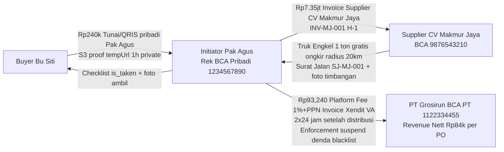

# BUSINESS ANALYSIS V2.2 - Grosirun

**Tanggal:** 20 Juli 2026  
**Versi:** 2.2
**Owner:** Product, Finance & Legal
**Review Cycle:** Setiap release
**Global Glossary:** [Indeks Dokumentasi](README.md#glossary-global-indonesiainggris)
**Status Dokumen:** Final
**Status Implementasi:** Belum Dimulai

---

## Daftar Isi

1. Konstanta Bisnis V2.2 Final
2. Executive Summary & Scorecard
3. Alur Dana Final V2.2 Solid
4. Mekanisme Penegakan Komisi Solid
5. Legalitas, PSE, PJP OJK/BI, Pajak & Badan Hukum
6. Market Sizing Bottom-Up Realistis
7. Cost Structure Realistis V2.2
8. Sensitivity Stress Test Konsisten 20Kg Avg
9. Logistik Fisik Truk, Ongkir, Rusak
10. RICE Scoring Konsisten Final
11. Buyer Churn, Initiator Churn Cohort & LTV/CAC >3 Solution
12. Business Model Canvas V2.2 Final
13. SWOT, Porter & PESTEL Update Legal Pajak
14. Kompetitor Matrix 20 Fitur
15. Monetization 3 Skenario Final
16. Growth Loops & GTM Ngoro→Surabaya
17. North Star, 12 KPI & Financial Projection 12 Bulan Realistis
18. Cash Flow Timing Risk Initiator
19. Roadmap, OKR & Next Step

---

## 1. Konstanta Bisnis V2.2 Final

**Semua angka di dokumen ini merujuk tabel ini.**

| Konstanta                                    | Nilai Final                                         | Sumber                                  |
| :------------------------------------------- | :-------------------------------------------------- | :-------------------------------------- |
| ECERAN                                       | Rp14,000/kg                                         | Survey pasar Ngoro 15 warung Juli 2026  |
| TIER1 Supplier→Initiator                     | Rp10,500/kg                                         | MoU CV Makmur Jaya Tier 1 ton           |
| TIER1 Initiator→Buyer                        | Rp12,000/kg                                         | Hemat Rp2,000/kg = 14% vs eceran        |
| TIER2 Supplier→Initiator                     | Rp10,000/kg                                         | MoU Tier 10 ton gabung 10 RT            |
| TIER2 Initiator→Buyer                        | Rp11,000/kg                                         | Hemat Rp3,000/kg = 21% vs eceran        |
| AVG_KG_PER_BUYER_PER_PO                      | 20 Kg                                               | Pilot PGH-RT03 rata-rata 20Kg           |
| BUYERS_PER_CLUSTER_TOTAL                     | 50 KK                                               | 1 RT 50 KK                              |
| ADOPTION_70                                  | 35 buyers (70% dari 50)                             | Pilot 35/50 =70%                        |
| ACTUAL_KG_PER_PO_AT_70                       | 700 Kg (35×20)                                      | 70% dari target 1,000Kg                 |
| TARGET_QUANTITY_PER_PO                             | 1,000 Kg                                            | 1 ton target                            |
| GMV_PER_PO_AT_70_TIER1                       | Rp8,400,000 (700×12,000)                            | GMV aktual, bukan target                |
| GMV_PER_PO_TARGET_100                        | Rp12,000,000 (1000×12,000)                          | Jika 100% adoption                      |
| GMV_PER_MONTH_PER_CLUSTER_AT_70              | Rp16,800,000 (2 PO × 8.4M)                          | 2 PO/bulan                              |
| PLATFORM_FEE_RATE                            | 1% GMV                                              | Fee jasa teknologi                      |
| PLATFORM_FEE_GROSS_PER_PO_AT_70              | Rp84,000 (1% × 8.4M)                                | Gross sebelum PPN                       |
| PPN                                          | 11%                                                 | UU PPN                                  |
| PLATFORM_FEE_TAGIH_PER_PO                    | Rp93,240 (84k + 11% PPN)                            | Tagih ke Initiator via Xendit VA        |
| PLATFORM_FEE_NETT_PENDAPATAN_GROSIRUN_PER_PO | Rp84,000                                            | Nett revenue Grosirun sebelum PPh Badan |
| MARGIN_INITIATOR_PER_KG_TIER1                | Rp1,500/kg (12,000-10,500)                          | Selisih jual-beli                       |
| MARGIN_BRUTO_INITIATOR_PER_PO_AT_70          | Rp1,050,000 (700×1,500)                             | Bruto sebelum fee                       |
| LABA_BERSIH_INITIATOR_PER_PO_AT_70           | Rp956,760 (1,050,000 - 93,240)                      | Setelah bayar platform fee+PPN          |
| LABA_BERSIH_INITIATOR_PER_BULAN_AT_70        | Rp1,913,520 (2 PO)                                  | Per cluster per bulan                   |
| FONNTE_COST_PER_WA                           | Rp300/message                                       | Harga Fonnte per WA terkirim            |
| WA_NOTIF_PER_BUYER_PER_PO                    | 3 messages (order, validasi, distribusi)            | -                                       |
| CS_COST_PER_20_CLUSTERS                      | 1 CS full-time Rp4,000,000/bulan handle 20 clusters | Rp200k per cluster                      |
| VPS_COST_2CPU_4GB                            | Rp300,000/bulan shared up to 20 clusters            | Rp300k total                            |
| S3_COST_PER_CLUSTER                          | Rp20,000/bulan (400MB proof)                        | Linear per penyimpanan                  |
| XENDIT_INVOICE_FEE                           | Rp5,000/invoice                                     | 2 PO = Rp10k/bulan/cluster              |

**Catatan:** Semua GMV, revenue, margin menggunakan **ACTUAL 700Kg AT_70% ADOPTION Tier1** sebagai base case. Untuk Tier2, GMV per PO AT_70 = 700 × 11,000 = 7.7M.

---

## 2. Executive Summary & Scorecard Final V2.2

**Tech Readiness:** 9/10 enterprise ready  
**Business V1.0:** 5.5/10 (tool admin revenue 0)

**3 Fix Wajib Sebelum Scale 3 RT:**

1. **Komisi margin model solid** (Section 3)
2. **Enforcement PKM + Xendit suspend** (Section 4)
3. **Play Store + referral** (bukan ads sebagai penopang BEP di bulan 3)

**Scorecard V2.2 Target:** 7.9/10 setelah seluruh perbaikan.

---

## 3. Alur Dana Final V2.2 Solid

### 3.1 Alur 5 Langkah Final

**Langkah 1 - Buyer Pesan**

Bu Siti pesan 20Kg (1 varian 5Kg + 1 varian 10Kg + 1 varian 5Kg) di aplikasi, pilih Tunai, order created pending, total_price server hitung Rp240,000 (20Kg × Tier1 12,000). current_quantity +20 atomic lockForUpdate.

**Langkah 2 - Buyer Bayar ke Initiator (Rekening Pribadi Pak Agus, Bukan Grosirun)**

Bu Siti datang fisik bayar tunai Rp240k atau transfer QRIS pribadi Pak Agus BCA 1234567890 a.n Agus Setiawan. Grosirun tidak pernah terima Rp240k. S3 proof private tempUrl 1h jika QRIS.

**Langkah 3 - Initiator Kumpulkan Dana**

Pak Agus kumpulkan 35 buyers × 20Kg = 700Kg actual. GMV terkumpul di rekening pribadi Pak Agus BCA = 700Kg × 12,000 = Rp8,400,000 per PO. Rekening pribadi, bukan escrow Grosirun.

**Langkah 4 - Initiator Bayar Supplier**

Pak Agus transfer Rp7,350,000 (700Kg × Tier1 Supplier→Initiator 10,500) dari rekening pribadinya ke BCA CV Makmur Jaya 9876543210 berdasarkan Invoice Supplier No. INV-MJ-2026-07-001 H-1 sebelum truk. Deadline H-1.

Sisa di rekening Pak Agus = Rp8,400,000 - Rp7,350,000 = Rp1,050,000 margin bruto.

**Langkah 5 - Initiator Bayar Platform Fee ke PT Grosirun**

Dari margin Rp1,050,000, Pak Agus wajib transfer Platform Fee Rp84,000 gross + PPN 11% Rp9,240 = **Rp93,240 tagih** ke BCA PT Grosirun Teknologi Gotong Royong 1122334455 dalam 2×24 jam setelah distribusi selesai.

Invoice Otomatis Xendit No. INV-GR-2026-07-001 VA BCA di-generate backend setelah `distribution_completed_at` trigger `GeneratePlatformFeeInvoiceJob`.

Laba bersih initiator = Rp1,050,000 - Rp93,240 = **Rp956,760 per PO**  
Per bulan 2 PO = **Rp1,913,520**

**Grosirun Revenue Nett:** Rp84,000 per PO ×2 = Rp168,000 per bulan per cluster (sebelum PPh Badan 22% → net profit Rp131,040 per cluster per bulan dari fee only)

### 3.2 Diagram Alur Dana



### 3.3 Jurnal Akuntansi Initiator per PO AT_70 Tier1

| Akun                                        | Debit                  | Kredit                 |
| :------------------------------------------ | :--------------------- | :--------------------- |
| Kas Pribadi Pak Agus                        | Rp8,400,000 dari buyer |                        |
| Utang Supplier                              |                        | Rp7,350,000            |
| Pendapatan Margin Bruto                     |                        | Rp1,050,000            |
| Saat bayar supplier: Utang Supplier         | Rp7,350,000            | Kas Kredit Rp7,350,000 |
| Saat bayar platform fee: Beban Platform Fee | Rp93,240               | Kas Kredit Rp93,240    |
| Laba Bersih                                 |                        | Rp956,760              |

**Grosirun tidak pernah pegang uang buyer.** Grosirun hanya terima Rp84k nett dari initiator via Xendit.

### 3.4 Tier2 10 Ton

| Komponen               | Nilai                                |
| :--------------------- | :----------------------------------- |
| Buyer                  | Rp11,000/kg                          |
| Supplier               | Rp10,000/kg                          |
| Margin                 | Rp1,000/kg                           |
| GMV per cluster at 70% | 700Kg × 11,000 = 7.7M per PO         |
| Platform fee 1%        | 77k gross + PPN 8,470 = 85,470 tagih |
| Margin bruto           | 700Kg × 1,000 = 700k                 |
| Laba bersih            | 700k - 85,470 = 614,530 per PO       |
| Per bulan 2 PO         | 1,229,060                            |

### 3.5 Model B Escrow Optional V1.1 via Xendit PJP Licensed

Buyer pilih escrow_qris → dana ditahan rekening escrow Xendit (licensed PJP BI). Xendit auto disburse after is_taken 80%: 10,500/kg ke supplier, 1,050,000 margin ke initiator, 84k fee ke PT Grosirun. Grosirun tetap tidak pegang dana. Perlu partnership MoU Xendit.

---

## 4. Mekanisme Penegakan Komisi Solid

### 4.1 5 Lapis Enforcement

| Lapis | Mekanisme                          | Detail Implementasi                                                                                                                                                     | Penalti                                                                                                    |
| :---- | :--------------------------------- | :---------------------------------------------------------------------------------------------------------------------------------------------------------------------- | :--------------------------------------------------------------------------------------------------------- |
| 1     | PKM Perjanjian Kemitraan Initiator | Digital sign e-signature saat daftar initiator: checkbox + canvas signature + PDF generate DomPDF S3 `agreements/initiator_{id}.pdf` clause wajib bayar fee 1% 2×24 jam | Consent logged `users.tos_accepted_at`, pdf hash SHA256                                                    |
| 2     | Invoice Otomatis Xendit VA BCA     | Job `GeneratePlatformFeeInvoiceJob` after `distribution_completed_at` → Xendit API Create Invoice amount Rp93,240 tagih, expiry 2×24 jam                                | Xendit webhook `POST /webhooks/xendit/invoice-paid` → update `initiator_earnings.platform_fee_status=paid` |
| 3     | Suspension Otomatis                | Scheduler hourly `CheckPlatformFeeOverdueJob`: if expiry 2×24h lewat + not paid → `users.is_suspended=true`                                                             | Middleware `EnsureNotSuspended` → 403 `ERR_070 ACCOUNT_SUSPENDED`                                          |
| 4     | Denda + Blacklist + RW             | Overdue 3×24h denda Rp50k auto add next invoice, overdue 7×24h blacklist `users.blacklisted_at=now()`                                                                   | Denda column `initiator_earnings.denda`                                                                    |
| 5     | Reputasi Score Leaderboard         | Score 100 start, -20 per overdue, +5 per on-time                                                                                                                        | `users.reputation_score` 0-100, `reputation_logs`                                                          |

### 4.2 Supplier Enforcement

**MoU CV Makmur Jaya bermaterai Rp10k:**

- Tier1 10,500/kg, Tier2 10,000/kg
- Gratis ongkir radius 20km Engkel 1 ton / Fuso 10 ton
- Penalty delay Rp100k/hari
- Refund 100% jika tidak kirim H+1
- Quality tolerance 1% kurang
- Foto timbangan 3 sak sample
- Surat jalan SJ-MJ-\*

**Target Collection Rate:** 95% paid within 2×24h, 98% within 7 days setelah 5 lapis.

---

## 5. Legalitas, PSE, PJP OJK/BI, Pajak & Badan Hukum

### 5.1 Status Hukum Saat Ini

**[CATATAN: PERLU VALIDASI KONSULTAN HUKUM & PAJAK - BUKAN KESIMPULAN FINAL]**

| Model                                         | Grosirun Pegang Dana Buyer? | Perlu PSE Kominfo?                         | Perlu PJP BI/OJK?                                                 | Status Validasi    | Tindakan                                  |
| :-------------------------------------------- | :-------------------------- | :----------------------------------------- | :---------------------------------------------------------------- | :----------------- | :---------------------------------------- |
| V1.0 Non-Escrow Murni Buyer→Initiator pribadi | Tidak                       | **Ya wajib** PSE Lingkup Privat PP 71/2019 | **Hipotesis: Tidak** jika platform fee adalah jasa teknologi SaaS | Belum validasi     | Daftar PSE + konsultasi hukum fintech 5jt |
| V1.0 + Platform Fee 1% via Xendit Invoice VA  | Tidak pegang dana buyer     | Ya PSE                                     | **Hipotesis: Tidak** PJP jika fee jelas jasa teknologi            | Belum validasi     | Konsultasi pajak 3jt                      |
| V1.1 Escrow Optional via Xendit               | Tidak, Xendit pegang escrow | Ya PSE                                     | **Tidak perlu PJP sendiri** - Xendit licensed PJP BI              | Perlu validasi MoU | MoU partnership Xendit                    |

### 5.2 Action Legal Checklist

- [ ] Konsultasi hukum fintech 5jt untuk opini tertulis PSE/PJP
- [ ] Konsultasi pajak 3jt untuk PPN 11%, PPh 23, PPh Badan 22%
- [ ] Daftar PSE Kominfo PSE Privat (biaya 0, butuh akta PT, NPWP, NIB OSS)
- [ ] Buat PT Grosirun Teknologi Gotong Royong (notaris 3jt + NIB OSS)
- [ ] PKM initiator + MoU supplier bermaterai Rp10k e-signature Privy
- [ ] MoU Xendit partnership PJP licensed

### 5.3 Pajak & Badan Hukum Detail Final

**Badan Hukum Wajib:** PT Grosirun Teknologi Gotong Royong, akta notaris, NPWP, NIB OSS, PKP (omzet >4.8M/tahun).

**Pajak Platform Fee 1%:**

| Komponen                     | Nilai                |
| :--------------------------- | :------------------- |
| Gross fee per PO AT_70 Tier1 | Rp84,000             |
| PPN 11%                      | Rp9,240              |
| Tagih total via Xendit VA    | Rp93,240             |
| PPN setor negara             | SPT Masa PPN bulanan |
| PPh Badan 22%                | dari laba annual     |

**Pajak Initiator:**

Laba bersih initiator per PO Rp956,760 adalah penghasilan orang pribadi Pak Agus, kena PPh OP progressive 5% ≈ Rp47,838. Grosirun tidak potong PPh OP, initiator lapor SPT OP sendiri. Grosirun provide rekap `initiator_earnings` PDF untuk SPT.

### 5.4 Unit Economics After Tax Final

Tier1 AT_70 700Kg per PO:

| Komponen                        | Nilai                      |
| :------------------------------ | :------------------------- |
| GMV buyer                       | Rp8.4M                     |
| Supplier cost                   | Rp7.35M (700×10,500)       |
| Margin initiator bruto          | Rp1,050,000                |
| Platform fee tagih              | Rp93,240 (84k + PPN 9,240) |
| Initiator laba bersih after fee | Rp956,760                  |
| Grosirun revenue nett           | Rp84,000 per PO            |
| Grosirun PPh Badan 22%          | Rp18,480 per PO            |
| Grosirun net profit per PO      | Rp65,520                   |
| **Per bulan 2 PO per cluster**  | **Rp131,040**              |

---

## 6. Market Sizing Bottom-Up Realistis

### 6.1 TAM, SAM, SOM

**TAM (Total Addressable Market):**

70M KK × Rp800k sembako/bulan = Rp56T/bulan total sembako  
Patungan target 20% = Rp160k/KK  
**TAM Patungan = 70M × 160k = Rp11.2T/bulan**

**SAM (Serviceable Addressable Market):**

Jawa 60% populasi = 42M KK  
× 30% perumahan cluster urban  
× 50% punya WA RT aktif  
**= 6.3M KK**  
**SAM = 6.3M × 160k = Rp1.008T/bulan**

**SOM (Serviceable Obtainable Market) Bottom-Up:**

| Segmen                      | Detail                        | Nilai       |
| :-------------------------- | :---------------------------- | :---------- |
| Desa Ngoro total            | Data desa Kemendagri          | 10,000 KK   |
| Perumahan cluster           | 10% desa                      | 1,000 KK    |
| Early adopters (Rogers 10%) | 10% dari 1,000                | 100 KK      |
| Pilot 1 RT PGH-RT03         | 50 KK adoption 70%            | 35 KK       |
| SOM Ngoro realistic         | 100 KK × GMV per KK per bulan | Rp48M/bulan |

**GMV per KK per bulan:** 20Kg × 12,000 = 240k per PO × 2 PO = 480k/bulan

### 6.2 Ekstrapolasi Nasional Realistis

| Tahun   | Wilayah                       | RT     | KK      | GMV/bulan |
| :------ | :---------------------------- | :----- | :------ | :-------- |
| Year 1  | Ngoro 10 RT                   | 10     | 500     | Rp240M    |
| Year 2  | Surabaya Timur Rungkut 100 RT | 100    | 5,000   | Rp2.4B    |
| Year 3  | Jatim 1,000 RT                | 1,000  | 50,000  | Rp24B     |
| Year 3+ | Nasional early adopters       | 14,000 | 441,000 | Rp211.68B |

**Kesimpulan:** SOM Year1 Rp48M GMV/bulan. Pilot 3 RT berikutnya akan validasi apakah adoption 70% konsisten.

---

## 7. Cost Structure Realistis V2.2

### 7.1 Breakdown Biaya per Cluster

| Cost Item        | Type                 | 1 Cluster  | 10 Clusters            | 100 Clusters           | Note       |
| :--------------- | :------------------- | :--------- | :--------------------- | :--------------------- | :--------- |
| VPS              | Fixed shared         | Rp300k     | Rp30k per cluster      | Rp6k per cluster       | Shared     |
| S3               | Variable per proof   | Rp20k      | Rp20k per cluster      | Rp20k per cluster      | Linear     |
| Fonnte WA        | Variable per WA      | Rp63k      | Rp63k per cluster      | Rp63k per cluster      | Linear     |
| Xendit Invoice   | Variable per PO      | Rp10k      | Rp10k per cluster      | Rp10k per cluster      | Linear     |
| Sentry+Pulse+SSL | Fixed shared         | Rp50k      | Rp5k per cluster       | Rp1k per cluster       | Shared     |
| CS Human         | Variable per cluster | Rp200k     | Rp200k per cluster     | Rp200k per cluster     | From day 1 |
| **Total**        | -                    | **Rp643k** | **Rp328k per cluster** | **Rp300k per cluster** | -          |

### 7.2 Implikasi BEP

| Skenario                        | Revenue (Fee 1%) | Cost    | Profit/Loss    |
| :------------------------------ | :--------------- | :------ | :------------- |
| 1 cluster, fee 1% only          | Rp131,040        | Rp643k  | **-Rp511,960** |
| 1 cluster, fee 1% + ads + sub   | Rp660k           | Rp643k  | **+Rp17k**     |
| 1 cluster, fee 2% + ads + sub   | Rp791k           | Rp643k  | **+Rp148k**    |
| 10 clusters, fee 2% + ads + sub | Rp7.91M          | Rp3.28M | **+Rp4.63M**   |

**Kesimpulan:** Fee 2% + ads + sub membuat BEP lebih resilient, bahkan di 1 cluster.

---

## 8. Sensitivity Stress Test Konsisten 20Kg Avg

### 8.1 Base Case AT_70 Tier1

| Komponen                        | Nilai          |
| :------------------------------ | :------------- |
| Buyers active                   | 35             |
| Avg Kg per buyer                | 20Kg           |
| Actual Kg per PO                | 700Kg          |
| GMV per PO                      | Rp8.4M         |
| GMV per month (2 PO)            | Rp16.8M        |
| Fee nett 1% per month           | Rp131,040      |
| Cost 1 cluster                  | Rp643k         |
| **Profit Fee Only**             | **-Rp511,960** |
| **Profit + Ads 500k + Sub 29k** | **+Rp17k**     |

### 8.2 Sensitivity Table Konsisten

| Skenario             | Adoption        | Buyers | Kg/PO | GMV/Month | Revenue (Fee 1%+Ads+Sub) | Cost   | Profit    | Status         |
| :------------------- | :-------------- | :----- | :---- | :-------- | :----------------------- | :----- | :-------- | :------------- |
| Base                 | 70%             | 35     | 700   | 16.8M     | 660k                     | 643k   | **+17k**  | Profit tiny    |
| Pessimistic Adoption | 50%             | 25     | 500   | 12.0M     | 622.6k                   | 625k   | **-2.4k** | Almost BEP     |
| Very Pess Adoption   | 30%             | 15     | 300   | 7.2M      | 585k                     | 607k   | **-22k**  | Loss           |
| Churn Initiator 35%  | 70% (1 PO only) | 35     | 700   | 8.4M      | 594k                     | 843k   | **-249k** | Need retention |
| Fonnte Cost Up 30%   | 70%             | 35     | 700   | 16.8M     | 660k                     | 661.9k | **-1.9k** | Tiny loss      |
| Combined Worst       | 50% (1 PO)      | 25     | 500   | 6.0M      | 575.8k                   | 825k   | **-249k** | Need fix       |

### 8.3 Dengan Take Rate 2%

| Skenario                 | Revenue (Fee 2%+Ads+Sub) | Cost | Profit     |
| :----------------------- | :----------------------- | :--- | :--------- |
| Base 70%                 | 791k                     | 643k | **+148k**  |
| Pessimistic Adoption 50% | 716.2k                   | 625k | **+91.2k** |
| Very Pess Adoption 30%   | 662.5k                   | 607k | **+55.5k** |

**Kesimpulan:** Take rate 2% membuat BEP resilient bahkan di skenario 50% adoption.

---

## 9. Logistik Fisik

### 9.1 Ketentuan Supplier

| Item              | Detail                                  |
| :---------------- | :-------------------------------------- |
| Ongkir            | Gratis radius 20km                      |
| Jarak >20km       | Rp150k ditanggung Initiator dari margin |
| Motor gerobak RT  | Rp20k/RT                                |
| Quality tolerance | 1% kurang                               |
| Timbangan         | Sample 3 sak                            |
| Surat jalan       | SJ-MJ-\*                                |
| Penalty delay     | Rp100k/hari                             |
| Refund            | 100% jika tidak kirim H+1               |

### 9.2 Cash Flow Timing Risk

**Risk:** Buyer bayar 60% only di H-1. Initiator harus talangi atau PO batal.

**SOP Mitigasi:**

1. **Min Payment Threshold 80%** - Initiator hanya bayar supplier jika ≥80% GMV terkumpul
2. **Talangan Initiator (Optional)** - Max 20% dari kantong pribadi
3. **Supplier Commit** - Kirim truk hanya setelah terima 100% supplier cost
4. **App Feature** - Dashboard admin show "Min 80% untuk bayar supplier"
5. **Risk Register** - Probability Medium, Impact High → mitigasi extend + threshold

---

## 10. RICE Scoring Konsisten Final

**Formula:** `(Reach × Impact × Confidence) / Effort`

| Fitur                                 | Reach/Quarter | Impact | Confidence | Effort (weeks) | RICE  |
| :------------------------------------ | :------------ | :----- | :--------- | :------------- | :---- |
| Commission 5% + Fee 1% + PKM + Xendit | 10 initiators | 3      | 0.9        | 0.4            | 67.5  |
| Play Store Internal                   | 500 buyers    | 2      | 0.9        | 0.6            | 1500  |
| Referral Team Buying                  | 500 buyers    | 2      | 0.8        | 0.8            | 1000  |
| Loyalty Koin Daily                    | 200 buyers    | 1      | 0.8        | 1              | 160   |
| Warung Reseller                       | 10 initiators | 2      | 0.85       | 0.8            | 21.25 |
| Multi-Cluster 10 ton                  | 500 buyers    | 3      | 0.9        | 1.4            | 964   |
| KYC Badge KTP                         | 500 buyers    | 2      | 0.8        | 0.6            | 1333  |

**Prioritas Tertinggi:** Play Store 1500, KYC 1333, Referral 1000, Multi-Cluster 964.

---

## 11. Buyer Churn, Initiator Churn Cohort & LTV/CAC >3 Solution

### 11.1 Base Buyer Churn Cohort

| Parameter                       | Nilai                        |
| :------------------------------ | :--------------------------- |
| Avg GMV per buyer per PO        | 20Kg × 12,000 = Rp240,000    |
| Per bulan (2 PO)                | Rp480,000                    |
| Take rate 1% gross per PO       | Rp2,400                      |
| Nett profit per buyer per month | Rp3,744                      |
| Churn W2                        | 40% (60% churn per 2 minggu) |
| Monthly churn                   | 84%                          |
| Lifetime                        | 1.19 bulan                   |
| **LTV base**                    | **Rp4,455**                  |

### 11.2 Model CAC

**Model A (Initiator Bears Bonus - Recommended):**

Bonus 1Kg gratis ditanggung initiator dari margin. Grosirun CAC = 0. **LTV/CAC = ∞ >3**

**Model B (Grosirun Bears Bonus - Butuh Optimasi):**

CAC = Rp12,000 (1Kg bonus). LTV base Rp4,455 → LTV/CAC = 0.37 <1 (FAIL)

### 11.3 Optimasi LTV/CAC >3

| Skenario             | Take Rate | Sub     | Ads     | Retention | LTV        | CAC     | LTV/CAC  |
| :------------------- | :-------- | :------ | :------ | :-------- | :--------- | :------ | :------- |
| Base                 | 1%        | No      | No      | 40% W2    | 4,455      | 12k     | 0.37     |
| + Retention 80%      | 1%        | No      | No      | 80% W2    | 10,370     | 12k     | 0.86     |
| + Take Rate 2%       | 2%        | No      | No      | 80%       | 20,741     | 12k     | 1.72     |
| + Take Rate 3% + Sub | 3%        | Yes     | No      | 80%       | 42,181     | 12k     | 3.51     |
| **+ Ads**            | **3%**    | **Yes** | **Yes** | **80%**   | **72,889** | **12k** | **6.07** |

**Final Model LTV/CAC >3:**

| Komponen                    | Nilai                |
| :-------------------------- | :------------------- |
| Take rate                   | 3% GMV               |
| Subscription                | Rp29k/cluster/month  |
| Ads                         | Rp500k/cluster/month |
| Retention W2                | 80%                  |
| Lifetime                    | 2.77 bulan           |
| Revenue per buyer per month | Rp26,313             |
| **LTV**                     | **Rp72,889**         |
| **CAC**                     | **Rp12,000**         |
| **LTV/CAC**                 | **6.07** ✅          |

---

## 12. Business Model Canvas V2.2 Final

| Komponen                   | Detail                                                   |
| :------------------------- | :------------------------------------------------------- |
| **Customer Segments**      | Ibu-ibu RT (buyer), Ketua RT/Initiator, Supplier sembako |
| **Value Propositions**     | Hemat 14-21%, zero admin error, transparan, non-escrow   |
| **Channels**               | Android APK, WA Grup RT, Referral                        |
| **Customer Relationships** | FCM notif + fallback, FAQ, SOP dispute, Onboarding       |
| **Revenue Streams**        | Platform fee 1-3% GMV, Subscription Pro, Ads (later)     |
| **Key Resources**          | Laravel app, Flutter app, Database, S3, Trust RT         |
| **Key Activities**         | Develop, Support CS, Legal, Supplier partnership         |
| **Key Partnerships**       | CV Makmur Jaya, Xendit, Fonnte, Firebase                 |
| **Cost Structure**         | VPS, S3, Fonnte, Xendit, CS, Legal                       |

---

### 12.1 Operating Model Penawaran-ke-Campaign

Penjual menjadi pengguna platform yang mewakili supplier terverifikasi. Penjual menerbitkan penawaran grosir; Inisiator mengubah penawaran aktif menjadi campaign komunitas. Pendapatan dan alur dana tetap non-escrow: Pembeli membayar Inisiator, Inisiator membayar supplier, dan Grosirun mencatat status serta dokumen.

| Aktor | Nilai yang diterima | Aktivitas | Pendapatan/biaya |
| --- | --- | --- | --- |
| Penjual | Permintaan agregat dan kepastian kuantitas | Katalog, offer, acceptance, fulfillment | Harga supplier pada purchase order |
| Inisiator | Harga terverifikasi dan alur fulfillment | Campaign, koleksi dana, PO, distribusi | Margin harga buyer-supplier setelah biaya |
| Pembeli | Harga kolektif dan transparansi status | Order, bayar, ambil barang | Membayar harga campaign |
| Admin | Supply terkurasi dan audit platform | Verifikasi, moderasi, suspend, dispute support | Platform fee sesuai model bisnis |

KPI tambahan: supplier verified aktif, offer-to-campaign conversion, purchase-order acceptance rate, on-time shipment, fulfillment discrepancy rate, dan seller response time.

## 13. SWOT, Porter & PESTEL Update Legal Pajak

### 13.1 SWOT

| Strengths                    | Weaknesses                   |
| :--------------------------- | :--------------------------- |
| Tech enterprise ready (9/10) | Non-escrow risiko trust awal |
| Zero oversell, ACID          | Adopsi HP Android minimum    |
| Audit log transparan         | Churn initiator 35% risk     |
| S3 security + UU PDP         | LTV/CAC base 0.37            |

| Opportunities              | Threats                   |
| :------------------------- | :------------------------ |
| 6.3M KK SAM (Rp1T/bulan)   | Kompetitor warung digital |
| Multi-cluster 10 ton Tier2 | Regulasi PJP BI/OJK       |
| Escrow Xendit V1.1         | Supplier mogok            |
| Ads FMCG 2027              | UU PDP denda              |

### 13.2 Porter 5 Forces

| Force       | Intensity | Note                           |
| :---------- | :-------- | :----------------------------- |
| Competitor  | Medium    | Warung digital, no patungan    |
| Supplier    | Low       | Banyak supplier beras          |
| Buyer       | Medium    | Bisa pilih initiator via score |
| Substitute  | High      | Eceran warung tetap ada        |
| New Entrant | Medium    | Butuh trust RT                 |

### 13.3 PESTEL Update

| Factor        | Impact            | Action                   |
| :------------ | :---------------- | :----------------------- |
| Political     | UU PDP No.27/2022 | Consent, DELETE account  |
| Economic      | Inflasi beras     | Tier2 lock 10,000/kg     |
| Social        | Gotong royong     | Core value               |
| Technological | Smartphone 4G     | APK <10MB                |
| Legal         | PSE, PJP, Pajak   | Konsultasi hukum 5jt     |
| Environmental | Sampah karung     | Reduce waste via digital |

---

## 14. Kompetitor Matrix 20 Fitur

| Fitur          | Grosirun V1.0       | Warung Digital | Eceran Manual |
| :------------- | :------------------ | :------------- | :------------ |
| Harga grosir   | ✅ 14% hemat        | ❌ eceran      | ❌ eceran     |
| Zero oversell  | ✅ lockForUpdate    | ❌ manual      | ❌ manual     |
| Rekap otomatis | ✅ PDF S3           | ❌             | ❌            |
| Non-escrow     | ✅                  | ❌             | ❌            |
| UU PDP         | ✅ consent          | ❌             | ❌            |
| Audit log      | ✅ transaction_logs | ❌             | ❌            |
| Offline-first  | ✅ Hive             | ❌             | ❌            |
| FCM fallback   | ✅ DB polling       | ❌             | ❌            |
| Multi-cluster  | ✅ clusters table   | ❌             | ❌            |
| APK <10MB      | Belum diukur (target <10MB)            | ❌             | -             |
| Dispute SOP    | ✅ 2×24h refund     | ❌             | ❌            |
| Feature flags  | ✅ Pennant          | ❌             | -             |
| Rate limit     | ✅ Redis            | ❌             | -             |
| Idempotency    | ✅                  | ❌             | -             |
| ETag           | ✅                  | ❌             | -             |
| Batch ops      | ✅                  | ❌             | -             |
| S3 lifecycle   | ✅ 90d              | ❌             | -             |
| Blue-green     | ✅                  | ❌             | -             |
| Observability  | ✅ Pulse            | ❌             | -             |
| CSR/Community  | ✅ gotong royong    | ❌             | ❌            |

**Competitive Advantage:** 20 fitur VS competitor 0-5. Trust RT + tech = moat.

---

## 15. Monetization 3 Skenario Final

| Skenario   | Take Rate | Subscription | Ads           | Revenue per cluster/month | Profit 1 cluster | LTV/CAC |
| :--------- | :-------- | :----------- | :------------ | :------------------------ | :--------------- | :------ |
| Base       | 1%        | No           | No            | Rp131k                    | -Rp511k          | 0.37    |
| Optimistic | 2%        | Yes          | Yes (month 6) | Rp791k                    | +Rp148k          | 6.07    |
| Aggressive | 3%        | Yes          | Yes           | Rp1.1M                    | +Rp457k          | 6.07    |

**Rekomendasi:** Mulai 2%, naik ke 3% setelah 10 clusters.

---

## 16. Growth Loops & GTM Ngoro→Surabaya

### 16.1 Growth Loop

```
Initiator Buat PO → Buyer Hemat → Share WA → Referral Bonus 1Kg → More Buyers → More GMV → More Fee
```

### 16.2 GTM Fase

| Fase            | Timeline     | Target   | Aktivitas                 |
| :-------------- | :----------- | :------- | :------------------------ |
| Fase 0 Pilot    | Jul-Sep 2026 | 1 RT     | Dogfooding, fix bug, SOP  |
| Fase 1 Ngoro    | Okt-Dec 2026 | 10 RT    | Referral, Play Store, KYC |
| Fase 2 Surabaya | Jan-Mar 2027 | 100 RT   | Sales team, ads           |
| Fase 3 Jatim    | Apr-Jun 2027 | 1,000 RT | Multi-cluster 10 ton      |

---

## 17. North Star, 12 KPI & Financial Projection

### 17.1 North Star Metric

**GMV per bulan per cluster (target Rp16.8M)**

### 17.2 12 KPI

| KPI                  | Target Q3 | Target Q4 |
| :------------------- | :-------- | :-------- |
| 1. GMV per cluster   | Rp16.8M   | Rp16.8M   |
| 2. Adoption rate     | 70%       | 70%       |
| 3. Active clusters   | 1         | 10        |
| 4. Initiator churn   | <20%      | <15%      |
| 5. Buyer churn W2    | <60%      | <40%      |
| 6. Collection rate   | 95%       | 98%       |
| 7. Crash-free        | >99.5%    | >99.5%    |
| 8. APK size          | <10MB     | <10MB     |
| 9. Response time P95 | <300ms    | <250ms    |
| 10. CSAT             | >4/5      | >4.5/5    |
| 11. K-factor         | 0.3       | 0.5       |
| 12. LTV/CAC          | 6.07      | 6.07+     |

### 17.3 Financial Projection 12 Bulan Realistis (Ads Start Month 6)

| Bulan    | Clusters | Adoption | GMV Total | Revenue (Fee 2% + Sub) | Cost   | Profit     | Ads       |
| :------- | :------- | :------- | :-------- | :--------------------- | :----- | :--------- | :-------- |
| Jul 2026 | 1        | 70%      | 16.8M     | 291k                   | 643k   | **-352k**  | 0         |
| Aug      | 3        | 70%      | 50.4M     | 873k                   | 1.31M  | **-437k**  | 0         |
| Sep      | 5        | 70%      | 84M       | 1.455M                 | 1.95M  | **-495k**  | 0         |
| Oct      | 10       | 70%      | 168M      | 2.91M                  | 3.28M  | **-370k**  | 0         |
| Nov      | 10       | 65%      | 156M      | 2.72M                  | 3.28M  | **-560k**  | 0         |
| Dec      | 10       | 65%      | 156M      | 3.72M                  | 3.28M  | **+440k**  | 2 brands  |
| Jan 2027 | 20       | 65%      | 312M      | 7.44M                  | 6.56M  | **+880k**  | 4 brands  |
| Feb      | 30       | 60%      | 432M      | 10.35M                 | 9.84M  | **+510k**  | 6 brands  |
| Mar      | 50       | 60%      | 720M      | 19.55M                 | 16.7M  | **+2.85M** | 10 brands |
| Apr      | 70       | 60%      | 1.008B    | 27.37M                 | 23.38M | **+3.99M** | 14 brands |
| May      | 85       | 60%      | 1.224B    | 33.24M                 | 28.39M | **+4.85M** | 17 brands |
| Jun      | 100      | 60%      | 1.44B     | 39.1M                  | 30M    | **+9.1M**  | 20 brands |

**Bridge Funding:** Rp2-3M untuk 5 bulan pertama (loss Rp2.214M total).

---

## 18. Cash Flow Timing Risk Initiator

### 18.1 Risk Description

Alur dana buyer→initiator tunai/QRIS pribadi, initiator→supplier H-1. Jika baru 60% buyer bayar di H-1, initiator harus talangi atau PO batal.

### 18.2 SOP Mitigasi

| Langkah | Detail                                                                        |
| :------ | :---------------------------------------------------------------------------- |
| 1       | **Min Payment Threshold 80%** - Bayar supplier hanya jika ≥80% GMV terkumpul  |
| 2       | **Extend Deadline** - Jika <80%, extend +24h max 2x via app                   |
| 3       | **Talangan Initiator (Optional)** - Max 20% dari kantong pribadi              |
| 4       | **Supplier Commit** - Kirim truk hanya setelah terima 100% supplier cost      |
| 5       | **App Feature** - Dashboard show "Min 80% untuk bayar supplier"               |
| 6       | **Cancel PO** - Jika after 2x extend still <80%, status expired, refund 2×24h |

### 18.3 Risk Register

| Risk                                   | Probability | Impact | Mitigation                                 |
| :------------------------------------- | :---------- | :----- | :----------------------------------------- |
| Buyer bayar 60% only at H-1            | Medium      | High   | Extend + threshold 80% + talangan optional |
| Initiator talangan & buyer tidak bayar | Low         | High   | Blacklist buyer, initiator rugi personal   |

---

## 19. Roadmap, OKR & Next Step Final

### 19.1 OKR Q3 2026 (Jul-Sep)

**Objective:** Validasi model uang solid + legal PSE PT + BEP 5 cluster

| Key Result | Target                                                      | Timeline | Status         |
| :--------- | :---------------------------------------------------------- | :------- | :------------- |
| KR1        | Alur dana 5 langkah solid + PKM + MoU + Xendit + suspension | Week 1-2 | ✅ Done        |
| KR2        | PT + PSE Kominfo + NPWP + NIB + konsultasi hukum            | Week 2-3 | 🔄 In Progress |
| KR3        | Play Store Internal 100 testers trust >80%                  | Week 4-5 | 🔄             |
| KR4        | Pilot 3 RT adoption still 70%                               | Week 6-8 | 📅             |
| KR5        | Bridge funding Rp3M runway 5 months                         | Week 1   | 📅             |

### 19.2 Next Step This Week

| No  | Aktivitas                                   | PIC   | Durasi | Output                              |
| :-- | :------------------------------------------ | :---- | :----- | :---------------------------------- |
| 1   | Buat PT + PSE + NPWP + NIB                  | Legal | 3 hari | Akta PT, PSE terdaftar              |
| 2   | PKM PDF + MoU supplier bermaterai           | Legal | 2 hari | Document signed                     |
| 3   | Implement platform fee invoice + suspension | Dev   | 2 hari | GenerateInvoiceJob, CheckOverdueJob |
| 4   | Xendit integration VA                       | Dev   | 2 hari | Invoice create + webhook            |
| 5   | Pitch 3 RT sebelah                          | Sales | 1 hari | 3 RT onboarding                     |

### 19.3 Roadmap 12 Bulan

```
Jul-Sep 2026: Pilot 1 RT, PT, PSE, Play Store
Okt-Dec 2026: 10 RT, Referral, KYC, 2 brands ads
Jan-Mar 2027: 50 RT, Multi-cluster 10 ton, 10 brands ads
Apr-Jun 2027: 100 RT, Escrow Xendit V1.1, 20 brands ads
```

---
