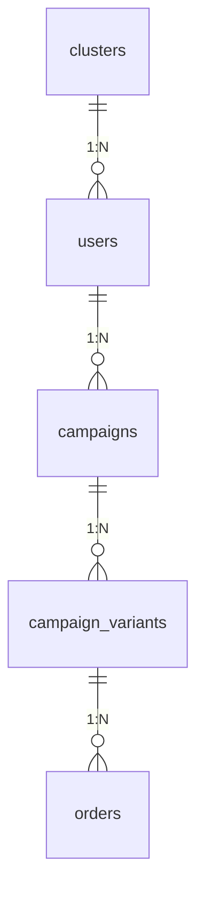
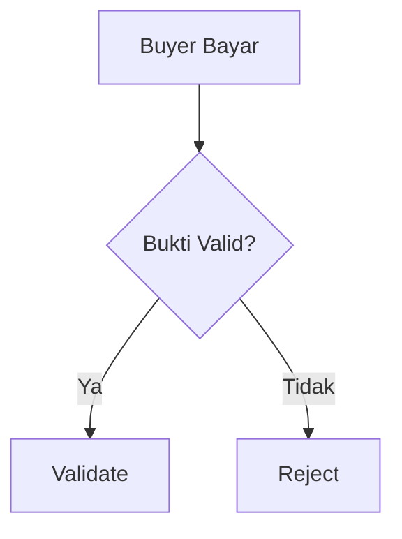
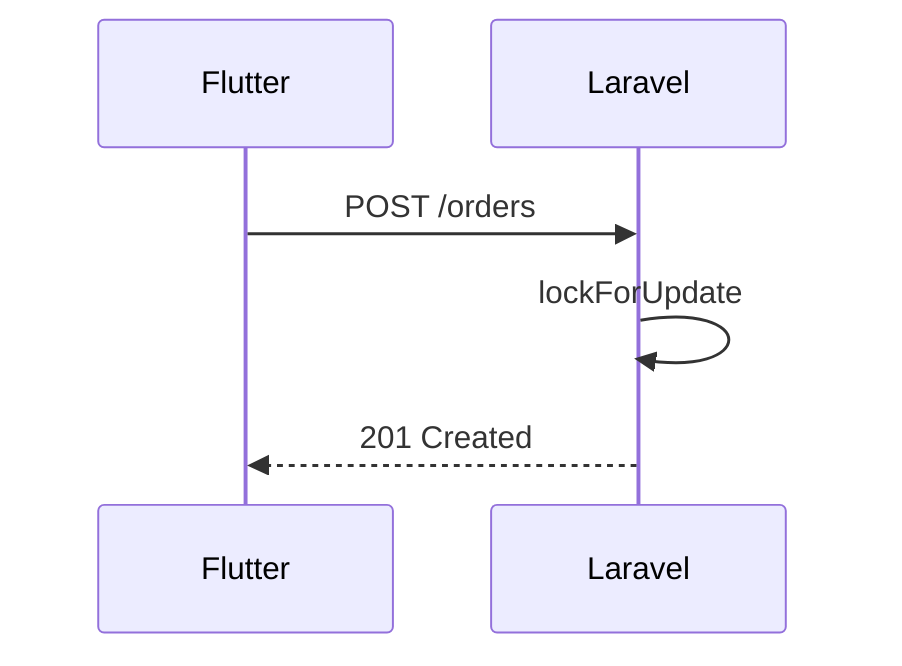

# STANDAR PENULISAN KODE - Grosirun V3.1

**Tanggal:** 20 Juli 2026  
**Versi:** 3.1  
**Status:** Production Ready

---

## Daftar Isi

1. Standar Laravel 11
2. Standar Flutter
3. Git, Commit & Pull Request
4. Standar Dokumentasi

---

## 1. Standar Laravel 11

### 1.1 Konvensi Penamaan

| Jenis                 | Aturan                             | Contoh                                                                              |
| --------------------- | ---------------------------------- | ----------------------------------------------------------------------------------- |
| **Model**             | Singular PascalCase                | `Campaign`, `CampaignVariant`, `Order`, `TransactionLog`, `Cluster`, `Notification` |
| **Table**             | Plural snake_case                  | `campaigns`, `campaign_variants`, `orders`, `transaction_logs`, `clusters`          |
| **Migration**         | `YYYY_MM_DD_HHMMSS_nama_table.php` | `2026_07_20_000001_create_clusters_table.php`                                       |
| **Controller**        | `Api/V1/` namespace, PascalCase    | `CampaignController`, `OrderController`, `AuthController`                           |
| **Controller Method** | RESTful                            | `index()`, `show()`, `store()`, `update()`, `destroy()`                             |
| **Service**           | PascalCase + `Service`             | `CampaignService`, `OrderService`, `OtpService`, `ImageService`                     |
| **Service Method**    | camelCase                          | `createWithVariants()`, `validatePaid()`, `generateRecap()`                         |
| **DTO**               | PascalCase + `DTO`                 | `CreateCampaignDTO`, `CreateOrderDTO`                                               |
| **Form Request**      | PascalCase + `Request`             | `StoreCampaignRequest`, `StoreOrderRequest`                                         |
| **Resource**          | PascalCase + `Resource`            | `CampaignResource`, `OrderResource`, `UserResource`                                 |
| **Job**               | PascalCase + `Job`                 | `SendFcmJob`, `CleanOldProofsJob`, `AnonymizeUserJob`                               |
| **Middleware**        | PascalCase + `Middleware`          | `RoleMiddleware`, `IdempotencyMiddleware`, `ClusterScopeMiddleware`                 |
| **Policy**            | PascalCase + `Policy`              | `CampaignPolicy`, `OrderPolicy`                                                     |
| **Scope**             | PascalCase + `Scope`               | `ClusterScope`                                                                      |
| **Factory**           | PascalCase + `Factory`             | `CampaignFactory`, `OrderFactory`                                                   |
| **Seeder**            | PascalCase + `Seeder`              | `ClusterSeeder`, `PilotSeeder`                                                      |

### 1.2 Struktur Folder Backend

```
backend/
├── app/
│   ├── Console/
│   │   └── Commands/
│   │       ├── FirebaseImportCommand.php
│   │       └── ExcelImportOrdersCommand.php
│   ├── DTOs/
│   │   ├── CreateCampaignDTO.php
│   │   └── CreateOrderDTO.php
│   ├── Http/
│   │   ├── Controllers/
│   │   │   └── Api/
│   │   │       └── V1/
│   │   │           ├── AuthController.php
│   │   │           ├── CampaignController.php
│   │   │           ├── OrderController.php
│   │   │           └── NotificationController.php
│   │   ├── Middleware/
│   │   │   ├── RoleMiddleware.php
│   │   │   ├── IdempotencyMiddleware.php
│   │   │   └── EnsureConsent.php
│   │   ├── Requests/
│   │   │   ├── StoreCampaignRequest.php
│   │   │   ├── StoreOrderRequest.php
│   │   │   └── UploadProofRequest.php
│   │   └── Resources/
│   │       ├── CampaignResource.php
│   │       ├── OrderResource.php
│   │       └── UserResource.php
│   ├── Jobs/
│   │   ├── SendFcmJob.php
│   │   ├── CleanOldProofsJob.php
│   │   ├── AnonymizeUserJob.php
│   │   └── CheckDeadlinesJob.php
│   ├── Models/
│   │   ├── Cluster.php
│   │   ├── User.php
│   │   ├── Campaign.php
│   │   ├── CampaignVariant.php
│   │   ├── Order.php
│   │   ├── TransactionLog.php
│   │   └── Notification.php
│   ├── Policies/
│   │   ├── CampaignPolicy.php
│   │   └── OrderPolicy.php
│   ├── Scopes/
│   │   └── ClusterScope.php
│   └── Services/
│       ├── CampaignService.php
│       ├── OrderService.php
│       ├── OtpService.php
│       ├── ImageService.php
│       └── NotificationService.php
├── database/
│   ├── factories/
│   └── seeders/
├── tests/
│   ├── Feature/
│   │   ├── CampaignTest.php
│   │   ├── OrderTest.php
│   │   └── AuthTest.php
│   └── Unit/
│       ├── OrderServiceTest.php
│       └── OtpServiceTest.php
└── routes/
    └── api/
        └── v1.php
```

### 1.3 Standar Penulisan Kode

#### PHP 8.3 & PSR-12

Gunakan Laravel Pint untuk menjaga konsistensi kode.

```bash
./vendor/bin/pint --test   # Cek saja
./vendor/bin/pint          # Perbaiki otomatis
```

**Aturan Pint (pint.json):**

```json
{
  "preset": "laravel",
  "rules": {
    "concat_space": { "spacing": "one" },
    "trailing_comma_in_multiline": true,
    "array_syntax": { "syntax": "short" }
  }
}
```

#### Contoh Service Class

```php
<?php

namespace App\Services;

use App\DTOs\CreateOrderDTO;
use App\Models\Campaign;
use App\Models\CampaignVariant;
use App\Models\Order;
use App\Models\User;
use Illuminate\Http\Exceptions\HttpResponseException;
use Illuminate\Support\Facades\DB;
use Illuminate\Support\Facades\Log;

class OrderService
{
    public function __construct(
        private readonly NotificationService $notificationService,
    ) {}

    /**
     * Buat order baru dengan atomic transaction
     *
     * @throws HttpResponseException Jika stok habis (409)
     */
    public function create(Campaign $campaign, CreateOrderDTO $dto, User $buyer): Order
    {
        return DB::transaction(function () use ($campaign, $dto, $buyer) {
            // 1. Lock variant untuk mencegah oversell
            $variant = CampaignVariant::where('id', $dto->variantId)
                ->where('campaign_id', $campaign->id)
                ->lockForUpdate()
                ->firstOrFail();

            // 2. Cek stok
            $remaining = $variant->quota - $variant->sold;
            if ($remaining < $dto->quantity) {
                throw new HttpResponseException(
                    response()->json([
                        'message' => 'Stok varian habis',
                        'code' => 'ERR_024',
                        'http_code' => 409,
                    ], 409)
                );
            }

            // 3. Buat order
            $order = Order::create([
                'uuid' => (string) \Illuminate\Support\Str::uuid(),
                'cluster_id' => $campaign->cluster_id,
                'campaign_id' => $campaign->id,
                'campaign_variant_id' => $variant->id,
                'user_id' => $buyer->id,
                'quantity' => $dto->quantity,
                'total_kg' => $variant->size_kg * $dto->quantity,
                'total_price' => $variant->price * $dto->quantity,
                'payment_method' => $dto->paymentMethod,
                'payment_status' => 'pending',
                'idempotency_key' => $dto->idempotencyKey,
            ]);

            // 4. Update stok dan current_kg
            $variant->increment('sold', $dto->quantity);
            $campaign->increment('current_kg', $variant->size_kg * $dto->quantity);

            // 5. Kirim notifikasi (FCM + fallback DB)
            $this->notificationService->sendNewOrderNotification($order);

            // 6. Audit log
            TransactionLog::create([
                'order_id' => $order->id,
                'initiator_id' => $buyer->id,
                'type' => 'order_created',
                'ip_address' => request()->ip(),
            ]);

            return $order;
        });
    }
}
```

#### Contoh DTO

```php
<?php

namespace App\DTOs;

readonly class CreateOrderDTO
{
    public function __construct(
        public int $variantId,
        public int $quantity,
        public string $paymentMethod,
        public string $idempotencyKey,
    ) {}
}
```

#### Contoh Form Request

```php
<?php

namespace App\Http\Requests;

use Illuminate\Foundation\Http\FormRequest;

class StoreOrderRequest extends FormRequest
{
    public function authorize(): bool
    {
        return $this->user()->role === 'buyer';
    }

    public function rules(): array
    {
        return [
            'variant_id' => ['required', 'integer', 'exists:campaign_variants,id'],
            'quantity' => ['required', 'integer', 'min:1', 'max:100'],
            'payment_method' => ['required', 'string', 'in:cash,qris'],
        ];
    }

    public function toDTO(): CreateOrderDTO
    {
        return new CreateOrderDTO(
            variantId: $this->input('variant_id'),
            quantity: $this->input('quantity'),
            paymentMethod: $this->input('payment_method'),
            idempotencyKey: $this->header('Idempotency-Key'),
        );
    }
}
```

#### Contoh Resource

```php
<?php

namespace App\Http\Resources;

use Illuminate\Http\Resources\Json\JsonResource;

class CampaignResource extends JsonResource
{
    public function toArray($request): array
    {
        return [
            'id' => $this->id,
            'cluster_id' => $this->cluster_id,
            'slug' => $this->slug,
            'name' => $this->name,
            'description' => $this->description,
            'image_url' => $this->image_path
                ? Storage::disk('s3')->temporaryUrl($this->image_path, now()->addHour())
                : null,
            'target_kg' => $this->target_kg,
            'current_kg' => $this->current_kg,
            'progress_percent' => round(($this->current_kg / $this->target_kg) * 100, 1),
            'deadline' => $this->deadline->toIso8601String(),
            'status' => $this->status,
            'initiator' => new UserResource($this->whenLoaded('initiator')),
            'variants' => CampaignVariantResource::collection($this->whenLoaded('variants')),
            'created_at' => $this->created_at->toIso8601String(),
        ];
    }
}
```

### 1.4 Aturan Tambahan

| Aturan                           | Keterangan                                                                  |
| -------------------------------- | --------------------------------------------------------------------------- |
| **$fillable, bukan $guarded**    | Selalu gunakan `protected $fillable = [...]` untuk mencegah mass assignment |
| **Controller tipis (<50 baris)** | Logic bisnis di Service, validasi di FormRequest                            |
| **No DB::raw tanpa binding**     | Gunakan `whereRaw('... ?', [$value])` jika terpaksa                         |
| **Gunakan DTO**                  | Untuk internal service, bukan array assoc                                   |
| **ETag & Cache**                 | `Cache::remember('campaigns:active', 60, fn() => ...)`                      |
| **S3 tempUrl**                   | `Storage::disk('s3')->temporaryUrl($path, now()->addHour())`                |
| **Audit Log**                    | Semua aksi sensitif di `transaction_logs`                                   |
| **Feature Flags**                | `Feature::active('qris-upload')`                                            |

### 1.5 Testing dengan Pest

```php
<?php

use App\Models\Campaign;
use App\Models\CampaignVariant;
use App\Models\User;
use App\Services\OrderService;

test('mencegah oversell dengan lockForUpdate', function () {
    $campaign = Campaign::factory()->hasVariants(1, ['quota' => 1])->create();
    $variant = $campaign->variants->first();
    $buyer1 = User::factory()->create();
    $buyer2 = User::factory()->create();

    $service = app(OrderService::class);

    // Buyer 1 berhasil
    $order1 = $service->create($campaign, new CreateOrderDTO(
        variantId: $variant->id,
        quantity: 1,
        paymentMethod: 'cash',
        idempotencyKey: 'key1'
    ), $buyer1);

    expect($order1)->toBeInstanceOf(Order::class);

    // Buyer 2 gagal (stok habis)
    expect(fn() => $service->create($campaign, new CreateOrderDTO(
        variantId: $variant->id,
        quantity: 1,
        paymentMethod: 'cash',
        idempotencyKey: 'key2'
    ), $buyer2))->toThrow(HttpResponseException::class);
});

test('admin race condition - double validation', function () {
    $order = Order::factory()->create(['payment_status' => 'pending']);
    $initiator1 = User::factory()->initiator()->create(['cluster_id' => $order->cluster_id]);
    $initiator2 = User::factory()->initiator()->create(['cluster_id' => $order->cluster_id]);

    $service = app(OrderService::class);

    // Validasi pertama berhasil
    $result1 = $service->validate($order, $initiator1);
    expect($result1->payment_status)->toBe('paid');

    // Validasi kedua gagal (sudah divalidasi)
    expect(fn() => $service->validate($order->fresh(), $initiator2))
        ->toThrow(HttpResponseException::class, 'ERR_030');
});
```

---

## 2. Standar Flutter

### 2.1 Struktur Folder Mobile

```
mobile/lib/
├── main.dart
├── core/
│   ├── analytics/
│   │   └── analytics_service.dart
│   ├── constants/
│   │   └── app_constants.dart
│   ├── network/
│   │   ├── dio_client.dart
│   │   ├── api_endpoints.dart
│   │   ├── interceptors/
│   │   │   ├── auth_interceptor.dart
│   │   │   ├── idempotency_interceptor.dart
│   │   │   └── etag_interceptor.dart
│   │   └── retry_interceptor.dart
│   ├── storage/
│   │   ├── secure_storage.dart
│   │   └── hive_service.dart
│   ├── deeplink/
│   │   └── app_links_service.dart
│   ├── fcm/
│   │   └── fcm_service.dart
│   ├── error/
│   │   ├── error_boundary.dart
│   │   └── error_mapper.dart
│   └── theme/
│       └── app_theme.dart
├── data/
│   ├── models/
│   │   ├── user_model.dart
│   │   ├── campaign_model.dart
│   │   ├── order_model.dart
│   │   └── notification_model.dart
│   ├── datasources/
│   │   ├── remote/
│   │   │   ├── auth_remote_datasource.dart
│   │   │   ├── campaign_remote_datasource.dart
│   │   │   └── order_remote_datasource.dart
│   │   └── local/
│   │       ├── campaign_local_datasource.dart
│   │       ├── order_local_datasource.dart
│   │       └── app_state_local_datasource.dart
│   └── repositories/
│       ├── auth_repository.dart
│       ├── campaign_repository.dart
│       └── order_repository.dart
├── logic/
│   ├── cubits/
│   │   ├── auth/
│   │   │   ├── auth_cubit.dart
│   │   │   └── auth_state.dart
│   │   ├── campaign/
│   │   │   ├── campaign_cubit.dart
│   │   │   └── campaign_state.dart
│   │   ├── order/
│   │   │   ├── order_cubit.dart
│   │   │   └── order_state.dart
│   │   └── notification/
│   │       ├── notification_cubit.dart
│   │       └── notification_state.dart
│   └── observers/
│       └── bloc_observer.dart
└── presentation/
    ├── screens/
    │   ├── auth/
    │   │   ├── login_screen.dart
    │   │   ├── consent_screen.dart
    │   │   └── tos_screen.dart
    │   ├── buyer/
    │   │   ├── home_screen.dart
    │   │   ├── campaign_detail_screen.dart
    │   │   ├── checkout_screen.dart
    │   │   ├── my_orders_screen.dart
    │   │   └── notifications_screen.dart
    │   └── initiator/
    │       ├── admin_dashboard_screen.dart
    │       ├── create_campaign_screen.dart
    │       ├── recap_screen.dart
    │       └── distribution_screen.dart
    └── widgets/
        ├── big_button.dart
        ├── progress_truck.dart
        ├── social_ticker.dart
        ├── campaign_card.dart
        ├── variant_selector.dart
        ├── error_view.dart
        ├── empty_view.dart
        └── skeleton_loader.dart
```

### 2.2 Konvensi Penamaan

| Jenis            | Aturan             | Contoh                                            |
| ---------------- | ------------------ | ------------------------------------------------- |
| **File**         | snake_case         | `campaign_repository.dart`, `auth_cubit.dart`     |
| **Class**        | PascalCase         | `CampaignRepository`, `AuthCubit`                 |
| **State Class**  | PascalCase + State | `AuthInitial`, `AuthLoading`, `AuthAuthenticated` |
| **Cubit Method** | camelCase          | `requestOtp()`, `loadActive()`, `createOrder()`   |
| **Widget**       | PascalCase         | `BigButton`, `ProgressTruckWidget`                |
| **Constant**     | lowerCamel (const) | `ApiConstants.baseUrl`                            |
| **Key**          | `Key('nama')`      | `Key('phoneField')`                               |

### 2.3 Standar Penulisan Kode

#### Contoh Cubit

```dart
// logic/cubits/order/order_cubit.dart

import 'package:bloc/bloc.dart';
import 'package:equatable/equatable.dart';
import '../../../data/repositories/order_repository.dart';
import '../../../core/analytics/analytics_service.dart';

part 'order_state.dart';

class OrderCubit extends Cubit<OrderState> {
  OrderCubit(this._repository, this._analytics) : super(OrderInitial());

  final OrderRepository _repository;
  final AnalyticsService _analytics;

  Future<void> createOrder({
    required int campaignId,
    required int variantId,
    required int quantity,
    required String paymentMethod,
  }) async {
    emit(OrderLoading());

    try {
      final order = await _repository.createOrder(
        campaignId: campaignId,
        variantId: variantId,
        quantity: quantity,
        paymentMethod: paymentMethod,
      );

      // Kirim event ke analytics
      await _analytics.logEvent(
        name: 'checkout_success',
        parameters: {
          'campaign_id': campaignId,
          'order_uuid': order.uuid,
          'variant_size': order.variantSize,
          'quantity': quantity,
          'total_price': order.totalPrice,
          'payment_method': paymentMethod,
          'is_offline': false,
        },
      );

      emit(OrderSuccess(order));
    } on DioException catch (e) {
      final errorCode = e.response?.data['code'] ?? 'ERR_100';

      await _analytics.logEvent(
        name: 'checkout_fail',
        parameters: {
          'campaign_id': campaignId,
          'error_code': errorCode,
        },
      );

      emit(OrderError(errorCode));
    }
  }
}
```

#### Contoh State

```dart
// logic/cubits/order/order_state.dart

part of 'order_cubit.dart';

abstract class OrderState extends Equatable {
  const OrderState();

  @override
  List<Object?> get props => [];
}

class OrderInitial extends OrderState {}

class OrderLoading extends OrderState {}

class OrderSuccess extends OrderState {
  const OrderSuccess(this.order);

  final OrderModel order;

  @override
  List<Object?> get props => [order];
}

class OrderError extends OrderState {
  const OrderError(this.errorCode);

  final String errorCode;

  @override
  List<Object?> get props => [errorCode];
}

class OrderLocalQueued extends OrderState {
  const OrderLocalQueued(this.order);

  final OrderModel order;

  @override
  List<Object?> get props => [order];
}
```

#### Contoh Repository (Offline-First)

```dart
// data/repositories/campaign_repository.dart

import 'package:meta/meta.dart';
import '../datasources/remote/campaign_remote_datasource.dart';
import '../datasources/local/campaign_local_datasource.dart';
import '../models/campaign_model.dart';

class CampaignRepository {
  CampaignRepository({
    required this.remote,
    required this.local,
  });

  final CampaignRemoteDatasource remote;
  final CampaignLocalDatasource local;

  Future<List<CampaignModel>> getActiveCampaigns({
    required int clusterId,
    required bool refresh,
  }) async {
    try {
      // 1. Coba ambil dari remote
      final campaigns = await remote.fetchActive(
        clusterId: clusterId,
        etag: refresh ? null : local.getEtag('campaigns_active_$clusterId'),
      );

      // 2. Simpan ke local cache
      await local.saveCampaigns(campaigns);
      await local.saveEtag('campaigns_active_$clusterId', campaigns.etag);

      return campaigns;
    } on NotModifiedException {
      // 3. Jika 304, pakai cache lokal
      return local.getCampaigns();
    } catch (e) {
      // 4. Jika error, fallback ke cache lokal
      final cached = await local.getCampaigns();
      if (cached.isNotEmpty) {
        return cached;
      }
      rethrow;
    }
  }
}
```

### 2.4 Widget Standard

#### BigButton

```dart
// presentation/widgets/big_button.dart

import 'package:flutter/material.dart';

class BigButton extends StatelessWidget {
  const BigButton({
    super.key,
    required this.onPressed,
    required this.text,
    this.isLoading = false,
    this.isEnabled = true,
    this.icon,
  });

  final VoidCallback? onPressed;
  final String text;
  final bool isLoading;
  final bool isEnabled;
  final IconData? icon;

  @override
  Widget build(BuildContext context) {
    return SizedBox(
      height: 56, // 56dp minimum
      width: double.infinity,
      child: ElevatedButton(
        onPressed: isEnabled && !isLoading ? onPressed : null,
        style: ElevatedButton.styleFrom(
          backgroundColor: isEnabled ? const Color(0xFF16A34A) : Colors.grey[300],
          foregroundColor: isEnabled ? Colors.white : Colors.grey[600],
          shape: RoundedRectangleBorder(
            borderRadius: BorderRadius.circular(12),
          ),
          elevation: 0,
          minimumSize: const Size(double.infinity, 56),
        ),
        child: isLoading
            ? const SizedBox(
                height: 24,
                width: 24,
                child: CircularProgressIndicator(
                  color: Colors.white,
                  strokeWidth: 2,
                ),
              )
            : Row(
                mainAxisAlignment: MainAxisAlignment.center,
                children: [
                  if (icon != null) ...[
                    Icon(icon, size: 20),
                    const SizedBox(width: 8),
                  ],
                  Text(
                    text,
                    style: const TextStyle(
                      fontSize: 16,
                      fontWeight: FontWeight.w600,
                    ),
                  ),
                ],
              ),
      ),
    );
  }
}
```

### 2.5 Aturan Flutter

| Aturan                     | Keterangan                                                                         |
| -------------------------- | ---------------------------------------------------------------------------------- |
| `dart format .`            | Format otomatis sebelum commit                                                     |
| `flutter analyze`          | 0 issues wajib sebelum PR                                                          |
| `flutter_lints`            | Gunakan linter bawaan                                                              |
| `Equatable`                | Semua State harus extend Equatable                                                 |
| **No print()**             | Gunakan `log()` jika `kDebugMode`                                                  |
| **SecureStorage**          | Token tidak boleh di Hive                                                          |
| **Hive Boxes**             | 7 box: campaigns, orders, pendingQueue, notifications, appState, etag, idempotency |
| **Dio Interceptors**       | Auth, Idempotency, ETag, Retry                                                     |
| **ListView.builder**       | Jangan gunakan `ListView(children:)` untuk daftar panjang                          |
| **cached_network_image**   | Disk cache 7 hari                                                                  |
| **compress before upload** | `flutter_image_compress` sebelum upload proof                                      |
| **Barrel Export**          | `lib/logic/cubits/cubits.dart` export semua cubit                                  |

---

## 3. Git, Commit & Pull Request

### 3.1 Branching Strategy

```
main (protected)
  └── develop (integration)
      ├── feature/cluster-scope
      ├── feature/idempotency-key
      ├── fix/oversell-lock
      ├── docs/adr-007
      └── hotfix/crash-proof-upload (dari main)
```

### 3.2 Conventional Commits

**Format:** `type(scope): subject`

| Type       | Penggunaan    | Contoh                                            |
| ---------- | ------------- | ------------------------------------------------- |
| `feat`     | Fitur baru    | `feat(backend): add cluster_id FK + ClusterScope` |
| `fix`      | Perbaikan bug | `fix(mobile): add offline proof queue`            |
| `docs`     | Dokumentasi   | `docs(adr): add ADR-003 S3 primary decision`      |
| `test`     | Testing       | `test(k6): add deadline-rush 100 VU`              |
| `chore`    | Maintenance   | `chore: update dependencies`                      |
| `refactor` | Refactor kode | `refactor(order): extract validation logic`       |
| `perf`     | Performance   | `perf(campaign): add Redis cache 60s`             |
| `ci`       | CI/CD         | `ci: add blue-green deploy script`                |

**Scope yang Valid:**

| Scope      | Keterangan           |
| ---------- | -------------------- |
| `backend`  | Laravel backend      |
| `mobile`   | Flutter mobile       |
| `api`      | API endpoints        |
| `docs`     | Dokumentasi          |
| `ci`       | CI/CD pipeline       |
| `infra`    | Infrastruktur/Docker |
| `security` | Keamanan             |
| `test`     | Testing              |

### 3.3 Pull Request Template

```markdown
# Pull Request - Grosirun V3.1

## Deskripsi

[Jelaskan perubahan yang dilakukan]

## Checklist

### Backend

- [ ] `php artisan test` pass coverage >80%
- [ ] `docker compose exec app php artisan test` pass
- [ ] Race condition handled? lockForUpdate both buyer checkout and admin validate
- [ ] RBAC + ClusterScope + Policy check
- [ ] Idempotency-Key added for POST/PATCH? Redis cache 24h
- [ ] ETag If-None-Match 304 + If-Match 412 handled
- [ ] Rate limit centralized per-route override tested 429
- [ ] Consent + ToS + DELETE account anonymize + retensi 90d proof
- [ ] S3 tempUrl private 1h generation with Policy check
- [ ] FCM fallback notifications table + polling 60s
- [ ] Batch operations 207 multi-status
- [ ] Feature flag Pennant check

### Mobile

- [ ] `flutter analyze` 0 issues
- [ ] `flutter test` pass
- [ ] APK size <10MB `ls -lh` + `--analyze-size`
- [ ] Deep link grosirun://campaign/{id} handled
- [ ] FCM background handler + error boundary + state persistence
- [ ] Offline proof queue upload_proof + file cleanup
- [ ] Consent + ToS checkbox UI required

### Dokumentasi

- [ ] Update API_SPEC.md + TECHNICAL_SPEC.md
- [ ] Update CHANGELOG.md + VERSIONING_STRATEGY.md
- [ ] Added ADR if architecture decision
- [ ] Update ONBOARDING_PILOT.md / FAQ_END_USER.md if user flow change

### Infra & Security

- [ ] No hardcoded secrets .env, dart-define only
- [ ] Tested blue-green deploy health check + rollback automation
- [ ] Added k6 script if performance critical
- [ ] CODEOWNERS approve required + test.yml green

## Issue Terkait

Closes #123
```

---

## 4. Standar Dokumentasi

### 4.1 Format Dokumen

| Elemen         | Aturan                                                |
| -------------- | ----------------------------------------------------- |
| **Bahasa**     | Bahasa Indonesia (campur English untuk tech terms)    |
| **Heading**    | `##` untuk judul, `###` untuk sub-judul               |
| **Tabel**      | Gunakan markdown table dengan rapi                    |
| **Diagram**    | Mermaid untuk ERD, flowchart, sequence, state diagram |
| **Code Block** | Spesifikasikan bahasa (php, dart, bash, yaml, json)   |
| **Daftar Isi** | Setiap dokumen harus memiliki daftar isi              |

### 4.2 Mermaid Diagram Examples

**ERD:**



**Flowchart:**



**Sequence Diagram:**



### 4.3 Update Wajib Saat PR

| Perubahan             | Dokumen yang Harus Diupdate                     |
| --------------------- | ----------------------------------------------- |
| Endpoint baru/berubah | API_SPEC.md, TECHNICAL_SPEC.md, CHANGELOG.md    |
| Schema DB baru        | DATABASE_DESIGN.md, DATABASE_MIGRATION_GUIDE.md |
| Error code baru       | ERROR_CATALOG.md + mapper                       |
| Feature flag baru     | TECHNICAL_SPEC.md, API_SPEC.md                  |
| User flow berubah     | ONBOARDING_PILOT.md, FAQ_END_USER.md            |
| Architecture decision | ARCHITECTURE_DECISION_RECORDS.md                |
| Breaking change       | VERSIONING_STRATEGY.md, CHANGELOG.md            |
| Deploy/infra          | DEPLOYMENT.md, CI_CD.md                         |

### 4.4 Single Source of Truth

Keputusan final untuk inkonsistensi antar dokumen mengacu pada:

| Topik              | Dokumen Referensi              |
| ------------------ | ------------------------------ |
| Storage S3 Primary | TECHNICAL_SPEC.md, API_SPEC.md |
| Cluster Multi-RT   | DATABASE_DESIGN.md, PRD.md     |
| CI/CD Real         | CI_CD.md, DEPLOYMENT.md        |
| Auth Required      | PRD.md, API_SPEC.md            |
| Platform Fee 1%    | BUSINESS_ANALYSIS.md           |
| Non-Escrow         | DISPUTE_SOP.md, PRD.md         |
| UU PDP Compliance  | PRIVACY_POLICY.md              |

---

## 5. Ringkasan Perintah Penting

### 5.1 Backend

```bash
# Cek coding style
./vendor/bin/pint --test

# Perbaiki otomatis
./vendor/bin/pint

# Jalankan test
php artisan test --parallel --coverage --min=80

# Jalankan test race condition
php artisan test --filter=RaceCondition

# Generate OpenAPI
php artisan scribe:generate

# Clear cache
php artisan optimize:clear
php artisan config:cache
php artisan route:cache
php artisan view:cache
```

### 5.2 Mobile

```bash
# Format kode
dart format lib/

# Static analysis
flutter analyze

# Jalankan test
flutter test --coverage

# Build APK
flutter build apk --release --split-per-abi --obfuscate --split-debug-info=./build/debug-info

# Check size
ls -lh build/app/outputs/apk/release/*.apk
```

### 5.3 Git

```bash
# Commit dengan Conventional Commits
git commit -m "feat(backend): add cluster_id FK + ClusterScope"

# Tag release
git tag -a v1.0.0 -m "MVP V1.0 Laravel 11 + S3 + Cluster"
git push origin v1.0.0
```

---

**Standar Penulisan Kode V3.1 Production Ready - Konsisten, Bersih, Terstruktur!** 🚀
