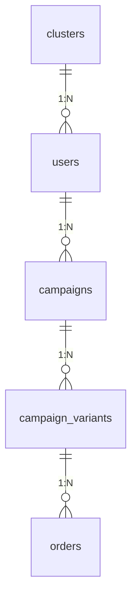
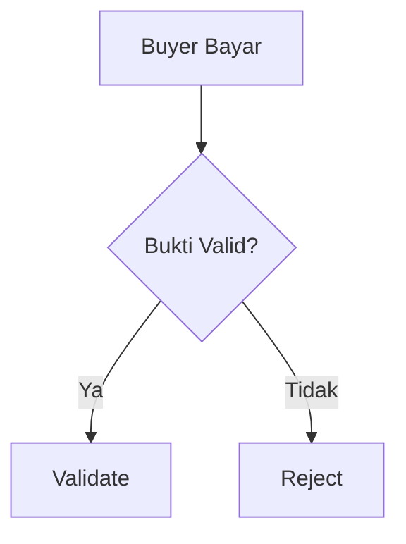
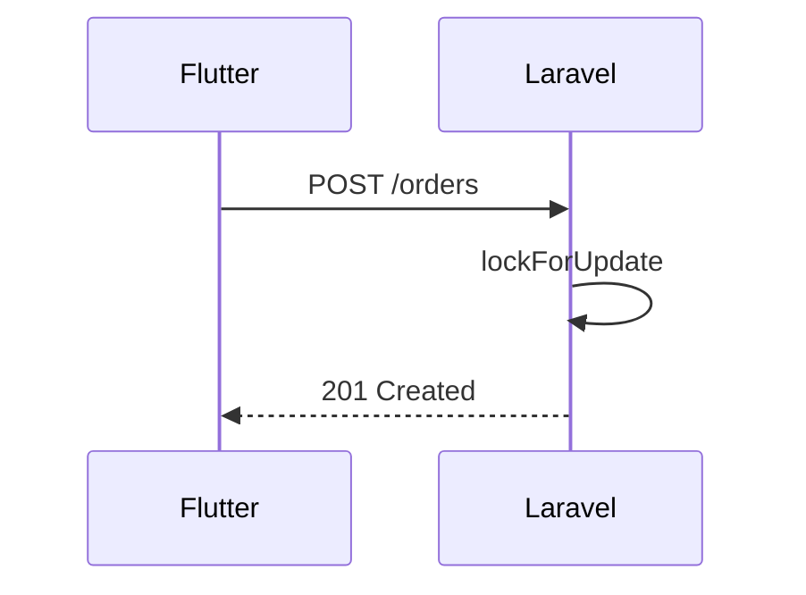

# PANDUAN PENGEMBANGAN - Grosirun V3.1

**Tanggal:** 20 Juli 2026
**Versi:** 3.1
**Owner:** Engineering
**Review Cycle:** Setiap release
**Global Glossary:** [Indeks Dokumentasi](README.md#glossary-global-indonesiainggris)
**Status Dokumen:** Final
**Status Implementasi:** Flutter Ready for Integration | Backend Not Started

---

## Daftar Isi

1. Standar Laravel
2. Standar Flutter
3. Standar Dokumentasi dan Domain Penawaran-ke-Campaign
4. Perintah Pengembangan
5. Konteks Kontribusi
6. Branching dan Monorepo
7. Issue dan Pull Request
8. Code Review
9. Testing dan Quality Gates
10. Dokumentasi Wajib
11. Security dan Secrets
12. Budget APK
13. Kode Etik dan Komunikasi
14. Proses Rilis
15. Setup Development Singkat

---

## 1. Standar Laravel


### Konvensi Penamaan

| Jenis                 | Aturan                             | Contoh                                                                              |
| --------------------- | ---------------------------------- | ----------------------------------------------------------------------------------- |
| **Model**             | Singular PascalCase                | `Campaign`, `CampaignVariant`, `Order`, `TransactionLog`, `Cluster`, `Notification` |
| **Table**             | Plural snake_case                  | `campaigns`, `campaign_variants`, `orders`, `transaction_logs`, `clusters`          |
| **Migration**         | `YYYY_MM_DD_HHMMSS_nama_table.php` | `2026_07_20_000001_create_clusters_table.php`                                       |
| **Controller**        | `Api/V1/` namespace, PascalCase    | `CampaignController`, `OrderController`, `AuthController`                           |
| **Controller Method** | RESTful                            | `index()`, `show()`, `store()`, `update()`, `destroy()`                             |
| **Service**           | PascalCase + `Service`             | `CampaignService`, `OrderService`, `OtpService`, `ImageService`                     |
| **Service Method**    | camelCase                          | `createWithVariants()`, `validatePaid()`, `generateRecap()`                         |
| **DTO**               | PascalCase + `DTO`                 | `CreateCampaignDTO`, `CreateOrderDTO`                                               |
| **Form Request**      | PascalCase + `Request`             | `StoreCampaignRequest`, `StoreOrderRequest`                                         |
| **Resource**          | PascalCase + `Resource`            | `CampaignResource`, `OrderResource`, `UserResource`                                 |
| **Job**               | PascalCase + `Job`                 | `SendFcmJob`, `CleanOldProofsJob`, `AnonymizeUserJob`                               |
| **Middleware**        | PascalCase + `Middleware`          | `RoleMiddleware`, `IdempotencyMiddleware`, `ClusterScopeMiddleware`                 |
| **Policy**            | PascalCase + `Policy`              | `CampaignPolicy`, `OrderPolicy`                                                     |
| **Scope**             | PascalCase + `Scope`               | `ClusterScope`                                                                      |
| **Factory**           | PascalCase + `Factory`             | `CampaignFactory`, `OrderFactory`                                                   |
| **Seeder**            | PascalCase + `Seeder`              | `ClusterSeeder`, `PilotSeeder`                                                      |

### Struktur Folder Backend

```
backend/
├── app/
│   ├── Console/
│   │   └── Commands/
│   │       ├── FirebaseImportCommand.php
│   │       └── ExcelImportOrdersCommand.php
│   ├── DTOs/
│   │   ├── CreateCampaignDTO.php
│   │   └── CreateOrderDTO.php
│   ├── Http/
│   │   ├── Controllers/
│   │   │   └── Api/
│   │   │       └── V1/
│   │   │           ├── AuthController.php
│   │   │           ├── CampaignController.php
│   │   │           ├── OrderController.php
│   │   │           └── NotificationController.php
│   │   ├── Middleware/
│   │   │   ├── RoleMiddleware.php
│   │   │   ├── IdempotencyMiddleware.php
│   │   │   └── EnsureConsent.php
│   │   ├── Requests/
│   │   │   ├── StoreCampaignRequest.php
│   │   │   ├── StoreOrderRequest.php
│   │   │   └── UploadProofRequest.php
│   │   └── Resources/
│   │       ├── CampaignResource.php
│   │       ├── OrderResource.php
│   │       └── UserResource.php
│   ├── Jobs/
│   │   ├── SendFcmJob.php
│   │   ├── CleanOldProofsJob.php
│   │   ├── AnonymizeUserJob.php
│   │   └── CheckDeadlinesJob.php
│   ├── Models/
│   │   ├── Cluster.php
│   │   ├── User.php
│   │   ├── Campaign.php
│   │   ├── CampaignVariant.php
│   │   ├── Order.php
│   │   ├── TransactionLog.php
│   │   └── Notification.php
│   ├── Policies/
│   │   ├── CampaignPolicy.php
│   │   └── OrderPolicy.php
│   ├── Scopes/
│   │   └── ClusterScope.php
│   └── Services/
│       ├── CampaignService.php
│       ├── OrderService.php
│       ├── OtpService.php
│       ├── ImageService.php
│       └── NotificationService.php
├── database/
│   ├── factories/
│   └── seeders/
├── tests/
│   ├── Feature/
│   │   ├── CampaignTest.php
│   │   ├── OrderTest.php
│   │   └── AuthTest.php
│   └── Unit/
│       ├── OrderServiceTest.php
│       └── OtpServiceTest.php
└── routes/
    └── api/
        └── v1.php
```

### Standar Penulisan Kode

###### PHP 8.3 & PSR-12

Gunakan Laravel Pint untuk menjaga konsistensi kode.

```bash
./vendor/bin/pint --test   # Cek saja
./vendor/bin/pint          # Perbaiki otomatis
```

**Aturan Pint (pint.json):**

```json
{
  "preset": "laravel",
  "rules": {
    "concat_space": { "spacing": "one" },
    "trailing_comma_in_multiline": true,
    "array_syntax": { "syntax": "short" }
  }
}
```

###### Contoh Service Class

```php
<?php

namespace App\Services;

use App\DTOs\CreateOrderDTO;
use App\Models\Campaign;
use App\Models\CampaignVariant;
use App\Models\Order;
use App\Models\User;
use Illuminate\Http\Exceptions\HttpResponseException;
use Illuminate\Support\Facades\DB;
use Illuminate\Support\Facades\Log;

class OrderService
{
    public function __construct(
        private readonly NotificationService $notificationService,
    ) {}

    /**
     * Buat order baru dengan atomic transaction
     *
     * @throws HttpResponseException Jika stok habis (409)
     */
    public function create(Campaign $campaign, CreateOrderDTO $dto, User $buyer): Order
    {
        return DB::transaction(function () use ($campaign, $dto, $buyer) {
            // 1. Lock variant untuk mencegah oversell
            $variant = CampaignVariant::where('id', $dto->variantId)
                ->where('campaign_id', $campaign->id)
                ->lockForUpdate()
                ->firstOrFail();

            // 2. Cek stok
            $remaining = $variant->quota - $variant->sold;
            if ($remaining < $dto->quantity) {
                throw new HttpResponseException(
                    response()->json([
                        'message' => 'Stok varian habis',
                        'code' => 'ERR_024',
                        'http_code' => 409,
                    ], 409)
                );
            }

            // 3. Buat order
            $order = Order::create([
                'uuid' => (string) \Illuminate\Support\Str::uuid(),
                'cluster_id' => $campaign->cluster_id,
                'campaign_id' => $campaign->id,
                'campaign_variant_id' => $variant->id,
                'user_id' => $buyer->id,
                'quantity' => $dto->quantity,
                'total_quantity' => $variant->package_quantity * $dto->quantity,
                'total_price' => $variant->price * $dto->quantity,
                'payment_method' => $dto->paymentMethod,
                'payment_status' => 'pending',
                'idempotency_key' => $dto->idempotencyKey,
            ]);

            // 4. Update stok dan current_quantity
            $variant->increment('sold', $dto->quantity);
            $campaign->increment('current_quantity', $variant->package_quantity * $dto->quantity);

            // 5. Kirim notifikasi (FCM + fallback DB)
            $this->notificationService->sendNewOrderNotification($order);

            // 6. Audit log
            TransactionLog::create([
                'order_id' => $order->id,
                'initiator_id' => $buyer->id,
                'type' => 'order_created',
                'ip_address' => request()->ip(),
            ]);

            return $order;
        });
    }
}
```

###### Contoh DTO

```php
<?php

namespace App\DTOs;

readonly class CreateOrderDTO
{
    public function __construct(
        public int $variantId,
        public int $quantity,
        public string $paymentMethod,
        public string $idempotencyKey,
    ) {}
}
```

###### Contoh Form Request

```php
<?php

namespace App\Http\Requests;

use Illuminate\Foundation\Http\FormRequest;

class StoreOrderRequest extends FormRequest
{
    public function authorize(): bool
    {
        return $this->user()->activeRoleIs('buyer') && $this->user()->hasRole('buyer');
    }

    public function rules(): array
    {
        return [
            'variant_id' => ['required', 'integer', 'exists:campaign_variants,id'],
            'quantity' => ['required', 'integer', 'min:1', 'max:100'],
            'payment_method' => ['required', 'string', 'in:cash,qris'],
        ];
    }

    public function toDTO(): CreateOrderDTO
    {
        return new CreateOrderDTO(
            variantId: $this->input('variant_id'),
            quantity: $this->input('quantity'),
            paymentMethod: $this->input('payment_method'),
            idempotencyKey: $this->header('Idempotency-Key'),
        );
    }
}
```

###### Contoh Resource

```php
<?php

namespace App\Http\Resources;

use Illuminate\Http\Resources\Json\JsonResource;

class CampaignResource extends JsonResource
{
    public function toArray($request): array
    {
        return [
            'id' => $this->id,
            'cluster_id' => $this->cluster_id,
            'slug' => $this->slug,
            'name' => $this->name,
            'description' => $this->description,
            'image_url' => $this->image_path
                ? Storage::disk('s3')->temporaryUrl($this->image_path, now()->addHour())
                : null,
            'target_quantity' => $this->target_quantity,
            'current_quantity' => $this->current_quantity,
            'progress_percent' => round(($this->current_quantity / $this->target_quantity) * 100, 1),
            'deadline' => $this->deadline->toIso8601String(),
            'status' => $this->status,
            'initiator' => new UserResource($this->whenLoaded('initiator')),
            'variants' => CampaignVariantResource::collection($this->whenLoaded('variants')),
            'created_at' => $this->created_at->toIso8601String(),
        ];
    }
}
```

### Aturan Tambahan

| Aturan                           | Keterangan                                                                  |
| -------------------------------- | --------------------------------------------------------------------------- |
| **$fillable, bukan $guarded**    | Selalu gunakan `protected $fillable = [...]` untuk mencegah mass assignment |
| **Controller tipis (<50 baris)** | Logic bisnis di Service, validasi di FormRequest                            |
| **No DB::raw tanpa binding**     | Gunakan `whereRaw('... ?', [$value])` jika terpaksa                         |
| **Gunakan DTO**                  | Untuk internal service, bukan array assoc                                   |
| **ETag & Cache**                 | `Cache::remember('campaigns:active', 60, fn() => ...)`                      |
| **S3 tempUrl**                   | `Storage::disk('s3')->temporaryUrl($path, now()->addHour())`                |
| **Audit Log**                    | Semua aksi sensitif di `transaction_logs`                                   |
| **Feature Flags**                | `Feature::active('qris-upload')`                                            |

### Testing dengan Pest

```php
<?php

use App\Models\Campaign;
use App\Models\CampaignVariant;
use App\Models\User;
use App\Services\OrderService;

test('mencegah oversell dengan lockForUpdate', function () {
    $campaign = Campaign::factory()->hasVariants(1, ['quota' => 1])->create();
    $variant = $campaign->variants->first();
    $buyer1 = User::factory()->create();
    $buyer2 = User::factory()->create();

    $service = app(OrderService::class);

    // Buyer 1 berhasil
    $order1 = $service->create($campaign, new CreateOrderDTO(
        variantId: $variant->id,
        quantity: 1,
        paymentMethod: 'cash',
        idempotencyKey: 'key1'
    ), $buyer1);

    expect($order1)->toBeInstanceOf(Order::class);

    // Buyer 2 gagal (stok habis)
    expect(fn() => $service->create($campaign, new CreateOrderDTO(
        variantId: $variant->id,
        quantity: 1,
        paymentMethod: 'cash',
        idempotencyKey: 'key2'
    ), $buyer2))->toThrow(HttpResponseException::class);
});

test('admin race condition - double validation', function () {
    $order = Order::factory()->create(['payment_status' => 'pending']);
    $initiator1 = User::factory()->initiator()->create(['cluster_id' => $order->cluster_id]);
    $initiator2 = User::factory()->initiator()->create(['cluster_id' => $order->cluster_id]);

    $service = app(OrderService::class);

    // Validasi pertama berhasil
    $result1 = $service->validate($order, $initiator1);
    expect($result1->payment_status)->toBe('paid');

    // Validasi kedua gagal (sudah divalidasi)
    expect(fn() => $service->validate($order->fresh(), $initiator2))
        ->toThrow(HttpResponseException::class, 'ERR_030');
});
```

---

---

## 2. Standar Flutter


### Struktur Folder Mobile

```
mobile/lib/
├── main.dart
├── core/
│   ├── analytics/
│   │   └── analytics_service.dart
│   ├── constants/
│   │   └── app_constants.dart
│   ├── network/
│   │   ├── dio_client.dart
│   │   ├── api_endpoints.dart
│   │   ├── interceptors/
│   │   │   ├── auth_interceptor.dart
│   │   │   ├── idempotency_interceptor.dart
│   │   │   └── etag_interceptor.dart
│   │   └── retry_interceptor.dart
│   ├── storage/
│   │   ├── secure_storage.dart
│   │   └── hive_service.dart
│   ├── deeplink/
│   │   └── app_links_service.dart
│   ├── fcm/
│   │   └── fcm_service.dart
│   ├── error/
│   │   ├── error_boundary.dart
│   │   └── error_mapper.dart
│   └── theme/
│       └── app_theme.dart
├── data/
│   ├── models/
│   │   ├── user_model.dart
│   │   ├── campaign_model.dart
│   │   ├── order_model.dart
│   │   └── notification_model.dart
│   ├── datasources/
│   │   ├── remote/
│   │   │   ├── auth_remote_datasource.dart
│   │   │   ├── campaign_remote_datasource.dart
│   │   │   └── order_remote_datasource.dart
│   │   └── local/
│   │       ├── campaign_local_datasource.dart
│   │       ├── order_local_datasource.dart
│   │       └── app_state_local_datasource.dart
│   └── repositories/
│       ├── auth_repository.dart
│       ├── campaign_repository.dart
│       └── order_repository.dart
├── logic/
│   ├── cubits/
│   │   ├── auth/
│   │   │   ├── auth_cubit.dart
│   │   │   └── auth_state.dart
│   │   ├── campaign/
│   │   │   ├── campaign_cubit.dart
│   │   │   └── campaign_state.dart
│   │   ├── order/
│   │   │   ├── order_cubit.dart
│   │   │   └── order_state.dart
│   │   └── notification/
│   │       ├── notification_cubit.dart
│   │       └── notification_state.dart
│   └── observers/
│       └── bloc_observer.dart
└── presentation/
    ├── screens/
    │   ├── auth/
    │   │   ├── login_screen.dart
    │   │   ├── consent_screen.dart
    │   │   └── tos_screen.dart
    │   ├── buyer/
    │   │   ├── home_screen.dart
    │   │   ├── campaign_detail_screen.dart
    │   │   ├── checkout_screen.dart
    │   │   ├── my_orders_screen.dart
    │   │   └── notifications_screen.dart
    │   └── initiator/
    │       ├── admin_dashboard_screen.dart
    │       ├── create_campaign_screen.dart
    │       ├── recap_screen.dart
    │       └── distribution_screen.dart
    └── widgets/
        ├── big_button.dart
        ├── progress_truck.dart
        ├── social_ticker.dart
        ├── campaign_card.dart
        ├── variant_selector.dart
        ├── error_view.dart
        ├── empty_view.dart
        └── skeleton_loader.dart
```

### Konvensi Penamaan

| Jenis            | Aturan             | Contoh                                            |
| ---------------- | ------------------ | ------------------------------------------------- |
| **File**         | snake_case         | `campaign_repository.dart`, `auth_cubit.dart`     |
| **Class**        | PascalCase         | `CampaignRepository`, `AuthCubit`                 |
| **State Class**  | PascalCase + State | `AuthInitial`, `AuthLoading`, `AuthAuthenticated` |
| **Cubit Method** | camelCase          | `requestOtp()`, `loadActive()`, `createOrder()`   |
| **Widget**       | PascalCase         | `BigButton`, `ProgressTruckWidget`                |
| **Constant**     | lowerCamel (const) | `ApiConstants.baseUrl`                            |
| **Key**          | `Key('nama')`      | `Key('phoneField')`                               |

### Standar Penulisan Kode

###### Contoh Cubit

```dart
// logic/cubits/order/order_cubit.dart

import 'package:bloc/bloc.dart';
import 'package:equatable/equatable.dart';
import '../../../data/repositories/order_repository.dart';
import '../../../core/analytics/analytics_service.dart';

part 'order_state.dart';

class OrderCubit extends Cubit<OrderState> {
  OrderCubit(this._repository, this._analytics) : super(OrderInitial());

  final OrderRepository _repository;
  final AnalyticsService _analytics;

  Future<void> createOrder({
    required int campaignId,
    required int variantId,
    required int quantity,
    required String paymentMethod,
  }) async {
    emit(OrderLoading());

    try {
      final order = await _repository.createOrder(
        campaignId: campaignId,
        variantId: variantId,
        quantity: quantity,
        paymentMethod: paymentMethod,
      );

      // Kirim event ke analytics
      await _analytics.logEvent(
        name: 'checkout_success',
        parameters: {
          'campaign_id': campaignId,
          'order_uuid': order.uuid,
          'variant_size': order.variantSize,
          'quantity': quantity,
          'total_price': order.totalPrice,
          'payment_method': paymentMethod,
          'is_offline': false,
        },
      );

      emit(OrderSuccess(order));
    } on DioException catch (e) {
      final errorCode = e.response?.data['code'] ?? 'ERR_100';

      await _analytics.logEvent(
        name: 'checkout_fail',
        parameters: {
          'campaign_id': campaignId,
          'error_code': errorCode,
        },
      );

      emit(OrderError(errorCode));
    }
  }
}
```

###### Contoh State

```dart
// logic/cubits/order/order_state.dart

part of 'order_cubit.dart';

abstract class OrderState extends Equatable {
  const OrderState();

  @override
  List<Object?> get props => [];
}

class OrderInitial extends OrderState {}

class OrderLoading extends OrderState {}

class OrderSuccess extends OrderState {
  const OrderSuccess(this.order);

  final OrderModel order;

  @override
  List<Object?> get props => [order];
}

class OrderError extends OrderState {
  const OrderError(this.errorCode);

  final String errorCode;

  @override
  List<Object?> get props => [errorCode];
}

class OrderLocalQueued extends OrderState {
  const OrderLocalQueued(this.order);

  final OrderModel order;

  @override
  List<Object?> get props => [order];
}
```

###### Contoh Repository (Offline-First)

```dart
// data/repositories/campaign_repository.dart

import 'package:meta/meta.dart';
import '../datasources/remote/campaign_remote_datasource.dart';
import '../datasources/local/campaign_local_datasource.dart';
import '../models/campaign_model.dart';

class CampaignRepository {
  CampaignRepository({
    required this.remote,
    required this.local,
  });

  final CampaignRemoteDatasource remote;
  final CampaignLocalDatasource local;

  Future<List<CampaignModel>> getActiveCampaigns({
    required int clusterId,
    required bool refresh,
  }) async {
    try {
      // 1. Coba ambil dari remote
      final campaigns = await remote.fetchActive(
        clusterId: clusterId,
        etag: refresh ? null : local.getEtag('campaigns_active_$clusterId'),
      );

      // 2. Simpan ke local cache
      await local.saveCampaigns(campaigns);
      await local.saveEtag('campaigns_active_$clusterId', campaigns.etag);

      return campaigns;
    } on NotModifiedException {
      // 3. Jika 304, pakai cache lokal
      return local.getCampaigns();
    } catch (e) {
      // 4. Jika error, fallback ke cache lokal
      final cached = await local.getCampaigns();
      if (cached.isNotEmpty) {
        return cached;
      }
      rethrow;
    }
  }
}
```

### Widget Standard

###### BigButton

```dart
// presentation/widgets/big_button.dart

import 'package:flutter/material.dart';

class BigButton extends StatelessWidget {
  const BigButton({
    super.key,
    required this.onPressed,
    required this.text,
    this.isLoading = false,
    this.isEnabled = true,
    this.icon,
  });

  final VoidCallback? onPressed;
  final String text;
  final bool isLoading;
  final bool isEnabled;
  final IconData? icon;

  @override
  Widget build(BuildContext context) {
    return SizedBox(
      height: 56, // 56dp minimum
      width: double.infinity,
      child: ElevatedButton(
        onPressed: isEnabled && !isLoading ? onPressed : null,
        style: ElevatedButton.styleFrom(
          backgroundColor: isEnabled ? const Color(0xFF16A34A) : Colors.grey[300],
          foregroundColor: isEnabled ? Colors.white : Colors.grey[600],
          shape: RoundedRectangleBorder(
            borderRadius: BorderRadius.circular(12),
          ),
          elevation: 0,
          minimumSize: const Size(double.infinity, 56),
        ),
        child: isLoading
            ? const SizedBox(
                height: 24,
                width: 24,
                child: CircularProgressIndicator(
                  color: Colors.white,
                  strokeWidth: 2,
                ),
              )
            : Row(
                mainAxisAlignment: MainAxisAlignment.center,
                children: [
                  if (icon != null) ...[
                    Icon(icon, size: 20),
                    const SizedBox(width: 8),
                  ],
                  Text(
                    text,
                    style: const TextStyle(
                      fontSize: 16,
                      fontWeight: FontWeight.w600,
                    ),
                  ),
                ],
              ),
      ),
    );
  }
}
```

### Aturan Flutter

| Aturan                     | Keterangan                                                                         |
| -------------------------- | ---------------------------------------------------------------------------------- |
| `dart format .`            | Format otomatis sebelum commit                                                     |
| `flutter analyze`          | 0 issues wajib sebelum PR                                                          |
| `flutter_lints`            | Gunakan linter bawaan                                                              |
| `Equatable`                | Semua State harus extend Equatable                                                 |
| **No print()**             | Gunakan `log()` jika `kDebugMode`                                                  |
| **SecureStorage**          | Token tidak boleh di Hive                                                          |
| **Hive Boxes**             | 7 box: campaigns, orders, pendingQueue, notifications, appState, etag, idempotency |
| **Dio Interceptors**       | Auth, Idempotency, ETag, Retry                                                     |
| **ListView.builder**       | Jangan gunakan `ListView(children:)` untuk daftar panjang                          |
| **cached_network_image**   | Disk cache 7 hari                                                                  |
| **compress before upload** | `flutter_image_compress` sebelum upload proof                                      |
| **Barrel Export**          | `lib/logic/cubits/cubits.dart` export semua cubit                                  |

---

---

## 3. Standar Dokumentasi dan Domain Penawaran-ke-Campaign


### Format Dokumen

| Elemen         | Aturan                                                |
| -------------- | ----------------------------------------------------- |
| **Bahasa**     | Bahasa Indonesia (campur English untuk tech terms)    |
| **Heading**    | `##` untuk judul, `###` untuk sub-judul               |
| **Tabel**      | Gunakan markdown table dengan rapi                    |
| **Diagram**    | Mermaid untuk ERD, flowchart, sequence, state diagram |
| **Code Block** | Spesifikasikan bahasa (php, dart, bash, yaml, json)   |
| **Daftar Isi** | Setiap dokumen harus memiliki daftar isi              |

### Mermaid Diagram Examples

**ERD:**



**Flowchart:**



**Sequence Diagram:**



### Update Wajib Saat PR

| Perubahan             | Dokumen yang Harus Diupdate                     |
| --------------------- | ----------------------------------------------- |
| Endpoint baru/berubah | [API_SPEC.md](API_SPEC.md), [TECHNICAL_SPEC.md](TECHNICAL_SPEC.md), [CHANGELOG.md](CHANGELOG.md)    |
| Schema DB baru        | [Technical Specification §19](TECHNICAL_SPEC.md#19-panduan-migrasi-database) |
| Error code baru       | [API Specification §1.4](API_SPEC.md#14-format-error--error-catalog) + mapper                       |
| Feature flag baru     | [TECHNICAL_SPEC.md](TECHNICAL_SPEC.md), [API_SPEC.md](API_SPEC.md)                  |
| User flow berubah     | [USER_GUIDE.md](USER_GUIDE.md)            |
| Architecture decision | [ARCHITECTURE_DECISION_RECORDS.md](ARCHITECTURE_DECISION_RECORDS.md)                |
| Breaking change       | [Changelog — Strategi Versioning](CHANGELOG.md#bagian-1-strategi-versioning), [CHANGELOG.md](CHANGELOG.md)            |
| Deploy/infra          | [DEPLOYMENT.md](DEPLOYMENT.md), [Deployment §2](DEPLOYMENT.md#2-ci-quality-gates--build-pipelines)                         |

### Single Source of Truth

Keputusan final untuk inkonsistensi antar dokumen mengacu pada:

| Topik              | Dokumen Referensi              |
| ------------------ | ------------------------------ |
| Storage S3 Primary | [TECHNICAL_SPEC.md](TECHNICAL_SPEC.md), [API_SPEC.md](API_SPEC.md) |
| Cluster Multi-RT   | [TECHNICAL_SPEC.md](TECHNICAL_SPEC.md), [PRD.md](PRD.md)     |
| CI/CD Real         | [Deployment §2](DEPLOYMENT.md#2-ci-quality-gates--build-pipelines), [DEPLOYMENT.md](DEPLOYMENT.md)        |
| Auth Required      | [PRD.md](PRD.md), [API_SPEC.md](API_SPEC.md)            |
| Platform Fee 1%    | [BUSINESS_ANALYSIS.md](BUSINESS_ANALYSIS.md)           |
| Non-Escrow         | [User Guide §7–8](USER_GUIDE.md#7-komplain-refund-dan-dispute-operations), [PRD.md](PRD.md)         |
| UU PDP Compliance  | [PRIVACY_POLICY.md](PRIVACY_POLICY.md)              |

---

### Standar Domain Penawaran-ke-Campaign

Gunakan nama `Seller` untuk role manusia dan `Supplier` untuk organisasi. Gunakan `SupplierOffer`, bukan `SellerCampaign`; campaign selalu dimiliki Inisiator. Semua perubahan status purchase order berada di `PurchaseOrderService`, tidak di Controller/Model. DTO wajib: `CreateSupplierDTO`, `CreateOfferDTO`, `CreateCampaignFromOfferDTO`, `SubmitPurchaseOrderDTO`, dan `TransitionPurchaseOrderDTO`. Resource seller dilarang menyertakan relasi buyer atau payment proof buyer. Policy wajib menguji role, supplier membership, ownership, dan cluster.

---

## 4. Perintah Pengembangan


### Backend

```bash
# Cek coding style
./vendor/bin/pint --test

# Perbaiki otomatis
./vendor/bin/pint

# Jalankan test
php artisan test --parallel --coverage --min=80

# Jalankan test race condition
php artisan test --filter=RaceCondition

# Generate OpenAPI
php artisan scribe:generate

# Clear cache
php artisan optimize:clear
php artisan config:cache
php artisan route:cache
php artisan view:cache
```

### Mobile

```bash
# Format kode
dart format lib/

# Static analysis
flutter analyze

# Jalankan test
flutter test --coverage

# Build APK
flutter build apk --release --split-per-abi --obfuscate --split-debug-info=./build/debug-info

# Check size
ls -lh build/app/outputs/apk/release/*.apk
```

### Git

```bash
# Commit dengan Conventional Commits
git commit -m "feat(backend): add cluster_id FK + ClusterScope"

# Tag release
git tag -a v1.0.0 -m "MVP V1.0 Laravel 11 + S3 + Cluster"
git push origin v1.0.0
```

---

---

## 5. Konteks Kontribusi


### Tentang Grosirun

Grosirun adalah platform patungan belanja sembako berbasis RT/RW yang dibangun dengan **Laravel 11** sebagai backend dan **Flutter 3.22+** sebagai aplikasi mobile. Tujuan utama adalah membantu warga mendapatkan harga grosir 14-21% lebih murah dibandingkan eceran melalui sistem gotong royong yang transparan dan akuntabel.

### Fokus Utama Pengembangan

| Fokus                 | Keterangan                                                          |
| --------------------- | ------------------------------------------------------------------- |
| **Ringan**            | APK <10MB, RAM <180MB untuk perangkat low-end                       |
| **Zero Oversell**     | Menggunakan `lockForUpdate` untuk mencegah penjualan melebihi kuota |
| **Offline-First**     | Aplikasi tetap berfungsi saat tidak ada koneksi internet            |
| **UU PDP Compliance** | Consent, retensi data 90 hari, hak hapus akun                       |
| **Cluster Scope**     | Setiap user hanya melihat data di cluster RT-nya masing-masing      |
| **S3 Primary**        | Penyimpanan bukti di S3 private dengan tempUrl 1 jam                |
| **FCM Fallback**      | Notifikasi tetap terkirim melalui polling DB jika FCM down          |

### Model Bisnis (Referensi [BUSINESS_ANALYSIS.md](BUSINESS_ANALYSIS.md))

| Komponen              | Nilai                             |
| --------------------- | --------------------------------- |
| Platform Fee          | 1% GMV + PPN 11%                  |
| Tagihan per PO AT_70  | Rp93.240 (Rp84.000 + PPN Rp9.240) |
| Laba Initiator per PO | Rp956.760                         |
| Target Adopsi         | 70% (35 dari 50 KK)               |
| Target GMV per PO     | Rp8.400.000 (700Kg × Rp12.000)    |

### Status CI/CD

**CI Gate sudah real (bukan future):**

- Setiap Pull Request ke `develop` wajib melewati `test.yml`
- `backend-test` + `frontend-test` + `k6-smoke` harus hijau
- Minimal 1 CODEOWNER approve
- Deploy ke produksi menggunakan **Blue-Green zero-downtime**

---

---

## 6. Branching dan Monorepo


### Struktur Branch

```
main (protected)
  └── develop (integration - CI gate wajib)
      ├── feature/cluster-scope
      ├── feature/idempotency-key
      ├── feature/fcm-fallback
      ├── fix/oversell-lock
      ├── fix/s3-tempurl-expiry
      ├── docs/adr-007
      └── hotfix/crash-proof-upload (dari main)
```

### Aturan Branch

| Branch      | Aturan                                                                                                     |
| ----------- | ---------------------------------------------------------------------------------------------------------- |
| `main`      | **Protected** - Hanya menerima PR dari `develop` setelah CI green + CODEOWNERS approve. Tag rilis di sini. |
| `develop`   | **Integrasi** - Semua feature branch merge ke sini. CI `test.yml` wajib hijau.                             |
| `feature/*` | Fitur baru - Branch dari `develop`, merge ke `develop` via PR.                                             |
| `fix/*`     | Perbaikan bug - Branch dari `develop`, merge ke `develop` via PR.                                          |
| `hotfix/*`  | Perbaikan darurat - Branch dari `main`, merge ke `main` dan `develop`.                                     |
| `docs/*`    | Perubahan dokumentasi - Branch dari `develop`.                                                             |

### Monorepo Structure

```
grosirun/
├── backend/          # Laravel 11 API
│   ├── app/
│   ├── database/
│   ├── tests/
│   ├── load-test/    # k6 scripts
│   └── docker/
├── mobile/           # Flutter 3.22+
│   ├── lib/
│   ├── android/
│   └── test/
├── docs/             # Dokumentasi (27 file markdown)
├── .github/
│   └── workflows/
│       ├── test.yml
│       ├── deploy.yml
│       └── build-apk.yml
├── docker-compose.yml
└── README.md
```

### Deploy Terpisah

| Komponen    | Deploy                    | Trigger        |
| ----------- | ------------------------- | -------------- |
| Backend     | Blue-Green ke VPS         | Push ke `main` |
| Mobile APK  | Firebase App Distribution | Tag `v*.*.*`   |
| Dokumentasi | GitHub Pages (opsional)   | Push ke `main` |

---

---

## 7. Issue dan Pull Request


### Bug Report

**Judul:** `[Bug] Deskripsi singkat`

**Body Template:**

```markdown
### Informasi Bug

- **Cluster:** PGH-RT03 / PGH-RT04
- **Idempotency-Key:** [uuid jika ada]
- **ETag / If-Match:** W/"..."
- **Trace ID:** [dari error response]

### Langkah Reproduksi

1. [Langkah 1]
2. [Langkah 2]
3. [Langkah 3]

### Ekspektasi

[Jelaskan yang seharusnya terjadi]

### Aktual

[Jelaskan yang terjadi]

### Device

- **Model:** Samsung A10
- **OS:** Android 9
- **Versi Aplikasi:** 1.0.0+1

### Logs
```

[Tempelkan log error]

```

### Screenshot
[Lampirkan screenshot jika ada]
```

**Label yang Tersedia:**

| Label         | Keterangan                                 |
| ------------- | ------------------------------------------ |
| `bug`         | Semua bug                                  |
| `critical`    | Bug mematikan (crash, oversell, data loss) |
| `major`       | Bug utama (fungsi tidak jalan)             |
| `minor`       | Bug kecil (UI, typo)                       |
| `backend`     | Bug di Laravel                             |
| `mobile`      | Bug di Flutter                             |
| `security`    | Masalah keamanan                           |
| `cluster`     | Masalah terkait cluster                    |
| `idempotency` | Masalah Idempotency-Key                    |

### Feature Request

**Judul:** `[Feature] Deskripsi fitur`

**Body Template:**

```markdown
### Problem

[Jelaskan masalah yang ingin dipecahkan]

### Solusi yang Diusulkan

[Jelaskan solusi]

### RICE Score

- **Reach:** [Berapa user yang terdampak]
- **Impact:** [1/2/3]
- **Confidence:** [0.1-1.0]
- **Effort:** [Person-weeks]
- **RICE:** [Hasil perhitungan]

### MoSCoW

- **Must:** [Wajib ada]
- **Should:** [Seharusnya ada]
- **Could:** [Boleh ada]
- **Won't:** [Tidak untuk V1.0]

### Dampak Teknis

- [ ] Membutuhkan cluster_id FK baru?
- [ ] Membutuhkan S3 storage?
- [ ] Membutuhkan FCM fallback?
- [ ] Membutuhkan Idempotency-Key?
- [ ] Memengaruhi APK size? Jika ya, estimasi penambahan: \_\_\_ MB
- [ ] Membutuhkan ADR (Architecture Decision Record)?
- [ ] Nama Feature Flag: `___`
- [ ] Membutuhkan data migration (Firebase → MySQL)?
```

### Pull Request Flow

###### Langkah 1: Fork & Clone

```bash
git clone https://github.com/[username]/grosirun.git
cd grosirun
git checkout develop
git checkout -b feature/nama-fitur
```

###### Langkah 2: Coding

Ikuti standar di **[DEVELOPMENT_GUIDE.md](DEVELOPMENT_GUIDE.md)**:

**Backend Laravel 11:**

- PSR-12 via `pint`
- `$fillable` strict, bukan `$guarded=[]`
- FormRequest untuk validasi
- Service layer untuk business logic + `lockForUpdate`
- DTO readonly untuk transfer data
- Resource untuk response API
- Pennant untuk feature flags
- RateLimiter centralized Redis
- S3 tempUrl dengan Policy check
- Audit `transaction_logs` untuk semua aksi sensitif

**Mobile Flutter:**

- `dart format` + `flutter analyze` 0 issues
- Equatable untuk semua State
- SecureStorage untuk token (bukan Hive)
- IdempotencyInterceptor untuk UUID per POST
- ETag If-None-Match untuk caching
- Hive persistence offline-first
- AppLinksService untuk deep link
- FcmService background handler + fallback polling
- ErrorBoundary + Sentry Crashlytics

###### Langkah 3: Test Lokal

**Wajib dijalankan sebelum PR:**

```bash
# Backend (Docker preferred)
docker compose exec app ./vendor/bin/pint
docker compose exec app php artisan test --parallel --coverage --min=80
docker compose exec app php artisan test --filter=RaceCondition

# Mobile
flutter analyze
flutter test
flutter test integration_test
flutter build apk --split-per-abi --obfuscate --analyze-size

# k6 smoke (jika OrderService berubah)
k6 run backend/load-test/k6-deadline-rush.js --vus 10 --duration 10s
```

###### Langkah 4: Commit

**Format:** `type(scope): subject`

| Type       | Penggunaan    | Contoh                                            |
| ---------- | ------------- | ------------------------------------------------- |
| `feat`     | Fitur baru    | `feat(backend): add cluster_id FK + ClusterScope` |
| `fix`      | Perbaikan bug | `fix(mobile): add offline proof queue`            |
| `docs`     | Dokumentasi   | `docs(adr): add ADR-003 S3 primary decision`      |
| `test`     | Testing       | `test(k6): add deadline-rush 100 VU`              |
| `chore`    | Maintenance   | `chore: update dependencies`                      |
| `refactor` | Refactor      | `refactor(order): extract validation logic`       |
| `perf`     | Performance   | `perf(campaign): add Redis cache 60s`             |
| `ci`       | CI/CD         | `ci: add blue-green deploy script`                |

**Scope yang Valid:** `backend`, `mobile`, `api`, `docs`, `ci`, `infra`, `security`, `test`

**Contoh Commit:**

```
feat(backend): add cluster_id FK + ClusterScope + cluster mismatch 403 ERR_040
feat(mobile): add deep link app_links + state persistence appStateBox
feat(api): add Idempotency-Key middleware + Redis cache 24h
feat(backend): add S3 primary disk + tempUrl 1h + lifecycle 90d job
feat(backend): add notifications fallback table + FCM fallback polling endpoint
feat(api): add batch-validate 207 multi-status
feat(backend): add Pennant feature flags qris-upload + canary
feat(infra): add docker-compose.yml + Dockerfile prod + blue-green deploy script
feat(ci): add test.yml gate Pest + flutter analyze required
fix(backend): prevent double validation admin race with lockForUpdate
fix(mobile): add offline proof upload queue type upload_proof
docs(adr): add ADR-003 S3 primary decision
test(k6): add deadline-rush 100 VU thundering herd
chore: update dependencies
```

###### Langkah 5: Push & PR

```bash
git push origin feature/nama-fitur
```

Buka Pull Request ke `develop` (bukan `main`).

###### Langkah 6: PR Template Checklist

```markdown
### Deskripsi

[Jelaskan perubahan yang dilakukan]

### Backend Checklist

- [ ] `php artisan test` pass coverage >80%
- [ ] `docker compose exec app php artisan test` pass
- [ ] Migration baru? Test rollback: `migrate:rollback --step=1` lalu `migrate`
- [ ] Race condition handled? `lockForUpdate` buyer checkout & admin validate
- [ ] RBAC + ClusterScope + Policy check owner/initiator own cluster
- [ ] Idempotency-Key added for POST/PATCH? Redis cache 24h
- [ ] ETag If-None-Match 304 + If-Match 412 handled
- [ ] Rate limit centralized per-route override tested 429
- [ ] Consent + ToS + DELETE account anonymize + retensi 90d proof
- [ ] S3 tempUrl private 1h generation with Policy check
- [ ] FCM fallback notifications table + polling 60s
- [ ] Batch operations 207 multi-status
- [ ] Feature flag Pennant check

### Mobile Checklist

- [ ] `flutter analyze` 0 issues
- [ ] `flutter test` pass
- [ ] APK size <10MB `ls -lh` + `--analyze-size`
- [ ] Deep link `grosirun://campaign/{id}` handled + pending when not auth
- [ ] FCM background handler + error boundary + state persistence when killed
- [ ] Offline proof queue `upload_proof` + file cleanup after sync
- [ ] Consent + ToS checkbox UI required

### Dokumentasi Checklist

- [ ] Update API_SPEC.md + TECHNICAL_SPEC.md
- [ ] Update [API Specification §1.4](API_SPEC.md#14-format-error--error-catalog) + [Changelog — Strategi Versioning](CHANGELOG.md#bagian-1-strategi-versioning)
- [ ] Added ADR if architecture decision
- [ ] Update USER_GUIDE.md if user flow change

### Infra & Security Checklist

- [ ] No hardcoded secrets .env, dart-define only
- [ ] Tested blue-green deploy health check + rollback automation
- [ ] Added k6 script if performance critical
- [ ] CODEOWNERS approve required + test.yml green

### Issue Terkait

Closes #123
```

###### Langkah 7: Code Review

**CODEOWNERS (`.github/CODEOWNERS`):**

```
* @backend-lead @mobile-lead
/backend/ @backend-lead
/mobile/ @mobile-lead
/docs/ @product-owner @backend-lead @mobile-lead
*.md @product-owner
docker-compose.yml @backend-lead @infra
.github/workflows/ @infra @backend-lead
load-test/ @backend-lead
```

**Syarat Merge:**

- Minimal 1 CODEOWNER approve
- CI `test.yml` hijau
- Semua checklist tercentang

###### Langkah 8: Merge

Gunakan **Squash & Merge** ke `develop`, lalu hapus branch.

---

---

## 8. Code Review


Reviewer wajib memeriksa semua item di bawah ini. Jika ada yang gagal → Request Changes.

### Backend & API

- [ ] **Race Condition Buyer:** `lockForUpdate` variant quota, sold atomic, 409 OUT_OF_STOCK di k6 100 VU
- [ ] **Admin Race:** `lockForUpdate` orders on validate, 409 ALREADY_VALIDATED
- [ ] **Cluster Scope:** ClusterScope global, Policy check cluster_id match, 403 ERR_040
- [ ] **Idempotency-Key:** Redis cache 24h, replay same key return same response, header mandatory untuk POST/PATCH kritisk
- [ ] **ETag:** Generation `W/"updated_at-current_quantity"`, If-None-Match 304, If-Match 412 stale handling
- [ ] **S3 Primary + tempUrl:** S3 private bucket, tempUrl 1h dengan Policy, lifecycle 90d + CleanOldProofsJob
- [ ] **Consent + ToS + PDP:** `consent_at`, `tos_accepted_at` logged, checkbox UI, DELETE /auth/account anonymize <24h
- [ ] **FCM Fallback:** notifications table fallback, GET /notifications polling 60s, mark read
- [ ] **Batch Validate:** 207 multi-status success+failed, transaction per order, FCM batch
- [ ] **Feature Flags:** Pennant check, enable/disable tanpa deploy, GET /features
- [ ] **Rate Limit Centralized:** Redis per-route: 60/min global user + 100/min per IP, 5/min OTP, 10/min override, test 429
- [ ] **Security:** $fillable strict, FormRequest, Policy, S3 mime check random UUID, no SQL injection, XSS escape, audit logs, no hardcoded secrets

### Mobile

- [ ] **Deep Link:** `grosirun://campaign/{id}` AppLinks handler + pending deep link when not auth
- [ ] **FCM Background Handler:** `_firebaseMessagingBackgroundHandler` entry-point, save Hive notificationsBox
- [ ] **Error Boundary:** `FlutterError.onError` + `PlatformDispatcher.onError` Sentry Crashlytics
- [ ] **State Persistence:** `appStateBox` lastRoute, lastCampaignId restored after kill
- [ ] **Offline Proof Queue:** pendingQueue type `upload_proof`, file path in app docs, sync online, delete local temp after success
- [ ] **APK Size:** <10MB arm64, `--analyze-size`, no heavy libs unless justified, WebP assets, Lottie <100KB

### Observability & Infra

- [ ] **Docs Updated:** API_SPEC, TECHNICAL_SPEC, API_SPEC bagian 1.4 — Format dan Katalog Error, CHANGELOG, VERSIONING, ADR, USER_GUIDE
- [ ] **CI/CD:** test.yml gate green, deploy blue-green zero-downtime, rollback automation, SSL expiry monitoring, canary 10%
- [ ] **Observability:** Log vs Sentry matrix, Pulse slow queries, Firebase Performance traces
- [ ] **Disaster Recovery:** Backup S3 daily + restore drill <1h RTO documented

---

---

## 9. Testing dan Quality Gates


### Backend Testing

| Jenis Test       | Tools     | Coverage Target       |
| ---------------- | --------- | --------------------- |
| Unit Service     | Pest      | >80%                  |
| Feature API      | Pest      | Semua endpoint        |
| Race Condition   | Pest + k6 | 100 VU deadline rush  |
| Admin Race       | Pest      | 2 concurrent validate |
| Cluster Mismatch | Pest      | 403 ERR_040           |
| Idempotency      | Pest      | Redis cache 24h       |
| ETag             | Pest      | 304 + 412             |
| S3               | Pest mock | tempUrl 1h            |
| Notifications    | Pest      | FCM + fallback DB     |
| Deletion         | Pest      | Anonymize <24h        |
| Rate Limit       | Pest      | 429                   |

### Mobile Testing

| Jenis Test        | Tools            | Coverage                   |
| ----------------- | ---------------- | -------------------------- |
| Cubit             | bloc_test        | All states                 |
| Widget            | flutter_test     | UI components              |
| Integration       | integration_test | Full E2E flow              |
| Deep Link         | integration_test | `grosirun://campaign/{id}` |
| FCM Fallback      | integration_test | Polling 60s                |
| Proof Queue       | integration_test | Offline upload sync        |
| State Persistence | integration_test | Restore after kill         |

### k6 Load Testing

| Script                | VUs | Duration     | Threshold         |
| --------------------- | --- | ------------ | ----------------- |
| `k6-deadline-rush.js` | 100 | 30s          | P95 <300ms, 0 5xx |
| `k6-orders-race.js`   | 2   | 2 iterations | 1 success, 1 409  |
| `k6-recap-heavy.js`   | 10  | 60s          | P95 <3s           |

**Run Locally:**

```bash
k6 run backend/load-test/k6-deadline-rush.js --vus 10 --duration 10s
```

### Smoke Test (5 Menit per Release)

**Backend Smoke:**

- [ ] GET /health 200 (db, redis, s3 connected)
- [ ] POST request-otp + verify-otp consent+tos → token 200
- [ ] GET offer aktif → pilih offer → POST /campaigns dengan `supplier_offer_id`, target, dan harga buyer → snapshot + reservasi kapasitas
- [ ] POST /orders with Idempotency-Key → 201 + sold++
- [ ] POST /orders same key replay → same response (no duplicate)
- [ ] PATCH validate → 200 paid + log + notifications fallback
- [ ] DELETE /auth/account → 202
- [ ] k6 small 10 VU 10s → 0 5xx

**Mobile Smoke:**

- [ ] Install APK arm64 <10MB
- [ ] Consent + ToS checkboxes required
- [ ] Login OTP → Home list own cluster
- [ ] DeepLink opens detail
- [ ] Checkout cash + Idempotency header
- [ ] Offline checkout → SuccessLocal + pendingQueue
- [ ] Online sync → success
- [ ] Proof upload offline → UploadLocalQueued → sync success
- [ ] Admin dashboard + batch validate 2 orders
- [ ] Recap PDF + share WA
- [ ] Distribusi checklist markTaken + complete
- [ ] Notifications polling 60s
- [ ] Error boundary → ErrorView not crash
- [ ] State persistence kill app → restore lastRoute

---

---

## 10. Dokumentasi Wajib

Perubahan besar wajib memiliki trace lengkap: requirement/source of truth, ADR baru atau perubahan ADR, satu baris [Decision Log](CHANGELOG.md#decision-log), perubahan implementasi contract, dan test terkait. PR tidak boleh disetujui jika ADR dan Decision Log berbeda status atau tanggal.


### Update Berdasarkan Perubahan

| Perubahan             | Dokumen yang Harus Diupdate                         |
| --------------------- | --------------------------------------------------- |
| Endpoint baru/berubah | [API_SPEC.md](API_SPEC.md), [TECHNICAL_SPEC.md](TECHNICAL_SPEC.md), OpenAPI Scribe      |
| Schema DB             | [Technical Specification §19](TECHNICAL_SPEC.md#19-panduan-migrasi-database)     |
| Error code baru       | [API Specification §1.4](API_SPEC.md#14-format-error--error-catalog) + mapper Flutter                   |
| Feature flag baru     | [TECHNICAL_SPEC.md](TECHNICAL_SPEC.md), [API_SPEC.md](API_SPEC.md), [DEVELOPMENT_GUIDE.md](DEVELOPMENT_GUIDE.md) |
| User flow berubah     | [USER_GUIDE.md](USER_GUIDE.md), [Mobile Specification](MOBILE_SPEC.md)    |
| Architecture decision | [ARCHITECTURE_DECISION_RECORDS.md](ARCHITECTURE_DECISION_RECORDS.md)                    |
| Breaking change       | [Changelog — Strategi Versioning](CHANGELOG.md#bagian-1-strategi-versioning)                |
| Deploy/infra          | [DEPLOYMENT.md](DEPLOYMENT.md), [Deployment §2](DEPLOYMENT.md#2-ci-quality-gates--build-pipelines)                             |
| Security              | [Security — Review Checklist](SECURITY.md#15-owasp-api-top-10-2023-checklist)                     |
| Performance           | [Observability — Performance & Benchmark](OBSERVABILITY.md#3-performance-engineering)     |
| Observability         | [OBSERVABILITY.md](OBSERVABILITY.md)                                    |

### Generate OpenAPI

```bash
php artisan scribe:generate
# Output: storage/docs/v1/openapi.yaml
# Akses: https://api.grosirun.id/docs
```

### Update CHANGELOG

Setiap PR wajib menambahkan entry di `CHANGELOG.md` bagian `[Unreleased]`:

```markdown
### [Unreleased]

### Added

- `feat(backend): add cluster_id FK + ClusterScope`

### Changed

- `refactor(order): extract validation logic to service`

### Fixed

- `fix(mobile): offline proof queue file cleanup`

### Deprecated

- `GET /campaigns/{id}/old-recap` - use `recap`, Sunset 31 Dec 2026
```

Jika breaking change → tambah `### Upgrade Guide`.

---

### Checklist Perubahan Penawaran-ke-Campaign

Perubahan seller, offer, atau purchase order wajib memperbarui PRD, API, database, technical spec, security, test plan, error catalog, UI, analytics, dan privacy. Reviewer memeriksa terminologi Seller=user dan Supplier=organisasi, snapshot offer, state transition, membership, larangan data Buyer, idempotency, ETag, serta audit log.

---

## 11. Security dan Secrets


### Jangan Commit

| File                               | Keterangan                       |
| ---------------------------------- | -------------------------------- |
| `.env.prod`                        | Environment production           |
| `storage/app/firebase/*.json`      | Firebase credentials             |
| `android/app/google-services.json` | Google Services (prod)           |
| `*.jks`                            | Keystore Android                 |
| `*.p12`, `*.pem`                   | Sertifikat                       |
| `FONNTE_TOKEN`                     | Token WA Gateway                 |
| `AWS_*`                            | S3 credentials                   |
| `SENTRY_DSN`                       | Sentry DSN (gunakan dart-define) |

### Cara Aman

| Environment     | Metode                                                       |
| --------------- | ------------------------------------------------------------ |
| Backend .env    | `.env.example` di repo, `.env.prod` di VPS + 1Password vault |
| Flutter secrets | `--dart-define` saat build, bukan `constants.dart`           |
| Google Services | `google-services.json` dev di repo, prod di VPS              |
| S3              | Private bucket, tempUrl 1h, lifecycle 90d                    |
| Firebase        | Service Account JSON di `storage/app/firebase/` (gitignore)  |

### Key Rotation

| Key                  | Prosedur                                              |
| -------------------- | ----------------------------------------------------- |
| APP_KEY              | `php artisan key:generate` + update .env.prod         |
| S3 Keys              | Rotasi IAM, update .env.prod                          |
| Firebase Credentials | Generate new Service Account, update JSON, revoke old |
| FONNTE Token         | Regenerate di dashboard Fonnte                        |

### Vulnerability Disclosure

**Email:** `security@grosirun.id`

**Kebijakan:**

- Jangan buka issue publik untuk keamanan
- Kami akan respons dalam 24 jam
- Perbaikan critical dalam 7 hari
- Credit di [SECURITY.md](SECURITY.md) Hall of Fame (opsional)

---

---

## 12. Budget APK


### Target

| Arsitektur  | Target |
| ----------- | ------ |
| arm64-v8a   | <10MB  |
| armeabi-v7a | <9MB   |
| x86_64      | <11MB  |

### Perintah Cek

```bash
flutter build apk --release --split-per-abi --obfuscate --analyze-size
ls -lh build/app/outputs/apk/release/*.apk
```

### Aturan Tambahan

| Aturan     | Keterangan                                                          |
| ---------- | ------------------------------------------------------------------- |
| +0.5MB     | Wajib justification + alternatif lebih ringan                       |
| Heavy libs | Hindari `google_maps_flutter` (~5MB), `camera` full (kecuali perlu) |
| Assets     | Gunakan WebP (bukan PNG), Lottie <100KB                             |
| Font       | Gunakan system font (bukan custom) jika memungkinkan                |

---

---

## 13. Kode Etik dan Komunikasi


### Kode Etik

1. **Hormat & Profesional** - Fokus pada solusi, bukan ego teknologi
2. **Fokus Warga RT** - Setiap keputusan harus mengutamakan kemudahan ibu-ibu RT
3. **Bahasa Indonesia** untuk diskusi GitHub Issue
4. **Commit message** English (Conventional Commits)
5. **On-Call** untuk critical bug di pilot:
   - Oversell → hotfix <24 jam
   - Money mismatch → hotfix <24 jam
   - S3 down → fallback + hotfix <24 jam
   - FCM down → fallback polling sudah ada

### Komunikasi

| Channel                | Tujuan                                               |
| ---------------------- | ---------------------------------------------------- |
| GitHub Issues          | Bug report, feature request                          |
| GitHub PR              | Code review                                          |
| Slack #grosirun-alerts | Pulse slow query >300ms, failed jobs >5, SSL <7 days |
| WA Grup Dev            | Darurat (opsional)                                   |

---

---

## 14. Proses Rilis


### Langkah Rilis

| Langkah | Aktivitas                                                | PIC           |
| ------- | -------------------------------------------------------- | ------------- |
| 1       | Merge semua feature PR ke `develop` (CI green)           | Developer     |
| 2       | Buat PR `develop` → `main` dengan judul `Release vX.Y.Z` | Tech Lead     |
| 3       | Update [CHANGELOG.md](CHANGELOG.md): date, version, upgrade guide        | Tech Lead     |
| 4       | Update [Observability — Performance & Benchmark](OBSERVABILITY.md#3-performance-engineering) baseline                 | Backend Lead  |
| 5       | Tag: `git tag -a v1.0.0 -m "MVP V1.0"` + push tag        | Tech Lead     |
| 6       | CI/CD `deploy.yml` auto blue-green deploy ke VPS         | Otomatis      |
| 7       | Canary flag 10% via Pennant, monitor 1 jam               | Backend Lead  |
| 8       | Jika error rate <2% → naik 50% → 100%                    | Backend Lead  |
| 9       | Build APK + Firebase Distribution canary 10% → all       | Mobile Lead   |
| 10      | Notifikasi Slack + WA tester                             | Product Owner |

### Blue-Green Deploy

Script `deploy-blue-green.sh` di VPS:

```bash
#!/bin/bash
CURRENT=$(readlink /var/www/grosirun/current | xargs basename)
if [ "$CURRENT" = "blue" ]; then NEXT="green"; else NEXT="blue"; fi

cd /var/www/grosirun/$NEXT
git pull origin main
composer install --no-dev --optimize-autoloader
php artisan migrate --force  # ADDITIVE ONLY!
php artisan config:cache && php artisan route:cache && php artisan view:cache
php artisan optimize

# Health check temp port 8001
php artisan serve --host=127.0.0.1 --port=8001 &
sleep 5
curl -f http://127.0.0.1:8001/api/v1/health || exit 1

# Switch symlink (zero-downtime)
ln -nfs /var/www/grosirun/$NEXT /var/www/grosirun/current
systemctl reload php8.3-fpm
systemctl reload nginx
supervisorctl restart grosirun-worker:*

curl -f https://api.grosirun.id/api/v1/health || ./rollback.sh
```

### Rollback Otomatis

Jika health check gagal 5x di `deploy.yml`, otomatis jalankan `rollback.sh`:

```bash
#!/bin/bash
CURRENT=$(readlink /var/www/grosirun/current | xargs basename)
if [ "$CURRENT" = "blue" ]; then ROLLBACK="green"; else ROLLBACK="blue"; fi

ln -nfs /var/www/grosirun/$ROLLBACK /var/www/grosirun/current
systemctl reload php8.3-fpm
systemctl reload nginx
supervisorctl restart grosirun-worker:*

curl -X POST -H 'Content-type: application/json' \
  --data '{"text":"🚨 Rollback to '$ROLLBACK' automated"}' $SLACK_WEBHOOK
```

---

---

## 15. Setup Development Singkat


### Docker (15 Menit - Recommended)

```bash
git clone https://github.com/username/grosirun.git
cd grosirun

cp backend/.env.example backend/.env
# Edit DB_HOST=mysql, REDIS_HOST=redis

docker compose up -d --build
docker compose exec app composer install
docker compose exec app php artisan key:generate
docker compose exec app php artisan migrate --seed
docker compose exec app php artisan storage:link

curl http://localhost:8000/api/v1/health
# {"status":"ok","db":"connected","redis":"connected","s3":"connected"}
```

### Mobile

```bash
cd mobile
flutter pub get
flutter run --dart-define=API_BASE_URL=http://10.0.2.2:8000/api/v1
```

### Troubleshooting Decision Tree

```
[App tidak bisa jalan?]
  |
  ├─ Backend 500?
  │   ├─ docker compose logs app → cek .env DB_HOST=mysql
  │   ├─ php artisan migrate → SQLSTATE access denied → cek DB_PASSWORD
  │   └─ Storage link 404 → php artisan storage:link + chmod 775
  │
  ├─ OTP tidak masuk?
  │   ├─ Local? Cek storage/logs/laravel.log OTP plain
  │   ├─ Fonnte token salah? Test curl manual
  │   └─ Rate limit 429? Cek redis-cli KEYS "rl:otp:*"
  │
  ├─ Flutter Connection refused?
  │   ├─ Emulator? baseUrl 10.0.2.2:8000
  │   ├─ Real device? IP laptop 192.168.1.x, same WiFi
  │   └─ Cleartext HTTP? AndroidManifest usesCleartextTraffic true
  │
  └─ APK >10MB?
      ├─ flutter build apk --analyze-size
      ├─ Cek pubspec ada google_maps? Hapus
      └─ PNG → WebP, Lottie trim
```
