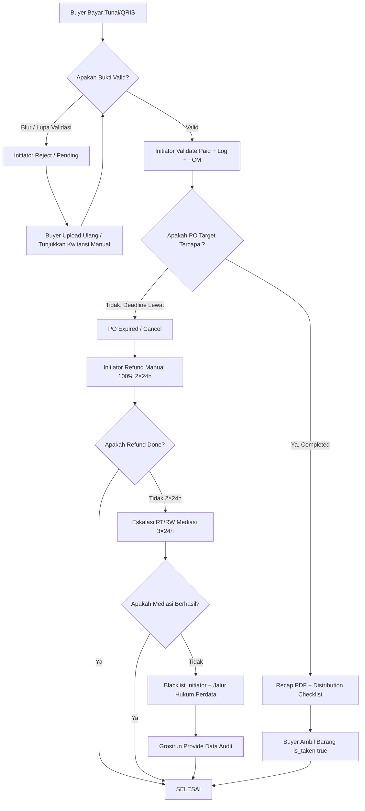

# SOP PENYELESAIAN SENGKETA - Grosirun V3.1

**Non-Escrow Refund & Eskalasi**  
**Tanggal:** 20 Juli 2026  
**Status:** Final  
**Legal:** Non-Escrow, tidak memegang dana, bukan penjamin

---

## Daftar Isi

1. Pendahuluan & Konteks Bisnis
2. Filosofi Non-Escrow & ToS Consent
3. Tanggung Jawab Pihak
4. Skenario Sengketa & SOP Timeline
5. Bukti yang Dibutuhkan untuk Mediasi
6. Eskalasi RT/RW
7. Flowchart Penyelesaian Sengketa
8. Template WA & Consent Screen
9. Audit Log untuk Mediasi
10. Ringkasan & Poin Penting

---

## 1. Pendahuluan & Konteks Bisnis

### 1.1 Mengapa Dokumen Ini Penting?

Grosirun adalah platform patungan berbasis gotong royong. Berdasarkan **BUSINESS_ANALYSIS.md**, model bisnis Grosirun adalah:

| Komponen                      | Nilai                          |
| ----------------------------- | ------------------------------ |
| Platform Fee                  | 1% GMV + PPN 11%               |
| GMV per PO AT_70              | Rp8.400.000 (700Kg × Rp12.000) |
| Laba Initiator per PO         | Rp956.760                      |
| Margin Initiator Bruto per PO | Rp1.050.000                    |

**Konsekuensi Non-Escrow:**

- Grosirun **tidak pernah memegang dana** buyer
- Dana tunai/QRIS langsung ke rekening pribadi Initiator
- Risiko sengketa dana adalah **tanggung jawab Initiator**

**Tujuan SOP Ini:**

1. Melindungi hak buyer dan initiator
2. Memberikan prosedur jelas untuk refund manual
3. Menyediakan jalur eskalasi RT/RW
4. Menjamin transparansi dengan audit log

### 1.2 Prinsip Dasar

| Prinsip               | Keterangan                                          |
| --------------------- | --------------------------------------------------- |
| **Non-Escrow**        | Grosirun tidak memegang dana, hanya mencatat status |
| **Transparansi**      | Semua aksi tercatat di `transaction_logs`           |
| **Akuntabilitas**     | Initiator bertanggung jawab atas refund manual      |
| **Eskalasi Bertahap** | Buyer ↔ Initiator → RT → RW → Hukum                 |
| **Bukti Digital**     | S3 proof tempUrl 1h, audit log, recap PDF           |

---

## 2. Filosofi Non-Escrow & ToS Consent

### 2.1 Alur Dana Non-Escrow

```
┌─────────────────────────────────────────────────────────────────────────────┐
│                         ALUR DANA NON-ESCROW                               │
├─────────────────────────────────────────────────────────────────────────────┤
│                                                                             │
│  Buyer Bu Siti                                                              │
│       │                                                                     │
│       ▼                                                                     │
│  Bayar Rp240.000 (Tunai/QRIS pribadi Pak Agus)                            │
│       │                                                                     │
│       ▼                                                                     │
│  Rekening Pribadi Initiator Pak Agus (BCA 1234567890)                     │
│       │                                                                     │
│       ├─── Rp7.350.000 → Supplier CV Makmur Jaya (BCA 9876543210)        │
│       │                                                                     │
│       ├─── Rp93.240 → PT Grosirun (Platform Fee 1% + PPN 11%)             │
│       │                                                                     │
│       └─── Rp956.760 → Laba Bersih Initiator                              │
│                                                                             │
│  GROSIRUN TIDAK PERNAH PEGANG UANG BUYER                                  │
└─────────────────────────────────────────────────────────────────────────────┘
```

### 2.2 ToS Consent Screen

**Wajib ditampilkan di Onboarding Flutter (setelah OTP login pertama):**

```
═══════════════════════════════════════════════════════════════
                    SYARAT LAYANAN NON-ESCROW
═══════════════════════════════════════════════════════════════

1. Grosirun adalah alat catat digital gotong royong, BUKAN
   marketplace, BUKAN escrow, BUKAN penjamin dana.

2. Dana tunai / transfer QRIS langsung ke rekening pribadi
   Initiator (Ketua RT), BUKAN ke Grosirun.

3. Jika terjadi sengketa dana:
   - Sudah transfer tapi bukti blur
   - Sudah bayar tunai tapi lupa validasi
   - PO batal karena target gagal

   Maka tanggung jawab pertama Initiator untuk REFUND MANUAL
   100% dalam 2×24 JAM.

4. Jika Initiator tidak kooperatif, eskalasi ke Ketua RT/RW
   untuk mediasi.

5. Grosirun menyediakan data audit untuk mediasi:
   - transaction_logs (riwayat aksi)
   - orders paid (daftar pembayaran)
   - S3 proof tempUrl 1h (bukti QRIS)
   - Recap PDF (rekap transaksi)

   Grosirun BUKAN penjamin dana.

6. Dengan mencentang "Saya mengerti dan setuju", Anda
   menyatakan telah memahami dan menyetujui sistem
   non-escrow ini.

☐ Saya mengerti dan setuju dengan Syarat Layanan Non-Escrow

                    [ SETUJU LANJUT ]
═══════════════════════════════════════════════════════════════
```

**API Call:** `POST /auth/tos-accept` → `users.tos_accepted_at` tercatat

**Jika tidak setuju:** Aplikasi logout, tidak bisa melanjutkan.

---

## 3. Tanggung Jawab Pihak

### 3.1 Matriks Tanggung Jawab

| Pihak               | Tanggung Jawab                                 | Batas Waktu            | Konsekuensi Jika Gagal            |
| ------------------- | ---------------------------------------------- | ---------------------- | --------------------------------- |
| **Buyer**           | Bayar tunai tepat waktu sebelum deadline PO    | Sebelum deadline PO    | Order dibatalkan otomatis         |
|                     | Upload bukti QRIS jelas (nominal terlihat)     | Saat upload            | Bukti ditolak, harus upload ulang |
|                     | Simpan kwitansi manual tunai (jika ada)        | -                      | Sulit buktikan pembayaran         |
| **Initiator**       | Validasi pembayaran tunai setelah terima fisik | 2×24 jam               | Buyer komplain, eskalasi          |
|                     | Cek mutasi QRIS, validasi/reject bukti         | 2×24 jam               | Order pending, reputasi turun     |
|                     | Override dengan notes jika mutasi ada          | 2×24 jam               | Audit log untuk mediasi           |
|                     | Refund manual 100% jika PO batal               | 2×24 jam setelah batal | Eskalasi RW, blacklist            |
|                     | Checklist distribusi is_taken                  | Saat distribusi        | Buyer tidak bisa ambil barang     |
| **Grosirun System** | Catat status ACID lockForUpdate zero oversell  | Real-time <500ms       | Oversell error 409                |
|                     | Audit logs transaction_logs                    | Real-time              | Tidak ada bukti mediasi           |
|                     | S3 proof private tempUrl 1h lifecycle 90d      | Real-time              | Bukti hilang, mediasi sulit       |
|                     | FCM + fallback notifications                   | Real-time              | Buyer tidak tahu status           |
|                     | Recap PDF akurat                               | <3s                    | Data rekap salah                  |
| **Ketua RT/RW**     | Mediasi jika buyer & initiator deadlock        | 3×24 jam               | Kasus naik ke RW                  |
|                     | Saksi transaksi                                | Saat mediasi           | Sulit memutuskan                  |
|                     | Blacklist initiator jika kabur                 | Setelah mediasi gagal  | Initiator tidak bisa buat PO lagi |

### 3.2 Referensi Unit Economics (BUSINESS_ANALYSIS.md)

| Komponen                      | Nilai         | Keterangan                            |
| ----------------------------- | ------------- | ------------------------------------- |
| Margin Bruto Initiator per PO | Rp1.050.000   | 700Kg × Rp1.500                       |
| Platform Fee Tagih            | Rp93.240      | 1% + PPN 11%                          |
| **Laba Bersih Initiator**     | **Rp956.760** | **Dana yang harus siap untuk refund** |

**Initiator harus menyisihkan dana untuk potensi refund** dari laba bersih Rp956.760 per PO.

---

## 4. Skenario Sengketa & SOP Timeline

### 4.1 Skenario 1: QRIS Transfer Bukti Blur

**Kasus:** Buyer transfer QRIS Rp60.000, upload screenshot blur (nominal tidak terlihat). Initiator menolak bukti.

| Langkah     | Actor         | Action                                                                                                 | Timeline | Bukti                                                                              |
| ----------- | ------------- | ------------------------------------------------------------------------------------------------------ | -------- | ---------------------------------------------------------------------------------- |
| 1           | **Buyer**     | Transfer QRIS Rp60.000 jam 10:00                                                                       | -        | Screenshot blur di S3 `order_proofs/{uuid}.jpg`                                    |
| 2           | **Initiator** | Dashboard Tab QRIS Waiting → lihat proof blur → tap REJECT + reason "Foto blur nominal tidak terlihat" | <24 jam  | PATCH reject + `transaction_logs` type `rejection` + reason + FCM + fallback notif |
| 3           | **System**    | FCM + fallback notifications: "Bukti ditolak: Foto blur..."                                            | Instant  | `notifications` table                                                              |
| 4           | **Buyer**     | Upload ulang bukti jelas jam 11:00                                                                     | -        | Proof baru S3                                                                      |
| 5           | **Initiator** | Validate QRIS → paid + log validation + FCM lunas                                                      | <24 jam  | `transaction_logs` type `validation`                                               |
| **Selesai** | -             | Order paid, current_kg++                                                                               | -        | -                                                                                  |

**Alternatif jika buyer tidak upload ulang:**

Initiator bisa **override validate** dengan notes:

> "Sudah cek mutasi BCA 60.000 jam 10:05, bukti blur tapi mutasi ada."

→ `transaction_logs` type `override` + notes tercatat.

**Timeline Refund (jika sengketa):** 2×24 jam.

---

### 4.2 Skenario 2: Tunai Lupa Validasi, PO Selesai

**Kasus:** Buyer bayar tunai Rp60.000 jam 09:00, Initiator lupa tap Validasi. PO mencapai 100% jam 12:00 dan completed. Buyer status masih pending, tidak bisa ambil barang.

**SOP:**

| Langkah | Actor         | Action                                                                  | Timeline        |
| ------- | ------------- | ----------------------------------------------------------------------- | --------------- |
| 1       | **Buyer**     | Tunjukkan kwitansi manual / saksi                                       | Saat komplain   |
| 2       | **Initiator** | Override validate with notes "Lupa validasi, buyer ada kwitansi manual" | 2×24 jam        |
| 3       | **System**    | Status paid, order masuk distribusi (tambahan manual)                   | Instant         |
| 4       | **Initiator** | Buyer ambil barang, is_taken true                                       | Saat distribusi |

**Penting:**

- Sebelum `POST /campaigns/{id}/complete-distribution`, initiator **harus** memastikan tidak ada pending left (dashboard pending tab kosong)
- Jika masih ada pending → validasi atau cancel/refund manual

**Peringatan di App:**

```
⚠️ PERHATIAN
Masih ada 3 order pending yang belum divalidasi!
Selesaikan validasi sebelum menyelesaikan distribusi.
```

---

### 4.3 Skenario 3: PO Gagal Target, Buyer Sudah Paid

**Kasus:** PO Beras Mahkota target 1000Kg, hanya terkumpul 600Kg (60%). Deadline lewat, PO expired. 35 buyer sudah paid total Rp8.400.000. Ini adalah uang yang sudah masuk ke rekening Initiator.

**SOP Timeline 2×24 Jam:**

| Langkah | Actor                 | Action                                                                       | Timeline  | Keterangan                                       |
| ------- | --------------------- | ---------------------------------------------------------------------------- | --------- | ------------------------------------------------ |
| 1       | **System**            | Deadline lewat, status auto expired via `CheckDeadlinesJob`, FCM H-1 warning | H-1       | Notifikasi "PO Hampir Gagal!"                    |
| 2       | **Initiator**         | POST `/campaigns/{id}/cancel` → status expired                               | H+0       | Pending orders cancelled, paid orders tetap paid |
| 3       | **Initiator**         | FCM broadcast: "PO Beras Mahkota dibatalkan, refund 2×24h hubungi Initiator" | H+0       | WA + FCM + fallback                              |
| 4       | **Initiator**         | **Refund manual tunai 100%** ke buyer paid list                              | H+0 - H+2 | Dari rekening pribadi                            |
| 5       | **Buyer**             | Terima refund tunai + tanda terima manual                                    | H+0 - H+2 | Kwitansi manual                                  |
| 6       | **Initiator**         | Catat refund di transaction_logs type `cancel_campaign` notes "Refunded all" | H+2       | Audit log                                        |
| 7       | **Jika tidak refund** | Eskalasi RT/RW mediasi 3×24h                                                 | H+2 - H+5 | Lihat Section 6                                  |

**Refund Amount:**

| Detail                         | Nilai                      |
| ------------------------------ | -------------------------- |
| Total GMV terkumpul            | Rp8.400.000                |
| Supplier cost (sudah dibayar?) | Tergantung kontrak         |
| **Dana yang harus direfund**   | **100% dari buyer paid**   |
| Sumber dana                    | Rekening pribadi Initiator |

**Peringatan di App (saat cancel):**

```
⚠️ PERHATIAN!
Anda akan membatalkan PO Beras Mahkota.
- 35 buyer sudah paid (Rp8.400.000)
- Anda wajib refund 100% dalam 2×24 jam
- Jika tidak, akun Anda akan di-suspend
- List buyer paid: [nama1, nama2, ...]

[ BATALKAN PO ]   [ BATAL ]
```

---

### 4.4 Skenario 4: Initiator Kabur Bawa Uang Rp10 Juta

**Kasus:** Initiator tidak refund, menghilang setelah menerima Rp8.400.000 dari buyer dan Rp7.350.000 dari supplier (jika sudah transfer). Total dana yang dipegang ~Rp10.000.000.

**Risk & Mitigation:**

| Aspek                     | Detail                                                                                          |
| ------------------------- | ----------------------------------------------------------------------------------------------- |
| **Risiko**                | Non-escrow inherent, Grosirun tidak pegang dana                                                 |
| **Mitigasi Pencegahan**   | Initiator = Ketua RT terpercaya, cluster code invite limited, onboarding pilot Pak Agus trusted |
| **Mitigasi Transparansi** | Audit log transparan, S3 proof, recap PDF, buyer tahu alamat RT                                 |
| **Jika Kabur**            | Buyer lapor Ketua RW + mediasi, Grosirun provide data audit, jalur hukum perdata                |
| **Blacklist**             | `users.blacklisted_at=now()`, tidak bisa buat PO lagi                                           |

**Data yang Diberikan Grosirun untuk Mediasi:**

| Data                         | Format    |
| ---------------------------- | --------- |
| List buyer paid + nominal    | Recap PDF |
| S3 proof images (tempUrl 1h) | URL       |
| transaction_logs audit       | CSV       |
| Rekap total dana             | PDF       |

**Jalur Hukum:** Grosirun **bukan penjamin**, hanya menyediakan data.

**Future V1.1:** Escrow integration via Xendit licensed PJP (opsional).

---

## 5. Bukti yang Dibutuhkan untuk Mediasi

### 5.1 Data dari Grosirun

| Sumber Data          | Detail                                                                                                                             | Akses                         |
| -------------------- | ---------------------------------------------------------------------------------------------------------------------------------- | ----------------------------- |
| **orders**           | uuid, total_kg, total_price, payment_method, payment_status, proof_path (S3 tempUrl 1h), is_taken, taken_at, taken_by_initiator_id | Initiator via dashboard       |
| **transaction_logs** | type, notes, ip_address, created_at, initiator_id                                                                                  | Initiator via audit           |
| **campaigns recap**  | Total buyer, total Kg, total revenue, total supplier cost, margin                                                                  | Initiator via recap PDF       |
| **notifications**    | FCM + DB notif broadcast cancel/extend                                                                                             | System log                    |
| **S3 proof images**  | Private tempUrl 1h, lifecycle 90d                                                                                                  | Owner/Initiator via proof-url |
| **users**            | consent_at, tos_accepted_at (legal consent)                                                                                        | Admin only                    |

### 5.2 Export untuk Mediasi

**1. Recap PDF (Auto dari app):**

```
GET /campaigns/{id}/recap
→ PDF S3 tempUrl 1h
```

**2. Audit Logs CSV (Manual via Artisan):**

```bash
php artisan orders:export-csv --campaign=12 --status=paid
```

**3. Query SQL untuk Mediasi (Manual):**

```sql
SELECT
    o.uuid AS order_uuid,
    u.name AS buyer_name,
    u.phone AS buyer_phone_masked,
    v.size_kg AS variant_size,
    o.quantity,
    o.total_price,
    o.payment_method,
    o.payment_status,
    o.is_taken,
    o.taken_at,
    tl.type AS log_type,
    tl.notes AS log_notes,
    tl.created_at AS log_created_at,
    i.name AS initiator_name
FROM orders o
JOIN users u ON o.user_id = u.id
JOIN campaign_variants v ON o.campaign_variant_id = v.id
LEFT JOIN transaction_logs tl ON tl.order_id = o.id
JOIN users i ON tl.initiator_id = i.id
WHERE o.campaign_id = 12
  AND o.payment_status = 'paid'
ORDER BY o.created_at;
```

---

## 6. Eskalasi RT/RW

### 6.1 Level Eskalasi

```
┌─────────────────────────────────────────────────────────────────────────────┐
│                           ESKALASI SENGKETA                                 │
├─────────────────────────────────────────────────────────────────────────────┤
│                                                                             │
│  LEVEL 1: Buyer ↔ Initiator (WA Personal)                                 │
│  ├─ Buyer tunjukkan bukti transfer/mutasi                                  │
│  ├─ Initiator cek mutasi, validasi/refund                                 │
│  └─ Timeline: 2×24 jam                                                    │
│                                                                             │
│         ↓ Jika deadlock                                                    │
│                                                                             │
│  LEVEL 2: Ketua RT sebagai Saksi                                           │
│  ├─ Mediasi offline di rumah RT                                           │
│  ├─ Tunjukkan rekap PDF + audit logs via HP initiator                    │
│  └─ Timeline: 3×24 jam                                                    │
│                                                                             │
│         ↓ Jika initiator tidak kooperatif                                 │
│                                                                             │
│  LEVEL 3: Ketua RW                                                         │
│  ├─ RW panggil initiator                                                   │
│  ├─ Mediasi dengan saksi RW                                               │
│  ├─ Blacklist initiator jika perlu                                        │
│  └─ Timeline: 3×24 jam                                                    │
│                                                                             │
│         ↓ Jika nominal > Rp5.000.000 dan kabur                            │
│                                                                             │
│  LEVEL 4: Jalur Hukum Perdata                                              │
│  ├─ Laporan polisi                                                         │
│  ├─ Grosirun provide data audit untuk penyelidikan                        │
│  └─ Grosirun BUKAN penjamin                                               │
│                                                                             │
└─────────────────────────────────────────────────────────────────────────────┘
```

### 6.2 Timeline Total

| Level                      | Timeline | Total dari Kejadian |
| -------------------------- | -------- | ------------------- |
| Level 1: Buyer ↔ Initiator | 2×24 jam | 2 hari              |
| Level 2: Ketua RT          | 3×24 jam | 5 hari              |
| Level 3: Ketua RW          | 3×24 jam | 8 hari              |
| Level 4: Hukum             | Variabel | >8 hari             |

**Maksimal eskalasi selesai dalam 7 hari (Level 1-3).**

### 6.3 Blacklist Initiator

**Trigger:** Tidak refund 2×24 jam setelah PO batal, atau kabur.

**Implementasi:**

```php
// app/Jobs/CheckPlatformFeeOverdueJob.php
if ($overdue > 7 days) {
    $user->update(['blacklisted_at' => now()]);
    // Tidak bisa create campaign, validate
    // Notifikasi buyer: "Initiator RT03 suspend, hubungi RW"
}
```

---

## 7. Flowchart Penyelesaian Sengketa



### 7.1 Penjelasan Flowchart

| Node  | Keterangan                                              |
| ----- | ------------------------------------------------------- |
| **A** | Buyer melakukan pembayaran (tunai/QRIS)                 |
| **B** | Validasi bukti: QRIS jelas? Tunai sudah terekam di app? |
| **C** | Jika bukti blur → initiator reject, buyer upload ulang  |
| **E** | Jika valid → initiator validate, status paid, FCM notif |
| **F** | Cek apakah PO mencapai target 100%                      |
| **G** | Jika tidak → PO expired/cancel, initiator wajib refund  |
| **H** | Refund manual 100% dari rekening pribadi initiator      |
| **K** | Jika tidak refund 2×24h → eskalasi RT/RW                |
| **O** | Jika target tercapai → recap + distribusi               |
| **P** | Buyer ambil barang, is_taken true                       |

---

## 8. Template WA & Consent Screen

### 8.1 Template WA Reject Proof Blur

**Otomatis dari API (saat initiator reject):**

> "Halo [Nama Buyer], bukti QRIS PO [Nama PO] [Varian] Rp[Total] foto blur nominal tidak terlihat. Mohon upload ulang bukti jelas di aplikasi Grosirun. Atau jika sudah transfer, hubungi saya via WA pribadi untuk verifikasi mutasi. Terima kasih - [Nama Initiator] RT[No]"

**Manual (jika initiator ingin personalisasi):**

> "Bu Siti, maaf bukti QRIS Beras Mahkota 5Kg Rp60.000 foto blur. Mohon upload ulang foto yang jelas ya. Kalau sudah transfer, bisa screenshot mutasi BCA dan kirim ke WA saya. - Pak Agus RT03"

### 8.2 Template WA Cancel Refund

**Otomatis dari API (saat initiator cancel campaign):**

> "⚠️ PEMBERITAHUAN PO BATAL
>
> PO [Nama PO] dibatalkan karena target [Target] baru [Current] ([Progress]%).
>
> Bagi yang sudah bayar (paid), silakan ambil refund tunai 100% di rumah [Nama Initiator] dalam 2×24 jam.
>
> List paid:
> [List Nama Buyer + Total]
>
> Jika tidak diambil dalam 2×24 jam, silakan hubungi Ketua RW untuk mediasi.
>
> Terima kasih - [Nama Initiator] RT[No]"

**Manual:**

> "Warga RT03, PO Beras Mahkota dibatalkan karena target 1000Kg baru 600Kg. Bagi yang sudah bayar, refund 100% di rumah Pak Agus 2×24 jam. Daftar: Bu Siti 60k, Pak Joko 115k, Bu Nengsih 60k... Total 8.4jt. Terima kasih."

### 8.3 Consent Screen (ToS)

**Sudah di Section 2.2.** Ini wajib muncul pertama kali setelah OTP login.

---

## 9. Audit Log untuk Mediasi

### 9.1 Data yang Tersedia

| Data             | Lokasi                                    | Akses                         |
| ---------------- | ----------------------------------------- | ----------------------------- |
| **Order detail** | `orders` table                            | Initiator di dashboard        |
| **Bukti QRIS**   | S3 `order_proofs/{uuid}.jpg` (tempUrl 1h) | Owner/Initiator via proof-url |
| **Audit trail**  | `transaction_logs` table                  | Initiator di dashboard        |
| **Rekap PO**     | Recap PDF S3                              | Initiator via recap           |
| **Notifikasi**   | `notifications` table                     | User via notification screen  |

### 9.2 Query untuk Mediasi

**Export CSV untuk mediator:**

```sql
SELECT
    o.uuid AS 'Order ID',
    u.name AS 'Buyer',
    SUBSTRING(u.phone, 1, 4) AS 'Phone (masked)',
    v.size_kg AS 'Variant (Kg)',
    o.quantity AS 'Qty',
    o.total_price AS 'Total (Rp)',
    o.payment_method AS 'Metode',
    o.payment_status AS 'Status',
    o.is_taken AS 'Sudah Ambil',
    tl.type AS 'Log Type',
    tl.notes AS 'Log Notes',
    tl.created_at AS 'Log Time',
    i.name AS 'Initiator'
FROM orders o
JOIN users u ON o.user_id = u.id
JOIN campaign_variants v ON o.campaign_variant_id = v.id
LEFT JOIN transaction_logs tl ON tl.order_id = o.id
JOIN users i ON tl.initiator_id = i.id
WHERE o.campaign_id = 12
  AND o.payment_status IN ('paid', 'waiting')
ORDER BY o.created_at;
```

**Export via Artisan (future V1.1):**

```bash
php artisan orders:export-csv --campaign=12 --status=paid
```

### 9.3 S3 Proof Access untuk Mediasi

**Cara mendapatkan proof URL:**

1. Login sebagai Initiator (Pak Agus)
2. Buka detail order
3. Tap "Lihat Bukti"
4. S3 tempUrl 1h di-generate
5. Tunjukkan ke mediator

**Jika buyer/mediator butuh akses:**

```bash
# Via API (authorized)
GET /orders/{uuid}/proof-url
→ {"proof_url": "https://s3...tempUrl..."}
```

---

## 10. Ringkasan & Poin Penting

### 10.1 Poin Kunci untuk Tim

| #   | Poin               | Keterangan                                         |
| --- | ------------------ | -------------------------------------------------- |
| 1   | **Non-Escrow**     | Grosirun tidak pernah pegang dana buyer            |
| 2   | **Refund 2×24h**   | Initiator wajib refund 100% dalam 2 hari           |
| 3   | **Eskalasi RT/RW** | Jika initiator tidak kooperatif, eskalasi ke RT/RW |
| 4   | **Audit Log**      | Semua aksi tercatat, siap untuk mediasi            |
| 5   | **ToS Consent**    | User wajib setuju non-escrow sebelum pakai app     |
| 6   | **Blacklist**      | Initiator nakal di-blacklist, tidak bisa buat PO   |
| 7   | **S3 Proof**       | Bukti QRIS tersimpan 90 hari, tempUrl 1h           |

### 10.2 Poin Kunci untuk Warga RT

| #   | Poin                    | Bahasa Sederhana                                            |
| --- | ----------------------- | ----------------------------------------------------------- |
| 1   | Dana langsung ke Pak RT | Uang tidak masuk ke aplikasi, langsung ke rekening Pak Agus |
| 2   | Refund 2 hari           | Jika PO batal, Pak Agus wajib kembalikan uang 2 hari        |
| 3   | Ada saksi RT/RW         | Jika ada masalah, RT/RW siap mediasi                        |
| 4   | Simpan bukti            | Kwitansi manual, screenshot mutasi, simpan sampai selesai   |
| 5   | Audit log               | Semua transaksi tercatat, bisa dicek kapan saja             |

### 10.3 Timeline Refund & Eskalasi

```
Kejadian (PO Batal)
    │
    ▼
H+0: Initiator refund manual
    │
    ├── 2×24 jam (H+2)
    │
    ▼
Jika TIDAK refund
    │
    ▼
H+2: Eskalasi RT (mediasi 3×24 jam)
    │
    ├── 3×24 jam (H+5)
    │
    ▼
Jika TIDAK selesai
    │
    ▼
H+5: Eskalasi RW (mediasi 3×24 jam)
    │
    ├── 3×24 jam (H+8)
    │
    ▼
Jika TIDAK selesai
    │
    ▼
H+8: Blacklist + Jalur Hukum
```

---

**SOP Penyelesaian Sengketa V3.1 Production Ready - Non-Escrow, 2×24h Refund, Eskalasi RT/RW, Audit Log!** ⚖️
