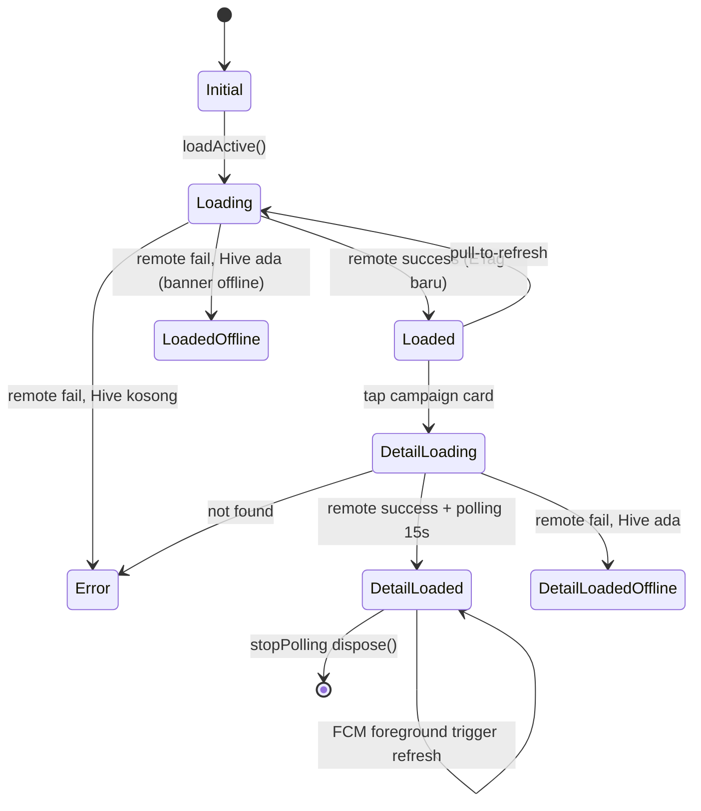
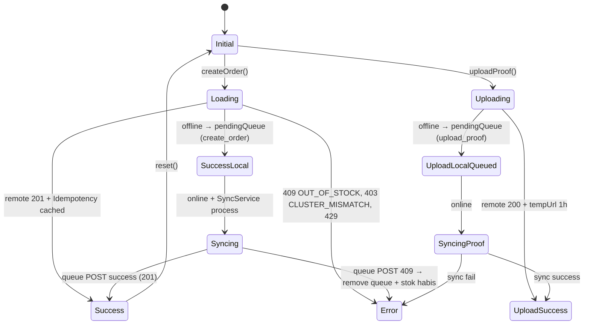
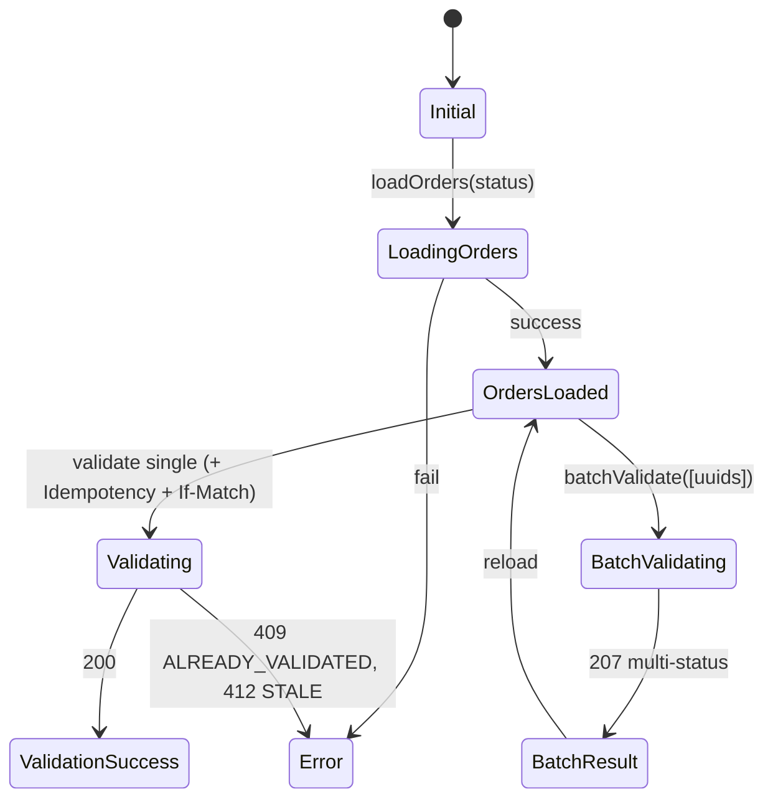

# SPESIFIKASI MOBILE - Grosirun V3.1

**Tanggal:** 20 Juli 2026
**Versi:** 3.1
**Owner:** Mobile
**Review Cycle:** Setiap release
**Global Glossary:** [Indeks Dokumentasi](README.md#glossary-global-indonesiainggris)
**Status Dokumen:** Final
**Status Implementasi:** Flutter Ready for Integration | Backend Not Started

---

## Daftar Isi

1. Prinsip UX dan Design System
2. Role, Screen Map, dan Navigation
3. State Management dan Dependency Injection
4. Cubit per Domain
5. Offline, Sync, dan Persistence
6. Deep Link, FCM, dan Error Handling
7. Accessibility dan Performance
8. Spesifikasi UI Terperinci
9. Spesifikasi State Terperinci

---

## 1. Prinsip UX dan Design System

Mobile Flutter melayani Buyer, Initiator, Seller, dan Admin melalui active-role navigation. UI harus ringan untuk perangkat RAM 2GB, accessible, offline-aware, serta tidak membuka data Buyer kepada Seller.

## 2. Role, Screen Map, dan Navigation

RoleSelector menentukan workspace aktif. Buyer/Initiator cluster-scoped, Seller supplier-scoped, dan Admin platform-scoped. Route guard client hanya UX; authorization final selalu server Policy.

## 3. State Management dan Dependency Injection

Gunakan Cubit + Repository offline-first + Dio + Hive. Dependency injection memisahkan remote/local source, role context, supplier membership, campaign, purchase order, dan Admin operations.

## 4. Cubit per Domain

Cubit canonical: AuthCubit, RoleContextCubit, CampaignCubit, OrderCubit, SellerCubit, PurchaseOrderCubit, AdminCubit. State transition mengikuti API ETag, Idempotency-Key, lifecycle campaign, dan lifecycle PO.

## 5. Offline, Sync, dan Persistence

Read cache dapat offline. Mutation finansial, accept/reject PO, moderasi, verification, role grant, suspension, dispute resolution, dan override tidak boleh dilakukan offline. Queue hanya untuk operasi yang secara eksplisit aman dan idempotent.

## 6. Deep Link, FCM, dan Error Handling

Deep link memulihkan role/context dengan aman. FCM tidak membawa PII. Error mapping mengikuti API_SPEC bagian 1.4. Global error boundary mengirim trace tanpa secret atau temporary URL.

## 7. Accessibility dan Performance

Target touch 48–56dp, TalkBack semantics, contrast, responsive layout, skeleton/empty/error state, list virtualization, image cache, dan budget pada OBSERVABILITY.

## 8. Spesifikasi UI Terperinci

> **Referensi brand:** Seluruh spesifikasi warna, tipografi, dan komponen UI di bagian ini mengikuti [Brand Guidelines](BRAND_GUIDELINES.md) sebagai panduan identitas visual resmi.

### 1. Prinsip Desain

| Prinsip                  | Keterangan                                                                                                                       |
| ------------------------ | -------------------------------------------------------------------------------------------------------------------------------- |
| **Ringan di Mata**       | Latar belakang dominan putih (#FFFFFF), hijau neon (#16A34A) untuk aksi, tidak berlebihan warna                                  |
| **Jempol Friendly**      | Semua tombol utama minimal 56dp, tombol sekunder 48dp, area sentuh minimal 48dp                                                  |
| **Tanpa Typing Manual**  | Varian paten menggunakan tombol +/- saja, tidak ada input text angka (mencegah salah input 3.5 vs 35)                            |
| **Feedback Instant**     | Progress bar truk (Lottie + linear), social ticker marquee, snackbar sukses/error dengan pesan human-readable dari API_SPEC bagian 1.4 — Format dan Katalog Error |
| **Offline Banner**       | Banner kuning di atas: "Kamu offline, data mungkin tidak terbaru" saat isOffline = true                                          |
| **Trust & Transparansi** | Tampilkan nama cluster (PGH-RT03) di app bar, tampilkan consent & ToS, tampilkan audit log untuk override                        |

**Referensi [BUSINESS_ANALYSIS.md](BUSINESS_ANALYSIS.md):**

| Komponen              | Nilai            |
| --------------------- | ---------------- |
| Platform Fee          | 1% GMV + PPN 11% |
| GMV per PO AT_70      | Rp8.400.000      |
| Laba Initiator per PO | Rp956.760        |

**UI/UX harus mendukung transparansi keuangan dan kemudahan bagi warga RT.**

---

### 2. Warna, Tipografi & Spasi

#### 2.1 Palet Warna

| Token                   | Hex                           | Penggunaan                             |
| ----------------------- | ----------------------------- | -------------------------------------- |
| **Primary**             | #16A34A                       | Tombol ikut patungan, validasi, sukses |
| **Primary Dark**        | #15803D                       | State pressed                          |
| **Secondary (Warning)** | #FACC15                       | Progress 70-99% (kuning)               |
| **Error**               | #DC2626                       | Tolak, error, gagal upload proof       |
| **Background**          | #FFFFFF                       | Latar belakang Scaffold                |
| **Surface**             | #F8FAFC                       | Latar card abu-abu terang              |
| **Text Primary**        | #0F172A                       | Judul, body                            |
| **Text Secondary**      | #64748B                       | Subjudul, time ago                     |
| **Border**              | #E2E8F0                       | Border card                            |
| **Offline Banner**      | #FEF9C3 (bg) + #854D0E (text) | Peringatan offline                     |

#### 2.2 Tipografi

**Font Family:**

- Gunakan system font default (Roboto/San Francisco) untuk menjaga APK <10MB.
- Hindari custom font heavy. Jika terpaksa, subset Latin only.

**Skala Tipografi:**

| Nama               | Ukuran | Weight  | Penggunaan                  |
| ------------------ | ------ | ------- | --------------------------- |
| **Headline Large** | 24sp   | Bold    | Nama campaign di detail     |
| **Title Medium**   | 18sp   | Medium  | Judul card di home          |
| **Body Large**     | 16sp   | Regular | Deskripsi, ukuran varian    |
| **Body Medium**    | 14sp   | Regular | Secondary, ticker, time ago |
| **Label Large**    | 16sp   | Medium  | Text tombol                 |

**Line Height:** 1.4

#### 2.3 Spasi

- **Base:** 8dp
- **Skala:** 4, 8, 12, 16, 24, 32
- **Card Padding:** 16dp internal
- **Card Margin:** 12dp antar card
- **Tombol Height:** 56dp
- **Tombol Border Radius:** 12dp
- **Card Border Radius:** 16dp
- **App Bar Height:** 56dp
- **Bottom Sheet Radius Top:** 24dp

---

### 3. Widget Standar

#### 3.1 BigButton (Tombol Utama)

**Spesifikasi:**

| Properti      | Nilai           |
| ------------- | --------------- |
| Height        | 56dp (minimal)  |
| Min Width     | 120dp           |
| Border Radius | 12dp            |
| Background    | Primary #16A34A |
| Text Color    | Putih           |
| Font Size     | 16sp            |
| Weight        | Medium          |
| Elevation     | 0               |
| Icon          | Opsional (kiri) |

**State:**

| State        | Tampilan                                                              |
| ------------ | --------------------------------------------------------------------- |
| **Normal**   | Background #16A34A, text putih                                        |
| **Pressed**  | Background #15803D                                                    |
| **Loading**  | CircularProgressIndicator putih 20dp di dalam tombol, tombol disabled |
| **Disabled** | Background #E2E8F0, text #94A3B8                                      |

#### 3.2 Progress Truck

**Komponen:**

```
┌──────────────────────────────────────────────────────┐
│  🚚  ████████████████████░░░░░░░░░░░░  75%          │
│  Terkumpul 750 Kg dari Target 1000 Kg (75%)         │
│  ⏰ Sisa 12 Jam 30 Menit                            │
└──────────────────────────────────────────────────────┘
```

**Spesifikasi:**

| Komponen            | Detail                                                                                                         |
| ------------------- | -------------------------------------------------------------------------------------------------------------- |
| **Linear Progress** | Height 24dp, background #E2E8F0                                                                                |
| **Progress 0-70%**  | #16A34A (hijau)                                                                                                |
| **Progress 70-99%** | #FACC15 (kuning)                                                                                               |
| **Progress 100%**   | #16A34A (hijau neon)                                                                                           |
| **Lottie Truck**    | `<100KB`, `assets/lottie/truck.json`, width 48dp, height 32dp, loop idle (tidak bergerak untuk hemat performa) |
| **Text Progress**   | "Terkumpul X Kg dari Target Y Kg (Z%)", 14sp, secondary                                                        |
| **Countdown**       | "Sisa XX Jam XX Menit", 14sp, bold, merah jika <24 jam                                                         |

#### 3.3 Social Ticker

```
┌──────────────────────────────────────────────────────┐
│  Bu Nengsih • 5Kg 2 menit lalu • Pak Joko • 10Kg 5  │
└──────────────────────────────────────────────────────┘
```

**Spesifikasi:**

| Properti   | Nilai                                           |
| ---------- | ----------------------------------------------- |
| Height     | 28dp                                            |
| Background | Surface #F8FAFC                                 |
| Text       | 14sp, secondary                                 |
| Marquee    | Scroll infinite right-to-left                   |
| Data       | `GET /campaigns/{id}/activities` (last 10 paid) |

#### 3.4 Card Campaign (Home)

```
┌──────────────────────────────────────────────────────┐
│  ┌────────────────────────────────────────────────┐  │
│  │  [Image 16:9]                                 │  │
│  └────────────────────────────────────────────────┘  │
│  Beras Mahkota Premium                              │
│  🚚 ████████████████████░░░░░░░░  75%              │
│  Terkumpul 750 Kg dari Target 1000 Kg              │
│  ⏰ Sisa 12 Jam                                    │
│  [PGH-RT03]  [Aktif]                               │
│  ┌──────────────────────────────────────────────┐  │
│  │           Ikut Patungan                      │  │
│  └──────────────────────────────────────────────┘  │
└──────────────────────────────────────────────────────┘
```

**Spesifikasi:**

| Properti      | Nilai                                                                 |
| ------------- | --------------------------------------------------------------------- |
| Width         | Full                                                                  |
| Border Radius | 16dp                                                                  |
| Elevation     | 2                                                                     |
| Border        | #E2E8F0, 1px                                                          |
| Image         | 16:9, `cached_network_image`, 400x225 placeholder shimmer, error icon |
| Padding       | 16dp                                                                  |
| Title         | 18sp, medium, max 2 lines, ellipsis                                   |
| BigButton     | "Ikut Patungan", full width, 56dp                                     |

#### 3.5 Variant Selector (Paten)

```
┌──────────────────────────────────────────────────────┐
│  5 Kg - Rp 60.000        [-]  1  [+]   Sisa 20     │
│  10 Kg - Rp 115.000      [-]  2  [+]   Sisa 13     │
└──────────────────────────────────────────────────────┘
```

**Spesifikasi:**

| Komponen     | Detail                                                   |
| ------------ | -------------------------------------------------------- |
| **Text**     | Ukuran varian "5 Kg - Rp 60.000", 16sp                   |
| **Button -** | 48dp square, border radius 8dp, border Primary, icon "-" |
| **Button +** | 48dp square, border radius 8dp, border Primary, icon "+" |
| **Qty Text** | 16sp bold, 24dp width                                    |
| **Sisa**     | "Sisa 20", 12sp secondary                                |
| **Disabled** | Grey jika remaining = 0 (untuk +) atau qty = 0 (untuk -) |

**Tidak ada TextField manual input!**

#### 3.6 Offline Banner

```
┌──────────────────────────────────────────────────────┐
│  📡 Kamu offline, data mungkin tidak terbaru       │
└──────────────────────────────────────────────────────┘
```

**Spesifikasi:**

| Properti   | Nilai                 |
| ---------- | --------------------- |
| Height     | 32dp                  |
| Background | #FEF9C3               |
| Text Color | #854D0E               |
| Font Size  | 12sp                  |
| Icon       | `wifi_off` 16dp, kiri |

#### 3.7 ErrorView / EmptyView / Skeleton

**ErrorView:**

```
┌──────────────────────────────────────────────────────┐
│  [Icon Error 48dp]                                  │
│  Stok habis, pilih varian lain                      │
│  Trace ID: 550e8400-...                            │
│  ┌──────────────────────────────────────────────┐  │
│  │              Coba Lagi                       │  │
│  └──────────────────────────────────────────────┘  │
└──────────────────────────────────────────────────────┘
```

**EmptyView:**

```
┌──────────────────────────────────────────────────────┐
│  [Icon Inbox 48dp, grey]                           │
│  Belum ada PO aktif di cluster PGH-RT03            │
│  ┌──────────────────────────────────────────────┐  │
│  │              Refresh                         │  │
│  └──────────────────────────────────────────────┘  │
└──────────────────────────────────────────────────────┘
```

**Skeleton:**

- Custom Container grey #E2E8F0, animated pulse
- Untuk card: image 16:9 grey + lines grey
- Tampilkan saat loading, bukan CircularProgressIndicator full screen (UX lebih baik)

---

### 4. Daftar Layar & Navigasi

#### 4.1 Screen Map Canonical Empat Role

```text
Auth
└── Login → OTP → Consent → ToS → RoleSelector

Buyer Workspace
├── Home → CampaignDetail → Checkout
├── MyOrders → OrderDetail → ProofUpload
└── Profile

Initiator Workspace
├── OfferMarketplace → OfferDetail → CreateCampaign
├── InitiatorDashboard → CampaignDashboard
├── PurchaseOrderDetail → PaymentProof → DeliveryConfirmation
├── DistributionChecklist
└── Profile

Seller Workspace
├── SellerDashboard
├── SupplierVerification → SupplierMembers
├── ProductList → ProductForm
├── OfferList → OfferForm → OfferDetail
├── SellerPurchaseOrderList → PurchaseOrderDetail
├── PurchaseOrderDocuments → Fulfillment
└── Profile

Admin Application Workspace
├── AdminApplicationDashboard
├── SupplierVerificationQueue
├── OfferModerationQueue
├── UserRoleManagement → Suspension
├── FulfillmentDisputeQueue → DisputeResolution
├── AuditViewer
└── FeatureFlags
```

`InitiatorDashboardScreen` hanya untuk koordinasi cluster. `AdminApplicationDashboardScreen` hanya untuk operator platform. Route guard client memeriksa active role; server Policy tetap sumber authorization.

#### 4.2 Daftar Layar

##### SplashScreen

- Logo Grosirun
- Loading indicator
- Check autentikasi

##### LoginScreen

- Input field: Nomor HP (08xx)
- Tombol: "Kirim OTP"
- Link: "Privacy Policy"

##### OtpScreen

- Input field: OTP 4 digit
- Timer countdown 5 menit
- Tombol: "Verifikasi"
- Tombol: "Kirim Ulang" (aktif setelah 60 detik)

##### ConsentScreen

- Title: "Kebijakan Privasi (UU PDP)"
- Scrollable text dari [PRIVACY_POLICY.md](PRIVACY_POLICY.md) (ringkasan)
- Link: "Baca selengkapnya"
- Checkbox: "Saya setuju data WA disimpan untuk PO RT sesuai UU PDP No.27/2022"
- Tombol: "Setuju Lanjut" (disabled jika checkbox tidak centang)

##### TosScreen

- Title: "Syarat Layanan Non-Escrow"
- Scrollable text dari [User Guide §7–8](USER_GUIDE.md#7-komplain-refund-dan-dispute-operations) (ringkasan)
- Checkbox: "Saya mengerti dan setuju"
- Tombol: "Setuju Lanjut" (disabled jika checkbox tidak centang)

##### HomeScreen

**AppBar:**

- Logo Grosirun
- Cluster chip: "PGH-RT03"
- Notification bell (badge unread count)
- Profile icon

**Body:**

- OfflineBanner (jika offline)
- PullToRefresh
- List Campaign Cards (atau EmptyView atau Skeleton)

##### CampaignDetailScreen

**AppBar:**

- Back button
- Share WA button

**Body (Scroll):**

- Image 16:9 + OfflineBanner (jika offline)
- Title + Description + Pickup Location
- ProgressTruck + Countdown + Cluster chip
- SocialTicker (marquee)
- Variant Selector list
- Bottom sticky BigButton: "Pesan Sekarang - Total Rp X"

##### CheckoutScreen (BottomSheet)

- Title: "Pilih Pembayaran"
- RadioListTile: Cash + description "Bayar tunai ke Pak Agus"
- RadioListTile: QRIS + description "Transfer QRIS + upload bukti"
- BigButton: "Konfirmasi"

##### MyOrdersScreen

- List orders dengan status (pending, waiting, paid, rejected, cancelled)
- QRIS waiting: tombol "Upload Bukti"
- Tap order → detail order

##### UploadProofScreen

- Pick image via camera/gallery
- Preview gambar
- Info kompresi: "Ukuran 1.2MB → 0.7MB"
- BigButton: "Upload Proof"
- Offline queue banner jika offline

##### InitiatorDashboardScreen

**3 Tabs:**

1. Menunggu Bayar (pending)
2. Lunas Tunai (paid)
3. QRIS Menunggu Cek (waiting)

**Fitur:**

- Search bar
- List orders (user name, variant, qty, total)
- Proof thumbnail (tap → view S3 tempUrl)
- BigButton: "Validasi" (48dp, hijau)
- BigButton: "Tolak" (48dp, merah)
- Checkbox multi-select untuk batch validate
- Batch bar bottom: "Validasi 3 terpilih"

##### AdminApplicationDashboardScreen

- Verification and moderation queue age.
- User/supplier suspension and role management.
- Fulfillment dispute backlog.
- Audit, security alerts, feature rollout, dan emergency override.
- Mutation sensitif meminta re-authentication, reason, ticket ID, dan confirmation.

##### CreateCampaignScreen

**Langkah 1 — Pilih Offer:** daftar offer aktif sesuai area, supplier verified, base unit, kapasitas tersedia, tier, packaging variant, biaya kirim, dan masa berlaku.

**Langkah 2 — Konfigurasi Campaign:**

- Nama dan deskripsi campaign.
- Target quantity dalam base unit.
- Buyer unit price.
- Packaging variant yang dipilih dari offer; tidak dapat membuat ukuran baru.
- Tenggat minimum +24 jam dan tidak melewati aturan offer.
- Lokasi distribusi.
- Foto campaign opsional.

**Ringkasan read-only:** supplier unit price terpilih, supplier subtotal, delivery cost, buyer package price per variant, estimasi margin, available/reserved capacity, dan offer version. Tidak ada input harga supplier.

**Tombol:** "Publikasikan PO" mengirim `supplier_offer_id`, `selected_offer_variant_ids`, target, buyer unit price, dan Idempotency-Key.

##### RecapScreen

- Header: campaign name, target, current
- Text rekap format
- PDF viewer via `flutter_cached_pdfview` atau open tempUrl S3 via `url_launcher`
- BigButton: "Buat Purchase Order" dari snapshot campaign
- Tombol sekunder: "Bagikan Ringkasan" via WA/email sebagai notifikasi tambahan
- Button: "Share PDF"

##### DistributionChecklistScreen

- List paid orders with checkbox `is_taken`
- Info: `taken_at`, `taken_by`
- Search
- Progress: `taken_count / total`
- BigButton: "Selesai Distribusi"

##### NotificationsScreen

- List notifications (fallback DB + FCM Hive)
- Unread: bold, Read: normal
- Tap → mark read + navigate campaign_id
- Swipe to mark read
- AppBar: "Mark All Read"

##### ProfileScreen

- Name
- Phone (masked)
- Cluster
- `consent_at`
- FAQ (expandable)
- Privacy Policy (full text scroll)
- Button: "Hapus Akun" (dengan konfirmasi)

#### 4.3 Navigasi & Deep Link

**Deep Link:** `grosirun://campaign/{id}`

**Flow:**

1. Aplikasi terbuka via deep link
2. Jika sudah login → langsung ke CampaignDetailScreen
3. Jika belum login → simpan pendingDeepLink di Hive `appStateBox`
4. Setelah login → navigasi ke CampaignDetailScreen

**Route Mapping:**

| Route                     | Screen                      |
| ------------------------- | --------------------------- |
| `/`                       | SplashScreen                |
| `/login`                  | LoginScreen                 |
| `/otp`                    | OtpScreen                   |
| `/consent`                | ConsentScreen               |
| `/tos`                    | TosScreen                   |
| `/home`                   | HomeScreen                  |
| `/campaign/:id`           | CampaignDetailScreen        |
| `/my-orders`              | MyOrdersScreen              |
| `/profile`                | ProfileScreen               |
| `/initiator/dashboard` | InitiatorDashboardScreen |
| `/initiator/create` | CreateCampaignScreen |
| `/initiator/recap/:id` | RecapScreen |
| `/initiator/distribution/:id` | DistributionChecklistScreen |
| `/seller/dashboard` | SellerDashboardScreen |
| `/seller/offers` | OfferListScreen |
| `/seller/purchase-orders` | SellerPurchaseOrderListScreen |
| `/admin/dashboard` | AdminApplicationDashboardScreen |
| `/admin/suppliers/verification` | SupplierVerificationQueueScreen |
| `/admin/offers/moderation` | OfferModerationQueueScreen |
| `/admin/disputes` | FulfillmentDisputeQueueScreen |
| `/admin/audit` | AuditViewerScreen |
| `/notifications` | NotificationsScreen |

---

### 5. State Loading, Empty, Error & Skeleton

#### 5.1 Loading

| Skenario            | Tampilan                                            |
| ------------------- | --------------------------------------------------- |
| **List Campaign**   | Skeleton shimmer 3 cards (image grey + lines grey)  |
| **Detail Campaign** | Shimmer image + shimmer lines                       |
| **Checkout**        | BigButton loading state (CircularProgressIndicator) |
| **Upload Proof**    | BigButton loading state                             |

#### 5.2 Empty

| Skenario             | Tampilan                                                  |
| -------------------- | --------------------------------------------------------- |
| **Home (buyer)**     | "Belum ada PO aktif di cluster PGH-RT03" + Button Refresh |
| **Home (initiator)** | "Belum ada PO aktif. Buat PO pertama!" + FAB Create PO    |
| **My Orders**        | "Belum ada pesanan"                                       |
| **Notifications**    | "Belum ada notifikasi"                                    |

#### 5.3 Error

| Skenario                 | Tampilan                                                        |
| ------------------------ | --------------------------------------------------------------- |
| **Network Error**        | ErrorView: Icon error + human message + Trace ID + Button Retry |
| **404 Not Found**        | ErrorView: "PO tidak ditemukan" + Button Kembali                |
| **409 OUT_OF_STOCK**     | Dialog: "Stok habis, pilih varian lain"                         |
| **403 CLUSTER_MISMATCH** | Dialog: "Beda cluster RT, tidak bisa pesan di sini"             |

#### 5.4 Offline

| Skenario         | Tampilan                                                         |
| ---------------- | ---------------------------------------------------------------- |
| **Home**         | Banner kuning: "Kamu offline, data mungkin tidak terbaru"        |
| **Checkout**     | Snackbar: "Kamu offline, pesanan disimpan lokal akan sync nanti" |
| **Upload Proof** | Banner: "Bukti disimpan lokal, akan upload saat online"          |

---

### 6. Bottom Sheet, Dialog & SnackBar

#### 6.1 BottomSheet Payment Method

```
┌──────────────────────────────────────────────────────┐
│  ─── (Handle bar 4dp x 32dp)                       │
│  Pilih Pembayaran                                   │
│                                                    │
│  ○ Cash                                            │
│    Bayar tunai ke Pak Agus                         │
│                                                    │
│  ○ QRIS                                            │
│    Transfer QRIS + upload bukti                   │
│                                                    │
│  ┌──────────────────────────────────────────────┐  │
│  │              Konfirmasi                      │  │
│  └──────────────────────────────────────────────┘  │
└──────────────────────────────────────────────────────┘
```

#### 6.2 Dialog Confirm

```
┌──────────────────────────────────────────────────────┐
│  ⚠️ Konfirmasi                                     │
│                                                    │
│  Yakin batalkan PO?                                │
│  Semua pending akan batal, paid tetap butuh        │
│  refund manual.                                    │
│                                                    │
│  [  Batal  ]    [  Yakin Batalkan  ]              │
└──────────────────────────────────────────────────────┘
```

#### 6.3 SnackBar

| Properti      | Nilai                                              |
| ------------- | -------------------------------------------------- |
| Behavior      | Floating                                           |
| Margin        | 16dp                                               |
| Border Radius | 12dp                                               |
| Background    | #0F172A                                            |
| Text Color    | Putih                                              |
| Font Size     | 14sp                                               |
| Action        | "Lihat" (untuk order success → navigate My Orders) |
| Duration      | Sukses: 3s, Error: 4s                              |

#### 6.4 Dialog Reject Reason

```
┌──────────────────────────────────────────────────────┐
│  Alasan Penolakan                                   │
│                                                    │
│  ┌──────────────────────────────────────────────┐  │
│  │  Foto blur nominal tidak terlihat           │  │
│  └──────────────────────────────────────────────┘  │
│  (Minimal 10 karakter)                             │
│                                                    │
│  [  Batal  ]    [  Tolak  ]                       │
└──────────────────────────────────────────────────────┘
```

#### 6.5 Dialog Override Reason

Sama seperti di atas, untuk catatan override.

---

### 7. Aksesibilitas & Responsif

#### 7.1 Aksesibilitas

| Aspek             | Implementasi                                                                                                                     |
| ----------------- | -------------------------------------------------------------------------------------------------------------------------------- |
| **Semantics**     | Semua BigButton punya label, image punya contentDescription campaign name                                                        |
| **Touch Target**  | Minimal 48dp (WCAG 2.5.5)                                                                                                        |
| **Contrast**      | WCAG 2.1 AA: Primary #16A34A on white (4.5:1 pass), Text Primary #0F172A on white (15:1 pass), Error #DC2626 on white (5:1 pass) |
| **Font Scaling**  | Support `MediaQuery.textScaleFactor` up to 1.3x, layout tidak break                                                              |
| **Screen Reader** | Test TalkBack Android                                                                                                            |

#### 7.2 Responsif

| Perangkat                           | Layout                                     |
| ----------------------------------- | ------------------------------------------ |
| **Mobile Portrait** (width ≥ 360dp) | Single column (default)                    |
| **Tablet** (width > 600dp)          | Grid 2 columns menggunakan `LayoutBuilder` |
| **Landscape**                       | Tetap portrait (disarankan)                |

---

### 8. Animasi, Lottie & Performa

#### 8.1 Lottie

| Properti  | Nilai                        |
| --------- | ---------------------------- |
| File      | `assets/lottie/truck.json`   |
| Size      | <100KB                       |
| Loop      | True                         |
| FrameRate | Max                          |
| Cache     | `LottieComposition` di-cache |

#### 8.2 Animasi

| Animasi            | Durasi | Easing |
| ------------------ | ------ | ------ |
| Progress linear    | 300ms  | ease   |
| Card fade in       | 200ms  | ease   |
| Button press scale | 0.95   | -      |

#### 8.3 Performa

| Tips                 | Keterangan                                          |
| -------------------- | --------------------------------------------------- |
| **RepaintBoundary**  | Untuk Lottie agar tidak repaint seluruh screen      |
| **ListView.builder** | Untuk daftar panjang, hindari `ListView(children:)` |
| **const widgets**    | Gunakan `const` untuk widget statis                 |
| **Cubit logic**      | Hindari logic berat di build method                 |
| **Image cache**      | `cached_network_image` disk cache 7 hari            |

---

### 9. Layar Consent & ToS (UU PDP)

#### 9.1 ConsentScreen (UU PDP)

```
┌──────────────────────────────────────────────────────┐
│  🔒 Kebijakan Privasi                               │
│                                                    │
│  ──── scroll ────                                  │
│  Kami menghormati privasi Anda...                  │
│  [PRIVACY_POLICY.md content]                       │
│  ──── scroll ────                                  │
│                                                    │
│  ☐ Saya setuju data WA disimpan untuk PO RT        │
│    sesuai UU PDP No.27/2022                        │
│                                                    │
│  ┌──────────────────────────────────────────────┐  │
│  │              Setuju Lanjut                   │  │
│  └──────────────────────────────────────────────┘  │
│  (disabled jika checkbox tidak centang)            │
└──────────────────────────────────────────────────────┘
```

**API:** `POST /auth/consent` → `users.consent_at` tercatat

#### 9.2 TosScreen (Non-Escrow)

```
┌──────────────────────────────────────────────────────┐
│  ⚖️ Syarat Layanan Non-Escrow                       │
│                                                    │
│  ──── scroll ────                                  │
│  1. Grosirun hanya alat catat...                   │
│  [[User Guide §7–8](USER_GUIDE.md#7-komplain-refund-dan-dispute-operations) content]                         │
│  ──── scroll ────                                  │
│                                                    │
│  ☐ Saya mengerti dan setuju dengan Syarat          │
│    Layanan Non-Escrow                              │
│                                                    │
│  ┌──────────────────────────────────────────────┐  │
│  │              Setuju Lanjut                   │  │
│  └──────────────────────────────────────────────┘  │
│  (disabled jika checkbox tidak centang)            │
└──────────────────────────────────────────────────────┘
```

**API:** `POST /auth/tos-accept` → `users.tos_accepted_at` tercatat

#### 9.3 Flow Consent & ToS

```
OTP Verify Success
    │
    ▼
Cek consent_at & tos_accepted_at
    │
    ├── consent_at null ──► ConsentScreen ──► TosScreen ──► Home
    │
    ├── tos_accepted_at null ──► TosScreen ──► Home
    │
    └── keduanya ada ──► Home
```

---

### 10. Dark Mode (Future V1.1)

#### 10.1 Fitur

| Aspek            | Detail                                       |
| ---------------- | -------------------------------------------- |
| **ThemeMode**    | System light/dark                            |
| **Feature Flag** | `dark-mode` (Pennant, false V1.0, true V1.1) |
| **Storage**      | Hive `appStateBox` key `themeMode`           |
| **API**          | `GET /features` → `dark-mode: true/false`    |

#### 10.2 Dark Mode Colors

| Token          | Light   | Dark    |
| -------------- | ------- | ------- |
| Background     | #FFFFFF | #0F172A |
| Surface        | #F8FAFC | #1E293B |
| Text Primary   | #0F172A | #F8FAFC |
| Text Secondary | #64748B | #94A3B8 |
| Border         | #E2E8F0 | #334155 |

---

#### 10.3 Navigasi Empat Role dan Layar Seller

Setelah login, pengguna multi-role memilih mode aktif melalui role switcher. Buyer dan Initiator menggunakan navigasi cluster; Seller menggunakan workspace supplier; Admin menggunakan console aplikasi. Pergantian mode selalu menampilkan label role aktif.

Layar Seller MVP:

- `SupplierVerificationScreen`: status verifikasi dan dokumen usaha.
- `SellerCatalogScreen` dan `ProductFormScreen`: produk supplier.
- `OfferListScreen`, `OfferFormScreen`, dan `OfferDetailScreen`: tier harga, kapasitas, area, masa berlaku, status moderasi.
- `SellerPurchaseOrderListScreen` dan `SellerPurchaseOrderDetailScreen`: keputusan dan fulfillment.
- `PurchaseOrderDocumentScreen`: invoice, surat jalan, dan bukti pengiriman.

Layar Inisiator memperoleh `OfferMarketplaceScreen`, `CreateCampaignFromOfferScreen`, dan `InitiatorPurchaseOrderScreen`. UI seller hanya menampilkan kuantitas agregat; tidak menyediakan daftar nama, nomor HP, atau bukti pembayaran Buyer.

Admin memperoleh `SupplierVerificationQueueScreen`, `OfferModerationScreen`, dan audit viewer. Setiap override meminta alasan dan konfirmasi ulang.

### 11. Ringkasan

#### 11.1 Checklist UI/UX

| Item                                 | Status |
| ------------------------------------ | ------ |
| [ ] Design Principles diterapkan     | ☐      |
| [ ] Color Palette konsisten          | ☐      |
| [ ] BigButton 56dp                   | ☐      |
| [ ] Progress Truck                   | ☐      |
| [ ] Social Ticker                    | ☐      |
| [ ] Variant Selector (Paten)         | ☐      |
| [ ] Offline Banner                   | ☐      |
| [ ] ErrorView / EmptyView / Skeleton | ☐      |
| [ ] Consent + ToS Screens            | ☐      |
| [ ] Deep Link handling               | ☐      |
| [ ] Accessibility (TalkBack)         | ☐      |
| [ ] Responsive (tablet)              | ☐      |
| [ ] Lottie <100KB                    | ☐      |
| [ ] ListView.builder                 | ☐      |
| [ ] SnackBar floating                | ☐      |

#### 11.2 Referensi Dokumentasi

| Dokumen                  | Keterangan                        |
| ------------------------ | --------------------------------- |
| **[PRIVACY_POLICY.md](PRIVACY_POLICY.md)**    | Konten ConsentScreen              |
| **[User Guide §7–8](USER_GUIDE.md#7-komplain-refund-dan-dispute-operations)**       | Konten TosScreen                  |
| **[USER_GUIDE.md](USER_GUIDE.md)**      | Konten FAQ di ProfileScreen       |
| **[API Specification §1.4](API_SPEC.md#14-format-error--error-catalog)**     | Error mapping untuk ErrorView     |
| **[BUSINESS_ANALYSIS.md](BUSINESS_ANALYSIS.md)** | Unit economics untuk transparansi |

---

## 9. Spesifikasi State Terperinci

### 1. Pendahuluan & Konteks Bisnis

#### 1.1 Tujuan Dokumen Ini

Dokumen ini menjelaskan alur manajemen state (keadaan) di aplikasi mobile Flutter Grosirun V3.1. Tujuannya adalah memberikan pemahaman yang jelas kepada seluruh tim developer tentang bagaimana data mengalir dari pengguna ke server dan sebaliknya, serta bagaimana aplikasi tetap berfungsi dalam kondisi offline.

#### 1.2 Konteks Bisnis (Referensi [BUSINESS_ANALYSIS.md](BUSINESS_ANALYSIS.md))

| Komponen              | Nilai               |
| --------------------- | ------------------- |
| Platform Fee          | 1% GMV + PPN 11%    |
| GMV per PO AT_70      | Rp8.400.000         |
| Laba Initiator per PO | Rp956.760           |
| Target Adopsi         | 70% (35 dari 50 KK) |

**State management harus mendukung:**

- **Offline-first:** Warga tetap bisa melihat data dan membuat pesanan meski tidak ada internet
- **Zero oversell:** Validasi akhir tetap di server dengan `lockForUpdate`
- **Cluster scope:** Setiap user hanya melihat data cluster-nya sendiri
- **Idempotency:** Mencegah duplikasi order saat retry
- **UU PDP:** Data pribadi disimpan dengan aman (token di SecureStorage)

---

### 2. Filosofi Offline-First

#### 2.1 Prinsip Dasar

| Prinsip                 | Keterangan                                                                                |
| ----------------------- | ----------------------------------------------------------------------------------------- |
| **Cache First**         | Data dari server disimpan di Hive. Saat offline, tampilkan data cache.                    |
| **Queue for Writes**    | Order dan upload proof disimpan di antrian lokal saat offline, dikirim saat online.       |
| **Optimistic UI**       | Tampilkan sukses dulu di UI, baru sinkronkan ke server.                                   |
| **Conflict Resolution** | Server adalah sumber kebenaran (source of truth) via `lockForUpdate` dan Idempotency-Key. |

#### 2.2 Data Flow

```
┌─────────────────────────────────────────────────────────────────────────────┐
│                         OFFLINE-FIRST DATA FLOW                            │
├─────────────────────────────────────────────────────────────────────────────┤
│                                                                             │
│  UI ──► Cubit ──► Repository ──► Remote (Dio)                              │
│                          │                                                  │
│                          ▼                                                  │
│                    Local (Hive)                                            │
│                                                                             │
│  READ (GET):                                                               │
│  1. Coba remote (dengan ETag)                                             │
│  2. Jika berhasil → simpan ke Hive → tampilkan                            │
│  3. Jika gagal (offline/error) → baca dari Hive → tampilkan              │
│                                                                             │
│  WRITE (POST/PATCH):                                                       │
│  1. Jika online → kirim ke remote (dengan Idempotency-Key)                │
│  2. Jika sukses → simpan hasil ke Hive                                    │
│  3. Jika offline → simpan ke pendingQueue → sync saat online              │
│                                                                             │
└─────────────────────────────────────────────────────────────────────────────┘
```

---

### 3. Arsitektur Layer & Folder

#### 3.1 Struktur Folder

```
lib/
├── core/
│   ├── network/
│   │   ├── dio_client.dart          # Dio + interceptors (Auth, Idempotency, ETag, Retry)
│   │   ├── api_endpoints.dart       # URL endpoint
│   │   └── idempotency_interceptor.dart
│   ├── storage/
│   │   ├── secure_storage.dart      # Token di SecureStorage
│   │   ├── hive_service.dart        # 7 Hive boxes
│   │   └── local_cache.dart
│   ├── deeplink/
│   │   └── app_links_service.dart   # grosirun://campaign/{id}
│   ├── fcm/
│   │   └── fcm_service.dart         # Foreground + background + fallback polling
│   ├── error/
│   │   ├── error_boundary.dart      # FlutterError + PlatformDispatcher
│   │   └── error_mapper.dart        # DioException → human message
│   ├── constants.dart
│   └── theme/app_theme.dart
├── data/
│   ├── models/                      # User, Campaign, Order, Notification
│   ├── datasources/
│   │   ├── remote/                  # Auth, Campaign, Order, Notification
│   │   └── local/                   # Campaign, Queue, Notification, AppState
│   └── repositories/                # Auth, Campaign, Order, Notification
├── logic/
│   ├── cubits/
│   │   ├── auth/
│   │   ├── campaign/
│   │   ├── order/
│   │   ├── admin/
│   │   └── notification/
│   └── observers/bloc_observer.dart
└── presentation/
    ├── screens/                     # Buyer, Initiator, Auth
    └── widgets/                     # BigButton, ProgressTruck, ErrorView
```

#### 3.2 7 Hive Boxes

| Box                | Fungsi                | Data                                       |
| ------------------ | --------------------- | ------------------------------------------ |
| `campaignsBox`     | Cache daftar campaign | List<CampaignModel>                        |
| `ordersBox`        | Cache order user      | List<OrderModel>                           |
| `pendingQueueBox`  | Antrian offline       | `create_order`, `upload_proof`             |
| `notificationsBox` | Cache notifikasi      | List<NotificationModel>                    |
| `appStateBox`      | State aplikasi        | lastRoute, lastCampaignId, pendingDeepLink |
| `etagBox`          | ETag cache            | `etag_{id}: value`                         |
| `idempotencyBox`   | Idempotency mapping   | `{key}: {url, payload, timestamp}`         |

---

### 4. Diagram Alir Data & State Transition

#### 4.1 Alur Umum (Remote Success)

```
UI ──► Cubit.emit(Loading)
      │
      ▼
Repository ──► Remote (Dio + ETag + Idempotency)
      │
      ├── Success ──► Simpan ke Hive ──► Cubit.emit(Loaded) ──► UI rebuild
      │
      └── 304 Not Modified ──► Baca Hive ──► Cubit.emit(Loaded) ──► UI rebuild
```

#### 4.2 State Transition Diagram - CampaignCubit



#### 4.3 State Transition Diagram - OrderCubit



#### 4.4 State Transition Diagram - AdminCubit



---

### 5. Dependency Injection & Barrel Export

#### 5.1 Main Initialization

```dart
// main.dart
void main() async {
  WidgetsFlutterBinding.ensureInitialized();

  // 1. Firebase
  await Firebase.initializeApp();

  // 2. Hive boxes
  await Hive.initFlutter();
  await Hive.openBox('campaignsBox');
  await Hive.openBox('ordersBox');
  await Hive.openBox('pendingQueueBox');
  await Hive.openBox('notificationsBox');
  await Hive.openBox('appStateBox');
  await Hive.openBox('etagBox');
  await Hive.openBox('idempotencyBox');

  // 3. Error boundary
  FlutterError.onError = (details) {
    FirebaseCrashlytics.instance.recordFlutterFatalError(details);
    Sentry.captureException(details.exception, stackTrace: details.stack);
  };

  PlatformDispatcher.instance.onError = (err, st) {
    FirebaseCrashlytics.instance.recordError(err, st, fatal: true);
    Sentry.captureException(err, stackTrace: st);
    return true;
  };

  // 4. Services
  final dioClient = DioClient();
  final secureStorage = FlutterSecureStorage();

  // 5. Datasources & Repositories
  final authRepo = AuthRepository(
    remote: AuthRemoteDatasource(dioClient.dio),
    local: AuthLocalDatasource(),
  );

  final campaignRepo = CampaignRepository(
    remote: CampaignRemoteDatasource(dioClient.dio),
    local: CampaignLocalDatasource(),
  );

  // 6. Cubits
  final authCubit = AuthCubit(authRepo);
  final campaignCubit = CampaignCubit(campaignRepo, authRepo);
  final orderCubit = OrderCubit(orderRepo, campaignRepo);
  final notificationCubit = NotificationCubit(notificationRepo);

  // 7. Services with dependencies
  AppLinksService().init(navigatorKey, authCubit);
  FcmService().init(campaignCubit, notificationCubit);
  SyncService().init(orderRepo, campaignRepo, notificationCubit);

  runApp(
    MultiBlocProvider(
      providers: [
        BlocProvider(create: (_) => authCubit),
        BlocProvider(create: (_) => campaignCubit),
        BlocProvider(create: (_) => orderCubit),
        BlocProvider(create: (_) => notificationCubit),
      ],
      child: MyApp(),
    ),
  );
}
```

#### 5.2 Barrel Export

```dart
// lib/logic/cubits/cubits.dart
export 'auth/auth_cubit.dart';
export 'auth/auth_state.dart';
export 'campaign/campaign_cubit.dart';
export 'campaign/campaign_state.dart';
export 'order/order_cubit.dart';
export 'order/order_state.dart';
export 'admin/admin_cubit.dart';
export 'admin/admin_state.dart';
export 'notification/notification_cubit.dart';
export 'notification/notification_state.dart';

// lib/data/repositories/repositories.dart
export 'auth_repository.dart';
export 'campaign_repository.dart';
export 'order_repository.dart';
export 'notification_repository.dart';
```

---

### 6. AuthCubit (Consent + ToS + Cluster)

#### 6.1 AuthState

```dart
// auth_state.dart
abstract class AuthState extends Equatable {
  const AuthState();
  @override List<Object?> get props => [];
}

class AuthInitial extends AuthState {}

class AuthLoading extends AuthState {}

class AuthOtpSent extends AuthState {
  const AuthOtpSent({required this.phone, required this.expiresIn, this.clusterCode});
  final String phone;
  final int expiresIn;
  final String? clusterCode;
  @override List<Object?> get props => [phone, expiresIn, clusterCode];
}

class AuthConsentRequired extends AuthState {
  const AuthConsentRequired(this.phone);
  final String phone;
  @override List<Object?> get props => [phone];
}

class AuthTosRequired extends AuthState {
  const AuthTosRequired(this.phone);
  final String phone;
  @override List<Object?> get props => [phone];
}

class AuthAuthenticated extends AuthState {
  const AuthAuthenticated(this.user);
  final UserModel user;
  @override List<Object?> get props => [user];
}

class AuthUnauthenticated extends AuthState {}

class AuthError extends AuthState {
  const AuthError(this.message, {this.code, this.lockedUntil});
  final String message;
  final String? code;
  final DateTime? lockedUntil;
  @override List<Object?> get props => [message, code, lockedUntil];
}

class AuthLocked extends AuthState {
  const AuthLocked(this.lockedUntil);
  final DateTime lockedUntil;
  @override List<Object?> get props => [lockedUntil];
}
```

#### 6.2 AuthCubit

```dart
// auth_cubit.dart
class AuthCubit extends Cubit<AuthState> {
  AuthCubit(this._repository) : super(AuthInitial());

  final AuthRepository _repository;

  Future<void> requestOtp({
    required String phone,
    String? clusterCode,
  }) async {
    emit(AuthLoading());
    try {
      final response = await _repository.requestOtp(phone, clusterCode);
      emit(AuthOtpSent(
        phone: phone,
        expiresIn: response.expiresIn,
        clusterCode: clusterCode,
      ));
    } on DioException catch (e) {
      final code = e.response?.data['code'];
      if (code == 'ERR_001_RL') {
        final lockedUntil = DateTime.parse(e.response?.data['locked_until']);
        emit(AuthLocked(lockedUntil));
      } else {
        emit(AuthError(e.response?.data['message'] ?? 'Gagal mengirim OTP'));
      }
    }
  }

  Future<void> verifyOtp({
    required String phone,
    required String otp,
    required bool consent,
    required bool tos,
    required String? clusterCode,
    required String? fcmToken,
  }) async {
    // Validasi consent & tos di UI sebelum panggil fungsi ini
    // Tapi tetap cek di sini untuk keamanan

    emit(AuthLoading());

    try {
      final response = await _repository.verifyOtp(
        phone: phone,
        otp: otp,
        fcmToken: fcmToken,
        consent: consent,
        tos: tos,
        clusterCode: clusterCode,
        consentVersion: 'v1.0',
        tosVersion: 'v1.0',
      );

      // Simpan token ke SecureStorage
      await SecureStorage().saveToken(response.token);

      // Set user properties di Firebase Analytics
      await analytics.setUserProperty(name: 'active_role', value: response.user.activeRole);
      await analytics.setUserProperty(
        name: 'cluster_code',
        value: response.user.clusterCode ?? '',
      );

      emit(AuthAuthenticated(response.user));

      // Log event
      await analytics.logEvent(
        name: 'login_success',
        parameters: {
          'user_id': response.user.id.hashCode.toString(),
          'active_role': response.user.activeRole,
          'cluster_id': response.user.clusterId,
        },
      );
    } on DioException catch (e) {
      final code = e.response?.data['code'];

      if (code == 'ERR_002') {
        emit(AuthConsentRequired(phone));
      } else if (code == 'ERR_003') {
        emit(AuthTosRequired(phone));
      } else if (code == 'ERR_004') {
        final attempts = e.response?.data['attempts'] ?? 0;
        emit(AuthError(
          'Kode OTP salah. Sisa $attempts percobaan.',
          code: code,
        ));
      } else if (code == 'ERR_001_RL') {
        final lockedUntil = DateTime.parse(e.response?.data['locked_until']);
        emit(AuthLocked(lockedUntil));
      } else {
        emit(AuthError(
          e.response?.data['message'] ?? 'Gagal verifikasi OTP',
          code: code,
        ));
      }

      await analytics.logEvent(
        name: 'login_fail',
        parameters: {'error_code': code ?? 'unknown'},
      );
    }
  }

  Future<void> logout() async {
    await _repository.logout();
    await SecureStorage().deleteToken();
    emit(AuthUnauthenticated());
  }

  Future<void> checkAuth() async {
    final token = await SecureStorage().getToken();
    if (token != null) {
      try {
        final user = await _repository.getMe();
        emit(AuthAuthenticated(user));
      } catch (_) {
        await SecureStorage().deleteToken();
        emit(AuthUnauthenticated());
      }
    } else {
      emit(AuthUnauthenticated());
    }
  }
}
```

---

### 7. CampaignCubit (Polling + ETag + Cache + Cluster)

#### 7.1 CampaignState

```dart
// campaign_state.dart
abstract class CampaignState extends Equatable {
  const CampaignState();
  @override List<Object?> get props => [];
}

class CampaignInitial extends CampaignState {}

class CampaignLoading extends CampaignState {}

class CampaignLoaded extends CampaignState {
  const CampaignLoaded({
    required this.campaigns,
    required this.etag,
    this.isOffline = false,
  });
  final List<CampaignModel> campaigns;
  final String etag;
  final bool isOffline;
  @override List<Object?> get props => [campaigns, etag, isOffline];
}

class CampaignDetailLoading extends CampaignState {}

class CampaignDetailLoaded extends CampaignState {
  const CampaignDetailLoaded({
    required this.campaign,
    this.isOffline = false,
  });
  final CampaignModel campaign;
  final bool isOffline;
  @override List<Object?> get props => [campaign, isOffline];
}

class CampaignError extends CampaignState {
  const CampaignError(this.message, {this.code});
  final String message;
  final String? code;
  @override List<Object?> get props => [message, code];
}
```

#### 7.2 CampaignCubit

```dart
// campaign_cubit.dart
class CampaignCubit extends Cubit<CampaignState>
    with WidgetsBindingObserver {
  CampaignCubit(this._repository, this._authRepo)
      : super(CampaignInitial()) {
    WidgetsBinding.instance.addObserver(this);
  }

  final CampaignRepository _repository;
  final AuthRepository _authRepo;
  Timer? _pollingTimer;
  int? _currentCampaignId;

  @override
  Future<void> close() {
    _pollingTimer?.cancel();
    WidgetsBinding.instance.removeObserver(this);
    return super.close();
  }

  @override
  void didChangeAppLifecycleState(AppLifecycleState state) {
    if (state == AppLifecycleState.resumed) {
      // Resume polling
      if (_currentCampaignId != null) {
        _startPolling(_currentCampaignId!);
      }
      loadActive();
    } else if (state == AppLifecycleState.paused ||
        state == AppLifecycleState.detached) {
      // Pause polling untuk hemat baterai
      _pollingTimer?.cancel();
    }
  }

  Future<void> loadActive({bool refresh = false}) async {
    emit(CampaignLoading());

    try {
      final clusterId = _authRepo.getCurrentUserClusterId();
      final etag = refresh ? null : await _repository.getEtag('campaigns_active_$clusterId');

      final result = await _repository.getActiveCampaigns(
        clusterId: clusterId,
        etag: etag,
      );

      emit(CampaignLoaded(
        campaigns: result.campaigns,
        etag: result.etag,
        isOffline: false,
      ));

      await analytics.logEvent(
        name: 'campaign_list_view',
        parameters: {
          'cluster_id': clusterId,
          'count': result.campaigns.length,
          'is_offline': false,
          'etag_hit': result.etag == etag,
        },
      );
    } on NotModifiedException {
      // 304 Not Modified - pakai cache
      final campaigns = await _repository.getLocalCampaigns();
      emit(CampaignLoaded(
        campaigns: campaigns,
        etag: await _repository.getEtag('campaigns_active_${_authRepo.getCurrentUserClusterId()}'),
        isOffline: false,
      ));
    } catch (e) {
      // Fallback ke cache lokal
      final campaigns = await _repository.getLocalCampaigns();
      if (campaigns.isNotEmpty) {
        emit(CampaignLoaded(
          campaigns: campaigns,
          etag: '',
          isOffline: true,
        ));
      } else {
        emit(CampaignError('Gagal memuat data PO'));
      }
    }
  }

  Future<void> loadDetail(int campaignId) async {
    _currentCampaignId = campaignId;
    emit(CampaignDetailLoading());

    try {
      final clusterId = _authRepo.getCurrentUserClusterId();
      final etag = await _repository.getEtag('campaign_detail_$campaignId');

      final campaign = await _repository.getCampaignDetail(
        campaignId: campaignId,
        clusterId: clusterId,
        etag: etag,
      );

      emit(CampaignDetailLoaded(campaign: campaign, isOffline: false));

      // Start polling
      _startPolling(campaignId);

      await analytics.logEvent(
        name: 'campaign_detail_view',
        parameters: {
          'campaign_id': campaignId,
          'target_quantity': campaign.targetKg,
          'current_quantity': campaign.currentKg,
          'progress_percent': campaign.progressPercent,
        },
      );
    } on NotModifiedException {
      // 304 - pakai cache
      final campaign = await _repository.getLocalCampaignDetail(campaignId);
      if (campaign != null) {
        emit(CampaignDetailLoaded(campaign: campaign, isOffline: false));
      } else {
        emit(CampaignError('Data PO tidak ditemukan'));
      }
    } catch (e) {
      final campaign = await _repository.getLocalCampaignDetail(campaignId);
      if (campaign != null) {
        emit(CampaignDetailLoaded(campaign: campaign, isOffline: true));
      } else {
        emit(CampaignError('Gagal memuat detail PO'));
      }
    }
  }

  void _startPolling(int campaignId) {
    _pollingTimer?.cancel();
    _pollingTimer = Timer.periodic(
      const Duration(seconds: 15),
      (_) => _poll(campaignId),
    );
  }

  Future<void> _poll(int campaignId) async {
    try {
      final etag = await _repository.getEtag('campaign_detail_$campaignId');
      final campaign = await _repository.getCampaignDetail(
        campaignId: campaignId,
        clusterId: _authRepo.getCurrentUserClusterId(),
        etag: etag,
      );

      // Hanya update jika state masih detail
      if (state is CampaignDetailLoaded) {
        final current = state as CampaignDetailLoaded;
        if (current.campaign.id == campaignId) {
          emit(CampaignDetailLoaded(campaign: campaign, isOffline: false));
        }
      }
    } on NotModifiedException {
      // 304 - tidak perlu rebuild
    } catch (_) {
      // Silent fail - tetap pakai data lama
    }
  }
}
```

---

### 8. OrderCubit (Idempotency + Proof Queue Offline)

#### 8.1 OrderState

```dart
// order_state.dart
abstract class OrderState extends Equatable {
  const OrderState();
  @override List<Object?> get props => [];
}

class OrderInitial extends OrderState {}

class OrderLoading extends OrderState {}

class OrderSuccess extends OrderState {
  const OrderSuccess(this.order);
  final OrderModel order;
  @override List<Object?> get props => [order];
}

class OrderSuccessLocal extends OrderState {
  const OrderSuccessLocal(this.order);
  final OrderModel order;
  @override List<Object?> get props => [order];
}

class OrderError extends OrderState {
  const OrderError(this.message, {this.code});
  final String message;
  final String? code;
  @override List<Object?> get props => [message, code];
}

class UploadLoading extends OrderState {}

class UploadSuccess extends OrderState {
  const UploadSuccess(this.proofUrl);
  final String proofUrl;
  @override List<Object?> get props => [proofUrl];
}

class UploadLocalQueued extends OrderState {
  const UploadLocalQueued(this.orderUuid);
  final String orderUuid;
  @override List<Object?> get props => [orderUuid];
}
```

#### 8.2 OrderCubit

```dart
// order_cubit.dart
class OrderCubit extends Cubit<OrderState> {
  OrderCubit(this._orderRepo, this._campaignCubit) : super(OrderInitial());

  final OrderRepository _orderRepo;
  final CampaignCubit _campaignCubit;

  Future<void> createOrder({
    required int campaignId,
    required int variantId,
    required int quantity,
    required String paymentMethod,
  }) async {
    emit(OrderLoading());

    try {
      final order = await _orderRepo.createOrder(
        campaignId: campaignId,
        variantId: variantId,
        quantity: quantity,
        paymentMethod: paymentMethod,
      );

      emit(OrderSuccess(order));

      // Refresh campaign detail
      _campaignCubit.loadDetail(campaignId);

      await analytics.logEvent(
        name: 'checkout_success',
        parameters: {
          'campaign_id': campaignId,
          'variant_size': order.variantSize,
          'quantity': quantity,
          'total_price': order.totalPrice,
          'payment_method': paymentMethod,
          'is_offline': false,
        },
      );
    } on DioException catch (e) {
      final code = e.response?.data['code'];

      if (e.type == DioExceptionType.connectionError ||
          e.type == DioExceptionType.connectionTimeout) {
        // Offline - simpan ke queue
        final order = await _orderRepo.saveOrderToQueue(
          campaignId: campaignId,
          variantId: variantId,
          quantity: quantity,
          paymentMethod: paymentMethod,
        );
        emit(OrderSuccessLocal(order));

        await analytics.logEvent(
          name: 'checkout_success',
          parameters: {
            'campaign_id': campaignId,
            'is_offline': true,
          },
        );
      } else if (code == 'ERR_024') {
        // OUT_OF_STOCK
        emit(OrderError('Stok habis, pilih varian lain', code: code));
      } else if (code == 'ERR_040') {
        // CLUSTER_MISMATCH
        emit(OrderError('Kamu beda cluster', code: code));
      } else if (code == 'ERR_060') {
        // Rate limit
        emit(OrderError('Terlalu banyak request, tunggu sebentar', code: code));
      } else {
        emit(OrderError(e.response?.data['message'] ?? 'Gagal membuat order'));
      }

      await analytics.logEvent(
        name: 'checkout_fail',
        parameters: {
          'campaign_id': campaignId,
          'error_code': code ?? 'unknown',
        },
      );
    }
  }

  Future<void> uploadProof({
    required String orderUuid,
    required String filePath,
  }) async {
    emit(UploadLoading());

    try {
      final proofUrl = await _orderRepo.uploadProof(
        orderUuid: orderUuid,
        filePath: filePath,
      );

      emit(UploadSuccess(proofUrl));

      await analytics.logEvent(
        name: 'proof_upload',
        parameters: {
          'order_uuid': orderUuid,
          'is_offline': false,
        },
      );
    } on DioException catch (e) {
      if (e.type == DioExceptionType.connectionError ||
          e.type == DioExceptionType.connectionTimeout) {
        // Offline - simpan ke queue
        await _orderRepo.saveProofToQueue(
          orderUuid: orderUuid,
          filePath: filePath,
        );
        emit(UploadLocalQueued(orderUuid));
      } else if (e.response?.data['code'] == 'ERR_050') {
        // UPLOAD_TOO_LARGE
        emit(OrderError('File kegedean, max 2MB', code: 'ERR_050'));
      } else {
        emit(OrderError(e.response?.data['message'] ?? 'Gagal upload bukti'));
      }
    }
  }
}
```

---

### 9. SyncService, Deep Linking, FCM Background & Error Boundary

#### 9.1 SyncService (Offline Queue)

```dart
// core/sync/sync_service.dart
class SyncService {
  static final SyncService _instance = SyncService._internal();
  factory SyncService() => _instance;
  SyncService._internal();

  late final OrderRepository _orderRepo;
  late final CampaignCubit _campaignCubit;
  late final NotificationCubit _notificationCubit;
  Timer? _periodicTimer;
  StreamSubscription? _connectivitySubscription;

  void init(
    OrderRepository orderRepo,
    CampaignCubit campaignCubit,
    NotificationCubit notificationCubit,
  ) {
    _orderRepo = orderRepo;
    _campaignCubit = campaignCubit;
    _notificationCubit = notificationCubit;

    // Periodic sync setiap 5 menit
    _periodicTimer = Timer.periodic(const Duration(minutes: 5), (_) => sync());

    // Sync saat koneksi berubah
    _connectivitySubscription = Connectivity()
        .onConnectivityChanged
        .listen((results) {
      if (results.contains(ConnectivityResult.none)) return;
      sync();
    });
  }

  Future<void> sync() async {
    final queue = await _orderRepo.getPendingQueue();

    for (final item in queue) {
      try {
        if (item.type == 'create_order') {
          final order = await _orderRepo.processCreateOrder(item);
          _campaignCubit.loadDetail(order.campaignId);
        } else if (item.type == 'upload_proof') {
          await _orderRepo.processUploadProof(item);
        }

        // Hapus dari queue
        await _orderRepo.removeFromQueue(item.id);
      } catch (e) {
        // Retry 3 kali
        if (item.retryCount >= 3) {
          await _orderRepo.markFailed(item.id);
          _notificationCubit.showLocalNotification(
            'Gagal sinkronisasi',
            'Pesanan ${item.orderUuid} gagal dikirim',
          );
        } else {
          await _orderRepo.incrementRetry(item.id);
        }
      }
    }
  }

  void dispose() {
    _periodicTimer?.cancel();
    _connectivitySubscription?.cancel();
  }
}
```

#### 9.2 Deep Linking Handler

```dart
// core/deeplink/app_links_service.dart
class AppLinksService {
  final _appLinks = AppLinks();
  StreamSubscription<Uri>? _subscription;
  late final GlobalKey<NavigatorState> _navKey;
  late final AuthCubit _authCubit;

  void init(GlobalKey<NavigatorState> navKey, AuthCubit authCubit) {
    _navKey = navKey;
    _authCubit = authCubit;

    // Handle initial deep link
    _appLinks.getInitialAppLink().then((uri) {
      if (uri != null) _handleUri(uri);
    });

    // Handle deep link stream
    _subscription = _appLinks.uriLinkStream.listen(_handleUri);
  }

  void _handleUri(Uri uri) {
    if (uri.scheme == 'grosirun' && uri.host == 'campaign') {
      final id = int.tryParse(uri.pathSegments.first);
      if (id != null) {
        _saveDeepLink('campaign', id);

        if (_authCubit.state is AuthAuthenticated) {
          _navigateToCampaign(id);
        } else {
          // Simpan pending deep link untuk setelah login
          Hive.box('appStateBox').put('pendingDeepLink', uri.toString());
        }
      }
    } else if (uri.host == 'grosirun.id' && uri.pathSegments.isNotEmpty) {
      // https://grosirun.id/c/{slug}
      final slug = uri.pathSegments.last;
      // Parse slug → campaign id
      // ...
    }
  }

  void _navigateToCampaign(int id) {
    _navKey.currentState?.push(
      MaterialPageRoute(
        builder: (_) => CampaignDetailScreen(campaignId: id),
      ),
    );
  }

  void _saveDeepLink(String type, int id) {
    final box = Hive.box('appStateBox');
    box.put('lastDeepLink', '$type:$id');
    box.put('lastActiveAt', DateTime.now().toIso8601String());
  }

  void dispose() {
    _subscription?.cancel();
  }
}
```

#### 9.3 FCM Service

```dart
// core/fcm/fcm_service.dart
@pragma('vm:entry-point')
Future<void> _firebaseMessagingBackgroundHandler(RemoteMessage message) async {
  await Firebase.initializeApp();
  await Hive.initFlutter();

  final box = await Hive.openBox('notificationsBox');
  await box.add({
    'title': message.notification?.title,
    'body': message.notification?.body,
    'data': message.data,
    'created_at': DateTime.now().toIso8601String(),
    'read': false,
  });
}

class FcmService {
  late final CampaignCubit _campaignCubit;
  late final NotificationCubit _notificationCubit;
  Timer? _fallbackTimer;

  void init(CampaignCubit campaignCubit, NotificationCubit notificationCubit) {
    _campaignCubit = campaignCubit;
    _notificationCubit = notificationCubit;

    // Background handler
    FirebaseMessaging.onBackgroundMessage(_firebaseMessagingBackgroundHandler);

    // Foreground handler
    FirebaseMessaging.onMessage.listen(_handleForegroundMessage);

    // Tap notification
    FirebaseMessaging.onMessageOpenedApp.listen(_handleNotificationTap);

    // Fallback polling (60 detik)
    _fallbackTimer = Timer.periodic(
      const Duration(seconds: 60),
      (_) => _pollFallback(),
    );
  }

  void _handleForegroundMessage(RemoteMessage message) async {
    // Save ke Hive
    final box = Hive.box('notificationsBox');
    await box.add({
      'title': message.notification?.title,
      'body': message.notification?.body,
      'data': message.data,
      'created_at': DateTime.now().toIso8601String(),
      'read': false,
    });

    // Refresh notifikasi
    _notificationCubit.loadUnread();

    // Refresh campaign jika relevan
    final type = message.data['type'];
    if (type == 'NEW_ORDER' || type == 'CAMPAIGN_STATUS_CHANGED') {
      _campaignCubit.loadActive(refresh: true);
      final campaignId = int.tryParse(message.data['campaign_id'] ?? '');
      if (campaignId != null) {
        _campaignCubit.loadDetail(campaignId);
      }
    }
  }

  void _handleNotificationTap(RemoteMessage message) {
    final campaignId = int.tryParse(message.data['campaign_id'] ?? '');
    if (campaignId != null) {
      // Navigate ke campaign detail
      navigatorKey.currentState?.push(
        MaterialPageRoute(
          builder: (_) => CampaignDetailScreen(campaignId: campaignId),
        ),
      );
    }
  }

  void _pollFallback() {
    if (AppLifecycleState.resumed) {
      _notificationCubit.loadUnread();
    }
  }

  void dispose() {
    _fallbackTimer?.cancel();
  }
}
```

#### 9.4 Error Boundary

```dart
// core/error/error_boundary.dart
class ErrorBoundary extends StatefulWidget {
  const ErrorBoundary({required this.child, super.key});
  final Widget child;

  @override
  State<ErrorBoundary> createState() => _ErrorBoundaryState();
}

class _ErrorBoundaryState extends State<ErrorBoundary> {
  Object? _error;

  @override
  void initState() {
    super.initState();

    FlutterError.onError = (details) {
      FirebaseCrashlytics.instance.recordFlutterFatalError(details);
      Sentry.captureException(
        details.exception,
        stackTrace: details.stack,
      );
      setState(() => _error = details.exception);
    };
  }

  @override
  Widget build(BuildContext context) {
    if (_error != null) {
      return Scaffold(
        body: Center(
          child: ErrorView(
            error: _error.toString(),
            onRetry: () => setState(() => _error = null),
          ),
        ),
      );
    }
    return widget.child;
  }
}
```

---

#### 9.5 RoleContextCubit, SellerCubit, dan PurchaseOrderCubit

`RoleContextCubit` memuat role dari `/auth/me`, memvalidasi role aktif, dan mengganti mode tanpa mengganti identitas/token. Route guard tetap menunggu Policy server.

`SellerCubit` memiliki state `initial`, `loading`, `supplierPendingVerification`, `catalogLoaded`, `offerEditing`, `offerPendingReview`, `offerActive`, dan `failure`. Cache seller dipisahkan per `supplier_id`.

`PurchaseOrderCubit` memuat PO sesuai konteks Inisiator atau Seller. Command decision/status selalu mengirim Idempotency-Key dan If-Match. Respons 412 memuat ulang PO; 409 invalid transition menampilkan status server. Seller tidak pernah menyimpan model Buyer atau proof pembayaran Buyer di Hive.

Pending queue yang diizinkan untuk Seller hanya update fulfillment dan upload dokumen. Keputusan accept/reject tidak boleh offline karena memerlukan kapasitas dan versi offer terbaru.

#### 9.6 AdminCubit

`AdminCubit` memisahkan state `verificationQueue`, `offerModerationQueue`, `userRoleManagement`, `suspension`, `disputeQueue`, `auditViewer`, dan `featureFlags`. Mutation sensitif meminta re-authentication, reason, If-Match, dan Idempotency-Key sebelum dispatch. Emergency override juga meminta ticket ID.

Admin queue boleh di-cache read-only, tetapi keputusan verifikasi, moderasi, role grant/revoke, suspension, dispute resolution, dan override tidak boleh masuk offline queue. Respons 401 re-auth menampilkan dialog autentikasi ulang; 409/412 selalu memuat ulang resource sebelum pengguna mengulangi keputusan.

### 10. Memory Lifecycle & State Persistence

#### 10.1 State Persistence When Killed

```dart
// data/datasources/local/app_state_local_datasource.dart
class AppStateLocalDatasource {
  final _box = Hive.box('appStateBox');

  Future<void> saveAppState({
    required String lastRoute,
    int? lastCampaignId,
  }) async {
    await _box.put('lastRoute', lastRoute);
    if (lastCampaignId != null) {
      await _box.put('lastCampaignId', lastCampaignId);
    }
    await _box.put('lastActiveAt', DateTime.now().toIso8601String());
  }

  Map<String, dynamic> getAppState() {
    return _box.toMap();
  }

  void clear() {
    _box.clear();
  }
}
```

#### 10.2 Navigator Observer

```dart
// logic/observers/navigation_observer.dart
class NavigationObserver extends NavigatorObserver {
  final AppStateLocalDatasource _appStateLocal = AppStateLocalDatasource();

  @override
  void didPush(Route route, Route? previousRoute) {
    _saveState(route);
  }

  @override
  void didReplace({Route? newRoute, Route? oldRoute}) {
    if (newRoute != null) _saveState(newRoute);
  }

  void _saveState(Route route) {
    final settings = route.settings;
    final name = settings.name ?? 'unknown';

    int? campaignId;
    if (settings.arguments is int) {
      campaignId = settings.arguments as int;
    }

    _appStateLocal.saveAppState(
      lastRoute: name,
      lastCampaignId: campaignId,
    );
  }
}
```

#### 10.3 Restore State di main

```dart
// main.dart - setelah Hive init
void _restoreAppState() {
  final appState = AppStateLocalDatasource().getAppState();
  final lastActiveAt = appState['lastActiveAt'];

  // Hanya restore jika dalam 30 menit terakhir
  if (lastActiveAt != null) {
    final lastTime = DateTime.parse(lastActiveAt);
    if (DateTime.now().difference(lastTime).inMinutes < 30) {
      final lastRoute = appState['lastRoute'];
      final lastCampaignId = appState['lastCampaignId'];

      if (lastRoute != null) {
        // Navigasi ke route terakhir
        navigatorKey.currentState?.pushReplacementNamed(
          lastRoute,
          arguments: lastCampaignId,
        );
      }
    }
  }
}
```

---

### 11. Retry Matrix (Idempotency + ETag)

| Error                     | HTTP | Action Cubit                                              | Retry?               | Idempotency                 | UI                          |
| ------------------------- | ---- | --------------------------------------------------------- | -------------------- | --------------------------- | --------------------------- |
| **No internet**           | -    | Save queue if POST, emit LoadedOffline if GET             | Auto sync online     | Same key replay             | Banner offline              |
| **Timeout**               | -    | Retry 3x exponential (1s,2s,3s) GET only                  | ✅ Yes GET           | Same key                    | Snackbar "Koneksi lambat"   |
| **401 Unauthorized**      | 401  | Clear SecureStorage, emit Unauthenticated, navigate login | ❌ No                | ❌ No                       | Dialog "Sesi habis"         |
| **403 Forbidden**         | 403  | Emit Error (cluster mismatch/RBAC)                        | ❌ No                | ❌ No                       | Dialog "Tidak punya akses"  |
| **404 Not Found**         | 404  | Emit Error                                                | ❌ No                | ❌ No                       | ErrorView not found         |
| **409 OUT_OF_STOCK**      | 409  | Emit Error, remove pending queue                          | ❌ No                | ✅ Same key (server cached) | Dialog "Stok habis"         |
| **409 ALREADY_VALIDATED** | 409  | Emit Error admin race                                     | ❌ No                | ✅ Same key                 | Snackbar "Sudah divalidasi" |
| **412 STALE_DATA**        | 412  | Emit Error, need refresh                                  | ❌ No                | ✅ Same key                 | Dialog "Data lama, refresh" |
| **413 UPLOAD_TOO_LARGE**  | 413  | Compress more, emit Error                                 | ❌ No                | ✅ Same key                 | Snackbar "File kegedean"    |
| **422 Validation**        | 422  | Emit Error validation                                     | ❌ No                | ✅ Same key                 | Form error                  |
| **429 Rate Limit**        | 429  | Emit Locked + countdown                                   | ✅ After retry_after | ✅ Same key                 | Dialog "Tunggu X menit"     |
| **503 Maintenance**       | 503  | Retry 3x backoff (2s,5s,10s)                              | ✅ Yes               | ✅ Same key                 | Banner maintenance          |

---

### 12. Error Mapping (API_SPEC bagian 1.4 — Format dan Katalog Error)

```dart
// core/error/error_mapper.dart
String humanMessage(DioException e) {
  final code = e.response?.data['code'];
  final message = e.response?.data['message'];

  switch (code) {
    // Auth Errors
    case 'ERR_001':
      return 'Kode OTP kadaluarsa, minta ulang';
    case 'ERR_001_RL':
      return 'Terlalu banyak percobaan, coba lagi nanti';
    case 'ERR_002':
      return 'Harus setuju privasi UU PDP';
    case 'ERR_003':
      return 'Harus setuju Syarat Layanan Non-Escrow';
    case 'ERR_004':
      final attempts = e.response?.data['attempts'] ?? 0;
      return 'Kode OTP salah. Sisa $attempts percobaan.';
    case 'ERR_005':
      return 'Sesi habis, silakan login ulang';
    case 'ERR_006':
      return 'Anda tidak memiliki akses ke fitur ini';

    // Cluster Errors
    case 'ERR_040':
      return 'Beda cluster RT, tidak bisa pesan di sini';
    case 'ERR_041':
      return 'Kode cluster tidak valid';

    // Campaign Errors
    case 'ERR_011':
      return 'Target harus kelipatan varian terkecil';
    case 'ERR_012':
      return 'Tenggat waktu minimal 24 jam';
    case 'ERR_013':
      return 'PO tidak ditemukan';
    case 'ERR_014':
      return 'PO sudah tidak aktif';
    case 'ERR_017':
      return 'Maksimal 2 kali perpanjangan';

    // Order Errors
    case 'ERR_020':
      return 'Pesanan tidak ditemukan';
    case 'ERR_021':
      return 'Anda tidak memiliki akses ke pesanan ini';
    case 'ERR_024':
      return 'Stok habis, pilih varian lain';
    case 'ERR_025':
      return 'Minimal 1, maksimal 100';

    // Validation Errors
    case 'ERR_030':
      return 'Sudah divalidasi di device lain, refresh';
    case 'ERR_031':
      return 'Data sudah lama, refresh dulu';
    case 'ERR_033':
      return 'Alasan penolakan wajib diisi';
    case 'ERR_034':
      return 'Sudah lewat 5 menit, gunakan Override';
    case 'ERR_035':
      return 'Catatan override wajib diisi';

    // Upload Errors
    case 'ERR_050':
      return 'File terlalu besar (max 2MB)';
    case 'ERR_051':
      return 'Format harus JPG atau PNG';
    case 'ERR_054':
      return 'Status tidak bisa upload bukti';
    case 'ERR_055':
      return 'Link bukti kadaluarsa, generate ulang';

    // Rate Limit
    case 'ERR_060':
      return 'Terlalu banyak permintaan, tunggu sebentar';
    case 'ERR_061':
      return 'Terlalu banyak override, tunggu sebentar';

    // System
    case 'ERR_100':
      return 'Terjadi kesalahan server, coba lagi';
    case 'ERR_101':
      return 'Aplikasi sedang maintenance, coba lagi nanti';
    case 'ERR_104':
      return 'Gagal upload, akan dicoba ulang nanti';
    case 'ERR_106':
      return 'Idempotency-Key tidak valid';

    default:
      return message ?? 'Koneksi terputus';
  }
}
```

---

### 13. Best Practices & Performance Tuning

#### 13.1 Do's & Don'ts

| Do                                                               | Don't                                       |
| ---------------------------------------------------------------- | ------------------------------------------- |
| Gunakan `ListView.builder` + `const` widgets + `Equatable` props | `ListView(children: big list)` reload semua |
| Cancel `Timer` & `StreamSubscription` di `close()`               | Memory leak                                 |
| Kompres gambar sebelum upload + simpan pending proof di app docs | Upload 5MB raw                              |
| Gunakan `ETag If-None-Match` untuk hindari 304 payload           | Selalu fetch full payload                   |
| Gunakan `Idempotency-Key` untuk semua POST/PATCH                 | Retry POST tanpa key → duplicate            |
| Simpan app state ke Hive setiap navigasi                         | Kehilangan state saat app di-kill           |
| Test Cubit dengan `bloc_test` mock repo + fake Hive              | Test real API di unit test                  |
| Handle deep link pending saat belum login                        | Abaikan deep link jika belum login          |

#### 13.2 Performance Tips

| Tips                       | Keterangan                                           |
| -------------------------- | ---------------------------------------------------- |
| **ListView.builder**       | Untuk daftar panjang, hindari `ListView(children:)`  |
| **RepaintBoundary**        | Isolasi Lottie untuk hindari repaint seluruh screen  |
| **cached_network_image**   | Disk cache 7 hari, memory cache max 100 images       |
| **flutter_image_compress** | Compress di isolate (native) untuk performa          |
| **Cancel polling**         | Hanya polling saat foreground, pause di background   |
| **State size**             | Jangan simpan >100 item di state, gunakan pagination |

---
