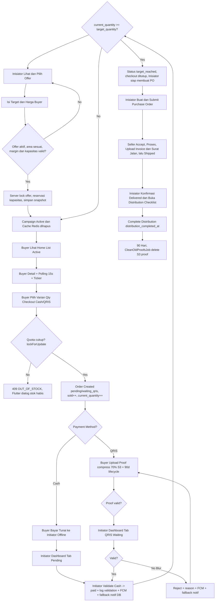

# PRODUCT REQUIREMENTS DOCUMENT (PRD) - Grosirun V3.1 Enterprise

**Nama:** Grosirun  
**Stack:** Backend Laravel 11 (REST API) + Frontend Flutter 3.22+ + Web Admin V1.1 (Livewire/Inertia)  
**Target:** APK `<10 MB` arm64, overall backend coverage ≥80%, critical Policy/state-transition coverage 100%, Crash-free >99.5%
**Fase:** MVP V1.0 + Enterprise Readiness  
**Tanggal:** 20 Juli 2026  
**Versi:** 3.1
**Owner:** Product
**Review Cycle:** Setiap release
**Global Glossary:** [Indeks Dokumentasi](README.md#glossary-global-indonesiainggris)
**Status Dokumen:** Final
**Status Implementasi:** Belum Dimulai

---

## Daftar Isi
1. Ringkasan Eksekutif + Stakeholder Matrix
2. Metrik + MoSCoW + RICE Scoring
3. Persona + UU PDP Consent
4. Ruang Lingkup Fitur + Cluster + Non-Escrow + ToS
5. Alur Pengguna + Flowchart Bisnis BPMN
6. NFR + Storage Strategy S3 Primary + Versioning V2
7. Fase Rilis + Roadmap Visual
8. Mitigasi Risiko + Dispute SOP Ref
9. Daftar Tugas + Dependency Graph
10. Glosarium + Keputusan Final Inkonsistensi

---

## 1. Ringkasan Eksekutif + Stakeholder Matrix

**Visi:** Otak digital ekonomi mikro RT/RW, hilangkan 100% admin manual patungan, taat UU PDP No.27/2022, non-escrow legal.

**Problem Validasi Lapangan 2026:** Harga eceran Rp14k vs grosir Rp11.5k, rekap manual salah 30%, uang titipan Rp5-10jt tercecer, ketua RT burnout 60% berhenti 2 siklus.

**Solusi V3.1:**
- Laravel 11 API ACID + `lockForUpdate()` untuk mencegah oversell serta tabel `clusters` untuk dukungan multi-RT
- S3 sebagai primary storage produksi dengan backup dan lifecycle 90 hari
- Flutter offline-first Hive + pendingQueue, onboarding Pak Agus + FAQ ibu-ibu
- GitHub Actions sebagai CI/CD test gate

**Stakeholder Matrix:**

| Stakeholder | Role | Kepentingan | Power | Strategi |
| :--- | :--- | :--- | :--- | :--- |
| Bu Siti (Buyer) | End User | Hemat 15-20%, checkout <2 menit | High interest, Low power | Fokus UX tombol 56dp, tutorial 60s, FAQ |
| Pak Agus (Initiator) | Inisiator | Hemat 80% waktu admin | High interest, High power | Libatkan di dogfooding, SOP onboarding, ToS |
| Ketua RW | Sponsor | Transparansi dana RT | Medium interest, High power | Laporan PDF rekap, observability dashboard |
| Dev Team | Builder | Code coverage, no oversell | High interest, Medium power | CI/CD, ADR, security review |
| Kominfo/UU PDP | Regulator | Data pribadi warga | Low interest, High power | Privacy policy, DELETE account, retensi |
| Penjual/Supplier (Makmur Jaya) | Seller / Mitra Usaha | Penawaran akurat dan fulfillment efisien | High interest, Medium power | Seller workspace, purchase order, invoice, surat jalan |

---

## 2. Metrik + MoSCoW + RICE Scoring

### Success Metrics (sama + tambahan PDP compliance)

| Metrik | Target | Sumber | Freq | Action Gagal |
| :--- | :--- | :--- | :--- | :--- |
| Adoption | 70% 1 RT 35/50 KK | users count cluster_id | Harian | Tutorial video + door-to-door |
| Friction checkout | 80% <2 menit | analytics event checkout_success | Per PO | Perbesar tombol |
| Zero-discrepancy | 100% uang==barang | Audit orders paid vs fisik | Akhir PO | Wajib checklist + foto |
| Retention W2 | 40% PO2 | distinct user second campaign | Mingguan | FCM promo |
| Admin time saved | 80% 4j→45m | Survey WA | Akhir pilot | Optimasi PDF 1-klik |
| Crash-free | >99.5% | Crashlytics | Harian | Hotfix 24h |
| API Error Rate | <2% 5xx | Telescope/Sentry | Harian | Scale FPM Redis |
| Oversell Rate | 0% | Check variant quota<0 | Per order | Pessimistic lock |
| APK Size | <10MB arm64 | ls -lh | Per build | Tree shaking WebP |
| **UU PDP Consent** | 100% consent checkbox logged | users consent_at | Per user | Block login jika belum consent |
| **Data Deletion SLA** | <24h setelah DELETE /auth/account | logs | Per request | Alert Slack |

### MoSCoW Priority V1.0

| Must Have | Should Have | Could Have V1.1 | Won't Have |
| :--- | :--- | :--- | :--- |
| Auth OTP WA + lock 15m + consent UU PDP checkbox + ToS non-escrow | Extend + Cancel + broadcast FCM + fallback /notifications | Web Dashboard Livewire (admin web) | Escrow payment gateway |
| Campaign dari offer aktif + snapshot + cluster scope | Transfer pesanan on_behalf | iOS TestFlight | ML recommendation |
| Varian Paten +/- no manual input | Social proof ticker polling 15s + share WA | Dark Mode + i18n | Multi-currency |
| Order lockForUpdate + quota check atomic + 409 oversell | Backup daily + restore drill RTO 1h RPO 24h | Analytics Dictionary + notification_open event | Google Maps |
| Upload bukti compress 70% + S3 primary + 90d lifecycle | Rate limit per-route Redis: auth 60/min, override 10/min | A/B Remote Config tombol |  |
| Validate/Reject/Override with notes + undo 5min + audit transaction_logs | Feature Flags Laravel Pennant | Offline proof upload queue |  |
| Rekap PDF + teks WA | Observability Pulse + Prometheus Grafana |  |  |
| Checklist distribusi is_taken + complete | CI/CD test gate |  |  |
| FCM + fallback /notifications poll |  |  |  |

### RICE Scoring untuk Fitur Nice-to-Have

| Fitur | Reach | Impact | Confidence | Effort | RICE Score | Priority |
| :--- | :--- | :--- | :--- | :--- | :--- | :--- |
| Web Dashboard Admin | 10 initiators | 8 (hemat waktu rekap desktop) | 90% | 5d | (10*8*0.9)/5=14.4 | V1.1 High |
| iOS TestFlight | 50 iPhone users per cluster (20%) | 6 | 70% | 7d | (50*6*0.7)/7=30 | V1.1 Medium |
| Dark Mode | 200 buyers malam hari | 3 | 80% | 2d | (200*3*0.8)/2=240 | V1.1 Low effort high |
| Analytics Dictionary | Dev team | 9 | 100% | 3d | 270 | V1.0 Should |
| Offline proof queue | 30 buyers sinyal jelek | 7 | 85% | 4d | (30*7*0.85)/4=44.6 | V1.1 |

---

## 3. Persona + UU PDP Consent

### Bu Siti Rahayu (Buyer) - Sama + tambahan PDP concern

| Atribut | Detail |
| :--- | :--- |
| Usia 45th IRT, Samsung A10 RAM 2GB Android 9, storage 64GB sisa 14GB | Takut data pribadi dijual, butuh jelas privasi |
| Butuh consent checkbox: "Saya setuju data WA disimpan untuk PO RT saja, sesuai UU PDP No.27/2022" + link Privacy Policy |  |
| Hak hapus data: Menu Profil → Hapus Akun → anonimize |

### Pak Agus (Initiator)

Butuh SOP sengketa jika buyer bilang sudah transfer tapi proof blur: lihat [User Guide §7–8](USER_GUIDE.md#7-komplain-refund-dan-dispute-operations) tanggung jawab initiator validasi 2x24 jam.

### Sistem Persona Laravel

Harus tahan 50-100 concurrent deadline rush (skenario thundering herd), bukan cuma 20.

---

## 4. Ruang Lingkup Fitur + Cluster + Non-Escrow + ToS

### 4.1. Cluster Multi-RT

**Sebelumnya:** PRD bilang 1 Cluster=500 user tapi DB tidak punya cluster_id → migration besar nanti.

**Sekarang V3.1 Fix:** Tambah table `clusters`:

| Field | Type |
| :--- | :--- |
| id PK | bigint |
| name | varchar: "Permata Hijau RT03" |
| code | varchar unique: "PGH-RT03" |
| rw, kelurahan, kota | varchar |
| created_at | timestamp |

Update `users` add `cluster_id FK nullable`, `campaigns` add `cluster_id FK`. Seed default cluster PGH-RT03 untuk pilot. Semua query `GET /campaigns` filter `where cluster_id = auth user cluster_id` (scope global). Untuk MVP 1 cluster, tapi schema siap multi-cluster tanpa migration besar.

### 4.2. Auth + UU PDP Compliance

**Flow Consent:**
1. User login OTP screen tambah checkbox wajib: "Saya menyetujui Penyimpanan data WA & transaksi untuk keperluan PO RT sesuai Kebijakan Privasi (link)"
2. Jika tidak centang → tombol Verifikasi disabled.
3. Saat verify OTP success Laravel simpan `users.consent_at = now(), consent_version = "v1.0"`, `privacy_policy_accepted = true`
4. Jika user tidak setuju → tidak bisa login.
5. Endpoint baru: `DELETE /api/v1/auth/account` → soft delete anonimize: name = "Deleted User {id}", phone_number = "DELETED_{id}", fcm_token null, personal_access_tokens revoked, orders retained anonymized (user_id null? atau keep but name masked), proof images deleted S3, transaction_logs keep initiator_id but buyer anonymized. SLA <24h, job queue.
6. Retensi: proof images S3 lifecycle 90 hari setelah campaign completed, lalu auto delete (S3 lifecycle rule + Laravel scheduler `CleanOldProofsJob` daily)
7. Privacy Policy screen di Flutter: `PRIVACY_POLICY.md` content.

Tambah di SETUP_GUIDE & API_SPEC.

### 4.3. Non-Escrow + ToS + Dispute SOP

**Disclaimer ToS Screen Onboarding (wajib scroll + checkbox):**
"Grosirun hanya mencatat status pembayaran (pending/paid). Dana tunai fisik atau transfer QRIS langsung ke rekening pribadi Initiator. Grosirun bukan penjamin dana, bukan escrow, tidak memegang dana. Jika ada sengketa dana, tanggung jawab pertama Initiator untuk refund manual 2x24 jam, eskalasi ke Ketua RT/RW. Baca USER_GUIDE bagian 7–8 — Dispute Operations."

- Flutter: first launch setelah login jika `tos_accepted_at null` → tampilkan modal ToS + checkbox → POST `/auth/tos-accept`
- Laravel: `users.tos_accepted_at`, `tos_version`
- Buyer agree ToS logged di `transaction_logs` type `tos_accept`
- Jika tidak agree → logout.

**Dispute SOP** detail ada di `USER_GUIDE.md` bagian 7–8: timeline, tanggung jawab, bukti, eskalasi.

### 4.4. Ruang Lingkup Fitur

Semua fitur lama (login OTP, beranda, varian paten, progress, ticker, checkout cash/qris, share WA, buat PO, dashboard 3 tab, rekap PDF, extend, cancel, checklist distribusi) tetap.

**Fitur pendukung V1.0:**

- **FCM Fallback:** Jika FCM gagal (Firebase down), simpan notifikasi ke table `notifications` Laravel. Flutter fallback polling `GET /api/v1/notifications?unread=true` setiap 60s atau saat app resume. Notif ditandai read setelah dibaca. Jadi tidak bergantung 100% FCM. Lihat API_SPEC + OBSERVABILITY.

- **Feature Flags:** Gunakan Laravel Pennant dengan registry canonical di API_SPEC bagian 12: client flags `qris-upload`, `extend-deadline`, `batch-validate`, `dark-mode`, `seller-onboarding`, `supplier-offers`, `purchase-orders`; backend-only `supplier-erp-webhook` dan `canary-new-order-service`. Seluruh flag default false sebelum implementasi dan diaktifkan bertahap sesuai scope global, user, cluster, supplier, atau percentage.

- **API Gateway Rate Limit Centralized:** Bukan hanya throttle middleware per controller. Buat `RateLimiter` custom di `AppServiceProvider`: global 60/min per user, per IP 100/min, per-route override: `request-otp 5/min per phone + IP`, `validate 30/min initiator`, `override-validate 10/min initiator` (sensitif). Gunakan Redis limiter. Lihat [SECURITY.md](SECURITY.md).

- **Offline Proof Upload Queue:** Sebelumnya hanya order queue offline. Sekarang tambah proof upload queue juga: jika buyer QRIS offline saat mau upload bukti, simpan file path lokal di pending queue type `upload_proof`, sync saat online (mirip order). Lihat MOBILE_SPEC bagian 3–9 + OBSERVABILITY bagian 3 dan 7 — Performance Engineering.

- **Batch Operations:** Endpoint `POST /api/v1/campaigns/{id}/orders/batch-validate` untuk validasi 10 orders sekaligus (checkbox di dashboard). Kurangi N+1 request admin saat distribusi 100 buyer.

- **Web Dashboard Admin V1.1 (Nice #1):** Doc `[Mobile Specification](MOBILE_SPEC.md)` mention web admin Livewire/Inertia optional V1.1 untuk rekap desktop Pak Agus. Tidak scope V1.0 tapi design siap.

---

### 4.5 Alur Penawaran-ke-Campaign

#### 4.5.1 Peran dan Batas Kewenangan

| Peran | Identitas | Kewenangan utama | Larangan utama |
| --- | --- | --- | --- |
| **Pembeli (`buyer`)** | Warga anggota cluster | Melihat campaign cluster, membuat order, membayar Inisiator, mengunggah bukti, memantau distribusi | Membuat campaign, melihat order warga lain, mengakses data Penjual |
| **Inisiator (`initiator`)** | Koordinator cluster | Memilih penawaran aktif, membuat campaign, menentukan margin dan target, memvalidasi pembayaran, membuat purchase order, mendistribusikan barang | Mengubah harga dasar Penjual, mengelola supplier, melihat cluster lain |
| **Penjual (`seller`)** | Anggota organisasi supplier | Mengelola produk dan penawaran, menerima/menolak purchase order, mengunggah invoice/surat jalan, memperbarui fulfillment | Melihat identitas/bukti bayar Pembeli, memvalidasi pembayaran Pembeli, membuat campaign cluster |
| **Admin aplikasi (`admin`)** | Operator Grosirun | Verifikasi supplier dan seller, moderasi, cluster, role, feature flag, audit dan suspend | Mengubah transaksi tanpa alasan dan audit log |

Satu pengguna dapat memiliki beberapa role melalui `user_roles`; satu role aktif dipilih pada sesi. `buyer` dan `initiator` wajib memiliki `cluster_id`. `seller` terhubung ke supplier melalui `supplier_members`. `admin` tidak dibatasi cluster.

#### 4.5.2 Pemisahan Penawaran dan Campaign

- **Penawaran (`supplier_offers`)** dimiliki supplier dan dikelola seller. Isinya produk, unit, minimum order, tier harga, kapasitas, area kirim, biaya kirim, serta masa berlaku.
- **Campaign (`campaigns`)** dimiliki Inisiator dan wajib merujuk satu penawaran aktif. Campaign menyimpan snapshot nama produk, unit, harga supplier, tier terpilih, dan syarat pengiriman agar perubahan penawaran tidak mengubah campaign berjalan.
- Inisiator menentukan harga Pembeli, target, deadline, lokasi distribusi, dan margin. Harga Pembeli tidak boleh lebih rendah dari total harga supplier dan biaya yang dialokasikan.
- Penjual tidak membuat, mengubah, memperpanjang, atau membatalkan campaign.

#### 4.5.3 Alur End-to-End

1. Seller membuat profil supplier; Admin memverifikasi supplier dan keanggotaan seller.
2. Seller membuat produk dan penawaran berstatus `draft`, lalu mengirimkannya untuk moderasi.
3. Admin menyetujui penawaran menjadi `active`; penawaran hanya terlihat di area layanan dan selama masa berlaku.
4. Inisiator memilih penawaran aktif dan membuat campaign dengan snapshot komersial.
5. Pembeli bergabung dan membayar langsung kepada Inisiator sesuai model non-escrow.
6. Ketika target dan ambang pembayaran tercapai, Inisiator membuat purchase order untuk supplier.
7. Seller menerima atau menolak purchase order. Penolakan wajib memiliki alasan; Inisiator dapat memilih penawaran lain atau membatalkan campaign dan melakukan refund.
8. Inisiator membayar supplier di luar Grosirun dan mengunggah bukti transfer; Grosirun hanya mencatat status.
9. Seller menandai `paid`, `processing`, `shipped`, dan mengunggah invoice serta surat jalan.
10. Inisiator mengonfirmasi `delivered`, memeriksa kuantitas, lalu mendistribusikan barang kepada Pembeli.
11. Semua perubahan status, harga, dokumen, dan override dicatat di `transaction_logs`.

#### 4.5.4 Privasi Penjual

Seller hanya menerima jumlah agregat per varian, alamat pengiriman Inisiator, kontak bisnis Inisiator, dan dokumen purchase order. Nama, nomor HP, bukti pembayaran, serta riwayat Pembeli tidak diberikan kepada seller.

---

## 5. Alur Pengguna + Flowchart Bisnis BPMN

### 5.1. Flowchart Bisnis Utama (New)



Sequence Diagram detail ada di `TECHNICAL_SPEC.md`.

### 5.2. Skenario Thundering Herd

Jam H-1 deadline, 50-100 buyer buka app bersamaan checkout sisa 10 paket.

- Laravel harus handle 100 concurrent dengan `lockForUpdate()` + Redis queue FCM after commit.
- Flutter Dio retry 503 dengan backoff jika server 503 maintenance deploy.
- Load test k6 `k6-deadline-rush.js` simulasi 100 VUs.

### 5.3. Skenario Admin Race

2 admin device (Pak Agus HP + istri login akun sama? atau 2 initiator satu cluster) validate order sama bersamaan.

- Solution: `orders` row `lockForUpdate()` juga saat validate, transaction_logs audit. Second request dapat 409 "Order sudah divalidasi".
- Test di `OrderServiceTest` concurrency.

---

## 6. NFR + Storage S3 Primary + Versioning V2

### Update Storage Strategy (Fix Inkonsistensi Dokumen #1)

**Keputusan Final V3.1:**

- Primary storage prod: **S3 compatible** (AWS S3 atau MinIO atau IDCloud S3) — bukan local. Alasan: VPS 4GB disk penuh jika 500 user upload proof 2MB x 200 orders x N campaigns.
- Local disk hanya untuk dev + cache.
- Laravel `FILESYSTEM_DISK=s3` prod, `public` dev.
- URL: `Storage::disk('s3')->temporaryUrl()` 1 jam untuk proof (private bucket) — lebih aman dari public URL random.
- Lifecycle S3: rule delete `order_proofs/*` after 90 days after campaign completed (via S3 lifecycle + Laravel scheduler CleanOldProofsJob double safety)
- Backup: proof images tidak backup (karena lifecycle), tapi DB backup daily S3.

Update di semua dokumen: TECHNICAL_SPEC, API_SPEC, DEPLOYMENT, SECURITY konsisten S3 primary.

### Versioning Strategy V2

- API versioning: prefix `/api/v1/` now. Future `/api/v2/` backward compatible.
- Strategy: V1 maintain min 6 bulan setelah V2 launch. Deprecation header `X-API-Deprecation: 2026-12-31` + Sunset.
- Breaking changes: need major version bump. Add guide in [Changelog — Strategi Versioning](CHANGELOG.md#bagian-1-strategi-versioning)
- Flutter: send `Accept: application/vnd.grosirun.v1+json` header optional, plus `X-App-Version`
- Docs: OpenAPI/Swagger per version via Scribe generate `storage/docs/v1/openapi.yaml`

### Performance Budget (Add dari penyempurnaan spesifikasi)

Lihat README + [Observability — Performance Engineering](OBSERVABILITY.md#3-performance-engineering):

- GET /campaigns P95 <150ms cache hit Redis 60s
- POST /orders P95 <300ms include lock
- Upload 2MB <2s
- Flutter cold start <2s
- RAM <180MB
- APK <10MB
- Frame 60 FPS

### Database Index + Partitioning

- Index: `campaigns (cluster_id, status, deadline)`, `campaign_variants (campaign_id)`, `orders (campaign_id, payment_status, user_id)`, `otp_codes (phone_number, expires_at)`, `notifications (user_id, read_at)`
- Partitioning: `orders` partition by year `PARTITION BY RANGE (YEAR(created_at))` jika >1M rows V2 (Mvp single partition but ready doc)
- Read Replica: Recap PDF heavy query via read replica (Doc TECHNICAL_SPEC add config `DB_CONNECTION=mysql_read` for reporting)
- Connection pooling: PHP-FPM pm.max_children 30, MySQL max_connections 100, Redis pooling.

### Cluster_id Add

Semua endpoint filter by `auth()->user()->cluster_id` scope.

---

## 7. Fase Rilis + Roadmap Visual

### Sprint Update (Docker + CI/CD + Security Review)

| Fase | Timeline | Backend | Mobile | Infra/Security | Output |
| :--- | :--- | :--- | :--- | :--- | :--- |
| Sprint 1 Foundation | 20 Jul - 3 Ags 2026 | Laravel 11 + Docker compose MySQL Redis Nginx + cluster table + OtpService + UU PDP consent fields | Flutter Dio Hive SecureStorage + AuthCubit + consent checkbox | CI test.yml gate Pest + flutter analyze + Docker ready | Auth E2E + cluster |
| Sprint 2 Core | 4 Ags - 18 Ags | Offer marketplace + campaign snapshot + variant + cache Redis + S3 primary | Home Detail progress ticker polling + share WA + deep link | ADR docs + TECHNICAL_SPEC + [SECURITY.md](SECURITY.md) | PO listing live |
| Sprint 3 Transaction | 19 Ags - 2 Sep | OrderService lockForUpdate + proof S3 tempUrl + batch validate + notifications fallback table | Checkout + proof queue offline + upload compress | k6 load test deadline rush 100 concurrent + API_SPEC bagian 1.4 — Format dan Katalog Error | Checkout live |
| Sprint 4 Admin & Obs | 3 Sep - 10 Sep | Recap PDF + distribution + FCM + fallback /notifications + feature flags + rate limit centralized | Admin dashboard 3 tabs + recap viewer + checklist + FCM background handler | [OBSERVABILITY.md](OBSERVABILITY.md) Pulse Prometheus Grafana + OBSERVABILITY bagian 3 dan 7 — Performance Engineering | Admin full |
| Dogfooding + Security Review | 11 Sep - 17 Sep | Load test thundering herd + admin race test + restore drill RTO 1h | Test 3 device low-end + APK <10MB + error boundary | SECURITY bagian Checklist Review Keamanan OWASP Top 10 API+Mobile checklist | RC + sec review |
| Alpha Pilot 1 RT | 18 Sep - 25 Sep | Deploy blue-green zero-downtime + backup daily S3 + canary 10% | Firebase App Distribution + onboarding pilot guide Pak Agus + FAQ | Monitoring alert Slack P95>300ms | Pilot 1 RT |
| Go-Live V1.0 | 26 Sep - 30 Sep | Go-live if adoption>70% crash-free>99.5% | Feedback form analytics dictionary | Post-launch hotfix plan | Prod V1.0 |

Gantt visual di [README.md](../README.md).

---

## 8. Mitigasi Risiko + Dispute SOP Ref

### Dispute SOP Non-Escrow

| Skenario | Tanggung Jawab | Timeline | Bukti | Eskalasi |
| :--- | :--- | :--- | :--- | :--- |
| Buyer transfer QRIS tapi proof blur rejected | Initiator harus cek mutasi bank 2x24 jam, jika ada mutasi validasi paksa override dengan notes "cek mutasi BCA jam..." | 2x24h | Mutasi screenshot + log override | Jika tidak kooperatif → Ketua RW → mediasi RT → refund manual |
| Buyer bayar tunai tapi initiator lupa centang validate | Buyer simpan bukti kwitansi manual, initiator wajib undo/override dalam 5m-24h. Checklist distribusi final jadi bukti ambil | 1x24h | Log validation, transaksi tunai fisik | Ketua RT saksi |
| PO batal target gagal, buyer sudah bayar | Initiator wajib refund manual 100% dalam 2x24h, FCM broadcast + WA grup. Grosirun hanya notif, bukan penahan dana | 2x24h | List paid orders di recap | Jika tidak refund → laporkan RW + blacklist initiator |
| Initiator kabur bawa uang | Risiko non-escrow. Mitigasi: pilih initiator terpercaya Ketua RT, audit log transparan, proof S3, ToS consent | - | transaction_logs + orders paid | Jalur hukum perdata, Grosirun provide data audit untuk mediasi (bukan penjamin) |

ToS consent screen wajib di onboarding: user centang setuju non-escrow + UU PDP.

### Risiko Lain (A,B,C) sebelumnya tetap + tambahan

| Risiko | Plan A | Plan B | Plan C |
| :--- | :--- | :--- | :--- |
| FCM Down Firebase | Fallback /notifications DB poll 60s | Retry queue 3x exponential | Buyer cek manual di app My Orders tanpa push |
| Storage S3 Down | Retry 3x, fallback local temp + queue upload S3 later | Alert admin, bukti simpan lokal HP dulu | Manual WA bukti ke initiator |
| Disaster VPS down | Restore dari backup S3, RTO 1h RPO 24h, disaster drill 1x sebelum pilot | Blue-green standby | Manual Excel sementara |
| UU PDP violation | Privacy policy + consent + DELETE account + retensi 90d | Anonimisasi | Lapor DPO |

---

### 8.3 Failure, Refund, dan Reservation Matrix

| Kondisi | Campaign | Purchase order | Reservation | Refund/penyelesaian | SLA |
| --- | --- | --- | --- | --- | --- |
| Offer stale/expired/capacity insufficient saat create | Tidak dibuat | — | Tidak berubah | Inisiator refresh/pilih offer | Instan |
| Campaign expired sebelum target | `expired` | — | Dilepas atomik | Refund Buyer paid oleh Inisiator | 2×24 jam |
| Inisiator cancel sebelum PO accepted | `cancelled` | cancelled/tidak ada | Dilepas atomik | Refund Buyer paid | 2×24 jam |
| Seller reject PO | `target_reached` menunggu keputusan | `rejected` | Dilepas | Buat campaign baru dari offer lain atau cancel/refund | Seller ≤12 jam; refund 2×24 jam |
| Seller tidak respons | `po_submitted` | `submitted` | Tetap reserved | Reminder 6 jam; Admin 12 jam; Inisiator dapat cancel | 12 jam |
| Seller cancel setelah accepted | `fulfillment` tertahan | dispute | Tetap committed | Replacement supplier atau refund berdasarkan resolusi Admin | Respons 1×24 jam |
| Kurang/rusak | `fulfillment` | `shipped` + dispute | Tetap committed | Replacement/partial refund supplier; Inisiator meneruskan hak Buyer | Buka 1×24 jam; respons 1×24 jam |
| Distribusi selesai | `completed` | `delivered` | Committed direkonsiliasi | Tidak ada refund kecuali dispute terbukti | Sesuai SOP |

Refund Buyer tetap dilakukan Inisiator karena non-escrow. Klaim Inisiator kepada Supplier adalah alur terpisah; kegagalan Supplier tidak menghapus kewajiban Inisiator kepada Buyer.

## 9. Daftar Tugas + Dependency Graph

### Dependency Graph

```
clusters table → users.cluster_id → campaigns.cluster_id → variants → orders → logs
     |
     → notifications fallback
     |
     → feature_flags
```

Order tidak bisa dibuat jika cluster mismatch: buyer cluster harus sama dengan campaign cluster (scope).

### Checklist Developer Update (Tambahan spesifikasi)

**Backend:**
- [ ] Migration `clusters` + add FK `users.cluster_id`, `campaigns.cluster_id`
- [ ] Migration `notifications` fallback FCM
- [ ] Change filesystem disk S3 primary prod, local dev (consistency fix)
- [ ] RateLimiter centralized Redis per-route (auth 5/min, override 10/min)
- [ ] Feature Flags package + flags: qris_upload, extend_deadline
- [ ] Endpoint `DELETE /auth/account` + `POST /auth/tos-accept` + `POST /auth/consent`
- [ ] Batch validate endpoint
- [ ] Error Catalog constants + response `code` like ERR_024
- [ ] Versioning strategy header deprecation
- [ ] K6 load test scripts in `backend/load-test/`
- [ ] Docker compose + Dockerfile prod Nginx
- [ ] CI/CD workflows test.yml, deploy.yml blue-green, build-apk.yml
- [ ] Observability Pulse + Scribe OpenAPI v1
- [ ] Privacy policy retensi 90d job `CleanOldProofsJob`

**Mobile:**
- [ ] Consent + ToS checkbox screens + API calls
- [ ] Deep linking `grosirun://campaign/{slug}` handler + AppLinks Android
- [ ] FCM background handler + fallback poll notifications 60s
- [ ] Offline proof upload queue pendingQueue type upload_proof
- [ ] Error boundary `FlutterError.onError` + `PlatformDispatcher.onError` Sentry
- [ ] State persistence Hive when killed (Auth state, campaign detail)
- [ ] Analytics Dictionary 59 events
- [ ] FAQ + Onboarding pilot screens

Total estimasi tambah 7 hari untuk penyempurnaan → masih dalam 5 minggu + 1 minggu buffer.

---

## 10. Glosarium + Keputusan Final Inkonsistensi

### Keputusan Lintas Dokumen

| # | Isu Sebelum | Keputusan Final V3.1 |
| :--- | :--- | :--- |
| 1 | Storage lokal vs S3 inkonsisten | **S3 primary prod** (private bucket tempUrl 1h), local hanya dev. Update semua docs: TECHNICAL_SPEC, API_SPEC, DEPLOYMENT, SECURITY konsisten S3. |
| 2 | DB tanpa cluster_id padahal PRD 1 cluster=500 user | **Tambah clusters table + FK** di users & campaigns. Semua query scoped cluster_id. Siap multi-cluster V2 tanpa migration besar. |
| 3 | CI Future vs deploy matang inkonsisten | **CI/CD real** now: `.github/workflows/test.yml` gate Pest + flutter analyze required before merge develop. Deploy blue-green zero-downtime, bukan manual git pull di prod langsung. |
| 4 | GET /campaigns public vs auth required | **Final: Auth required untuk semua** (keputusan produk). Public read hanya untuk health. PRD update eksplisit, bukan hanya API_SPEC. |

### Glosarium Baru

| Istilah | Definisi V3.1 |
| :--- | :--- |
| Cluster | Entitas RT/RW/Perumahan, 1 cluster max 500 active users MVP, FK di users & campaigns |
| S3 Primary | Penyimpanan utama proof & campaign image di S3/MinIO private bucket tempUrl, lifecycle 90d |
| FCM Fallback | Jika FCM gagal, simpan notifikasi ke table notifications + Flutter poll GET /notifications |
| Feature Flag | Fitur bisa on/off via env/DB tanpa deploy APK baru (Pennant) |
| Blue-Green Deploy | 2 env prod blue/green, deploy ke green, health check, switch Nginx zero-downtime |
| RTO/RPO | Recovery Time Objective 1 jam, Recovery Point Objective 24 jam (backup daily) |
| UU PDP | UU Pelindungan Data Pribadi No.27/2022, consent, retensi, hak hapus |
| ToS Non-Escrow | Terms of Service bahwa Grosirun tidak pegang dana, hanya catat status |
| Dispute SOP | Prosedur sengketa dana tunai/QRIS manual refund 2x24 jam + eskalasi RW |
| Thundering Herd | Lonjakan 50-100 buyer checkout sisa stok di H-1 deadline |

---

PRD ini menetapkan kebutuhan UU PDP, Dispute SOP, CI/CD, penyimpanan S3, cluster, fallback FCM, load testing, penanganan race condition, zero-downtime deployment, disaster recovery, MoSCoW, RICE, dan stakeholder matrix.

**Next Action:** Update semua dokumen lain sesuai keputusan Final di Section 10 ini (single source of truth).

**Signed:** Product Team Grosirun, 20 Juli 2026, V3.1.
