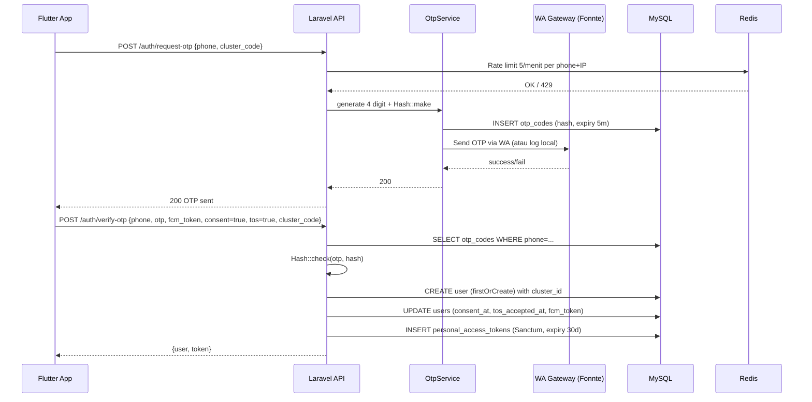
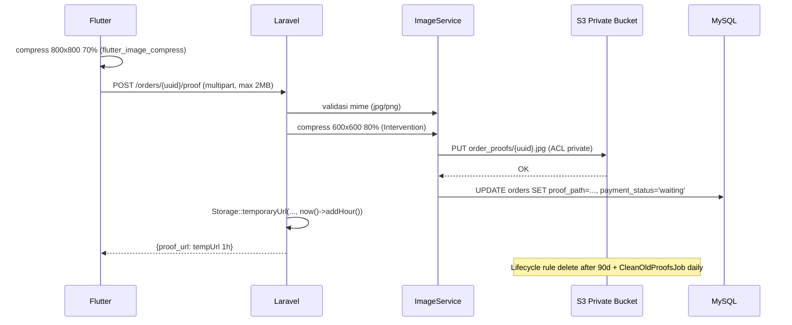
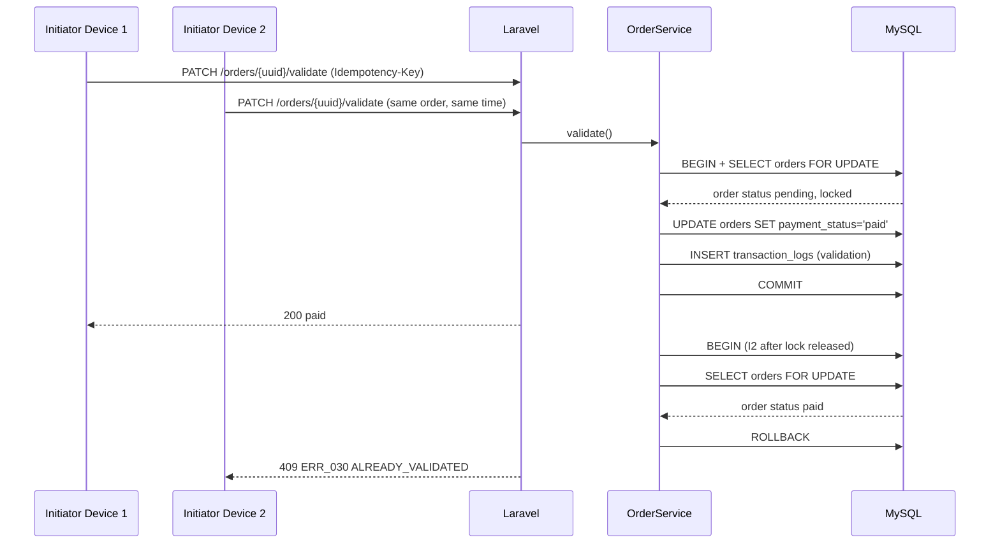

# SPESIFIKASI TEKNIS - Grosirun V3.1

**Proyek:** Grosirun Belanja Patungan  
**Stack:** Laravel 11.x (PHP 8.3) + MySQL 8 + Redis 7 + S3 + Flutter 3.22+  
**Tanggal:** 20 Juli 2026  
**Versi:** 3.1  
**Status:** Production Ready

---

## Daftar Isi

1. Pendahuluan & Referensi ADR
2. Tech Stack & Dependency Graph
3. Arsitektur High-Level & Sequence Diagram
4. Desain Database
5. Strategi Penyimpanan S3 Primary
6. Strategi Cluster Multi-RT
7. Struktur Laravel & Service Layer
8. Autentikasi (Sanctum + OTP + Consent + ToS)
9. Race Condition & Transaction Handling
10. Manajemen File S3 (tempUrl + Lifecycle)
11. Offline & Sync (Proof Queue)
12. FCM + Fallback Notifikasi DB
13. Keamanan (OWASP, Mass Assignment)
14. Optimasi APK <10MB
15. Logging vs Sentry & Disaster Recovery
16. Environment, Versioning & ETag
17. Glosarium

---

## 1. Pendahuluan & Referensi ADR

### 1.1 Tujuan Dokumen

Dokumen ini adalah **acuan implementasi teknis** untuk Grosirun V3.1. Seluruh keputusan arsitektur penting telah didokumentasikan di **ARCHITECTURE_DECISION_RECORDS.md (ADR)**. Dokumen ini menjabarkan secara rinci bagaimana setiap komponen diimplementasikan, termasuk:

- **Storage S3 Primary** (bukan local) — ADR-003
- **Cluster multi-RT** dengan `cluster_id` di semua tabel utama — ADR-002
- **API Versioning V2** dengan deprecation & sunset — ADR-009 (internal)
- **Indexing, partitioning, read replica** untuk performa — ADR-002

### 1.2 Referensi ADR

| ADR     | Keputusan                       | Alasan                                              |
| ------- | ------------------------------- | --------------------------------------------------- |
| ADR-001 | Laravel 11 bukan Node.js/Golang | Tim PHP, ekosistem Indonesia, lockForUpdate mature  |
| ADR-002 | MySQL 8 bukan PostgreSQL        | Familiar, harga hosting murah, lockForUpdate teruji |
| ADR-003 | S3 Primary bukan Local Storage  | Skalabilitas, lifecycle 90d, keamanan tempUrl       |
| ADR-004 | Cubit bukan Riverpod            | Ringan <10MB, familiar, tanpa code generation       |
| ADR-005 | Hive bukan Drift/Isar           | Offline cache sederhana, <200KB                     |
| ADR-006 | Sanctum bukan JWT/Passport      | Personal token, expiry 30d, revokable               |
| ADR-007 | Dio bukan http package          | Interceptor chain, retry, multipart mudah           |

### 1.3 Konteks Bisnis

Berdasarkan **BUSINESS_ANALYSIS.md**:

| Komponen              | Nilai                          |
| --------------------- | ------------------------------ |
| Platform Fee          | 1% GMV + PPN 11%               |
| GMV per PO AT_70      | Rp8.400.000                    |
| Laba Initiator per PO | Rp956.760                      |
| Target Adopsi         | 70% (35 dari 50 KK)            |
| Cluster               | 1 RT = 1 cluster, max 500 user |

---

## 2. Tech Stack & Dependency Graph

### 2.1 Backend Exact V3.1

| Komponen      | Package                    | Versi       | Keterangan                          |
| ------------- | -------------------------- | ----------- | ----------------------------------- |
| PHP           | -                          | 8.3.9       | OPcache aktif di produksi           |
| Laravel       | laravel/framework          | ^11.34      | -                                   |
| Auth          | laravel/sanctum            | ^4.0        | Token expiry 30 hari                |
| DB            | MySQL 8.0                  | -           | InnoDB, row lock, partitioning siap |
| Cache/Queue   | Redis + Horizon            | 7.2 + 5.17  | -                                   |
| Storage       | league/flysystem-aws-s3-v3 | ^3.0        | S3 primary di produksi              |
| Image         | intervention/image         | ^3.7        | Kompres 800x800 70%                 |
| PDF           | barryvdh/laravel-dompdf    | ^3.0        | Rekap PO                            |
| FCM           | kreait/laravel-firebase    | ^5.6        | + fallback notifications table      |
| Feature Flags | laravel/pennant            | ^1.8        | qris_upload, extend_deadline        |
| Monitoring    | laravel/pulse + sentry     | ^1.0 + ^4.9 | -                                   |
| Backup        | spatie/laravel-backup      | ^8.7        | Backup ke S3                        |
| API Docs      | dedoc/scramble             | ^0.11       | OpenAPI v1/v2                       |
| Load Test     | k6 (external)              | -           | `load-test/` folder                 |

### 2.2 Dependency Graph

```
AppServiceProvider
  ├── RateLimiter (Redis)
  ├── Feature Flags (Pennant)
  ├── Filesystem (S3)
  └── Sanctum

CampaignService
  ├── ImageService
  ├── Cache (Redis)
  └── S3

OrderService
  ├── CampaignVariant (lockForUpdate)
  ├── S3 (proof)
  ├── NotificationService (FCM + fallback)
  └── FeatureFlag

OtpService
  ├── WA Gateway (Fonnte)
  └── otp_codes table

NotificationService
  ├── FCM (Kreait)
  └── notifications fallback table
```

### 2.3 Skalabilitas Roadmap

| Versi    | Arsitektur                                                                              |
| -------- | --------------------------------------------------------------------------------------- |
| **V1.0** | Single VPS 2vCPU 4GB, MySQL & Redis local, S3 primary, 500 user/cluster, 100 concurrent |
| **V1.1** | Read replica MySQL untuk recap, tambah indeks                                           |
| **V2.0** | Partisi orders by year, sharding per cluster_id, Prometheus + Grafana, multi-region S3  |

---

## 3. Arsitektur High-Level & Sequence Diagram

### 3.1 Arsitektur High-Level

```
┌─────────────────────────────────────────────────────────────────────┐
│                          INTERNET                                  │
└─────────────────────────────────────────────────────────────────────┘
                                │
                                ▼
┌─────────────────────────────────────────────────────────────────────┐
│                          NGINX (443 SSL)                           │
│                    Let's Encrypt Auto-Renew                        │
└─────────────────────────────────────────────────────────────────────┘
                                │
                                ▼
┌─────────────────────────────────────────────────────────────────────┐
│                      PHP-FPM 8.3 (30 children)                     │
│              pm.max_children=30, pm.start_servers=10               │
└─────────────────────────────────────────────────────────────────────┘
                                │
                                ▼
┌─────────────────────────────────────────────────────────────────────┐
│                          LARAVEL 11                                │
│                                                                     │
│  ┌──────────────┐  ┌──────────────┐  ┌────────────────────────┐  │
│  │   MySQL 8    │  │   Redis 7    │  │    S3 Private Bucket   │  │
│  │  Primary +   │  │ Queue + Cache│  │ campaigns/, order_proofs│  │
│  │  Read Replica│  │              │  │     tempUrl 1h          │  │
│  └──────────────┘  └──────────────┘  └────────────────────────┘  │
│                                                                     │
│  ┌─────────────────────────────────────────────────────────────┐  │
│  │              Supervisor (Queue Worker)                       │  │
│  │    2 procs: php artisan queue:work redis --tries=3          │  │
│  └─────────────────────────────────────────────────────────────┘  │
│                                                                     │
│  ┌─────────────────────────────────────────────────────────────┐  │
│  │              Cron (Scheduler)                                │  │
│  │    * * * * * php artisan schedule:run                       │  │
│  │    0 2 * * * php artisan backup:run --only-db              │  │
│  │    0 3 * * * php artisan proofs:clean-old                  │  │
│  └─────────────────────────────────────────────────────────────┘  │
└─────────────────────────────────────────────────────────────────────┘
                                │
                                ▼
┌─────────────────────────────────────────────────────────────────────┐
│              OBSERVABILITY & MONITORING                             │
│  ┌───────────┐ ┌───────────┐ ┌───────────┐ ┌──────────────────┐  │
│  │  Pulse    │ │  Sentry   │ │Prometheus │ │    Grafana       │  │
│  │Slow Queries│ │  Errors   │ │  Metrics  │ │  Dashboard      │  │
│  └───────────┘ └───────────┘ └───────────┘ └──────────────────┘  │
│                                                                     │
│  ┌─────────────────────────────────────────────────────────────┐  │
│  │                 Slack Alerts                                │  │
│  │   #grosirun-ci, #grosirun-alerts                          │  │
│  └─────────────────────────────────────────────────────────────┘  │
└─────────────────────────────────────────────────────────────────────┘
```

### 3.2 Sequence Diagram: OTP Login + Consent + ToS



### 3.3 Sequence Diagram: Checkout Thundering Herd (lockForUpdate)


### 3.4 Sequence Diagram: Upload Proof + S3 tempUrl + Lifecycle



### 3.5 Sequence Diagram: Validation + Admin Race



---

## 4. Desain Database

### 4.1 ERD Lengkap

```mermaid
erDiagram
    clusters ||--o{ users : "1:N"
    clusters ||--o{ campaigns : "1:N"
    users ||--o{ campaigns : "1:N (initiator)"
    campaigns ||--o{ campaign_variants : "1:N"
    campaigns ||--o{ orders : "1:N"
    campaign_variants ||--o{ orders : "1:N"
    users ||--o{ orders : "1:N (buyer)"
    orders ||--o{ transaction_logs : "1:N"
    users ||--o{ otp_codes : "1:N"
    users ||--o{ notifications : "1:N"
    users ||--o{ personal_access_tokens : "1:N"

    clusters {
        bigint id PK
        varchar code UK "PGH-RT03"
        varchar name "Permata Hijau RT03"
        varchar rw
        varchar kelurahan
        varchar city "Surabaya"
        timestamps
    }

    users {
        bigint id PK
        bigint cluster_id FK
        varchar name
        varchar phone_number UK
        enum role "buyer,initiator,admin"
        text fcm_token
        datetime consent_at
        datetime tos_accepted_at
        timestamps
    }

    campaigns {
        bigint id PK
        bigint cluster_id FK
        bigint initiator_id FK
        varchar slug UK
        varchar name
        int target_kg
        int current_kg
        bigint price_total_supplier
        datetime deadline
        enum status "active,completed,expired,cancelled"
        varchar image_path "S3"
        timestamps
    }

    campaign_variants {
        bigint id PK
        bigint campaign_id FK
        decimal size_kg
        bigint price
        int quota
        int sold
        timestamps
        unique(campaign_id, size_kg)
    }

    orders {
        bigint id PK
        uuid uuid UK
        bigint cluster_id FK
        bigint campaign_id FK
        bigint campaign_variant_id FK
        bigint user_id FK
        int quantity
        decimal total_kg
        bigint total_price
        enum payment_method "cash,qris"
        enum payment_status "pending,waiting,paid,rejected,cancelled"
        varchar proof_path "S3"
        bool is_taken
        datetime taken_at
        bigint taken_by_initiator_id FK
        datetime cancelled_at
        varchar idempotency_key
        varchar deleted_user_name
        timestamps
    }

    transaction_logs {
        bigint id PK
        bigint order_id FK
        bigint initiator_id FK
        enum type "validation,rejection,override,undo,transfer,extend,cancel_campaign,distribution,tos_accept,delete_account"
        varchar notes
        varchar ip_address
        datetime created_at
    }

    notifications {
        bigint id PK
        bigint user_id FK
        bigint cluster_id FK
        varchar title
        varchar body
        json data
        datetime read_at
        timestamps
    }

    otp_codes {
        bigint id PK
        varchar phone_number
        varchar otp_hash
        tinyint attempts
        datetime expires_at
        datetime locked_until
        timestamps
    }
```

### 4.2 Cardinality & FK

| Relasi                            | Kardinalitas | Action                                                   |
| --------------------------------- | ------------ | -------------------------------------------------------- |
| `clusters` → `users`              | 1:N          | `SET NULL` (user tetap ada jika cluster dihapus)         |
| `clusters` → `campaigns`          | 1:N          | `RESTRICT` (tidak boleh hapus cluster jika ada campaign) |
| `users` (initiator) → `campaigns` | 1:N          | `RESTRICT`                                               |
| `campaigns` → `campaign_variants` | 1:N          | `CASCADE`                                                |
| `campaign_variants` → `orders`    | 1:N          | `RESTRICT` (tidak boleh hapus variant jika ada order)    |
| `users` (buyer) → `orders`        | 1:N          | `SET NULL` (jika user dihapus/anonymized)                |
| `orders` → `transaction_logs`     | 1:N          | `CASCADE`                                                |
| `users` → `notifications`         | 1:N          | `CASCADE`                                                |
| `users` → `otp_codes`             | 1:N          | (tidak pakai FK, pakai phone_number)                     |

### 4.3 Indeks Strategi

| Query                                                     | Indeks                           | Keterangan           |
| --------------------------------------------------------- | -------------------------------- | -------------------- |
| `GET /campaigns?status=active&cluster_id=1&sort=deadline` | `(cluster_id, status, deadline)` | Query utama campaign |
| `GET /campaigns/{id}/orders?payment_status=pending`       | `(campaign_id, payment_status)`  | Dashboard admin      |
| `GET /my/orders`                                          | `(user_id, created_at DESC)`     | Order user           |
| `OTP lookup`                                              | `(phone_number, expires_at)`     | Verifikasi OTP       |
| `GET /notifications?unread=true`                          | `(user_id, read_at)`             | Fallback notifikasi  |

**Contoh migration:**

```php
$table->index(['cluster_id','status','deadline'], 'idx_campaigns_cluster_status_deadline');
$table->index(['campaign_id','payment_status'], 'idx_orders_campaign_status');
$table->index(['user_id','created_at'], 'idx_orders_user_created');
$table->index(['phone_number','expires_at'], 'idx_otp_phone_expires');
$table->index(['user_id','read_at'], 'idx_notifications_user_read');
```

### 4.4 Optimalisasi Query

| Tips                | Keterangan                                                             |
| ------------------- | ---------------------------------------------------------------------- |
| **Eager Loading**   | `with(['variants','initiator:id,name','cluster:id,name'])` hindari N+1 |
| **Select Specific** | Gunakan `select('id','name','slug')` di Resource untuk kurangi payload |
| **Counter Cache**   | `current_kg` dan `sold` di-increment atomic, bukan `SUM()` tiap query  |
| **Read Replica**    | Query berat (recap) pakai `DB::connection('mysql_read')`               |
| **Cache Redis**     | `Cache::remember('campaigns:active:cluster:1', 60, fn()=>...)`         |

### 4.5 Partisi Orders (V2)

Tabel `orders` akan tumbuh cepat:

- 1 cluster = 35 buyer × 2 PO/bulan × 12 = 840 orders/tahun
- 100 cluster = 84.000 orders/tahun → perlu partisi

**Strategi V2:**

```sql
ALTER TABLE orders PARTITION BY RANGE (YEAR(created_at)) (
    PARTITION p2026 VALUES LESS THAN (2027),
    PARTITION p2027 VALUES LESS THAN (2028),
    PARTITION p2028 VALUES LESS THAN (2029),
    PARTITION pFuture VALUES LESS THAN MAXVALUE
);
```

**Prerequisite:** Primary Key harus include `created_at`.

```sql
-- V2 Migration
ALTER TABLE orders DROP PRIMARY KEY;
ALTER TABLE orders ADD PRIMARY KEY (id, created_at);
```

### 4.6 Read Replica

**config/database.php:**

```php
'connections' => [
    'mysql' => [
        'driver' => 'mysql',
        'host' => env('DB_HOST', '127.0.0.1'),
        'database' => env('DB_DATABASE', 'grosirun'),
        'username' => env('DB_USERNAME', 'grosirun'),
        'password' => env('DB_PASSWORD', 'secret'),
    ],
    'mysql_read' => [
        'driver' => 'mysql',
        'host' => env('DB_READ_HOST', '127.0.0.1'),
        'database' => env('DB_DATABASE', 'grosirun'),
        'username' => env('DB_READ_USERNAME', 'grosirun_readonly'),
        'password' => env('DB_READ_PASSWORD', 'secret'),
    ],
],
```

**Penggunaan:**

```php
// CampaignService@recap
$orders = Order::on('mysql_read')
    ->where('campaign_id', $campaign->id)
    ->where('payment_status', 'paid')
    ->with(['variant', 'user:id,name'])
    ->get();
```

### 4.7 Connection Pooling

| Komponen | Konfigurasi            | Nilai |
| -------- | ---------------------- | ----- |
| MySQL    | `max_connections`      | 100   |
| PHP-FPM  | `pm.max_children`      | 30    |
| PHP-FPM  | `pm.start_servers`     | 10    |
| PHP-FPM  | `pm.min_spare_servers` | 5     |
| PHP-FPM  | `pm.max_spare_servers` | 20    |
| PHP-FPM  | `pm.max_requests`      | 500   |
| Redis    | `maxclients`           | 10000 |
| Redis    | `timeout`              | 0     |

### 4.8 Siklus Hidup Data

| Tabel               | Retensi                            | Job                                |
| ------------------- | ---------------------------------- | ---------------------------------- |
| `otp_codes`         | 1 jam setelah expiry               | `CleanExpiredOtpsJob` (hourly)     |
| `notifications`     | 30 hari                            | `CleanOldNotificationsJob` (daily) |
| `order_proofs` (S3) | 90 hari setelah campaign completed | S3 lifecycle + `CleanOldProofsJob` |
| `users` (PII)       | Forever (anonymized on DELETE)     | `AnonymizeUserJob`                 |
| `transaction_logs`  | Forever                            | -                                  |

---

## 5. Strategi Penyimpanan S3 Primary

### 5.1 Keputusan Final

| Environment      | `FILESYSTEM_DISK` | Bucket                  | Akses               |
| ---------------- | ----------------- | ----------------------- | ------------------- |
| **Produksi**     | `s3`              | `grosirun-prod-private` | Private, tempUrl 1h |
| **Pengembangan** | `public`          | Local storage           | -                   |

### 5.2 S3 Configuration

```ini
# .env.prod
FILESYSTEM_DISK=s3
AWS_ACCESS_KEY_ID=AKIA...
AWS_SECRET_ACCESS_KEY=...
AWS_DEFAULT_REGION=ap-southeast-1
AWS_BUCKET=grosirun-prod-private
AWS_USE_PATH_STYLE_ENDPOINT=false
S3_TEMP_URL_EXPIRY=60  # menit
```

### 5.3 Lifecycle Rule

```json
{
  "Rules": [
    {
      "ID": "delete-old-proofs-90d",
      "Filter": { "Prefix": "order_proofs/" },
      "Status": "Enabled",
      "Expiration": { "Days": 90 },
      "NoncurrentVersionExpiration": { "NoncurrentDays": 7 }
    }
  ]
}
```

### 5.4 Penggunaan di Controller

```php
// app/Http/Controllers/Api/V1/OrderController.php
public function showProof(Order $order, Request $request)
{
    $this->authorize('view', $order);

    if (!$order->proof_path) {
        throw new HttpException(404, 'ERR_055 PROOF_NOT_FOUND');
    }

    $url = Storage::disk('s3')->temporaryUrl(
        $order->proof_path,
        now()->addMinutes(config('filesystems.s3_temp_url_expiry', 60))
    );

    return response()->json(['proof_url' => $url]);
}
```

---

## 6. Strategi Cluster Multi-RT

### 6.1 Migration V3.1

```php
// 1. Buat tabel clusters
Schema::create('clusters', function (Blueprint $table) {
    $table->id();
    $table->string('code', 20)->unique();
    $table->string('name', 100);
    $table->string('rw', 10)->nullable();
    $table->string('kelurahan', 50)->nullable();
    $table->string('city', 50)->default('Surabaya');
    $table->timestamps();
});

// 2. Tambah cluster_id ke users
Schema::table('users', function (Blueprint $table) {
    $table->foreignId('cluster_id')
        ->nullable()
        ->constrained('clusters')
        ->nullOnDelete()
        ->after('id');
    $table->index(['cluster_id', 'role'], 'idx_users_cluster_role');
});

// 3. Tambah cluster_id ke campaigns
Schema::table('campaigns', function (Blueprint $table) {
    $table->foreignId('cluster_id')
        ->constrained('clusters')
        ->cascadeOnDelete()
        ->after('id');
    $table->index(['cluster_id', 'status', 'deadline'], 'idx_campaigns_cluster_status_deadline');
});

// 4. Tambah cluster_id ke orders (denormalized)
Schema::table('orders', function (Blueprint $table) {
    $table->foreignId('cluster_id')
        ->nullable()
        ->constrained('clusters')
        ->nullOnDelete()
        ->after('uuid');
});
```

### 6.2 Global Scope ClusterScope

```php
// app/Scopes/ClusterScope.php
class ClusterScope implements Scope
{
    public function apply(Builder $builder, Model $model): void
    {
        if (auth()->check() && auth()->user()->cluster_id) {
            $builder->where('cluster_id', auth()->user()->cluster_id);
        }
    }
}

// app/Models/Campaign.php
protected static function booted(): void
{
    static::addGlobalScope(new ClusterScope());
}
```

### 6.3 Seeder Default Cluster

```php
// database/seeders/ClusterSeeder.php
Cluster::create([
    'code' => 'PGH-RT03',
    'name' => 'Permata Hijau RT03',
    'rw' => '03',
    'kelurahan' => 'Ngoro',
    'city' => 'Mojokerto',
]);
```

---

## 7. Struktur Laravel & Service Layer

### 7.1 Struktur Folder

```
app/
├── Console/
│   └── Commands/
│       ├── FirebaseImportCommand.php
│       ├── ExcelImportOrdersCommand.php
│       └── S3MigrateCommand.php
├── DTOs/
│   ├── CreateCampaignDTO.php
│   └── CreateOrderDTO.php
├── Http/
│   ├── Controllers/
│   │   └── Api/
│   │       └── V1/
│   │           ├── AuthController.php
│   │           ├── CampaignController.php
│   │           ├── OrderController.php
│   │           ├── NotificationController.php
│   │           └── FeatureController.php
│   ├── Middleware/
│   │   ├── RoleMiddleware.php
│   │   ├── IdempotencyMiddleware.php
│   │   └── EnsureConsent.php
│   ├── Requests/
│   │   ├── StoreCampaignRequest.php
│   │   ├── StoreOrderRequest.php
│   │   └── UploadProofRequest.php
│   └── Resources/
│       ├── CampaignResource.php
│       ├── OrderResource.php
│       └── UserResource.php
├── Jobs/
│   ├── SendFcmJob.php
│   ├── CleanOldProofsJob.php
│   ├── AnonymizeUserJob.php
│   └── CheckDeadlinesJob.php
├── Models/
│   ├── Cluster.php
│   ├── User.php
│   ├── Campaign.php
│   ├── CampaignVariant.php
│   ├── Order.php
│   ├── TransactionLog.php
│   ├── Notification.php
│   └── OtpCode.php
├── Policies/
│   ├── CampaignPolicy.php
│   └── OrderPolicy.php
├── Scopes/
│   └── ClusterScope.php
└── Services/
    ├── CampaignService.php
    ├── OrderService.php
    ├── OtpService.php
    ├── ImageService.php
    └── NotificationService.php
```

### 7.2 Service Layer

#### OrderService

```php
// app/Services/OrderService.php
class OrderService
{
    public function create(Campaign $campaign, CreateOrderDTO $dto, User $buyer): Order
    {
        return DB::transaction(function () use ($campaign, $dto, $buyer) {
            // 1. Lock variant (FOR UPDATE)
            $variant = CampaignVariant::where('id', $dto->variantId)
                ->where('campaign_id', $campaign->id)
                ->lockForUpdate()
                ->firstOrFail();

            // 2. Cek stok
            $remaining = $variant->quota - $variant->sold;
            if ($remaining < $dto->quantity) {
                throw new HttpException(409, 'ERR_024 OUT_OF_STOCK');
            }

            // 3. Buat order
            $order = Order::create([
                'uuid' => (string) Str::uuid(),
                'cluster_id' => $campaign->cluster_id,
                'campaign_id' => $campaign->id,
                'campaign_variant_id' => $variant->id,
                'user_id' => $buyer->id,
                'quantity' => $dto->quantity,
                'total_kg' => $variant->size_kg * $dto->quantity,
                'total_price' => $variant->price * $dto->quantity,
                'payment_method' => $dto->paymentMethod,
                'payment_status' => 'pending',
                'idempotency_key' => $dto->idempotencyKey,
            ]);

            // 4. Update stok
            $variant->increment('sold', $dto->quantity);
            $campaign->increment('current_kg', $variant->size_kg * $dto->quantity);

            // 5. Notifikasi (FCM + fallback DB)
            $this->notificationService->sendNewOrderNotification($order);

            // 6. Audit log
            TransactionLog::create([
                'order_id' => $order->id,
                'initiator_id' => $buyer->id,
                'type' => 'order_created',
                'ip_address' => request()->ip(),
            ]);

            return $order;
        });
    }

    public function validate(Order $order, User $initiator): Order
    {
        return DB::transaction(function () use ($order, $initiator) {
            // Lock order untuk mencegah admin race
            $lockedOrder = Order::where('id', $order->id)
                ->lockForUpdate()
                ->first();

            if ($lockedOrder->payment_status === 'paid') {
                throw new HttpException(409, 'ERR_030 ALREADY_VALIDATED');
            }

            $lockedOrder->update(['payment_status' => 'paid']);

            TransactionLog::create([
                'order_id' => $lockedOrder->id,
                'initiator_id' => $initiator->id,
                'type' => 'validation',
                'ip_address' => request()->ip(),
            ]);

            $this->notificationService->sendPaymentValidatedNotification($lockedOrder);

            return $lockedOrder;
        });
    }
}
```

#### DTO

```php
// app/DTOs/CreateOrderDTO.php
readonly class CreateOrderDTO
{
    public function __construct(
        public int $variantId,
        public int $quantity,
        public string $paymentMethod,
        public string $idempotencyKey,
    ) {}
}
```

#### FormRequest

```php
// app/Http/Requests/StoreOrderRequest.php
class StoreOrderRequest extends FormRequest
{
    public function authorize(): bool
    {
        return $this->user()->role === 'buyer';
    }

    public function rules(): array
    {
        return [
            'variant_id' => ['required', 'integer', 'exists:campaign_variants,id'],
            'quantity' => ['required', 'integer', 'min:1', 'max:100'],
            'payment_method' => ['required', 'string', 'in:cash,qris'],
        ];
    }

    public function toDTO(): CreateOrderDTO
    {
        return new CreateOrderDTO(
            variantId: $this->input('variant_id'),
            quantity: $this->input('quantity'),
            paymentMethod: $this->input('payment_method'),
            idempotencyKey: $this->header('Idempotency-Key'),
        );
    }
}
```

#### Resource

```php
// app/Http/Resources/CampaignResource.php
class CampaignResource extends JsonResource
{
    public function toArray($request): array
    {
        return [
            'id' => $this->id,
            'cluster_id' => $this->cluster_id,
            'slug' => $this->slug,
            'name' => $this->name,
            'description' => $this->description,
            'image_url' => $this->image_path
                ? Storage::disk('s3')->temporaryUrl($this->image_path, now()->addHour())
                : null,
            'target_kg' => $this->target_kg,
            'current_kg' => $this->current_kg,
            'progress_percent' => round(($this->current_kg / $this->target_kg) * 100, 1),
            'deadline' => $this->deadline->toIso8601String(),
            'status' => $this->status,
            'initiator' => new UserResource($this->whenLoaded('initiator')),
            'variants' => CampaignVariantResource::collection($this->whenLoaded('variants')),
            'created_at' => $this->created_at->toIso8601String(),
        ];
    }
}
```

### 7.3 Feature Flags (Pennant)

```php
// app/Providers/AppServiceProvider.php
Feature::define('qris-upload', fn(User $user) => true);
Feature::define('extend-deadline', fn() => true);
Feature::define('batch-validate', fn(User $user) => $user->role === 'initiator');
Feature::define('canary-new-order-service', function (User $user) {
    return crc32((string) $user->id) % 100 < 10; // 10% canary
});

// Penggunaan di controller
public function store(StoreOrderRequest $request, Campaign $campaign)
{
    if (!Feature::active('qris-upload') && $request->payment_method === 'qris') {
        throw new HttpException(403, 'ERR_064 FEATURE_DISABLED');
    }
    // ...
}

// Toggle tanpa deploy
php artisan pennant:activate qris-upload
php artisan pennant:activate canary-new-order-service --percentage=50
php artisan pennant:deactivate qris-upload
```

### 7.4 RateLimiter Centralized

```php
// app/Providers/AppServiceProvider.php
use Illuminate\Cache\RateLimiting\Limit;
use Illuminate\Support\Facades\RateLimiter;

public function boot(): void
{
    RateLimiter::for('otp', function (Request $r) {
        return Limit::perMinute(5)
            ->by($r->input('phone_number') . '|' . $r->ip())
            ->response(function () {
                return response()->json([
                    'message' => 'Terlalu banyak percobaan OTP',
                    'code' => 'ERR_001_RL',
                    'locked_until' => now()->addMinutes(15)->toIso8601String(),
                ], 429);
            });
    });

    RateLimiter::for('global-api', function (Request $r) {
        return Limit::perMinute(60)
            ->by($r->user()?->id ?: $r->ip())
            ->response(function () {
                return response()->json([
                    'message' => 'Terlalu banyak permintaan',
                    'code' => 'ERR_060',
                    'retry_after' => 60,
                ], 429);
            });
    });

    RateLimiter::for('override-validate', function (Request $r) {
        return Limit::perMinute(10)
            ->by($r->user()->id)
            ->response(function () {
                return response()->json([
                    'message' => 'Terlalu banyak override',
                    'code' => 'ERR_061',
                    'retry_after' => 60,
                ], 429);
            });
    });
}

// Routes
Route::middleware(['throttle:otp'])->post('/auth/request-otp', ...);
Route::middleware(['throttle:global-api'])->group(...);
Route::middleware(['throttle:override-validate'])->patch('/orders/{order}/override-validate', ...);
```

---

## 8. Autentikasi (Sanctum + OTP + Consent + ToS)

### 8.1 OTP Flow

```php
// app/Services/OtpService.php
class OtpService
{
    public function generateOtp(string $phone, string $clusterCode): string
    {
        // Rate limit sudah di middleware

        $otp = rand(1000, 9999);
        $hash = Hash::make($otp);

        OtpCode::create([
            'phone_number' => $this->normalizePhone($phone),
            'otp_hash' => $hash,
            'expires_at' => now()->addMinutes(5),
            'attempts' => 0,
        ]);

        // Kirim via WA (Fonnte) atau log di local
        $this->sendViaWhatsApp($phone, $otp);

        return $otp;
    }

    public function verifyOtp(string $phone, string $otp): User
    {
        $otpCode = OtpCode::where('phone_number', $this->normalizePhone($phone))
            ->where('expires_at', '>', now())
            ->first();

        if (!$otpCode) {
            throw new HttpException(401, 'ERR_001 OTP_EXPIRED');
        }

        if ($otpCode->locked_until && $otpCode->locked_until > now()) {
            throw new HttpException(429, 'ERR_001_RL');
        }

        if (!Hash::check($otp, $otpCode->otp_hash)) {
            $otpCode->increment('attempts');
            if ($otpCode->attempts >= 5) {
                $otpCode->update(['locked_until' => now()->addMinutes(15)]);
                throw new HttpException(429, 'ERR_001_RL');
            }
            throw new HttpException(401, 'ERR_004 OTP_INVALID');
        }

        $otpCode->delete();

        // Cari atau buat user
        $user = User::firstOrCreate(
            ['phone_number' => $this->normalizePhone($phone)],
            ['cluster_id' => $this->getClusterId($clusterCode)]
        );

        return $user;
    }
}
```

### 8.2 Consent & ToS

**Fields di `users`:**

| Field             | Tipe        | Keterangan                  |
| ----------------- | ----------- | --------------------------- |
| `consent_at`      | datetime    | Waktu consent UU PDP        |
| `consent_version` | varchar(20) | Versi privacy policy        |
| `tos_accepted_at` | datetime    | Waktu accept ToS non-escrow |
| `tos_version`     | varchar(20) | Versi ToS                   |

**Endpoints:**

```php
Route::post('/auth/consent', [AuthController::class, 'consent']);
Route::post('/auth/tos-accept', [AuthController::class, 'tosAccept']);
Route::delete('/auth/account', [AuthController::class, 'deleteAccount']);
```

### 8.3 Token Sanctum

```php
// Login - create token
$token = $user->createToken('mobile', ['*'], now()->addDays(30))->plainTextToken;

// Logout - revoke token
$user->currentAccessToken()->delete();

// Delete account - revoke all tokens
$user->tokens()->delete();
```

---

## 9. Race Condition & Transaction Handling

### 9.1 Thundering Herd (Buyer Race)

**Skenario:** 100 buyer checkout sisa 10 kuota di H-1 deadline.

**Solusi:** `lockForUpdate()` pada variant.

```php
$variant = CampaignVariant::where('id', $variantId)
    ->where('campaign_id', $campaign->id)
    ->lockForUpdate()
    ->first();

if ($variant->quota - $variant->sold < $quantity) {
    throw new HttpException(409, 'ERR_024 OUT_OF_STOCK');
}
```

**Test k6:** `k6-deadline-rush.js` (100 VU, 10 quota) → 10 success, 90 409.

### 9.2 Admin Race (Double Validation)

**Skenario:** 2 device admin memvalidasi order yang sama.

**Solusi:** `lockForUpdate()` pada orders + 409 ALREADY_VALIDATED.

```php
$order = Order::where('uuid', $uuid)->lockForUpdate()->first();

if ($order->payment_status === 'paid') {
    throw new HttpException(409, 'ERR_030 ALREADY_VALIDATED');
}

$order->update(['payment_status' => 'paid']);
```

**Test:** Pest concurrency 2 initiators → 1 success, 1 409.

---

## 10. Manajemen File S3 (tempUrl + Lifecycle)

### 10.1 Upload Proof

```php
// app/Services/ImageService.php
public function uploadProof(UploadedFile $file, Order $order): string
{
    // Validasi mime
    $this->validateImage($file);

    // Kompres
    $image = ImageManager::read($file);
    $image->resize(600, 600, function ($constraint) {
        $constraint->aspectRatio();
        $constraint->upsize();
    });
    $compressed = $image->encode('jpg', 80);

    // Random UUID
    $uuid = (string) Str::uuid();
    $path = "order_proofs/{$uuid}.jpg";

    // Upload ke S3 (private)
    Storage::disk('s3')->put($path, $compressed, 'private');

    // Update order
    $order->update(['proof_path' => $path, 'payment_status' => 'waiting']);

    return $path;
}

public function getTempUrl(string $path): string
{
    return Storage::disk('s3')->temporaryUrl($path, now()->addHour());
}
```

### 10.2 Lifecycle 90 Hari (Double Safety)

**S3 Lifecycle Rule:**

```json
{
  "Rules": [
    {
      "ID": "delete-old-proofs-90d",
      "Filter": { "Prefix": "order_proofs/" },
      "Status": "Enabled",
      "Expiration": { "Days": 90 }
    }
  ]
}
```

**CleanOldProofsJob (Laravel):**

```php
// app/Jobs/CleanOldProofsJob.php
Campaign::where('status', 'completed')
    ->where('distribution_completed_at', '<', now()->subDays(90))
    ->each(function ($campaign) {
        Order::where('campaign_id', $campaign->id)
            ->whereNotNull('proof_path')
            ->each(function ($order) {
                Storage::disk('s3')->delete($order->proof_path);
                $order->update(['proof_path' => null]);
            });
    });
```

---

## 11. Offline & Sync (Proof Queue)

### 11.1 Flutter Pending Queue

**Hive Box:** `pendingQueueBox`

**Queue Types:**

- `create_order`: `{campaignId, variantId, quantity, paymentMethod, idempotencyKey}`
- `upload_proof`: `{orderUuid, filePath, idempotencyKey}`

### 11.2 SyncService

```dart
class SyncService {
  Future<void> sync() async {
    final queue = await _orderRepo.getPendingQueue();

    for (final item in queue) {
      try {
        if (item.type == 'create_order') {
          await _orderRepo.processCreateOrder(item);
        } else if (item.type == 'upload_proof') {
          await _orderRepo.processUploadProof(item);
        }
        await _orderRepo.removeFromQueue(item.id);
      } catch (e) {
        if (item.retryCount >= 3) {
          await _orderRepo.markFailed(item.id);
        } else {
          await _orderRepo.incrementRetry(item.id);
        }
      }
    }
  }
}
```

---

## 12. FCM + Fallback /notifications DB

### 12.1 Table notifications

```php
Schema::create('notifications', function (Blueprint $table) {
    $table->id();
    $table->foreignId('user_id')->constrained()->cascadeOnDelete();
    $table->foreignId('cluster_id')->nullable()->constrained()->nullOnDelete();
    $table->string('title', 150);
    $table->string('body', 255);
    $table->json('data')->nullable();
    $table->datetime('read_at')->nullable();
    $table->timestamps();

    $table->index(['user_id', 'read_at'], 'idx_notifications_user_read');
});
```

### 12.2 NotificationService

```php
// app/Services/NotificationService.php
class NotificationService
{
    public function sendNewOrderNotification(Order $order): void
    {
        $initiator = $order->campaign->initiator;
        $data = [
            'title' => 'Pesanan Baru',
            'body' => "{$order->user->name} pesan {$order->total_kg}Kg",
            'data' => [
                'type' => 'NEW_ORDER',
                'campaign_id' => $order->campaign_id,
                'order_uuid' => $order->uuid,
            ],
        ];

        // 1. Coba FCM
        try {
            $this->sendFcm($initiator->fcm_token, $data);
        } catch (\Exception $e) {
            Log::warning('FCM failed, fallback to DB', ['error' => $e->getMessage()]);
        }

        // 2. Selalu simpan ke DB (fallback)
        Notification::create([
            'user_id' => $initiator->id,
            'cluster_id' => $initiator->cluster_id,
            'title' => $data['title'],
            'body' => $data['body'],
            'data' => $data['data'],
        ]);
    }
}
```

### 12.3 Flutter Polling Fallback

```dart
// lib/core/fcm/fcm_service.dart
Timer.periodic(Duration(seconds: 60), (_) {
  if (AppLifecycleState.resumed) {
    notificationCubit.loadUnread();
  }
});
```

---

## 13. Keamanan (OWASP, Mass Assignment)

### 13.1 Ringkasan Mitigasi

| OWASP                         | Mitigasi                                                             |
| ----------------------------- | -------------------------------------------------------------------- |
| **API1 BOLA**                 | OrderPolicy: owner atau initiator own campaign cluster               |
| **API2 Broken Auth**          | Sanctum expiry 30d, OTP hash bcrypt, lock 15m, rate limit 5/min      |
| **API3 Mass Assignment**      | $fillable strict, FormRequest hanya field yang diizinkan             |
| **API4 Resource Consumption** | Upload max 2MB, rate limit 60/min, S3 private tempUrl 1h             |
| **API5 BFLA**                 | RoleMiddleware: initiator untuk POST campaigns, admin untuk features |
| **API6 Sensitive Flows**      | Batch max 100, override 10/min, extend max 2                         |
| **API8 Misconfig**            | APP_DEBUG=false prod, S3 private, nginx deny dot files               |
| **API9 Inventory**            | Versioning /api/v1/, Deprecation header                              |

### 13.2 Mass Assignment

```php
// app/Models/Order.php
class Order extends Model
{
    // ✅ WHITELIST
    protected $fillable = [
        'uuid', 'cluster_id', 'campaign_id', 'campaign_variant_id',
        'user_id', 'quantity', 'total_kg', 'total_price',
        'payment_method', 'payment_status', 'proof_path',
        'is_taken', 'taken_at', 'taken_by_initiator_id',
        'cancelled_at', 'idempotency_key', 'deleted_user_name',
    ];
}
```

### 13.3 Policy

```php
// app/Policies/OrderPolicy.php
class OrderPolicy
{
    public function view(User $user, Order $order): bool
    {
        // Buyer: hanya order sendiri
        if ($user->id === $order->user_id) {
            return true;
        }

        // Initiator: hanya order campaign sendiri + cluster sendiri
        if ($user->role === 'initiator' &&
            $order->campaign->initiator_id === $user->id &&
            $order->cluster_id === $user->cluster_id) {
            return true;
        }

        return false;
    }
}
```

---

## 14. Optimasi APK <10MB

### 14.1 Build Command

```bash
flutter build apk --release --split-per-abi --obfuscate \
    --split-debug-info=./build/debug-info \
    --dart-define=API_BASE_URL=https://api.grosirun.id/api/v1 \
    --dart-define=SENTRY_DSN=...
```

### 14.2 Tips Size

| Tips                 | Keterangan                     |
| -------------------- | ------------------------------ |
| **Split ABI**        | `--split-per-abi` (wajib)      |
| **Obfuscate**        | `--obfuscate`                  |
| **Shrink Resources** | `android:shrinkResources=true` |
| **WebP Assets**      | PNG → WebP (hemat 30-50%)      |
| **Lottie Trim**      | <100KB                         |
| **No google_maps**   | Tambah ~5MB, hindari           |

---

## 15. Logging vs Sentry & Disaster Recovery

### 15.1 Logging vs Sentry Matrix

| Event                   | Level    | Destination             | Alert           |
| ----------------------- | -------- | ----------------------- | --------------- |
| Info bisnis             | info     | Log daily               | ❌              |
| Warning (quota low)     | warning  | Log + Sentry breadcrumb | ❌              |
| Error recoverable (409) | error    | Log only                | ❌              |
| Exception 5xx           | error    | Log + Sentry capture    | ✅ Slack        |
| Security critical       | critical | Log + Sentry + Slack    | ✅ Slack urgent |
| Performance >300ms      | warning  | Log + Pulse             | ✅ Slack 5min   |
| Queue failed >5         | error    | Log + Sentry            | ✅ Slack        |

### 15.2 Disaster Recovery

| Metric  | Target |
| ------- | ------ |
| **RTO** | 1 jam  |
| **RPO** | 24 jam |

**Backup:** Daily 02:00 via `spatie/laravel-backup` to S3, retention 7 days.

**Disaster Drill:** 1x sebelum pilot, restore dari backup S3 ke VPS baru, health check <1 jam.

---

## 16. Environment, Versioning & ETag

### 16.1 Environment Variables

```ini
APP_NAME=Grosirun
APP_ENV=production
APP_DEBUG=false
FILESYSTEM_DISK=s3

DB_HOST=localhost
DB_DATABASE=grosirun
DB_USERNAME=grosirun
DB_PASSWORD=secret

REDIS_HOST=localhost
REDIS_PORT=6379
QUEUE_CONNECTION=redis
CACHE_STORE=redis

AWS_ACCESS_KEY_ID=AKIA...
AWS_SECRET_ACCESS_KEY=...
AWS_DEFAULT_REGION=ap-southeast-1
AWS_BUCKET=grosirun-prod-private
AWS_USE_PATH_STYLE_ENDPOINT=false

FONNTE_API_KEY=...
FIREBASE_CREDENTIALS=storage/app/firebase/firebase_credentials.json

SENTRY_LARAVEL_DSN=...
SLACK_WEBHOOK=...
PULSE_ENABLED=true
TELESCOPE_ENABLED=false
```

### 16.2 API Versioning Strategy

| Aspek               | Detail                                     |
| ------------------- | ------------------------------------------ |
| **URL**             | `/api/v1/`, `/api/v2/` future              |
| **Accept Header**   | `application/vnd.grosirun.v1+json`         |
| **Deprecation**     | Header `Deprecation: true`, `Sunset: date` |
| **Maintenance**     | V1 maintain 6 bulan setelah V2 launch      |
| **Breaking Change** | Major version bump + Upgrade Guide         |

### 16.3 ETag + Cache-Control + Idempotency-Key

| Header              | Penggunaan                                 |
| ------------------- | ------------------------------------------ |
| **Cache-Control**   | GET /campaigns: `max-age=60`               |
| **ETag**            | `W/"campaign-12-2026-07-20"`               |
| **If-None-Match**   | Client kirim ETag → 304 jika sama          |
| **If-Match**        | PATCH validate kirim ETag → 412 jika stale |
| **Idempotency-Key** | UUID untuk POST/PATCH → Redis cache 24 jam |

**Implementasi Idempotency:**

```php
// app/Http/Middleware/IdempotencyMiddleware.php
public function handle(Request $request, Closure $next)
{
    $key = $request->header('Idempotency-Key');
    if (!$key) {
        throw new HttpException(400, 'ERR_106 IDEMPOTENCY_KEY_MISSING');
    }

    $cacheKey = "idempotency:{$request->user()->id}:{$key}";
    $cached = Cache::store('redis')->get($cacheKey);

    if ($cached) {
        return response()->json($cached, 200);
    }

    $response = $next($request);

    if ($response->status() === 201 || $response->status() === 200) {
        Cache::store('redis')->put($cacheKey, $response->getData(true), 86400); // 24h
    }

    return $response;
}
```

---

## 17. Glosarium

| Istilah               | Definisi                                                                  |
| --------------------- | ------------------------------------------------------------------------- |
| **Cluster**           | Entitas RT/RW, 1 cluster = 1 RT, max 500 user                             |
| **S3 Primary**        | Penyimpanan utama di S3 private bucket, tempUrl 1h                        |
| **FCM Fallback**      | Notifikasi disimpan di DB jika FCM gagal, Flutter poll GET /notifications |
| **Feature Flag**      | Fitur bisa on/off via Pennant tanpa deploy                                |
| **Blue-Green Deploy** | Dua environment blue/green, switch symlink zero-downtime                  |
| **RTO/RPO**           | Recovery Time Objective 1 jam, Recovery Point Objective 24 jam            |
| **Idempotency-Key**   | UUID header untuk POST/PATCH, mencegah duplicate, Redis cache 24h         |
| **ETag**              | Hash based on updated_at untuk cache & concurrency control                |
| **Non-Escrow**        | Grosirun tidak pegang dana buyer, hanya catat status                      |
| **UU PDP**            | UU Pelindungan Data Pribadi No.27/2022                                    |

---

**Spesifikasi Teknis V3.1 Production Ready - Siap Implementasi Sprint 1 dengan Docker, Cluster, S3, FCM Fallback!** 🚀
