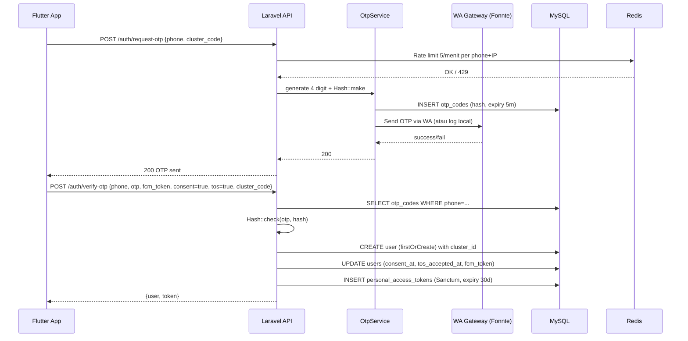
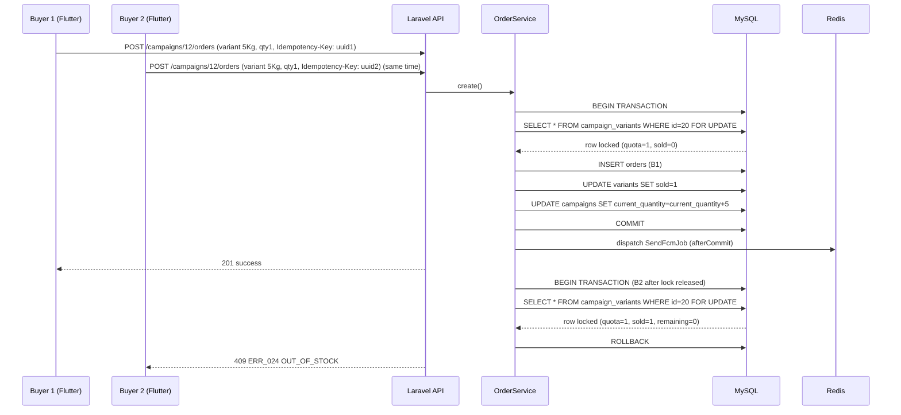
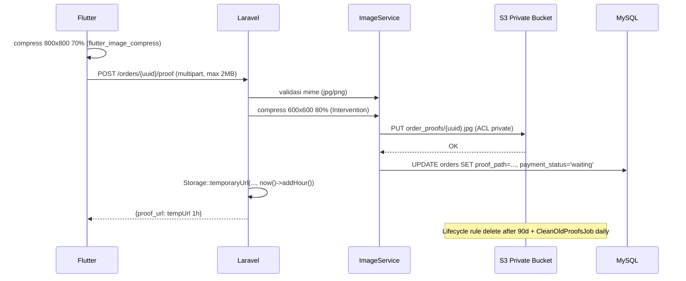
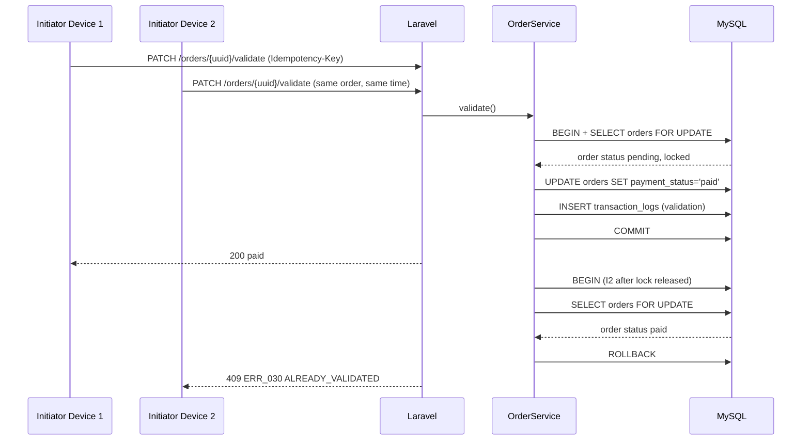
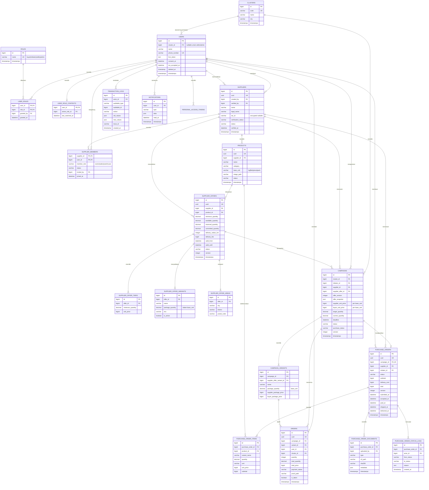

# SPESIFIKASI TEKNIS - Grosirun V3.1

**Proyek:** Grosirun Belanja Patungan  
**Stack:** Laravel 11.x (PHP 8.3) + MySQL 8 + Redis 7 + S3 + Flutter 3.22+  
**Tanggal:** 20 Juli 2026  
**Versi:** 3.1  
**Owner:** Architecture & Backend
**Review Cycle:** Setiap release
**Global Glossary:** [Indeks Dokumentasi](README.md#glossary-global-indonesiainggris)
**Status Dokumen:** Final
**Status Implementasi:** Belum Dimulai

---

## Daftar Isi

1. Pendahuluan & Referensi ADR
2. Tech Stack & Dependency Graph
3. Arsitektur High-Level & Sequence Diagram
4. Desain Database
5. Strategi Penyimpanan S3 Primary
6. Strategi Cluster Multi-RT
7. Struktur Laravel & Service Layer
8. Autentikasi (Sanctum + OTP + Consent + ToS)
9. Race Condition & Transaction Handling
10. Manajemen File S3 (tempUrl + Lifecycle)
11. Offline & Sync (Proof Queue)
12. FCM + Fallback Notifikasi DB
13. Keamanan (OWASP, Mass Assignment)
14. Optimasi APK <10MB
15. Logging vs Sentry & Disaster Recovery
16. Environment, Versioning & ETag
17. Glosarium
18. Rencana Migrasi Data
19. Panduan Migrasi Database
20. Backup & Disaster Recovery
21. Lampiran Database

---

## 1. Pendahuluan & Referensi ADR

### 1.1 Tujuan Dokumen

Dokumen ini adalah **acuan implementasi teknis** untuk Grosirun V3.1. Seluruh keputusan arsitektur penting telah didokumentasikan di **[ARCHITECTURE_DECISION_RECORDS.md](ARCHITECTURE_DECISION_RECORDS.md) (ADR)**. Dokumen ini menjabarkan secara rinci bagaimana setiap komponen diimplementasikan, termasuk:

- **Storage S3 Primary** (bukan local) — ADR-003
- **Cluster multi-RT** dengan `cluster_id` di semua tabel utama — ADR-002
- **API Versioning V2** dengan deprecation & sunset — ADR-009 (internal)
- **Indexing, partitioning, read replica** untuk performa — ADR-002

### 1.2 Referensi ADR

| ADR     | Keputusan                       | Alasan                                              |
| ------- | ------------------------------- | --------------------------------------------------- |
| ADR-001 | Laravel 11 bukan Node.js/Golang | Tim PHP, ekosistem Indonesia, lockForUpdate mature  |
| ADR-002 | MySQL 8 bukan PostgreSQL        | Familiar, harga hosting murah, lockForUpdate teruji |
| ADR-003 | S3 Primary bukan Local Storage  | Skalabilitas, lifecycle 90d, keamanan tempUrl       |
| ADR-004 | Cubit bukan Riverpod            | Ringan <10MB, familiar, tanpa code generation       |
| ADR-005 | Hive bukan Drift/Isar           | Offline cache sederhana, <200KB                     |
| ADR-006 | Sanctum bukan JWT/Passport      | Personal token, expiry 30d, revokable               |
| ADR-007 | Dio bukan http package          | Interceptor chain, retry, multipart mudah           |

### 1.3 Konteks Bisnis

Berdasarkan **[BUSINESS_ANALYSIS.md](BUSINESS_ANALYSIS.md)**:

| Komponen              | Nilai                          |
| --------------------- | ------------------------------ |
| Platform Fee          | 1% GMV + PPN 11%               |
| GMV per PO AT_70      | Rp8.400.000                    |
| Laba Initiator per PO | Rp956.760                      |
| Target Adopsi         | 70% (35 dari 50 KK)            |
| Cluster               | 1 RT = 1 cluster, max 500 user |

---

## 2. Tech Stack & Dependency Graph

### 2.1 Backend Exact V3.1

| Komponen      | Package                    | Versi       | Keterangan                          |
| ------------- | -------------------------- | ----------- | ----------------------------------- |
| PHP           | -                          | 8.3.9       | OPcache aktif di produksi           |
| Laravel       | laravel/framework          | ^11.34      | -                                   |
| Auth          | laravel/sanctum            | ^4.0        | Token expiry 30 hari                |
| DB            | MySQL 8.0                  | -           | InnoDB, row lock, partitioning siap |
| Cache/Queue   | Redis + Horizon            | 7.2 + 5.17  | -                                   |
| Storage       | league/flysystem-aws-s3-v3 | ^3.0        | S3 primary di produksi              |
| Image         | intervention/image         | ^3.7        | Kompres 800x800 70%                 |
| PDF           | barryvdh/laravel-dompdf    | ^3.0        | Rekap PO                            |
| FCM           | kreait/laravel-firebase    | ^5.6        | + fallback notifications table      |
| Feature Flags | laravel/pennant            | ^1.8        | qris_upload, extend_deadline        |
| Monitoring    | laravel/pulse + sentry     | ^1.0 + ^4.9 | -                                   |
| Backup        | spatie/laravel-backup      | ^8.7        | Backup ke S3                        |
| API Docs      | dedoc/scramble             | ^0.11       | OpenAPI v1/v2                       |
| Load Test     | k6 (external)              | -           | `load-test/` folder                 |

### 2.2 Dependency Graph

```
AppServiceProvider
  ├── RateLimiter (Redis)
  ├── Feature Flags (Pennant)
  ├── Filesystem (S3)
  └── Sanctum

CampaignService
  ├── ImageService
  ├── Cache (Redis)
  └── S3

OrderService
  ├── CampaignVariant (lockForUpdate)
  ├── S3 (proof)
  ├── NotificationService (FCM + fallback)
  └── FeatureFlag

OtpService
  ├── WA Gateway (Fonnte)
  └── otp_codes table

NotificationService
  ├── FCM (Kreait)
  └── notifications fallback table
```

### 2.3 Skalabilitas Roadmap

| Versi    | Arsitektur                                                                              |
| -------- | --------------------------------------------------------------------------------------- |
| **V1.0** | Single VPS 2vCPU 4GB, MySQL & Redis local, S3 primary, 500 user/cluster, 100 concurrent |
| **V1.1** | Read replica MySQL untuk recap, tambah indeks                                           |
| **V2.0** | Partisi orders by year, sharding per cluster_id, Prometheus + Grafana, multi-region S3  |

---

## 3. Arsitektur High-Level & Sequence Diagram

### 3.1 Arsitektur High-Level

```
┌─────────────────────────────────────────────────────────────────────┐
│                          INTERNET                                  │
└─────────────────────────────────────────────────────────────────────┘
                                │
                                ▼
┌─────────────────────────────────────────────────────────────────────┐
│                          NGINX (443 SSL)                           │
│                    Let's Encrypt Auto-Renew                        │
└─────────────────────────────────────────────────────────────────────┘
                                │
                                ▼
┌─────────────────────────────────────────────────────────────────────┐
│                      PHP-FPM 8.3 (30 children)                     │
│              pm.max_children=30, pm.start_servers=10               │
└─────────────────────────────────────────────────────────────────────┘
                                │
                                ▼
┌─────────────────────────────────────────────────────────────────────┐
│                          LARAVEL 11                                │
│                                                                     │
│  ┌──────────────┐  ┌──────────────┐  ┌────────────────────────┐  │
│  │   MySQL 8    │  │   Redis 7    │  │    S3 Private Bucket   │  │
│  │  Primary +   │  │ Queue + Cache│  │ campaigns/, order_proofs│  │
│  │  Read Replica│  │              │  │     tempUrl 1h          │  │
│  └──────────────┘  └──────────────┘  └────────────────────────┘  │
│                                                                     │
│  ┌─────────────────────────────────────────────────────────────┐  │
│  │              Supervisor (Queue Worker)                       │  │
│  │    2 procs: php artisan queue:work redis --tries=3          │  │
│  └─────────────────────────────────────────────────────────────┘  │
│                                                                     │
│  ┌─────────────────────────────────────────────────────────────┐  │
│  │              Cron (Scheduler)                                │  │
│  │    * * * * * php artisan schedule:run                       │  │
│  │    0 2 * * * php artisan backup:run --only-db              │  │
│  │    0 3 * * * php artisan proofs:clean-old                  │  │
│  └─────────────────────────────────────────────────────────────┘  │
└─────────────────────────────────────────────────────────────────────┘
                                │
                                ▼
┌─────────────────────────────────────────────────────────────────────┐
│              OBSERVABILITY & MONITORING                             │
│  ┌───────────┐ ┌───────────┐ ┌───────────┐ ┌──────────────────┐  │
│  │  Pulse    │ │  Sentry   │ │Prometheus │ │    Grafana       │  │
│  │Slow Queries│ │  Errors   │ │  Metrics  │ │  Dashboard      │  │
│  └───────────┘ └───────────┘ └───────────┘ └──────────────────┘  │
│                                                                     │
│  ┌─────────────────────────────────────────────────────────────┐  │
│  │                 Slack Alerts                                │  │
│  │   #grosirun-ci, #grosirun-alerts                          │  │
│  └─────────────────────────────────────────────────────────────┘  │
└─────────────────────────────────────────────────────────────────────┘
```

### 3.2 Sequence Diagram: OTP Login + Consent + ToS



### 3.3 Sequence Diagram: Checkout Thundering Herd (lockForUpdate)



### 3.4 Sequence Diagram: Upload Proof + S3 tempUrl + Lifecycle



### 3.5 Sequence Diagram: Validation + Admin Race



---


### 3.6 Sequence Diagram: Seller Acceptance

```mermaid
sequenceDiagram
    autonumber
    participant I as Inisiator
    participant API as Laravel API
    participant DB as MySQL Primary
    participant S as Seller
    participant N as NotificationService

    I->>API: POST /campaigns/{id}/purchase-orders<br/>Idempotency-Key + If-Match
    API->>DB: BEGIN; lock campaign + offer
    API->>DB: Validate target_reached, payment threshold,<br/>reservation, no active PO
    API->>DB: Create PO/items snapshot; draft→submitted;<br/>campaign→po_submitted; append logs
    API->>DB: COMMIT
    API->>N: Notify Seller PO submitted (SLA 12h)
    S->>API: PATCH /seller/purchase-orders/{uuid}/decision<br/>accepted + Idempotency-Key + If-Match
    API->>DB: BEGIN; lock PO + offer + membership
    API->>DB: Validate submitted, owner/sales, version
    API->>DB: submitted→accepted→awaiting_payment
    API->>DB: reserved_quantity -= PO quantity<br/>committed_quantity += PO quantity
    API->>DB: campaign→fulfillment; append 2 status logs
    API->>DB: COMMIT
    API->>N: Notify Inisiator awaiting payment
    API-->>S: 200 PO + ETag baru
```

Jika Seller memilih `rejected`, alasan wajib, PO menjadi terminal `rejected`, reservation dilepas satu kali, campaign kembali membutuhkan keputusan Inisiator, dan Buyer yang sudah membayar mengikuti SOP refund.

### 3.7 Sequence Diagram: Payment Confirmation dan Fulfillment

```mermaid
sequenceDiagram
    autonumber
    participant I as Inisiator
    participant API as Laravel API
    participant S3 as S3 Private
    participant DB as MySQL Primary
    participant S as Seller
    participant W as Warehouse
    participant N as NotificationService

    I->>API: POST /purchase-orders/{uuid}/payment-proof
    API->>DB: Authorize Inisiator + PO awaiting_payment
    API->>S3: Upload random path + checksum + malware scan
    API->>DB: Store initiator_payment_proof document
    API->>N: Notify Seller payment proof ready
    S->>API: PATCH /seller/purchase-orders/{uuid}/payment-confirmation<br/>confirmed + If-Match
    API->>DB: lock PO; awaiting_payment→paid; append log
    S->>API: PATCH status processing
    API->>DB: lock PO; paid→processing; append log
    S->>API: POST invoice dan delivery_note
    API->>S3: Store private documents
    W->>API: PATCH status shipped + tracking_reference
    API->>DB: Validate documents; processing→shipped; append log
    API->>N: Notify Inisiator shipment
    I->>API: PATCH /purchase-orders/{uuid}/delivered
    API->>DB: Compare expected/received/damaged quantity
    alt Sesuai
        API->>DB: shipped→delivered; campaign→distribution
        API->>N: Notify distribution ready
    else Selisih
        API->>DB: Keep shipped; create fulfillment dispute
        API->>N: Notify Seller dan Admin
    end
```

### 3.8 Sequence Diagram: Fulfillment Dispute

```mermaid
sequenceDiagram
    autonumber
    participant I as Inisiator
    participant API as Laravel API
    participant DB as MySQL Primary
    participant S3 as S3 Private
    participant S as Seller
    participant A as Admin Aplikasi
    participant N as NotificationService

    I->>API: POST /purchase-orders/{uuid}/disputes<br/>quantity + reason + evidence IDs
    API->>DB: Lock PO; validate dispute window 1×24h
    API->>DB: Create dispute open + append audit
    API->>N: Notify Seller response due 1×24h
    S->>API: POST /fulfillment-disputes/{uuid}/responses
    API->>S3: Store response evidence private
    API->>DB: Append response; dispute→responded
    A->>API: PATCH /admin/fulfillment-disputes/{uuid}/resolve<br/>re-auth + reason + If-Match + Idempotency-Key
    API->>DB: BEGIN; lock dispute + PO
    API->>DB: Validate Admin active role, evidence, version
    API->>DB: Store resolution replacement|partial_refund|full_refund|accepted_as_is
    API->>DB: Append immutable status/audit logs; COMMIT
    API->>N: Notify Inisiator dan Seller
    Note over I,S: Refund Buyer tetap dilakukan Inisiator<br/>karena Grosirun non-escrow
```

Setiap sequence membawa `trace_id`; log dan analytics tidak memuat PII, proof path, atau temporary URL.

---

## 4. Arsitektur Data & Database Penawaran-ke-Campaign

Bagian ini adalah sumber kebenaran tunggal untuk model data Grosirun. Empat role utama adalah `buyer`, `initiator`, `seller`, dan `admin`. Role bersifat many-to-many; Seller adalah pengguna, sedangkan Supplier adalah organisasi usaha. Arsitektur perdagangan menggunakan alur penawaran-ke-campaign: Seller membuat penawaran dan Inisiator membuat campaign dari penawaran aktif.

### 4.1 ERD Utama Penawaran-ke-Campaign



### 4.2 Data Dictionary Penawaran-ke-Campaign

#### 4.2.1 Role dan konteks aktif

| Tabel/kolom | Tipe | Null | Constraint/indeks | Delete behavior |
| --- | --- | --- | --- | --- |
| `roles.id` | bigint | NO | PK | RESTRICT jika dipakai |
| `roles.name` | varchar(32) | NO | UNIQUE; hanya `buyer`, `initiator`, `seller`, `admin` | RESTRICT |
| `user_roles.user_id` | bigint | NO | PK komposit, FK users; index `(user_id,role_id)` | CASCADE |
| `user_roles.role_id` | bigint | NO | PK komposit, FK roles | RESTRICT |
| `user_roles.granted_by` | bigint | YES | FK users | SET NULL |
| `user_roles.granted_at` | datetime | NO | — | mengikuti row |
| `user_role_contexts.user_id` | bigint | NO | PK/FK users | CASCADE |
| `user_role_contexts.active_role_id` | bigint | NO | FK roles; harus ada di `user_roles` | RESTRICT |
| `user_role_contexts.last_switched_at` | datetime | NO | index untuk audit operasional | mengikuti row |

Validasi active role dilakukan dalam transaksi: lock context, pastikan membership role aktif, update context, lalu tulis `role_switch` ke audit log.

#### 4.2.2 Supplier membership

| Kolom | Tipe | Null | Constraint/indeks |
| --- | --- | --- | --- |
| `supplier_id` | bigint | NO | PK komposit, FK suppliers; RESTRICT |
| `user_id` | bigint | NO | PK komposit, FK users; RESTRICT |
| `member_role` | varchar(16) | NO | CHECK `owner|sales|warehouse` |
| `status` | varchar(16) | NO | CHECK `invited|active|suspended|revoked` |
| `invited_by` | bigint | YES | FK users, SET NULL |
| `joined_at` | datetime | YES | — |

Indeks: unique `(supplier_id,user_id)`, `(user_id,status)`, dan `(supplier_id,member_role,status)`. Supplier wajib selalu memiliki minimal satu owner aktif; owner terakhir tidak dapat keluar sebelum menunjuk pengganti.

#### 4.2.3 Penawaran, tier, area, dan kapasitas

| Tabel/kolom | Tipe | Null | Constraint/indeks |
| --- | --- | --- | --- |
| `supplier_offers.supplier_id` | bigint | NO | FK suppliers, RESTRICT; index `(supplier_id,status)` |
| `supplier_offers.product_id` | bigint | NO | FK products, RESTRICT; index `(product_id,status)` |
| `minimum_quantity` | decimal(12,3) | NO | CHECK > 0 |
| `available_quantity` | decimal(12,3) | NO | CHECK ≥ 0 |
| `reserved_quantity` | decimal(12,3) | NO | default 0, CHECK ≥ 0 |
| `committed_quantity` | decimal(12,3) | NO | default 0, CHECK ≥ 0 |
| `version` | unsigned int | NO | default 1; ETag source |
| `valid_from`, `valid_until` | datetime | NO | CHECK `valid_until > valid_from`; index dengan status |
| `supplier_offer_tiers.minimum_quantity` | decimal(12,3) | NO | UNIQUE `(offer_id,minimum_quantity)` |
| `supplier_offer_tiers.unit_price` | bigint | NO | integer rupiah, CHECK > 0 |
| `supplier_offer_variants.offer_id` | bigint | NO | FK offer, RESTRICT; index `(offer_id,is_active)` |
| `supplier_offer_variants.package_quantity` | decimal(12,3) | NO | base unit, CHECK > 0; UNIQUE `(offer_id,package_quantity)` |
| `supplier_offer_variants.sku` | varchar(64) | YES | UNIQUE per supplier jika diisi |
| `supplier_offer_areas` | city/district/postal_code | bertingkat | UNIQUE area per offer; index `(city,district,offer_id)` |

Invariant kapasitas:

```text
reserved_quantity + committed_quantity <= available_quantity
```

Pembuatan campaign menambah `reserved_quantity` sebesar target. PO accepted memindahkan jumlah dari reserved ke committed. Campaign cancelled sebelum acceptance mengurangi reserved. Operasi tersebut mengunci row offer dan menambah `version`.

#### 4.2.4 Purchase order dan dokumen

| Tabel/kolom | Tipe | Null | Constraint/indeks |
| --- | --- | --- | --- |
| `purchase_orders.campaign_id` | bigint | NO | UNIQUE FK campaigns, RESTRICT |
| `supplier_id`, `initiator_id` | bigint | NO | FK, RESTRICT; index `(supplier_id,status,created_at)` |
| `status` | varchar(24) | NO | CHECK state machine |
| `subtotal`, `delivery_cost`, `total` | bigint | NO | CHECK ≥ 0; `total=subtotal+delivery_cost` |
| `version` | unsigned int | NO | ETag/source optimistic lock |
| seluruh `*_at` | datetime | YES | hanya diisi ketika transisi terkait terjadi |
| `purchase_order_items` | qty/unit/unit_price/subtotal | NO | snapshot immutable setelah submit |
| `purchase_order_documents.type` | varchar(32) | NO | CHECK tipe dokumen yang diizinkan |
| `s3_path` | varchar(512) | NO | private path, tidak menyimpan temporary URL |
| `sha256` | char(64) | NO | verifikasi integritas |
| `uploaded_by` | bigint | YES | FK users, SET NULL saat anonimisasi |
| `metadata` | json | YES | mime, size, original name yang disanitasi |

Unique dokumen mengikuti `(purchase_order_id,type,sha256)`. Indeks daftar menggunakan `(purchase_order_id,type,created_at)`. Penghapusan fisik dokumen mengikuti kebijakan retensi, bukan cascade transaksi.

#### 4.2.5 Purchase-order status log

| Kolom | Tipe | Null | Constraint/indeks |
| --- | --- | --- | --- |
| `purchase_order_id` | bigint | NO | FK purchase_orders, RESTRICT |
| `from_status` | varchar(24) | YES | NULL hanya untuk penciptaan |
| `to_status` | varchar(24) | NO | status valid |
| `actor_id` | bigint | YES | FK users, SET NULL/anonymized |
| `reason` | text | YES | wajib untuk reject, cancel, override, discrepancy |
| `created_at` | timestamp | NO | index `(purchase_order_id,created_at)` |

Status log bersifat append-only. Update dan delete ditolak pada layer aplikasi serta dibatasi pada database user produksi. Setiap log membawa `trace_id` melalui relasi audit untuk korelasi observability.

### 4.3 Batas Agregat dan Sumber Kebenaran

| Agregat | Root | Anggota | Pemilik perubahan |
| --- | --- | --- | --- |
| Identitas | `users` | roles, active role, token | User/Admin |
| Supplier | `suppliers` | members, products | Seller owner/Admin |
| Penawaran | `supplier_offers` | tiers, areas | Seller owner/sales; Admin moderasi |
| Campaign | `campaigns` | variants, buyer orders | Inisiator |
| Purchase order | `purchase_orders` | items, documents, status logs | Inisiator dan Seller sesuai state |

`offer_snapshot` adalah sumber komersial campaign setelah dibuat. Perubahan atau kedaluwarsa offer tidak mengubah campaign berjalan. `purchase_order_items` adalah snapshot pemenuhan dan tidak membaca harga produk secara dinamis.

### 4.4 Aturan Role dan Organisasi

- `users` tidak memiliki enum role.
- `user_roles` memiliki unique `(user_id, role_id)`.
- `active_role_id` harus merupakan role yang dimiliki user.
- Buyer dan Inisiator wajib memiliki `cluster_id`; Seller dan Admin boleh `NULL`.
- Seller hanya mengakses supplier melalui membership berstatus `active`.
- `owner` dan `sales` mengelola offer; `warehouse` hanya fulfillment.
- Supplier harus `verified` dan `active` sebelum offer dapat dipublikasikan.

### 4.5 Aturan Penawaran dan Kapasitas

Status offer: `draft`, `pending_review`, `active`, `paused`, `expired`, `rejected`.

- Minimal satu tier dan satu area layanan.
- Unique `(offer_id, minimum_quantity)`.
- Harga tier tidak boleh meningkat saat minimum quantity bertambah.
- `valid_until` harus setelah `valid_from`.
- Campaign hanya dapat dibuat dari offer `active`, belum kedaluwarsa, sesuai area cluster, dan memiliki kapasitas.
- Kapasitas direservasi saat campaign dibuat sebesar target campaign di dalam transaksi `lockForUpdate()`. Pembatalan sebelum purchase order diterima mengembalikan reservasi. Setelah PO diterima, reservasi menjadi committed quantity.

### 4.6 Aturan Campaign Berbasis Penawaran

Campaign wajib menyimpan `supplier_offer_id`, `offer_version`, dan snapshot. Harga aktif menggunakan:

- `supplier_unit_price`: tier supplier terpilih;
- `buyer_unit_price`: harga kepada Pembeli;
- `supplier_subtotal`: dihitung saat purchase order;
- `delivery_cost`: berasal dari snapshot offer;
- `purchase_order.total = supplier_subtotal + delivery_cost`.

Field lama `price_total_supplier` tidak digunakan pada skema penawaran-ke-campaign. Field tersebut hanya boleh muncul dalam dokumentasi migrasi legacy.

Satu campaign menghasilkan maksimal satu purchase order aktif melalui unique `purchase_orders.campaign_id`. Penggantian supplier memerlukan pembatalan PO lama, pelepasan reservasi, pemilihan offer baru, dan snapshot baru yang diaudit sebelum ada PO yang diterima.

### 4.7 Unit, Variant, Harga, dan Campaign Lifecycle

`products.base_unit` adalah satuan inventori canonical. Kapasitas, target, reservation, committed quantity, dan tier selalu menggunakan base unit. `supplier_offer_variants` hanya mendefinisikan packaging. Contoh: base unit `kg`, package 5 kg dan 10 kg. Kedua variant mengonsumsi pool kapasitas offer yang sama.

Saat campaign dibuat, server menyalin offer variant terpilih ke `campaign_variants`. `supplier_package_price = supplier_unit_price × package_quantity`; `buyer_package_price = buyer_unit_price × package_quantity`. Client tidak mengirim harga supplier. Pembulatan rupiah menggunakan half-up dan hasil wajib integer. Margin tervalidasi pada base unit dan package.

Status campaign canonical:

```text
draft → active → target_reached → po_submitted → fulfillment → distribution → completed
           ↘ expired
           ↘ cancelled
```

- `draft`: belum reservasi dan belum terlihat Buyer.
- `active`: offer tersnapshot dan kapasitas tereservasi; menerima order.
- `target_reached`: target/order threshold tercapai; checkout ditutup.
- `po_submitted`: purchase order telah dikirim.
- `fulfillment`: PO accepted sampai delivered.
- `distribution`: barang diterima dan dibagikan.
- `completed`: seluruh distribusi selesai dan rekonsiliasi ditutup.
- `expired`/`cancelled`: terminal; reservation dilepas jika PO belum accepted.

Target tercapai tidak pernah langsung menjadi `completed`. Setiap status menyimpan timestamp dan audit log.

### 4.8 State Machine Purchase Order

```text
draft → submitted → accepted → awaiting_payment → paid → processing → shipped → delivered
            ↘ rejected
submitted|accepted|awaiting_payment → cancelled
```

| Transisi | Aktor | SLA/prasyarat |
| --- | --- | --- |
| draft → submitted | Inisiator | target dan payment threshold tercapai |
| submitted → accepted/rejected | Seller owner/sales | maksimal 12 jam; reject wajib alasan |
| accepted → awaiting_payment | Sistem | atomik dalam transaksi acceptance |
| awaiting_payment → paid | Seller owner/sales | setelah proof Inisiator diverifikasi, maksimal 1×24 jam |
| paid → processing | Seller owner/sales | maksimal 1×24 jam |
| processing → shipped | Seller/warehouse | invoice dan surat jalan wajib; sesuai delivery SLA |
| shipped → delivered | Inisiator | bukti penerimaan dan kuantitas diperiksa |

Setiap transisi memerlukan `If-Match`, Idempotency-Key, `lockForUpdate()`, Policy, dan status log. `rejected`, `cancelled`, dan `delivered` terminal. Timeout submitted memicu reminder 6 jam dan eskalasi 12 jam; tidak membatalkan otomatis jika Buyer sudah membayar. Selisih penerimaan membuka fulfillment dispute dan menahan status `shipped`.

### 4.9 Foreign Key dan Delete Behavior

| Relasi | On delete | Alasan |
| --- | --- | --- |
| users → user_roles/context | CASCADE | Data otorisasi mengikuti user |
| suppliers → members/products/offers | RESTRICT | Riwayat usaha tidak boleh hilang |
| offers → tiers/areas | CASCADE sebelum dipakai; RESTRICT setelah direferensikan | Menjaga snapshot dan audit |
| campaigns → orders/purchase_orders | RESTRICT | Transaksi dipertahankan |
| purchase_orders → items/documents/logs | RESTRICT | Bukti fulfillment dipertahankan |
| user pada actor/audit | SET NULL atau anonymized actor | Mendukung penghapusan akun tanpa menghapus audit |

Soft delete digunakan untuk user, supplier, product, dan offer. Campaign/order/purchase order tidak dihapus setelah transaksi; gunakan status terminal.

### 4.10 Indeks dan Constraint Utama

- `users(phone_number)` unique.
- `roles(name)` unique.
- `supplier_members(supplier_id,user_id)` unique; index `(user_id,status)`.
- `supplier_offers(status,valid_from,valid_until)`, `(supplier_id,status)`, `(product_id,status)`.
- `supplier_offer_areas(city,district,offer_id)`.
- `campaigns(cluster_id,status,deadline)`, `(supplier_offer_id,status)`, `(initiator_id,created_at)`.
- `orders(campaign_id,payment_status)`, `(user_id,created_at)`, UUID unique.
- `purchase_orders(campaign_id)` unique, `(supplier_id,status,created_at)`, UUID unique.
- `purchase_order_status_logs(purchase_order_id,created_at)`.

Semua nominal uang menggunakan integer rupiah. Kuantitas menggunakan `decimal(12,3)`. Timestamp disimpan UTC dan disajikan dalam Asia/Jakarta.

### 4.11 Siklus Hidup dan Retensi

| Data | Retensi |
| --- | --- |
| Proof pembayaran Pembeli | 90 hari setelah campaign selesai |
| Invoice, surat jalan, bukti pembayaran supplier | Sesuai kebutuhan audit dan pajak, minimum 5 tahun |
| Offer snapshot dan PO items | Mengikuti transaksi, tidak berubah |
| Audit/status log | Minimum 5 tahun atau ketentuan hukum yang lebih lama |
| OTP | Dihapus maksimal 24 jam setelah kedaluwarsa |
| Data seller verification | Selama kemitraan dan periode kewajiban hukum |

### 4.12 Strategi Query dan Transaksi

- Daftar offer memfilter status, periode aktif, area cluster, dan kapasitas; cache 60 detik per area.
- Pembuatan campaign mengunci offer, memilih tier, mereservasi kapasitas, dan menyimpan snapshot dalam satu transaksi.
- Checkout mengunci campaign dan variant untuk mencegah oversell.
- Submit/decision/status purchase order mengunci PO dan memvalidasi state transition.
- Resource seller tidak pernah join atau serialize identitas dan proof pembayaran Buyer.
- Recap berat dapat menggunakan read replica; seluruh write dan validasi kapasitas selalu primary.


---

## 5. Strategi Penyimpanan S3 Primary

### 5.1 Keputusan Final

| Environment      | `FILESYSTEM_DISK` | Bucket                  | Akses               |
| ---------------- | ----------------- | ----------------------- | ------------------- |
| **Produksi**     | `s3`              | `grosirun-prod-private` | Private, tempUrl 1h |
| **Pengembangan** | `public`          | Local storage           | -                   |

### 5.2 S3 Configuration

```ini
# .env.prod
FILESYSTEM_DISK=s3
AWS_ACCESS_KEY_ID=AKIA...
AWS_SECRET_ACCESS_KEY=...
AWS_DEFAULT_REGION=ap-southeast-1
AWS_BUCKET=grosirun-prod-private
AWS_USE_PATH_STYLE_ENDPOINT=false
S3_TEMP_URL_EXPIRY=60  # menit
```

### 5.3 Lifecycle Rule

```json
{
  "Rules": [
    {
      "ID": "delete-old-proofs-90d",
      "Filter": { "Prefix": "order_proofs/" },
      "Status": "Enabled",
      "Expiration": { "Days": 90 },
      "NoncurrentVersionExpiration": { "NoncurrentDays": 7 }
    }
  ]
}
```

### 5.4 Penggunaan di Controller

```php
// app/Http/Controllers/Api/V1/OrderController.php
public function showProof(Order $order, Request $request)
{
    $this->authorize('view', $order);

    if (!$order->proof_path) {
        throw new HttpException(404, 'ERR_055 PROOF_NOT_FOUND');
    }

    $url = Storage::disk('s3')->temporaryUrl(
        $order->proof_path,
        now()->addMinutes(config('filesystems.s3_temp_url_expiry', 60))
    );

    return response()->json(['proof_url' => $url]);
}
```

---

## 6. Strategi Cluster Multi-RT

### 6.1 Migration V3.1

```php
// 1. Buat tabel clusters
Schema::create('clusters', function (Blueprint $table) {
    $table->id();
    $table->string('code', 20)->unique();
    $table->string('name', 100);
    $table->string('rw', 10)->nullable();
    $table->string('kelurahan', 50)->nullable();
    $table->string('city', 50)->default('Surabaya');
    $table->timestamps();
});

// 2. Tambah cluster_id ke users
Schema::table('users', function (Blueprint $table) {
    $table->foreignId('cluster_id')
        ->nullable()
        ->constrained('clusters')
        ->nullOnDelete()
        ->after('id');
    $table->index('cluster_id', 'idx_users_cluster');
});

// 3. Tambah cluster_id ke campaigns
Schema::table('campaigns', function (Blueprint $table) {
    $table->foreignId('cluster_id')
        ->constrained('clusters')
        ->cascadeOnDelete()
        ->after('id');
    $table->index(['cluster_id', 'status', 'deadline'], 'idx_campaigns_cluster_status_deadline');
});

// 4. Tambah cluster_id ke orders (denormalized)
Schema::table('orders', function (Blueprint $table) {
    $table->foreignId('cluster_id')
        ->nullable()
        ->constrained('clusters')
        ->nullOnDelete()
        ->after('uuid');
});
```

### 6.2 Global Scope ClusterScope

```php
// app/Scopes/ClusterScope.php
class ClusterScope implements Scope
{
    public function apply(Builder $builder, Model $model): void
    {
        if (auth()->check() && auth()->user()->cluster_id) {
            $builder->where('cluster_id', auth()->user()->cluster_id);
        }
    }
}

// app/Models/Campaign.php
protected static function booted(): void
{
    static::addGlobalScope(new ClusterScope());
}
```

### 6.3 Seeder Default Cluster

```php
// database/seeders/ClusterSeeder.php
Cluster::create([
    'code' => 'PGH-RT03',
    'name' => 'Permata Hijau RT03',
    'rw' => '03',
    'kelurahan' => 'Ngoro',
    'city' => 'Mojokerto',
]);
```

---

### 6.4 Arsitektur Penawaran-ke-Campaign dan Multi-Role

**Relasi otorisasi:**

```text
User --< user_roles >-- Role
User --< supplier_members >-- Supplier --< products --< supplier_offers
SupplierOffer --< supplier_offer_tiers
SupplierOffer --< campaigns --1 purchase_orders --< purchase_order_documents
Cluster --< campaigns --< orders
```

**Aturan domain:**

- `SupplierOfferService::publish()` hanya menerima supplier terverifikasi, minimal satu tier, kapasitas positif, area layanan, dan periode valid.
- `CampaignService::createFromOffer()` mengunci offer, memilih tier berdasarkan target, dan menyalin `offer_snapshot` JSON dalam transaksi.
- `PurchaseOrderService::submit()` hanya dapat dijalankan pemilik campaign setelah target dan payment threshold terpenuhi.
- Transisi purchase order menggunakan state machine: `draft → submitted → accepted → awaiting_payment → paid → processing → shipped → delivered`; terminal alternatif `rejected` dan `cancelled`.
- Setiap transisi memakai `lockForUpdate()`, `If-Match`, dan Idempotency-Key serta menghasilkan audit log.
- Policy seller selalu memeriksa `supplier_members.supplier_id`; policy initiator memeriksa kepemilikan campaign dan cluster.
- API Resource seller tidak pernah memuat `orders.user_id`, nomor HP Pembeli, atau `proof_path` pembayaran Pembeli.

**Service tambahan:** `SupplierService`, `ProductService`, `SupplierOfferService`, `PurchaseOrderService`, `SupplierVerificationService`, dan `RoleContextService`.

**Feature flags:** `seller-onboarding`, `supplier-offers`, dan `purchase-orders` mengendalikan rollout tanpa mengubah kontrak data.

---

## 7. Struktur Laravel & Service Layer

### 7.1 Struktur Folder

```
app/
├── Console/
│   └── Commands/
│       ├── FirebaseImportCommand.php
│       ├── ExcelImportOrdersCommand.php
│       └── S3MigrateCommand.php
├── DTOs/
│   ├── CreateCampaignDTO.php
│   └── CreateOrderDTO.php
├── Http/
│   ├── Controllers/
│   │   └── Api/
│   │       └── V1/
│   │           ├── AuthController.php
│   │           ├── CampaignController.php
│   │           ├── OrderController.php
│   │           ├── NotificationController.php
│   │           └── FeatureController.php
│   ├── Middleware/
│   │   ├── RoleMiddleware.php
│   │   ├── IdempotencyMiddleware.php
│   │   └── EnsureConsent.php
│   ├── Requests/
│   │   ├── StoreCampaignRequest.php
│   │   ├── StoreOrderRequest.php
│   │   └── UploadProofRequest.php
│   └── Resources/
│       ├── CampaignResource.php
│       ├── OrderResource.php
│       └── UserResource.php
├── Jobs/
│   ├── SendFcmJob.php
│   ├── CleanOldProofsJob.php
│   ├── AnonymizeUserJob.php
│   └── CheckDeadlinesJob.php
├── Models/
│   ├── Cluster.php
│   ├── User.php
│   ├── Campaign.php
│   ├── CampaignVariant.php
│   ├── Order.php
│   ├── TransactionLog.php
│   ├── Notification.php
│   └── OtpCode.php
├── Policies/
│   ├── CampaignPolicy.php
│   └── OrderPolicy.php
├── Scopes/
│   └── ClusterScope.php
└── Services/
    ├── CampaignService.php
    ├── OrderService.php
    ├── OtpService.php
    ├── ImageService.php
    └── NotificationService.php
```

### 7.2 Service Layer

#### OrderService

```php
// app/Services/OrderService.php
class OrderService
{
    public function create(Campaign $campaign, CreateOrderDTO $dto, User $buyer): Order
    {
        return DB::transaction(function () use ($campaign, $dto, $buyer) {
            // 1. Lock variant (FOR UPDATE)
            $variant = CampaignVariant::where('id', $dto->variantId)
                ->where('campaign_id', $campaign->id)
                ->lockForUpdate()
                ->firstOrFail();

            // 2. Cek stok
            $remaining = $variant->quota - $variant->sold;
            if ($remaining < $dto->quantity) {
                throw new HttpException(409, 'ERR_024 OUT_OF_STOCK');
            }

            // 3. Buat order
            $order = Order::create([
                'uuid' => (string) Str::uuid(),
                'cluster_id' => $campaign->cluster_id,
                'campaign_id' => $campaign->id,
                'campaign_variant_id' => $variant->id,
                'user_id' => $buyer->id,
                'quantity' => $dto->quantity,
                'total_quantity' => $variant->package_quantity * $dto->quantity,
                'total_price' => $variant->price * $dto->quantity,
                'payment_method' => $dto->paymentMethod,
                'payment_status' => 'pending',
                'idempotency_key' => $dto->idempotencyKey,
            ]);

            // 4. Update stok
            $variant->increment('sold', $dto->quantity);
            $campaign->increment('current_quantity', $variant->package_quantity * $dto->quantity);

            // 5. Notifikasi (FCM + fallback DB)
            $this->notificationService->sendNewOrderNotification($order);

            // 6. Audit log
            TransactionLog::create([
                'order_id' => $order->id,
                'initiator_id' => $buyer->id,
                'type' => 'order_created',
                'ip_address' => request()->ip(),
            ]);

            return $order;
        });
    }

    public function validate(Order $order, User $initiator): Order
    {
        return DB::transaction(function () use ($order, $initiator) {
            // Lock order untuk mencegah admin race
            $lockedOrder = Order::where('id', $order->id)
                ->lockForUpdate()
                ->first();

            if ($lockedOrder->payment_status === 'paid') {
                throw new HttpException(409, 'ERR_030 ALREADY_VALIDATED');
            }

            $lockedOrder->update(['payment_status' => 'paid']);

            TransactionLog::create([
                'order_id' => $lockedOrder->id,
                'initiator_id' => $initiator->id,
                'type' => 'validation',
                'ip_address' => request()->ip(),
            ]);

            $this->notificationService->sendPaymentValidatedNotification($lockedOrder);

            return $lockedOrder;
        });
    }
}
```

#### DTO

```php
// app/DTOs/CreateOrderDTO.php
readonly class CreateOrderDTO
{
    public function __construct(
        public int $variantId,
        public int $quantity,
        public string $paymentMethod,
        public string $idempotencyKey,
    ) {}
}
```

#### FormRequest

```php
// app/Http/Requests/StoreOrderRequest.php
class StoreOrderRequest extends FormRequest
{
    public function authorize(): bool
    {
        return $this->user()->activeRoleIs('buyer') && $this->user()->hasRole('buyer');
    }

    public function rules(): array
    {
        return [
            'variant_id' => ['required', 'integer', 'exists:campaign_variants,id'],
            'quantity' => ['required', 'integer', 'min:1', 'max:100'],
            'payment_method' => ['required', 'string', 'in:cash,qris'],
        ];
    }

    public function toDTO(): CreateOrderDTO
    {
        return new CreateOrderDTO(
            variantId: $this->input('variant_id'),
            quantity: $this->input('quantity'),
            paymentMethod: $this->input('payment_method'),
            idempotencyKey: $this->header('Idempotency-Key'),
        );
    }
}
```

#### Resource

```php
// app/Http/Resources/CampaignResource.php
class CampaignResource extends JsonResource
{
    public function toArray($request): array
    {
        return [
            'id' => $this->id,
            'cluster_id' => $this->cluster_id,
            'slug' => $this->slug,
            'name' => $this->name,
            'description' => $this->description,
            'image_url' => $this->image_path
                ? Storage::disk('s3')->temporaryUrl($this->image_path, now()->addHour())
                : null,
            'target_quantity' => $this->target_quantity,
            'current_quantity' => $this->current_quantity,
            'progress_percent' => round(($this->current_quantity / $this->target_quantity) * 100, 1),
            'deadline' => $this->deadline->toIso8601String(),
            'status' => $this->status,
            'initiator' => new UserResource($this->whenLoaded('initiator')),
            'variants' => CampaignVariantResource::collection($this->whenLoaded('variants')),
            'created_at' => $this->created_at->toIso8601String(),
        ];
    }
}
```

### 7.3 Feature Flags (Pennant)

```php
// app/Providers/AppServiceProvider.php
Feature::define('qris-upload', fn(User $user) => true);
Feature::define('extend-deadline', fn() => true);
Feature::define('batch-validate', fn(User $user) => $user->activeRoleIs('initiator') && $user->hasRole('initiator'));
Feature::define('dark-mode', fn(User $user) => false);
Feature::define('seller-onboarding', fn(User $user) => false);
Feature::define('supplier-offers', fn(User $user) => false);
Feature::define('purchase-orders', fn(User $user) => false);
Feature::define('supplier-erp-webhook', fn() => false);
Feature::define('canary-new-order-service', function (User $user) {
    return crc32((string) $user->id) % 100 < 10; // 10% canary
});

// Penggunaan di controller
public function store(StoreOrderRequest $request, Campaign $campaign)
{
    if (!Feature::active('qris-upload') && $request->payment_method === 'qris') {
        throw new HttpException(403, 'ERR_064 FEATURE_DISABLED');
    }
    // ...
}

// Toggle tanpa deploy
php artisan pennant:activate qris-upload
php artisan pennant:activate canary-new-order-service --percentage=50
php artisan pennant:deactivate qris-upload
```

### 7.4 RateLimiter Centralized

```php
// app/Providers/AppServiceProvider.php
use Illuminate\Cache\RateLimiting\Limit;
use Illuminate\Support\Facades\RateLimiter;

public function boot(): void
{
    RateLimiter::for('otp', function (Request $r) {
        return Limit::perMinute(5)
            ->by($r->input('phone_number') . '|' . $r->ip())
            ->response(function () {
                return response()->json([
                    'message' => 'Terlalu banyak percobaan OTP',
                    'code' => 'ERR_001_RL',
                    'locked_until' => now()->addMinutes(15)->toIso8601String(),
                ], 429);
            });
    });

    RateLimiter::for('global-api', function (Request $r) {
        return Limit::perMinute(60)
            ->by($r->user()?->id ?: $r->ip())
            ->response(function () {
                return response()->json([
                    'message' => 'Terlalu banyak permintaan',
                    'code' => 'ERR_060',
                    'retry_after' => 60,
                ], 429);
            });
    });

    RateLimiter::for('override-validate', function (Request $r) {
        return Limit::perMinute(10)
            ->by($r->user()->id)
            ->response(function () {
                return response()->json([
                    'message' => 'Terlalu banyak override',
                    'code' => 'ERR_061',
                    'retry_after' => 60,
                ], 429);
            });
    });
}

// Routes
Route::middleware(['throttle:otp'])->post('/auth/request-otp', ...);
Route::middleware(['throttle:global-api'])->group(...);
Route::middleware(['throttle:override-validate'])->patch('/orders/{order}/override-validate', ...);
```

---

## 8. Autentikasi (Sanctum + OTP + Consent + ToS)

### 8.1 OTP Flow

```php
// app/Services/OtpService.php
class OtpService
{
    public function generateOtp(string $phone, string $clusterCode): string
    {
        // Rate limit sudah di middleware

        $otp = rand(1000, 9999);
        $hash = Hash::make($otp);

        OtpCode::create([
            'phone_number' => $this->normalizePhone($phone),
            'otp_hash' => $hash,
            'expires_at' => now()->addMinutes(5),
            'attempts' => 0,
        ]);

        // Kirim via WA (Fonnte) atau log di local
        $this->sendViaWhatsApp($phone, $otp);

        return $otp;
    }

    public function verifyOtp(string $phone, string $otp): User
    {
        $otpCode = OtpCode::where('phone_number', $this->normalizePhone($phone))
            ->where('expires_at', '>', now())
            ->first();

        if (!$otpCode) {
            throw new HttpException(401, 'ERR_001 OTP_EXPIRED');
        }

        if ($otpCode->locked_until && $otpCode->locked_until > now()) {
            throw new HttpException(429, 'ERR_001_RL');
        }

        if (!Hash::check($otp, $otpCode->otp_hash)) {
            $otpCode->increment('attempts');
            if ($otpCode->attempts >= 5) {
                $otpCode->update(['locked_until' => now()->addMinutes(15)]);
                throw new HttpException(429, 'ERR_001_RL');
            }
            throw new HttpException(401, 'ERR_004 OTP_INVALID');
        }

        $otpCode->delete();

        // Cari atau buat user
        $user = User::firstOrCreate(
            ['phone_number' => $this->normalizePhone($phone)],
            ['cluster_id' => $this->getClusterId($clusterCode)]
        );

        return $user;
    }
}
```

### 8.2 Consent & ToS

**Fields di `users`:**

| Field             | Tipe        | Keterangan                  |
| ----------------- | ----------- | --------------------------- |
| `consent_at`      | datetime    | Waktu consent UU PDP        |
| `consent_version` | varchar(20) | Versi privacy policy        |
| `tos_accepted_at` | datetime    | Waktu accept ToS non-escrow |
| `tos_version`     | varchar(20) | Versi ToS                   |

**Endpoints:**

```php
Route::post('/auth/consent', [AuthController::class, 'consent']);
Route::post('/auth/tos-accept', [AuthController::class, 'tosAccept']);
Route::delete('/auth/account', [AuthController::class, 'deleteAccount']);
```

### 8.3 Token Sanctum

```php
// Login - create token
$token = $user->createToken('mobile', ['*'], now()->addDays(30))->plainTextToken;

// Logout - revoke token
$user->currentAccessToken()->delete();

// Delete account - revoke all tokens
$user->tokens()->delete();
```

---

## 9. Race Condition & Transaction Handling

### 9.1 Thundering Herd (Buyer Race)

**Skenario:** 100 buyer checkout sisa 10 kuota di H-1 deadline.

**Solusi:** `lockForUpdate()` pada variant.

```php
$variant = CampaignVariant::where('id', $variantId)
    ->where('campaign_id', $campaign->id)
    ->lockForUpdate()
    ->first();

if ($variant->quota - $variant->sold < $quantity) {
    throw new HttpException(409, 'ERR_024 OUT_OF_STOCK');
}
```

**Test k6:** `k6-deadline-rush.js` (100 VU, 10 quota) → 10 success, 90 409.

### 9.2 Admin Race (Double Validation)

**Skenario:** 2 device admin memvalidasi order yang sama.

**Solusi:** `lockForUpdate()` pada orders + 409 ALREADY_VALIDATED.

```php
$order = Order::where('uuid', $uuid)->lockForUpdate()->first();

if ($order->payment_status === 'paid') {
    throw new HttpException(409, 'ERR_030 ALREADY_VALIDATED');
}

$order->update(['payment_status' => 'paid']);
```

**Test:** Pest concurrency 2 initiators → 1 success, 1 409.

---

## 10. Manajemen File S3 (tempUrl + Lifecycle)

### 10.1 Upload Proof

```php
// app/Services/ImageService.php
public function uploadProof(UploadedFile $file, Order $order): string
{
    // Validasi mime
    $this->validateImage($file);

    // Kompres
    $image = ImageManager::read($file);
    $image->resize(600, 600, function ($constraint) {
        $constraint->aspectRatio();
        $constraint->upsize();
    });
    $compressed = $image->encode('jpg', 80);

    // Random UUID
    $uuid = (string) Str::uuid();
    $path = "order_proofs/{$uuid}.jpg";

    // Upload ke S3 (private)
    Storage::disk('s3')->put($path, $compressed, 'private');

    // Update order
    $order->update(['proof_path' => $path, 'payment_status' => 'waiting']);

    return $path;
}

public function getTempUrl(string $path): string
{
    return Storage::disk('s3')->temporaryUrl($path, now()->addHour());
}
```

### 10.2 Lifecycle 90 Hari (Double Safety)

**S3 Lifecycle Rule:**

```json
{
  "Rules": [
    {
      "ID": "delete-old-proofs-90d",
      "Filter": { "Prefix": "order_proofs/" },
      "Status": "Enabled",
      "Expiration": { "Days": 90 }
    }
  ]
}
```

**CleanOldProofsJob (Laravel):**

```php
// app/Jobs/CleanOldProofsJob.php
Campaign::where('status', 'completed')
    ->where('distribution_completed_at', '<', now()->subDays(90))
    ->each(function ($campaign) {
        Order::where('campaign_id', $campaign->id)
            ->whereNotNull('proof_path')
            ->each(function ($order) {
                Storage::disk('s3')->delete($order->proof_path);
                $order->update(['proof_path' => null]);
            });
    });
```

---

## 11. Offline & Sync (Proof Queue)

### 11.1 Flutter Pending Queue

**Hive Box:** `pendingQueueBox`

**Queue Types:**

- `create_order`: `{campaignId, variantId, quantity, paymentMethod, idempotencyKey}`
- `upload_proof`: `{orderUuid, filePath, idempotencyKey}`

### 11.2 SyncService

```dart
class SyncService {
  Future<void> sync() async {
    final queue = await _orderRepo.getPendingQueue();

    for (final item in queue) {
      try {
        if (item.type == 'create_order') {
          await _orderRepo.processCreateOrder(item);
        } else if (item.type == 'upload_proof') {
          await _orderRepo.processUploadProof(item);
        }
        await _orderRepo.removeFromQueue(item.id);
      } catch (e) {
        if (item.retryCount >= 3) {
          await _orderRepo.markFailed(item.id);
        } else {
          await _orderRepo.incrementRetry(item.id);
        }
      }
    }
  }
}
```

---

## 12. FCM + Fallback /notifications DB

### 12.1 Table notifications

```php
Schema::create('notifications', function (Blueprint $table) {
    $table->id();
    $table->foreignId('user_id')->constrained()->cascadeOnDelete();
    $table->foreignId('cluster_id')->nullable()->constrained()->nullOnDelete();
    $table->string('title', 150);
    $table->string('body', 255);
    $table->json('data')->nullable();
    $table->datetime('read_at')->nullable();
    $table->timestamps();

    $table->index(['user_id', 'read_at'], 'idx_notifications_user_read');
});
```

### 12.2 NotificationService

```php
// app/Services/NotificationService.php
class NotificationService
{
    public function sendNewOrderNotification(Order $order): void
    {
        $initiator = $order->campaign->initiator;
        $data = [
            'title' => 'Pesanan Baru',
            'body' => "{$order->user->name} pesan {$order->total_quantity}Kg",
            'data' => [
                'type' => 'NEW_ORDER',
                'campaign_id' => $order->campaign_id,
                'order_uuid' => $order->uuid,
            ],
        ];

        // 1. Coba FCM
        try {
            $this->sendFcm($initiator->fcm_token, $data);
        } catch (\Exception $e) {
            Log::warning('FCM failed, fallback to DB', ['error' => $e->getMessage()]);
        }

        // 2. Selalu simpan ke DB (fallback)
        Notification::create([
            'user_id' => $initiator->id,
            'cluster_id' => $initiator->cluster_id,
            'title' => $data['title'],
            'body' => $data['body'],
            'data' => $data['data'],
        ]);
    }
}
```

### 12.3 Flutter Polling Fallback

```dart
// lib/core/fcm/fcm_service.dart
Timer.periodic(Duration(seconds: 60), (_) {
  if (AppLifecycleState.resumed) {
    notificationCubit.loadUnread();
  }
});
```

---

## 13. Keamanan (OWASP, Mass Assignment)

### 13.1 Ringkasan Mitigasi

| OWASP                         | Mitigasi                                                             |
| ----------------------------- | -------------------------------------------------------------------- |
| **API1 BOLA**                 | OrderPolicy: owner atau initiator own campaign cluster               |
| **API2 Broken Auth**          | Sanctum expiry 30d, OTP hash bcrypt, lock 15m, rate limit 5/min      |
| **API3 Mass Assignment**      | $fillable strict, FormRequest hanya field yang diizinkan             |
| **API4 Resource Consumption** | Upload max 2MB, rate limit 60/min, S3 private tempUrl 1h             |
| **API5 BFLA**                 | RoleMiddleware: initiator untuk POST campaigns, admin untuk features |
| **API6 Sensitive Flows**      | Batch max 100, override 10/min, extend max 2                         |
| **API8 Misconfig**            | APP_DEBUG=false prod, S3 private, nginx deny dot files               |
| **API9 Inventory**            | Versioning /api/v1/, Deprecation header                              |

### 13.2 Mass Assignment

```php
// app/Models/Order.php
class Order extends Model
{
    // ✅ WHITELIST
    protected $fillable = [
        'uuid', 'cluster_id', 'campaign_id', 'campaign_variant_id',
        'user_id', 'quantity', 'total_quantity', 'total_price',
        'payment_method', 'payment_status', 'proof_path',
        'is_taken', 'taken_at', 'taken_by_initiator_id',
        'cancelled_at', 'idempotency_key', 'deleted_user_name',
    ];
}
```

### 13.3 Policy

```php
// app/Policies/OrderPolicy.php
class OrderPolicy
{
    public function view(User $user, Order $order): bool
    {
        // Buyer: hanya order sendiri
        if ($user->id === $order->user_id) {
            return true;
        }

        // Initiator: hanya order campaign sendiri + cluster sendiri
        if ($user->activeRoleIs('initiator') && $user->hasRole('initiator') &&
            $order->campaign->initiator_id === $user->id &&
            $order->cluster_id === $user->cluster_id) {
            return true;
        }

        return false;
    }
}
```

---

## 14. Optimasi APK <10MB

### 14.1 Build Command

```bash
flutter build apk --release --split-per-abi --obfuscate \
    --split-debug-info=./build/debug-info \
    --dart-define=API_BASE_URL=https://api.grosirun.id/api/v1 \
    --dart-define=SENTRY_DSN=...
```

### 14.2 Tips Size

| Tips                 | Keterangan                     |
| -------------------- | ------------------------------ |
| **Split ABI**        | `--split-per-abi` (wajib)      |
| **Obfuscate**        | `--obfuscate`                  |
| **Shrink Resources** | `android:shrinkResources=true` |
| **WebP Assets**      | PNG → WebP (hemat 30-50%)      |
| **Lottie Trim**      | <100KB                         |
| **No google_maps**   | Tambah ~5MB, hindari           |

---

## 15. Logging vs Sentry & Disaster Recovery

### 15.1 Logging vs Sentry Matrix

| Event                   | Level    | Destination             | Alert           |
| ----------------------- | -------- | ----------------------- | --------------- |
| Info bisnis             | info     | Log daily               | ❌              |
| Warning (quota low)     | warning  | Log + Sentry breadcrumb | ❌              |
| Error recoverable (409) | error    | Log only                | ❌              |
| Exception 5xx           | error    | Log + Sentry capture    | ✅ Slack        |
| Security critical       | critical | Log + Sentry + Slack    | ✅ Slack urgent |
| Performance >300ms      | warning  | Log + Pulse             | ✅ Slack 5min   |
| Queue failed >5         | error    | Log + Sentry            | ✅ Slack        |

### 15.2 Disaster Recovery

| Metric  | Target |
| ------- | ------ |
| **RTO** | 1 jam  |
| **RPO** | 24 jam |

**Backup:** Daily 02:00 via `spatie/laravel-backup` to S3, retention 7 days.

**Disaster Drill:** 1x sebelum pilot, restore dari backup S3 ke VPS baru, health check <1 jam.

---

## 16. Environment, Versioning & ETag

### 16.1 Environment Variables

```ini
APP_NAME=Grosirun
APP_ENV=production
APP_DEBUG=false
FILESYSTEM_DISK=s3

DB_HOST=localhost
DB_DATABASE=grosirun
DB_USERNAME=grosirun
DB_PASSWORD=secret

REDIS_HOST=localhost
REDIS_PORT=6379
QUEUE_CONNECTION=redis
CACHE_STORE=redis

AWS_ACCESS_KEY_ID=AKIA...
AWS_SECRET_ACCESS_KEY=...
AWS_DEFAULT_REGION=ap-southeast-1
AWS_BUCKET=grosirun-prod-private
AWS_USE_PATH_STYLE_ENDPOINT=false

FONNTE_API_KEY=...
FIREBASE_CREDENTIALS=storage/app/firebase/firebase_credentials.json

SENTRY_LARAVEL_DSN=...
SLACK_WEBHOOK=...
PULSE_ENABLED=true
TELESCOPE_ENABLED=false
```

### 16.2 API Versioning Strategy

| Aspek               | Detail                                     |
| ------------------- | ------------------------------------------ |
| **URL**             | `/api/v1/`, `/api/v2/` future              |
| **Accept Header**   | `application/vnd.grosirun.v1+json`         |
| **Deprecation**     | Header `Deprecation: true`, `Sunset: date` |
| **Maintenance**     | V1 maintain 6 bulan setelah V2 launch      |
| **Breaking Change** | Major version bump + Upgrade Guide         |

### 16.3 ETag + Cache-Control + Idempotency-Key

| Header              | Penggunaan                                 |
| ------------------- | ------------------------------------------ |
| **Cache-Control**   | GET /campaigns: `max-age=60`               |
| **ETag**            | `W/"campaign-12-2026-07-20"`               |
| **If-None-Match**   | Client kirim ETag → 304 jika sama          |
| **If-Match**        | PATCH validate kirim ETag → 412 jika stale |
| **Idempotency-Key** | UUID untuk POST/PATCH → Redis cache 24 jam |

**Implementasi Idempotency:**

```php
// app/Http/Middleware/IdempotencyMiddleware.php
public function handle(Request $request, Closure $next)
{
    $key = $request->header('Idempotency-Key');
    if (!$key) {
        throw new HttpException(400, 'ERR_106 IDEMPOTENCY_KEY_MISSING');
    }

    $cacheKey = "idempotency:{$request->user()->id}:{$key}";
    $cached = Cache::store('redis')->get($cacheKey);

    if ($cached) {
        return response()->json($cached, 200);
    }

    $response = $next($request);

    if ($response->status() === 201 || $response->status() === 200) {
        Cache::store('redis')->put($cacheKey, $response->getData(true), 86400); // 24h
    }

    return $response;
}
```

---

## 17. Glosarium
18. Rencana Migrasi Data
19. Panduan Migrasi Database
20. Backup & Disaster Recovery
21. Lampiran Database

| Istilah               | Definisi                                                                  |
| --------------------- | ------------------------------------------------------------------------- |
| **Cluster**           | Entitas RT/RW, 1 cluster = 1 RT, max 500 user                             |
| **S3 Primary**        | Penyimpanan utama di S3 private bucket, tempUrl 1h                        |
| **FCM Fallback**      | Notifikasi disimpan di DB jika FCM gagal, Flutter poll GET /notifications |
| **Feature Flag**      | Fitur bisa on/off via Pennant tanpa deploy                                |
| **Blue-Green Deploy** | Dua environment blue/green, switch symlink zero-downtime                  |
| **RTO/RPO**           | Recovery Time Objective 1 jam, Recovery Point Objective 24 jam            |
| **Idempotency-Key**   | UUID header untuk POST/PATCH, mencegah duplicate, Redis cache 24h         |
| **ETag**              | Hash based on updated_at untuk cache & concurrency control                |
| **Non-Escrow**        | Grosirun tidak pegang dana buyer, hanya catat status                      |
| **UU PDP**            | UU Pelindungan Data Pribadi No.27/2022                                    |

---

---

## 18. Rencana Migrasi Data

> **Legacy Source Schema:** Bagian ini hanya membaca field sistem lama sebagai input migrasi. Destination wajib menggunakan skema penawaran-ke-campaign (`supplier_offer`, snapshot, unit price, package variant); contoh legacy bukan skema aplikasi aktif.

### 18.1 Sumber Data

| Sumber          | Format | Lokasi                                                     |
| --------------- | ------ | ---------------------------------------------------------- |
| Firebase v0.5.0 | JSON   | `storage/app/firebase-export.json`                         |
| Excel Manual    | XLSX   | `storage/app/fallback-excel.xlsx`                          |
| Local Storage   | JPG    | `storage/app/public/campaigns/*.jpg`, `order_proofs/*.jpg` |

### 18.2 Firebase → MySQL Migration

#### Export Firebase

```bash
# Via gcloud CLI
gcloud firestore export gs://grosirun-backup/firebase-export \
  --collection-ids=users,products,orders,transactions

# Download ke local
gsutil cp -r gs://grosirun-backup/firebase-export/* storage/app/firebase-export/
```

#### Konversi ke JSON

```javascript
// scripts/convert-firestore-export.js
const fs = require("fs");
const path = require("path");

const collections = ["users", "products", "orders", "transactions"];
const result = {};

for (const col of collections) {
  const filePath = path.join(
    __dirname,
    "../storage/app/firebase-export",
    col + ".json"
  );
  const data = JSON.parse(fs.readFileSync(filePath, "utf8"));
  result[col] = data.documents.map((doc) => {
    const fields = doc.fields;
    const id = doc.name.split("/").pop();
    const obj = { uid: id };
    for (const [key, value] of Object.entries(fields)) {
      obj[key] = Object.values(value)[0] || null;
    }
    return obj;
  });
}

fs.writeFileSync(
  "storage/app/firebase-export.json",
  JSON.stringify(result, null, 2)
);
```

#### Artisan Command: FirebaseImportCommand

**File:** `app/Console/Commands/FirebaseImportCommand.php`

```php
<?php

namespace App\Console\Commands;

use App\Models\Campaign;
use App\Models\CampaignVariant;
use App\Models\Cluster;
use App\Models\Order;
use App\Models\TransactionLog;
use App\Models\User;
use Illuminate\Console\Command;
use Illuminate\Support\Facades\DB;
use Illuminate\Support\Str;

class FirebaseImportCommand extends Command
{
    protected $signature = 'firebase:import
                            {--file=storage/app/firebase-export.json : Path ke file JSON export}
                            {--cluster=PGH-RT03 : Kode cluster tujuan}';

    protected $description = 'Import data dari Firebase JSON ke MySQL (users, campaigns, orders, transactions)';

    public function handle(): int
    {
        $filePath = $this->option('file');
        $clusterCode = $this->option('cluster');

        if (!file_exists($filePath)) {
            $this->error("File tidak ditemukan: $filePath");
            return self::FAILURE;
        }

        $json = json_decode(file_get_contents($filePath), true);
        if (!$json) {
            $this->error('JSON tidak valid');
            return self::FAILURE;
        }

        $this->info('📦 Memulai import dari Firebase...');
        $this->info("Cluster target: $clusterCode");

        DB::transaction(function () use ($json, $clusterCode) {
            // 1. Dapatkan atau buat cluster
            $cluster = Cluster::firstOrCreate(
                ['code' => $clusterCode],
                [
                    'name' => 'Permata Hijau RT03',
                    'rw' => '03',
                    'kelurahan' => 'Ngoro',
                    'city' => 'Mojokerto',
                ]
            );
            $this->info("✅ Cluster: {$cluster->code} (ID: {$cluster->id})");

            // 2. Mapping Firebase UID -> User ID
            $uidToUserId = [];

            // 3. Import Users
            $this->info('📥 Import users...');
            foreach ($json['users'] as $u) {
                $phone = $this->normalizePhone($u['phoneNumber'] ?? $u['phone'] ?? '');
                if (!$phone) continue;

                $legacyRole = $u['role'] ?? 'buyer';
                $user = User::firstOrCreate(
                    ['phone_number' => $phone],
                    [
                        'name' => $u['displayName'] ?? $u['name'] ?? 'User ' . substr($phone, -4),
                        'cluster_id' => $cluster->id,
                        'consent_at' => $u['consent_at'] ?? null,
                        'tos_accepted_at' => $u['tos_accepted_at'] ?? null,
                    ]
                );
                $user->roles()->syncWithoutDetaching([Role::idFor($legacyRole)]);
                $uidToUserId[$u['uid']] = $user->id;
                $this->info("   ✅ User: {$user->name} ({$user->phone})");
            }

            // 4. Import legacy products into the FINAL offer-to-campaign aggregate.
            // Service creates/matches a verified synthetic legacy supplier,
            // Product, Offer, Tier, OfferVariants, snapshot CampaignVariants,
            // and capacity counters in one transaction.
            $this->info('📥 Import legacy products → offer-to-campaign...');
            $firebasePidToCampaignId = [];

            foreach ($json['products'] as $legacyProduct) {
                $initiatorId = $uidToUserId[$legacyProduct['initiatorId']] ?? null;
                if (!$initiatorId) {
                    $this->warn("Initiator tidak ditemukan: {$legacyProduct['name']}");
                    continue;
                }

                $result = app(LegacyOfferCampaignImportService::class)->importProduct(
                    legacy: $legacyProduct,
                    cluster: $cluster,
                    initiator: User::findOrFail($initiatorId),
                    mapping: new LegacyPriceMapping(
                        supplierSubtotal: (int) ($legacyProduct['priceTotalSupplier'] ?? 0),
                        // Service derives supplier_unit_price from subtotal/target,
                        // validates non-zero quantity, and stores legacy raw data only
                        // inside migration audit metadata—not in final campaign columns.
                    ),
                );

                $firebasePidToCampaignId[$legacyProduct['pid']] = $result->campaign->id;
                $this->info("✅ Campaign berbasis penawaran: {$result->campaign->name}");
            }

            // 5. Import Orders
            $this->info('📥 Import orders...');
            foreach ($json['orders'] as $o) {
                $campaignId = $firebasePidToCampaignId[$o['productId']] ?? null;
                if (!$campaignId) {
                    $this->warn("   ⚠️ Campaign tidak ditemukan untuk order: {$o['oid']}");
                    continue;
                }

                $userId = $uidToUserId[$o['userId']] ?? null;
                if (!$userId) {
                    $this->warn("   ⚠️ User tidak ditemukan untuk order: {$o['oid']}");
                    continue;
                }

                $variant = CampaignVariant::where('campaign_id', $campaignId)
                    ->where('package_quantity', $o['variantSize'] ?? 5)
                    ->first();

                if (!$variant) {
                    $this->warn("   ⚠️ Varian tidak ditemukan untuk order: {$o['oid']}");
                    continue;
                }

                $order = Order::create([
                    'uuid' => Str::uuid(),
                    'cluster_id' => $cluster->id,
                    'campaign_id' => $campaignId,
                    'campaign_variant_id' => $variant->id,
                    'user_id' => $userId,
                    'quantity' => $o['quantity'] ?? 1,
                    'total_quantity' => ($o['variantSize'] ?? 5) * ($o['quantity'] ?? 1),
                    'total_price' => $o['totalPrice'] ?? 0,
                    'payment_method' => $o['paymentMethod'] ?? 'cash',
                    'payment_status' => $o['paymentStatus'] ?? 'pending',
                    'created_at' => $o['created_at'] ?? now(),
                ]);

                $this->info("   ✅ Order: {$order->uuid}");

                // Import transactions jika ada (sebagai transaction_logs)
                foreach ($json['transactions'] ?? [] as $t) {
                    if ($t['orderId'] !== $o['oid']) continue;

                    TransactionLog::create([
                        'order_id' => $order->id,
                        'initiator_id' => $userId,
                        'type' => $t['type'] ?? 'validation',
                        'notes' => $t['notes'] ?? null,
                        'ip_address' => $t['ip_address'] ?? '127.0.0.1',
                        'created_at' => $t['created_at'] ?? now(),
                    ]);
                }
            }
        });

        $this->info('✅ Import selesai!');
        $this->table(
            ['Tabel', 'Jumlah'],
            [
                ['Cluster', Cluster::count()],
                ['User', User::count()],
                ['Campaign', Campaign::count()],
                ['Campaign Variant', CampaignVariant::count()],
                ['Order', Order::count()],
                ['Transaction Log', TransactionLog::count()],
            ]
        );

        return self::SUCCESS;
    }

    private function normalizePhone(?string $phone): ?string
    {
        if (!$phone) return null;
        $phone = preg_replace('/[\s\-+]/', '', $phone);
        if (str_starts_with($phone, '08')) {
            $phone = '628' . substr($phone, 2);
        }
        if (str_starts_with($phone, '8')) {
            $phone = '628' . $phone;
        }
        if (!str_starts_with($phone, '62')) {
            $phone = '62' . $phone;
        }
        return $phone;
    }
}
```

#### Menjalankan Import

```bash
# Di lingkungan Docker
docker compose exec app php artisan firebase:import \
  --file=storage/app/firebase-export.json \
  --cluster=PGH-RT03

# Native
cd backend
php artisan firebase:import --file=storage/app/firebase-export.json --cluster=PGH-RT03
```

#### Verifikasi

```bash
docker compose exec app php artisan tinker
```

```php
// Cek jumlah data
Cluster::count();      // Harus 1 (PGH-RT03)
User::count();         // Sesuai dengan jumlah user di Firebase
Campaign::count();     // Sesuai dengan jumlah products di Firebase
Order::count();        // Sesuai dengan jumlah orders di Firebase

// Cek tidak ada oversell
$variants = CampaignVariant::all();
foreach ($variants as $v) {
    $soldCheck = Order::where('campaign_variant_id', $v->id)
        ->where('payment_status', 'paid')
        ->sum('quantity');
    if ($v->sold != $soldCheck) {
        echo "⚠️ Oversell deteksi pada variant {$v->id}: sold={$v->sold}, actual={$soldCheck}\n";
    }
}

// Cek cluster_id konsisten
User::whereNull('cluster_id')->count();  // Harus 0
Campaign::whereNull('cluster_id')->count(); // Harus 0
```

### 18.3 Excel Manual → MySQL Bulk Create

#### Tujuan

Mengimpor data pesanan dari Excel yang dikelola Pak RT untuk warga yang tidak memiliki HP Android. Proses ini menggunakan `OrderService` yang sudah memiliki `lockForUpdate` sehingga **zero oversell** terjamin.

#### Format Excel

**File:** `storage/app/fallback-excel.xlsx`

| name     | phone        | variant_size | quantity | payment_method | cluster_code |
| -------- | ------------ | ------------ | -------- | -------------- | ------------ |
| Bu Mimin | 081234567892 | 5            | 1        | cash           | PGH-RT03     |
| Pak Joko | 081234567893 | 10           | 2        | cash           | PGH-RT03     |

#### Artisan Command: ExcelImportOrdersCommand

**File:** `app/Console/Commands/ExcelImportOrdersCommand.php`

```php
<?php

namespace App\Console\Commands;

use App\Models\Campaign;
use App\Models\Cluster;
use App\Models\User;
use App\Services\OrderService;
use Illuminate\Console\Command;
use Illuminate\Support\Facades\DB;
use PhpOffice\PhpSpreadsheet\IOFactory;

class ExcelImportOrdersCommand extends Command
{
    protected $signature = 'orders:import-excel
                            {--file=storage/app/fallback-excel.xlsx : Path ke file Excel}
                            {--campaign= : ID campaign tujuan (wajib)}';

    protected $description = 'Import orders dari Excel untuk warga tanpa HP';

    public function handle(OrderService $orderService): int
    {
        $filePath = $this->option('file');
        $campaignId = $this->option('campaign');

        if (!file_exists($filePath)) {
            $this->error("File tidak ditemukan: $filePath");
            return self::FAILURE;
        }

        if (!$campaignId) {
            $this->error('Parameter --campaign wajib diisi');
            return self::FAILURE;
        }

        $campaign = Campaign::find($campaignId);
        if (!$campaign) {
            $this->error("Campaign ID $campaignId tidak ditemukan");
            return self::FAILURE;
        }

        $this->info("📦 Import Excel ke campaign: {$campaign->name} (ID: {$campaign->id})");

        // Load Excel
        $spreadsheet = IOFactory::load($filePath);
        $rows = $spreadsheet->getActiveSheet()->toArray();

        if (count($rows) < 2) {
            $this->error('Excel kosong');
            return self::FAILURE;
        }

        $headers = array_shift($rows); // Hapus header
        $this->info("📊 Menemukan " . count($rows) . " baris data");

        $successCount = 0;
        $failCount = 0;
        $failedRows = [];

        DB::transaction(function () use ($rows, $campaign, $orderService, &$successCount, &$failCount, &$failedRows) {
            foreach ($rows as $index => $row) {
                try {
                    // Parse row
                    $name = trim($row[0] ?? '');
                    $phone = $this->normalizePhone(trim($row[1] ?? ''));
                    $variantSize = (float) ($row[2] ?? 5);
                    $quantity = (int) ($row[3] ?? 1);
                    $paymentMethod = trim($row[4] ?? 'cash');
                    $clusterCode = trim($row[5] ?? 'PGH-RT03');

                    if (!$name || !$phone) {
                        throw new \Exception("Nama atau nomor HP kosong di baris " . ($index + 2));
                    }

                    // Dapatkan cluster
                    $cluster = Cluster::where('code', $clusterCode)->first();
                    if (!$cluster) {
                        throw new \Exception("Cluster $clusterCode tidak ditemukan");
                    }

                    // Buat user jika belum ada
                    $user = User::firstOrCreate(
                        ['phone_number' => $phone],
                        [
                            'name' => $name,
                            'cluster_id' => $cluster->id,
                            'consent_at' => now(),
                            'tos_accepted_at' => now(),
                        ]
                    );
                    $user->roles()->syncWithoutDetaching([Role::idFor('buyer')]);

                    // Dapatkan variant
                    $variant = $campaign->variants()
                        ->where('package_quantity', $variantSize)
                        ->first();

                    if (!$variant) {
                        throw new \Exception("Varian {$variantSize}Kg tidak ditemukan di campaign ini");
                    }

                    // Gunakan OrderService (dengan lockForUpdate)
                    $order = $orderService->create(
                        $campaign,
                        [
                            'variant_id' => $variant->id,
                            'quantity' => $quantity,
                            'payment_method' => $paymentMethod,
                            'on_behalf_name' => $name,
                        ],
                        $user
                    );

                    $successCount++;
                    $this->info("   ✅ Order berhasil: {$user->name} - {$variantSize}Kg x{$quantity}");

                } catch (\Exception $e) {
                    $failCount++;
                    $failedRows[] = [
                        'row' => $index + 2,
                        'error' => $e->getMessage(),
                    ];
                    $this->warn("   ⚠️ Gagal di baris " . ($index + 2) . ": {$e->getMessage()}");
                }
            }
        });

        $this->info('');
        $this->info('📊 Ringkasan Import:');
        $this->table(
            ['Status', 'Jumlah'],
            [
                ['Berhasil', $successCount],
                ['Gagal', $failCount],
            ]
        );

        if (!empty($failedRows)) {
            $this->warn('⚠️ Baris yang gagal:');
            $this->table(['Baris', 'Error'], $failedRows);
        }

        return self::SUCCESS;
    }

    private function normalizePhone(?string $phone): ?string
    {
        if (!$phone) return null;
        $phone = preg_replace('/[\s\-+]/', '', $phone);
        if (str_starts_with($phone, '08')) {
            $phone = '628' . substr($phone, 2);
        }
        if (str_starts_with($phone, '8')) {
            $phone = '628' . $phone;
        }
        if (!str_starts_with($phone, '62')) {
            $phone = '62' . $phone;
        }
        return $phone;
    }
}
```

#### Install Dependency

```bash
composer require phpoffice/phpspreadsheet
```

#### Menjalankan Import

```bash
# Di lingkungan Docker
docker compose exec app php artisan orders:import-excel \
  --file=storage/app/fallback-excel.xlsx \
  --campaign=12

# Native
cd backend
php artisan orders:import-excel --file=storage/app/fallback-excel.xlsx --campaign=12
```

#### Verifikasi

```bash
php artisan tinker
```

```php
// Cek order yang baru diimport
$campaign = Campaign::find(12);
$orders = $campaign->orders()->whereNotNull('on_behalf_name')->get();
echo "Total order on-behalf: " . $orders->count() . "\n";

// Cek tidak ada oversell
$variants = $campaign->variants;
foreach ($variants as $v) {
    $sold = Order::where('campaign_variant_id', $v->id)
        ->where('payment_status', 'paid')
        ->sum('quantity');
    echo "Variant {$v->package_quantity}Kg: sold={$sold}, quota={$v->quota}\n";
}
```

### 18.4 Local Storage → S3 Migration

#### Tujuan

Memindahkan file gambar dari local storage (`storage/app/public/`) ke S3 private bucket sesuai dengan keputusan arsitektur S3 Primary (ADR-003).

#### Artisan Command: S3MigrateCommand

**File:** `app/Console/Commands/S3MigrateCommand.php`

```php
<?php

namespace App\Console\Commands;

use Illuminate\Console\Command;
use Illuminate\Support\Facades\Storage;

class S3MigrateCommand extends Command
{
    protected $signature = 'storage:s3-migrate
                            {--dry-run : Jalankan tanpa benar-benar upload}';

    protected $description = 'Migrasi file dari local storage ke S3';

    public function handle(): int
    {
        $dryRun = $this->option('dry-run');

        if ($dryRun) {
            $this->warn('⚠️ DRY RUN MODE - Tidak ada file yang akan diupload');
        }

        $diskLocal = Storage::disk('public');
        $diskS3 = Storage::disk('s3');

        // Cek koneksi S3
        try {
            $diskS3->put('test-connection.txt', 'test');
            $diskS3->delete('test-connection.txt');
            $this->info('✅ Koneksi S3 berhasil');
        } catch (\Exception $e) {
            $this->error('❌ Koneksi S3 gagal: ' . $e->getMessage());
            return self::FAILURE;
        }

        $directories = [
            'campaigns' => 'Campaign images',
            'order_proofs' => 'Order proofs',
        ];

        $totalFiles = 0;
        $migratedFiles = 0;

        foreach ($directories as $dir => $label) {
            if (!$diskLocal->exists($dir)) {
                $this->warn("⚠️ Directory local $dir tidak ditemukan, skip");
                continue;
            }

            $files = $diskLocal->files($dir);
            $totalFiles += count($files);

            $this->info("📁 $label: " . count($files) . " file ditemukan");

            foreach ($files as $file) {
                $content = $diskLocal->get($file);
                $this->info("   📤 Migrating: $file (" . number_format(strlen($content) / 1024, 1) . " KB)");

                if (!$dryRun) {
                    try {
                        $diskS3->put($file, $content);
                        $migratedFiles++;
                        $this->info("   ✅ $file berhasil");
                    } catch (\Exception $e) {
                        $this->error("   ❌ Gagal migrate $file: " . $e->getMessage());
                    }
                } else {
                    $this->info("   [DRY RUN] Akan upload: $file");
                }
            }
        }

        $this->info('');
        $this->info('📊 Ringkasan:');
        $this->table(
            ['Status', 'Jumlah'],
            [
                ['Total file ditemukan', $totalFiles],
                ['Berhasil dimigrasi', $migratedFiles],
                ['Gagal', $totalFiles - $migratedFiles],
            ]
        );

        if (!$dryRun && $migratedFiles > 0) {
            $this->info('');
            $this->info('✅ Migrasi selesai!');
            $this->warn('⚠️ Jangan lupa set FILESYSTEM_DISK=s3 di .env.prod');
            $this->info('🔍 Verifikasi di S3 console: ' . Storage::disk('s3')->url(''));
        }

        return self::SUCCESS;
    }
}
```

#### Menjalankan Migrasi

```bash
# Dry run terlebih dahulu
docker compose exec app php artisan storage:s3-migrate --dry-run

# Jika sudah yakin, jalankan
docker compose exec app php artisan storage:s3-migrate
```

#### Verifikasi di S3

```bash
php artisan tinker
```

```php
// Cek file di S3
$files = Storage::disk('s3')->files('campaigns');
echo "Total campaign files: " . count($files) . "\n";

// Cek tempUrl berfungsi
$path = $files[0] ?? null;
if ($path) {
    $url = Storage::disk('s3')->temporaryUrl($path, now()->addHour());
    echo "TempUrl: $url\n";
}

// Bandingkan dengan local
$localFiles = Storage::disk('public')->files('campaigns');
echo "Local campaign files: " . count($localFiles) . "\n";
```

#### Update Environment

```ini
FILESYSTEM_DISK=s3
AWS_ACCESS_KEY_ID=AKIA...
AWS_SECRET_ACCESS_KEY=...
AWS_DEFAULT_REGION=ap-southeast-1
AWS_BUCKET=grosirun-prod-private
AWS_USE_PATH_STYLE_ENDPOINT=false
```

### 18.5 Rollback Plan

#### Backup Sebelum Migrasi

```bash
# Backup database
php artisan backup:run --only-db

# Backup file local (jika ada)
tar -czf storage/backups/local-storage-$(date +%Y%m%d).tar.gz storage/app/public/
```

#### Rollback Firebase Import

```bash
# 1. Rollback migrasi terakhir
php artisan migrate:rollback --step=1

# 2. Restore database dari backup
php artisan backup:restore

# 3. Atau manual MySQL
mysql -u grosirun -p grosirun < storage/backups/latest.sql
```

#### Rollback Excel Import

```bash
php artisan tinker
```

```php
$campaign = Campaign::find(12);
$orders = $campaign->orders()->whereNotNull('on_behalf_name')->get();
foreach ($orders as $order) {
    // Restore quota
    $variant = $order->variant;
    $variant->decrement('sold', $order->quantity);
    $order->delete();
}
echo "Deleted " . count($orders) . " orders\n";
```

#### Rollback S3 Migration

```bash
php artisan tinker
```

```php
// Hapus file dari S3
Storage::disk('s3')->deleteDirectory('campaigns');
Storage::disk('s3')->deleteDirectory('order_proofs');

// S3 Versioning ON, bisa restore versi sebelumnya
// Atau copy dari local backup
$diskLocal = Storage::disk('public');
$diskS3 = Storage::disk('s3');

foreach ($diskLocal->files('campaigns') as $file) {
    $diskS3->put($file, $diskLocal->get($file));
}
```

### 18.6 Checklist Migration PR

#### Pra-Migrasi

- [ ] Backup database: `php artisan backup:run --only-db`
- [ ] Backup local storage: `tar -czf storage/backups/local-storage-*.tar.gz storage/app/public/`
- [ ] Firebase export JSON tersedia di `storage/app/firebase-export.json`
- [ ] Excel fallback tersedia di `storage/app/fallback-excel.xlsx`
- [ ] Cluster default PGH-RT03 sudah ada di database
- [ ] S3 bucket sudah dibuat dan credentials valid

#### Firebase Import

- [ ] `php artisan firebase:import --dry-run` (simulasi)
- [ ] `php artisan firebase:import` (aktual)
- [ ] Verifikasi jumlah: Cluster=1, User, Campaign, Order
- [ ] Tidak ada oversell: variant.sold <= variant.quota
- [ ] Cluster_id tidak null untuk semua user dan campaign
- [ ] Log error di `storage/logs/import-failed.log` kosong

#### Excel Import

- [ ] `composer require phpoffice/phpspreadsheet` sudah diinstall
- [ ] Campaign ID target sudah diketahui
- [ ] `php artisan orders:import-excel --campaign=12 --dry-run`
- [ ] `php artisan orders:import-excel --campaign=12`
- [ ] Verifikasi semua order on-behalf tersimpan
- [ ] Tidak ada oversell (lockForUpdate)

#### S3 Migration

- [ ] S3 credentials di `.env` valid
- [ ] `php artisan storage:s3-migrate --dry-run`
- [ ] `php artisan storage:s3-migrate`
- [ ] Verifikasi file di S3 console
- [ ] TempUrl berfungsi: `Storage::disk('s3')->temporaryUrl(...)`
- [ ] Update `.env.prod` FILESYSTEM_DISK=s3
- [ ] Restart queue worker: `supervisorctl restart grosirun-worker:*`

#### Post-Migrasi

- [ ] Test login OTP dengan user lama (Firebase)
- [ ] Test lihat campaign lama
- [ ] Test lihat order lama di My Orders
- [ ] Test upload proof baru ke S3
- [ ] Test S3 lifecycle 90d (simulasi dengan CleanOldProofsJob)
- [ ] Update dokumentasi: [Technical Specification §19](TECHNICAL_SPEC.md#19-panduan-migrasi-database)
- [ ] Update [CHANGELOG.md](CHANGELOG.md)

---

## 19. Panduan Migrasi Database

### 19.1 Filosofi Migrasi

| Aturan                         | Keterangan                                                                                                            |
| ------------------------------ | --------------------------------------------------------------------------------------------------------------------- |
| **Migration File**             | Setiap perubahan skema harus via migration file baru, jangan edit migration lama yang sudah merge ke `main`/`develop` |
| **Timestamp Order**            | `2026_07_20_000001_create_clusters_table.php` menentukan urutan dependency (clusters harus dibuat sebelum users)      |
| **Idempotent**                 | Migration harus bisa dijalankan berulang kali tanpa error                                                             |
| **Reversible**                 | Setiap migration harus memiliki `up()` dan `down()`                                                                   |
| **Additive Only (Blue-Green)** | Untuk zero-downtime, migration di production hanya boleh menambah (tidak menghapus/rename) dalam satu deploy          |
| **No DROP tanpa Check**        | Jangan gunakan `DB::statement('DROP ...')` tanpa pemeriksaan kondisi                                                  |

#### Blue-Green Safe Migration Principle

```
┌─────────────────────────────────────────────────────────────────┐
│                    Blue-Green Deployment                        │
├─────────────────────────────────────────────────────────────────┤
│                                                                 │
│  OLD Code (Blue)   │   NEW Code (Green)   │   NEW DB Schema    │
│  ───────────────────────────────────────────────────────────────│
│  Phase 1: ADD column (nullable)                                │
│    Old code: ignore new column (fine)                         │
│    New code: write to both old + new (dual-write)             │
│                                                                 │
│  Phase 2: BACKFILL + SWITCH READ                              │
│    Backfill: UPDATE table SET new_col = old_col               │
│    New code: read from new column                              │
│    Old code: still reads old column (still exists)            │
│                                                                 │
│  Phase 3: DROP old column (separate deploy)                   │
│    New code: only uses new column                              │
│    Old code: no longer used                                    │
└─────────────────────────────────────────────────────────────────┘
```

### 19.2 Cara Membuat Migrasi Baru

#### Generate Migration

```bash
cd backend

# Migration untuk menambah kolom
php artisan make:migration add_cluster_id_to_users_table --table=users

# Migration untuk membuat tabel baru
php artisan make:migration create_notifications_table

# Migration untuk menambah indeks
php artisan make:migration add_index_cluster_status_deadline_to_campaigns_table --table=campaigns
```

#### Contoh Migration: Add Cluster ID ke Users

**File:** `database/migrations/2026_07_21_000001_add_cluster_id_to_users_table.php`

```php
<?php

use Illuminate\Database\Migrations\Migration;
use Illuminate\Database\Schema\Blueprint;
use Illuminate\Support\Facades\Schema;

return new class extends Migration
{
    /**
     * Jalankan migrasi.
     * ADDITIVE ONLY - safe untuk blue-green.
     */
    public function up(): void
    {
        Schema::table('users', function (Blueprint $table) {
            // Tambah kolom cluster_id (nullable untuk backward compat)
            $table->foreignId('cluster_id')
                ->nullable()
                ->constrained('clusters')
                ->nullOnDelete()
                ->after('id');

            // Indeks domisili; role berada di tabel user_roles
            $table->index('cluster_id', 'idx_users_cluster');
        });
    }

    /**
     * Rollback migrasi.
     * Safe - tidak ada data loss karena kolom nullable.
     */
    public function down(): void
    {
        Schema::table('users', function (Blueprint $table) {
            $table->dropForeign(['cluster_id']);
            $table->dropIndex('idx_users_cluster_role');
            $table->dropColumn('cluster_id');
        });
    }
};
```

#### Contoh Migration: Tabel Notifications

**File:** `database/migrations/2026_07_20_000008_create_notifications_table.php`

```php
<?php

use Illuminate\Database\Migrations\Migration;
use Illuminate\Database\Schema\Blueprint;
use Illuminate\Support\Facades\Schema;

return new class extends Migration
{
    public function up(): void
    {
        Schema::create('notifications', function (Blueprint $table) {
            $table->id();
            $table->foreignId('user_id')->constrained()->cascadeOnDelete();
            $table->foreignId('cluster_id')->nullable()->constrained()->nullOnDelete();
            $table->string('title', 150);
            $table->string('body', 255);
            $table->json('data')->nullable();
            $table->datetime('read_at')->nullable();
            $table->timestamps();

            $table->index(['user_id', 'read_at'], 'idx_notifications_user_read');
            $table->index('cluster_id', 'idx_notifications_cluster');
        });
    }

    public function down(): void
    {
        Schema::dropIfExists('notifications');
    }
};
```

#### Menjalankan Migrasi

```bash
# Jalankan semua migrasi yang pending
php artisan migrate

# Cek status migrasi
php artisan migrate:status

# Refresh database (DEV ONLY - jangan di production!)
php artisan migrate:fresh --seed

# Refresh dengan seeder tertentu
php artisan migrate:fresh --seeder=PilotSeeder
```

#### Testing Rollback

```bash
# Rollback 1 langkah
php artisan migrate:rollback --step=1

# Rollback semua migrasi di batch terakhir
php artisan migrate:rollback

# Jalankan migrasi lagi (verifikasi)
php artisan migrate
```

### 19.3 Strategi Rollback yang Aman

#### Jenis Migration & Keamanan Rollback

| Jenis Migration                                  | Safe Rollback?            | Prosedur                               | Risiko                     |
| ------------------------------------------------ | ------------------------- | -------------------------------------- | -------------------------- |
| **Add table** (clusters, notifications)          | ✅ Safe                   | `migrate:rollback --step=1` drop table | Tidak ada data loss        |
| **Add nullable column** (cluster_id, consent_at) | ✅ Safe                   | Rollback drop column                   | Tidak ada data loss        |
| **Add non-nullable column with default**         | ✅ Safe (dengan default)  | Rollback drop column                   | Data aman jika ada default |
| **Add index**                                    | ✅ Safe                   | Drop index                             | Tidak ada data loss        |
| **Add FK constraint**                            | ✅ Safe                   | Drop foreign key                       | Data aman                  |
| **Drop column**                                  | ❌ **Unsafe - Data Loss** | Harus 2-phase expand-contract          | Data hilang permanen       |
| **Rename column**                                | ❌ **Unsafe**             | Harus 2-phase expand-contract          | Data hilang jika salah     |
| **Change column type**                           | ⚠️ Risky                  | Add new column, backfill, switch       | Data bisa corrupt          |
| **Drop table**                                   | ❌ **Unsafe**             | Backup dulu, lalu drop                 | Semua data hilang          |

#### Perintah Rollback

```bash
# Rollback 1 migration terakhir
php artisan migrate:rollback --step=1

# Rollback semua migration di batch terakhir
php artisan migrate:rollback

# Rollback sampai migration tertentu (tidak built-in, pakai --step)
# Hitung jumlah langkah dari target ke sekarang
php artisan migrate:rollback --step=5
```

#### Restore dari Backup (Jika Data Loss)

```bash
# Backup menggunakan Spatie
php artisan backup:run --only-db

# Restore dari backup
php artisan backup:restore

# Atau manual MySQL
mysql -u grosirun -p grosirun < /path/to/backup-2026-07-20.sql

# Jika backup di S3
aws s3 cp s3://grosirun-prod-private/backups/latest.sql.gz .
gunzip latest.sql.gz
mysql -u grosirun -p grosirun < latest.sql
```

#### Production Rollback Plan

| Langkah | Action                       | Keterangan                                                               |
| ------- | ---------------------------- | ------------------------------------------------------------------------ |
| **1**   | Backup database              | `php artisan backup:run --only-db` ke S3 `backups/pre-deploy-v1.0.0.zip` |
| **2**   | Deploy green                 | Migration additive only, health check temp port 8001                     |
| **3**   | Switch symlink               | `ln -nfs /var/www/grosirun/green /var/www/grosirun/current`              |
| **4**   | Jika health check gagal      | `./rollback.sh` otomatis switch ke blue                                  |
| **5**   | Jika data loss (drop column) | Restore dari backup S3 + replay transaction_logs (manual)                |
| **6**   | Investigasi root cause       | Cek log, perbaiki migration, deploy ulang                                |

**Golden Rule:** Jangan pernah melakukan `DROP COLUMN` atau `RENAME COLUMN` dalam satu deploy. Selalu gunakan Expand-Contract Pattern (lihat Section 4.5).

### 19.4 Seed & Factory

#### Factory

```bash
php artisan make:factory ClusterFactory
php artisan make:factory CampaignFactory
php artisan make:factory CampaignVariantFactory
php artisan make:factory OrderFactory
```

**Contoh Factory:**

```php
// database/factories/ClusterFactory.php
<?php

namespace Database\Factories;

use Illuminate\Database\Eloquent\Factories\Factory;

class ClusterFactory extends Factory
{
    public function definition(): array
    {
        return [
            'code' => 'PGH-RT' . $this->faker->unique()->numberBetween(1, 10),
            'name' => 'Permata Hijau RT' . $this->faker->numberBetween(1, 10),
            'rw' => $this->faker->numberBetween(1, 5),
            'kelurahan' => $this->faker->city(),
            'city' => 'Mojokerto',
        ];
    }
}
```

**Factory Scenario Penawaran-ke-Campaign:**

Factory tidak boleh membuat Campaign bebas atau menerima harga supplier dari client. Scenario builder membuat aggregate berurutan dan memanggil service produksi agar snapshot, tier, derived price, reservation, dan audit diuji dengan aturan yang sama.

```php
final class OfferCampaignScenarioFactory
{
    public static function activeCampaign(array $overrides = []): Campaign
    {
        $supplier = Supplier::factory()->verified()->create();
        $seller = User::factory()->create();
        $seller->roles()->sync([Role::idFor('seller')]);
        SupplierMember::factory()->owner()->for($supplier)->for($seller)->create();

        $product = Product::factory()->for($supplier)->create([
            'base_unit' => 'kg',
        ]);

        $offer = SupplierOffer::factory()->active()->for($supplier)->for($product)->create([
            'minimum_quantity' => 500,
            'available_quantity' => 3000,
            'reserved_quantity' => 0,
            'committed_quantity' => 0,
            'version' => 1,
        ]);
        SupplierOfferTier::factory()->for($offer)->createMany([
            ['minimum_quantity' => 500, 'unit_price' => 10500],
            ['minimum_quantity' => 1000, 'unit_price' => 10000],
        ]);
        $variants = SupplierOfferVariant::factory()->for($offer)->createMany([
            ['name' => 'Sak 5 Kg', 'package_quantity' => 5, 'sku' => 'BM-5'],
            ['name' => 'Sak 10 Kg', 'package_quantity' => 10, 'sku' => 'BM-10'],
        ]);
        SupplierOfferArea::factory()->for($offer)->create(['city' => 'Surabaya']);

        $initiator = User::factory()->for(Cluster::factory())->create();
        $initiator->roles()->sync([Role::idFor('buyer'), Role::idFor('initiator')]);

        return app(CampaignService::class)->createFromOffer(
            initiator: $initiator,
            offer: $offer,
            dto: new CreateCampaignFromOfferDTO(
                targetQuantity: $overrides['target_quantity'] ?? 1000,
                buyerUnitPrice: $overrides['buyer_unit_price'] ?? 12000,
                selectedOfferVariantIds: $variants->pluck('id')->all(),
                deadline: $overrides['deadline'] ?? now()->addDays(2),
                distributionAddress: $overrides['distribution_address'] ?? 'Rumah Pak Agus',
            ),
        );
    }
}
```

Assertion minimum factory:

```text
campaign.offer_snapshot immutable
campaign.supplier_unit_price = selected tier
campaign.buyer_unit_price = DTO
campaign_variants reference offer variants and derived package prices
supplier_offer.reserved_quantity = campaign.target_quantity
price_total_supplier/supplier_total_price absent from final model
```

#### Seeder

**DatabaseSeeder:**

```php
// database/seeders/DatabaseSeeder.php
class DatabaseSeeder extends Seeder
{
    public function run(): void
    {
        $this->call([
            ClusterSeeder::class,      // Buat cluster default PGH-RT03
            UserSeeder::class,         // 1 initiator + 50 buyers
            CampaignSeeder::class,     // 2 campaign aktif
        ]);
    }
}
```

**PilotSeeder (untuk Load Test):**

```php
// database/seeders/PilotSeeder.php
class PilotSeeder extends Seeder
{
    public function run(): void
    {
        // 1. Cluster PGH-RT03
        $cluster = Cluster::create([
            'code' => 'PGH-RT03',
            'name' => 'Permata Hijau RT03',
            'rw' => '03',
            'kelurahan' => 'Ngoro',
            'city' => 'Mojokerto',
        ]);

        // 2. Initiator
        $initiator = User::create([
            'cluster_id' => $cluster->id,
            'name' => 'Pak Agus Setiawan',
            'phone_number' => '6281234567890',
            'consent_at' => now(),
            'tos_accepted_at' => now(),
        ]);
        $initiator->roles()->sync([Role::idFor('buyer'), Role::idFor('initiator')]);

        // 3. 50 Buyers
        $buyers = User::factory(50)->create(['cluster_id' => $cluster->id]);
        $buyers->each(fn (User $buyer) =>
            $buyer->roles()->sync([Role::idFor('buyer')])
        );

        // 4. 2 Campaigns with variants
        $campaign1 = Campaign::factory()
            ->withVariants()
            ->create([
                'cluster_id' => $cluster->id,
                'initiator_id' => $initiator->id,
                'name' => 'Beras Mahkota Premium',
                'target_quantity' => 1000,
                'deadline' => now()->addDays(2),
            ]);

        $campaign2 = Campaign::factory()
            ->withVariants()
            ->create([
                'cluster_id' => $cluster->id,
                'initiator_id' => $initiator->id,
                'name' => 'Gula Pasir Rajawali',
                'target_quantity' => 500,
                'deadline' => now()->addDays(3),
            ]);

        // 5. 100 Orders
        Order::factory(100)->create([
            'cluster_id' => $cluster->id,
            'campaign_id' => $campaign1->id,
        ]);
    }
}
```

#### Menjalankan Seeder

```bash
# Jalankan semua seeder
php artisan db:seed

# Jalankan seeder tertentu
php artisan db:seed --class=PilotSeeder

# Refresh dan seed (DEV ONLY!)
php artisan migrate:fresh --seed

# 🚨 NEVER di production!
php artisan migrate:fresh --seed  # JANGAN di production!
```

### 19.5 Expand-Contract Pattern (Safe untuk Blue-Green)

#### Masalah

Blue-green zero-downtime membutuhkan old code (blue) dan new code (green) berjalan bersama dengan database yang sama selama proses deploy. Jika migration langsung menghapus kolom, old code akan error karena kolom tidak ditemukan.

#### Solusi: 3-Phase Expand-Contract

**Transitional Migration Example (Legacy Only): `price_total_supplier` → `supplier_total_price`**

**Phase 1 - Expand (Deploy 1 - Additive)**

**Migration 1:**

```php
// database/migrations/2026_08_01_000001_add_supplier_total_price_to_campaigns.php
public function up(): void
{
    Schema::table('campaigns', function (Blueprint $table) {
        // Tambah kolom baru (nullable)
        $table->bigInteger('supplier_total_price')
            ->nullable()
            ->after('price_total_supplier');
    });
}

public function down(): void
{
    Schema::table('campaigns', function (Blueprint $table) {
        $table->dropColumn('supplier_total_price');
    });
}
```

**Code V1.0 (Old):**

```php
// Hanya baca/tulis price_total_supplier
$campaign->price_total_supplier = 10000000;
```

**Code V1.1 (New):**

```php
// Dual-write: tulis ke kedua kolom
$campaign->price_total_supplier = 10000000;
$campaign->supplier_total_price = 10000000;

// Baca dari old kolom (backward compat)
$total = $campaign->price_total_supplier;
```

**Deploy:** Blue (V1.0) + Green (V1.1) berjalan bersama. Migration additive hanya menambah kolom, tidak menghapus. **Aman.**

---

**Phase 2 - Migrate (Deploy 2 - Backfill + Switch Read)**

**Migration 2 (Backfill):**

```php
// database/migrations/2026_08_15_000001_backfill_supplier_total_price.php
public function up(): void
{
    // Backfill data dari old ke new
    DB::table('campaigns')
        ->whereNull('supplier_total_price')
        ->update([
            'supplier_total_price' => DB::raw('price_total_supplier')
        ]);
}

public function down(): void
{
    // Reset ke null (opsional)
    DB::table('campaigns')->update(['supplier_total_price' => null]);
}
```

**Code V1.2 (New):**

```php
// Switch read ke new column
$total = $campaign->supplier_total_price;

// Tetap dual-write untuk backward compat
$campaign->price_total_supplier = 10000000;
$campaign->supplier_total_price = 10000000;
```

**Deploy:** Green sekarang membaca dari new column. Blue masih membaca dari old column. **Keduanya berfungsi.**

---

**Phase 3 - Contract (Deploy 3 - Drop Old Column)**

**Migration 3:**

```php
// database/migrations/2026_09_01_000001_drop_price_total_supplier.php
public function up(): void
{
    Schema::table('campaigns', function (Blueprint $table) {
        $table->dropColumn('price_total_supplier');
    });
}

public function down(): void
{
    Schema::table('campaigns', function (Blueprint $table) {
        $table->bigInteger('price_total_supplier')->nullable();
    });
}
```

**Code V1.3 (New):**

```php
// Hanya baca/tulis new column
$campaign->supplier_total_price = 10000000;
$total = $campaign->supplier_total_price;
// price_total_supplier sudah tidak digunakan
```

**Deploy:** Old code sudah tidak digunakan (semua sudah V1.3). **Aman.**

---

#### Ringkasan 3-Phase

| Phase                 | Migrasi                   | Code Change                      | Deploy   |
| --------------------- | ------------------------- | -------------------------------- | -------- |
| **Phase 1: Expand**   | Add new column (nullable) | Dual-write (old + new), read old | Deploy 1 |
| **Phase 2: Migrate**  | Backfill data             | Read new, dual-write             | Deploy 2 |
| **Phase 3: Contract** | Drop old column           | Read/write new only              | Deploy 3 |

#### Aplikasi untuk Skenario Lain

| Operasi          | Phase 1                                                      | Phase 2                | Phase 3         |
| ---------------- | ------------------------------------------------------------ | ---------------------- | --------------- |
| **Drop column**  | Stop reading/writing old column (code change)                | Drop column            | -               |
| **Change type**  | Add new column new type, dual-write                          | Backfill + switch read | Drop old column |
| **Add NOT NULL** | Add column nullable first, backfill, then change to NOT NULL | -                      | -               |
| **Add FK**       | Add column, backfill data, add FK constraint                 | -                      | -               |

#### Checklist Expand-Contract di PR

- [ ] Phase 1 migration hanya menambah (tidak drop/rename)
- [ ] Code mendukung dual-write jika diperlukan
- [ ] Phase 2 backfill query sudah di-test
- [ ] Phase 3 drop column dilakukan di deploy terpisah
- [ ] Dokumentasi di `TECHNICAL_SPEC.md bagian Panduan Migrasi Database` diperbarui
- [ ] Rollback tested: `migrate:rollback --step=1` lalu `migrate` berhasil

### 19.6 Migrasi Data Firebase → MySQL (Detail Command)

Sudah dibahas di Section 3.2. Command `firebase:import` dan `orders:import-excel` dijelaskan lengkap di sana.

### 19.7 Migrasi S3 & Cluster

#### Cluster Migration

**Migration:** `2026_07_20_000001_create_clusters_table.php`

```php
// 1. Buat tabel clusters
Schema::create('clusters', function (Blueprint $table) {
    $table->id();
    $table->string('code', 20)->unique();
    $table->string('name', 100);
    $table->string('rw', 10)->nullable();
    $table->string('kelurahan', 50)->nullable();
    $table->string('city', 50)->default('Surabaya');
    $table->timestamps();
});

// 2. Tambah cluster_id ke users
Schema::table('users', function (Blueprint $table) {
    $table->foreignId('cluster_id')
        ->nullable()
        ->constrained('clusters')
        ->nullOnDelete()
        ->after('id');
});

// 3. Tambah cluster_id ke campaigns
Schema::table('campaigns', function (Blueprint $table) {
    $table->foreignId('cluster_id')
        ->constrained('clusters')
        ->cascadeOnDelete()
        ->after('id');
});
```

**Backfill Existing Users:**

```bash
php artisan tinker
```

```php
$defaultCluster = Cluster::where('code', 'PGH-RT03')->first();
User::whereNull('cluster_id')->update(['cluster_id' => $defaultCluster->id]);
Campaign::whereNull('cluster_id')->update(['cluster_id' => $defaultCluster->id]);
```

#### S3 Migration

**Command:** `app/Console/Commands/S3MigrateCommand.php`

```bash
# Buat command
php artisan make:command S3MigrateCommand

# Dry run (cek dulu)
php artisan storage:s3-migrate --dry-run

# Jalankan migrasi
php artisan storage:s3-migrate
```

Kode command sudah lengkap di Section 3.4.

**Verifikasi:**

```bash
php artisan tinker
```

```php
// Cek file di S3
Storage::disk('s3')->files('campaigns');

// Cek tempUrl
$path = 'campaigns/example.jpg';
$url = Storage::disk('s3')->temporaryUrl($path, now()->addHour());
echo $url;
```

---

## 20. Backup & Disaster Recovery

### 20.1 Backup Strategy

| Komponen        | Frekuensi     | Retention | Lokasi          |
| --------------- | ------------- | --------- | --------------- |
| **Database**    | Daily 02:00   | 7 hari    | S3 `backups/`   |
| **S3 Files**    | Versioning ON | Forever   | S3 bucket       |
| **Source Code** | Tag vX.Y.Z    | Forever   | GitHub          |
| **Secrets**     | Manual        | Forever   | 1Password Vault |

### 20.2 Backup Command

```bash
# Spatie Backup
php artisan backup:run --only-db

# Restore
php artisan backup:restore

# Manual MySQL
mysql -u grosirun -p grosirun < storage/backups/latest.sql
```

### 20.3 Disaster Scenarios & RTO

| Disaster          | Recovery                                        | Est. Time |
| ----------------- | ----------------------------------------------- | --------- |
| VPS total down    | Spin new VPS, restore DB from S3 backup, deploy | 45 menit  |
| MySQL corrupted   | Restore from latest S3 backup                   | 30 menit  |
| S3 bucket deleted | Restore from versioning                         | 20 menit  |
| Redis down        | Restart container, retry queue jobs             | 5 menit   |

### 20.4 Disaster Recovery Drill

**RTO Target:** 1 jam
**RPO Target:** 24 jam

**Drill Procedure (Pre-Pilot):**

1. Spin new VPS staging
2. Download latest backup from S3
3. Restore database
4. Deploy Docker stack
5. Health check 200
6. Test login OTP, pilih offer aktif, buat campaign snapshot, order, proof upload
7. Measure time → target <1 jam

---

## 21. Lampiran

### 21.1 Troubleshooting

#### Firebase Import Gagal

| Masalah                     | Solusi                                                            |
| --------------------------- | ----------------------------------------------------------------- |
| `JSON tidak valid`          | Cek format JSON di `storage/app/firebase-export.json`             |
| `Duplicate phone_number`    | Cek `normalizePhone()` sudah benar, atau hapus duplikat           |
| `Initiator tidak ditemukan` | Cek mapping uid → phone di Firebase users                         |
| `Oversell detected`         | Cek data orders, mungkin ada order yang tidak valid               |
| `Memory exhausted`          | Jalankan dengan `php artisan firebase:import --memory-limit=512M` |

#### Excel Import Gagal

| Masalah                    | Solusi                                                |
| -------------------------- | ----------------------------------------------------- |
| `File tidak ditemukan`     | Pastikan path file benar                              |
| `Campaign tidak ditemukan` | Cek ID campaign dengan `Campaign::pluck('id','name')` |
| `Varian tidak ditemukan`   | Cek variant size di campaign                          |
| `Duplicate phone`          | User sudah ada, akan di-skip (firstOrCreate)          |

#### S3 Migration Gagal

| Masalah                   | Solusi                                   |
| ------------------------- | ---------------------------------------- |
| `Koneksi S3 gagal`        | Cek AWS credentials, endpoint, region    |
| `Permission denied`       | Cek IAM policy untuk bucket              |
| `File tidak ditemukan`    | Pastikan file di `storage/app/public/`   |
| `TempUrl tidak berfungsi` | Cek bucket policy, IAM, dan waktu expiry |

### 21.2 Perintah Penting

| Keperluan          | Command                                                        |
| ------------------ | -------------------------------------------------------------- |
| Buat migration     | `php artisan make:migration nama_migration --table=table_name` |
| Jalankan migration | `php artisan migrate`                                          |
| Cek status         | `php artisan migrate:status`                                   |
| Rollback 1 step    | `php artisan migrate:rollback --step=1`                        |
| Refresh (DEV)      | `php artisan migrate:fresh --seed`                             |
| Buat factory       | `php artisan make:factory NamaFactory`                         |
| Buat seeder        | `php artisan make:seeder NamaSeeder`                           |
| Jalankan seeder    | `php artisan db:seed --class=NamaSeeder`                       |
| Import Firebase    | `php artisan firebase:import --file=... --cluster=PGH-RT03`    |
| Migrasi S3         | `php artisan storage:s3-migrate`                               |
| Backup DB          | `php artisan backup:run --only-db`                             |
| Restore DB         | `php artisan backup:restore`                                   |

---
