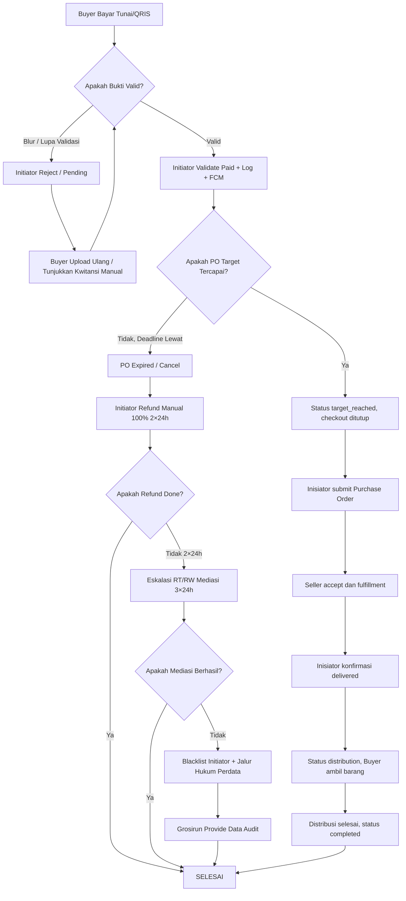

# USER & OPERATIONS MANUAL - Grosirun V3.1

**Tanggal:** 20 Juli 2026
**Versi:** 3.1
**Owner:** Product & Operations
**Review Cycle:** Setiap release
**Global Glossary:** [Indeks Dokumentasi](README.md#glossary-global-indonesiainggris)
**Status Dokumen:** Final
**Status Implementasi:** Belum Dimulai

---

## Daftar Isi

1. Model Peran dan Navigasi
2. Panduan Pembeli dan Inisiator
3. Panduan Penjual
4. Panduan Admin Aplikasi
5. FAQ Pengguna
6. Troubleshooting dan Eskalasi
7. Komplain, Refund, dan Dispute Operations
8. SOP Dispute Terperinci

---

## 1. Model Peran dan Navigasi

Grosirun memiliki empat role: Pembeli, Inisiator, Penjual, dan Admin aplikasi. Pengguna multi-role memilih `active_role` setelah login. Pembeli dan Inisiator bekerja dalam cluster; Penjual bekerja dalam supplier workspace; Admin bekerja dalam console platform.

| Role | Tujuan utama | Data yang dapat diakses |
| --- | --- | --- |
| Pembeli | Bergabung campaign dan mengambil barang | Campaign cluster dan order sendiri |
| Inisiator | Memilih offer, membuat campaign, mengelola PO dan distribusi | Cluster sendiri, offer aktif, PO campaign sendiri |
| Penjual | Produk, offer, keputusan PO, dan fulfillment | Supplier membership sendiri dan data agregat PO |
| Admin | Verifikasi, moderasi, keamanan, dan dispute | Data operasional sesuai kebutuhan, seluruh akses diaudit |

## 2. Panduan Pembeli dan Inisiator

### 1. Pendahuluan & Konteks Bisnis

#### 1.1 Selamat Datang di Grosirun!

Grosirun adalah aplikasi patungan belanja sembako khusus warga satu RT. Dengan berpatungan, kita bisa membeli dalam jumlah besar (misal 1 ton beras) sehingga harganya jauh lebih murah.

**Keuntungan untuk Warga:**
| Komponen | Nilai |
|----------|-------|
| Harga grosir untuk warga | **Rp12.000/Kg** |
| Harga eceran di warung | **Rp14.000/Kg** |
| **Hemat** | **Rp2.000/Kg (14%)** |

Jika satu keluarga membeli 20 Kg, hemat **Rp40.000** dalam sekali belanja. Jika sebulan dua kali, hemat **Rp80.000/bulan**!

**Keuntungan untuk Pak Agus (Initiator):**
| Komponen | Nilai |
|----------|-------|
| Margin bruto per PO | Rp1.050.000 |
| Platform fee + PPN | Rp93.240 |
| **Laba bersih per PO** | **Rp956.760** |

#### 1.2 Yang Perlu Diingat

- Grosirun **bukan toko online** dan **bukan bank**
- Uang pembayaran (tunai/QRIS) **langsung ke rekening pribadi Pak Agus**, bukan ke Grosirun
- Jika ada masalah, **refund manual 2×24 jam** oleh Pak Agus
- Jika tidak selesai, **eskalasi ke RT/RW**

---

### 2. Untuk Pak Agus (Initiator) - Ketua RT03 Permata Hijau

#### 2.1 A. Install APK (5 menit)

1. Buka WA grup RT03, klik link unduhan APK:

   - Firebase App Distribution: `https://appdistribution.firebase.google.com/...`
   - Atau Google Drive: `https://drive.google.com/.../app-arm64-v8a-release.apk`

2. Download file APK pilot. Ukuran aktual belum diukur; target APK arm64 adalah **<10 MB**.

3. Jika HP memperingatkan "File mungkin berbahaya", tap **Tetap Download**.

4. Setelah selesai, tap file APK → HP akan tanya "Install dari sumber tidak dikenal?" → tap **Izinkan** → tap **Install**.

5. Buka aplikasi Grosirun (logo hijau).

6. Izinkan notifikasi: tap **Izinkan** (penting untuk menerima notifikasi pesanan baru).

> **Jika HP tidak bisa install:** Pastikan Android versi 7.0 ke atas. Cek di Pengaturan → Tentang Ponsel → Versi Android. Jika masih Android 6, gunakan HP anak atau keluarga.

---

#### 2.2 B. Login OTP + Consent UU PDP + ToS Non-Escrow (3 menit)

1. Buka aplikasi Grosirun.

2. Masukkan nomor WA Anda (contoh: **081234567890** - pakai 08, bukan +62).

3. Centang checkbox **"Saya setuju data WA disimpan untuk PO RT sesuai UU PDP No.27/2022"**. Tap link **Kebijakan Privasi** untuk membaca sekilas.

4. Tap **Kirim OTP**.

5. Tunggu WA atau SMS masuk berisi **4 digit kode OTP** (contoh: `1234`).

   - Jika pilot lokal (uji coba), cek grup WA developer: OTP ada di log.

6. Masukkan 4 digit kode → tap **Verifikasi**.

7. Muncul layar **Syarat Layanan Non-Escrow**:

   - Scroll baca: "Grosirun hanya catat status, dana langsung ke Initiator, bukan penjamin, refund manual 2×24 jam"
   - Centang **"Saya mengerti dan setuju"**
   - Tap **Setuju Lanjut**

8. Masukkan nama lengkap: **Pak Agus Setiawan**.

9. Masuk Beranda, lihat chip cluster **PGH-RT03 Permata Hijau RT03**.

> **Jika OTP tidak masuk:**
>
> - Tunggu 60 detik, tap **Kirim Ulang**
> - Cek sinyal 4G
> - Jika masih tidak, hubungi grup darurat developer, minta kode test `1234` (khusus pilot lokal)
> - Jika produksi, pastikan WA Gateway Fonnte aktif (cek dashboard Fonnte)

---

#### 2.3 C. Pilih Penawaran dan Buat Campaign (3 menit)

1. Di Beranda mode Inisiator, tap **+ Buat PO**.
2. Pada layar **Pilih Penawaran**, filter area cluster lalu pilih offer aktif **Beras Mahkota Premium — CV Makmur Jaya**.
3. Periksa data yang berasal dari Penjual: unit, minimum 500 Kg, kapasitas, tier Rp10.500/Kg untuk target 500–999 Kg, tier Rp10.000/Kg untuk target ≥1.000 Kg, biaya kirim, dan masa berlaku.
4. Isi hanya data campaign yang menjadi kewenangan Inisiator:

| Field | Isian | Aturan |
| --- | --- | --- |
| Target | **1000 Kg** | Tidak melebihi kapasitas offer |
| Harga Pembeli | **Rp12.000/Kg** | Tidak lebih rendah dari harga supplier dan biaya |
| Tenggat | **2 hari dari sekarang** | Minimum 24 jam dan sebelum offer berakhir |
| Lokasi distribusi | **Rumah Pak RT Jl Mawar 12** | Wajib untuk fulfillment |

5. Aplikasi menampilkan ringkasan snapshot: `supplier_unit_price` Rp10.000, `buyer_unit_price` Rp12.000, target 1.000 Kg, supplier, tier, biaya kirim, dan versi offer.
6. Tap **Publikasikan PO**. Server mengunci offer, mereservasi kapasitas, menyimpan `offer_snapshot`, lalu mengaktifkan campaign secara atomik.
7. Campaign muncul di Beranda seluruh warga PGH-RT03. Perubahan harga offer setelah langkah ini tidak mengubah campaign.

---

#### 2.4 D. Share ke WA Grup RT (1 menit)

1. Buka detail PO Beras yang baru dibuat.

2. Tap tombol **Bagikan ke WA** (hijau).

3. WA terbuka dengan teks otomatis:

   > "Yuk patungan Beras Mahkota Premium! Harga cuma Rp12.000/Kg. Klik link: grosirun://campaign/beras-mahkota-premium-abc123"

4. Pilih grup **RT03** → tap **Kirim**.

5. Warga klik link → langsung buka detail PO di aplikasi (deep link).

---

#### 2.5 E. Validasi Pembayaran Tunai & QRIS (Setiap hari cek 10 menit)

1. Buka aplikasi → tap **Dashboard Admin** (bottom nav Admin).

2. Ada 3 Tab:

| Tab                   | Isi                                      |
| --------------------- | ---------------------------------------- |
| **Menunggu Bayar**    | Warga sudah pesan tapi belum bayar tunai |
| **Lunas Tunai**       | Warga sudah bayar tunai & divalidasi     |
| **QRIS Menunggu Cek** | Warga sudah upload bukti transfer QRIS   |

##### Validasi Tunai:

1. Warga Bu Siti datang bayar tunai Rp60.000 fisik.

2. Cari nama **Bu Siti** di tab Menunggu Bayar (pakai search).

3. Tap tombol **Validasi Tunai** (hijau besar, 48dp).

4. Status jadi **Lunas**, progress bar naik 5Kg, Bu Siti dapat notifikasi "Pembayaran Lunas".

##### Validasi QRIS:

1. Buka tab **QRIS Menunggu Cek**.

2. Lihat foto bukti (tap foto zoom, cek nominal Rp60.000 + tanggal transfer).

3. Jika jelas → tap **Validasi**.

4. Jika blur → tap **Tolak** + isi alasan "Foto blur nominal tidak terlihat".
   - Sistem kirim notifikasi ke Bu Siti: "Bukti ditolak, upload ulang"

##### Undo dalam 5 Menit:

Jika salah klik Validasi padahal belum terima uang:

1. Dalam 5 menit: tap **Batalkan Validasi** di list Lunas.
2. Jika lewat 5 menit: gunakan **Validasi Paksa Override** + isi alasan "Salah klik, sudah cek mutasi BCA jam 10:05"

##### Batch Validate (V3.1):

Centang checkbox 5 pesanan sekaligus → tap **Validasi 5 Terpilih** → validasi massal dengan dialog partial success.

> **Penting Sebelum Distribusi:** Pastikan tab Menunggu Bayar kosong (semua sudah validasi atau batal). Jika masih ada pending, validasi dulu atau hubungi warga.

---

#### 2.6 F. Perpanjangan Tenggat & Batal PO Jika Gagal Target

**H-1 Deadline:**

- Sistem otomatis kirim notifikasi: "PO Hampir Gagal! Beras Mahkota baru 60%, sisa 24 jam"

**Jika progres 60% di jam terakhir:**

1. Buka detail PO → tap **Perpanjang +24 Jam** (maksimal 2 kali).
2. Warga dapat notifikasi: "Tenggat diperpanjang 24 jam"

**Jika setelah perpanjang tetap gagal:**

1. Tap **Batalkan PO** → konfirmasi.
2. Status menjadi **Expired**, semua pending jadi cancelled.
3. Notifikasi ke semua buyer: "PO Beras Mahkota dibatalkan, refund 2×24 jam hubungi Initiator"
4. **Wajib refund manual tunai 100% dalam 2×24 jam** ke buyer yang sudah paid (lihat list di Rekap).
5. Catat manual kwitansi refund.

> **Detail SOP Refund:** Lihat **[User Guide §7–8](USER_GUIDE.md#7-komplain-refund-dan-dispute-operations)**

---

#### 2.7 G. Buat Purchase Order untuk Penjual

1. Setelah target dan payment threshold tercapai, buka campaign lalu tap **Buat Purchase Order**.
2. Periksa snapshot supplier, item agregat, `supplier_unit_price`, `supplier_subtotal`, `delivery_cost`, dan total. Daftar nama serta bukti pembayaran Pembeli tidak dikirim kepada Seller.
3. Tap **Kirim PO**. Status berubah `draft → submitted` dan Seller menerima notifikasi di workspace supplier.
4. Seller menerima atau menolak maksimal 12 jam. Jika diterima, status menjadi `accepted → awaiting_payment`; jika ditolak, alasan tampil kepada Inisiator untuk proses penggantian offer atau pembatalan/refund.
5. Setelah transfer ke supplier, Inisiator mengunggah bukti pembayaran khusus PO. Bukti ini berbeda dari bukti pembayaran Pembeli.
6. Seller mengonfirmasi pembayaran, memproses barang, mengunggah invoice dan surat jalan, lalu mengubah status `paid → processing → shipped`.
7. WA atau email hanya kanal notifikasi tambahan; purchase order, keputusan, dokumen, dan status di aplikasi adalah sumber kebenaran.

---

#### 2.8 H. Checklist Distribusi Saat Truk Tiba

1. Truk beras datang, buka **Distribusi** (di detail PO Completed).

2. Lihat list 120 buyer paid + search + progress `0/120` sudah diambil.

3. Warga datang ambil:

   - Cari nama **Bu Siti** → tap **Centang Sudah Ambil**
   - Sistem catat: `is_taken = true`, `taken_at = now`, `taken_by = initiator id`

4. Jika warga ambil via tetangga: tetap centang nama yang ambil, catat manual di buku.

5. Setelah semua 120 dicentang → tap **Selesai Distribusi**.

   - `distribution_completed_at` tercatat, sesi ditutup.

6. Jika ada klaim "Saya belum ambil tapi sudah dicentang":
   - Ada audit log `taken_by` + timestamp → anti klaim hilang.

**Selesai 1 siklus PO!** Ulangi buat PO baru untuk beras, gula, atau minyak.

---

### 3. Untuk Bu Siti (Buyer) - Ibu-Ibu RT (Langkah Simpel 2 Menit)

#### 3.1 A. Install APK

1. Sama seperti Pak Agus: download APK pilot dari link WA grup RT.
2. Install, izinkan notifikasi.

#### 3.2 B. Login OTP

1. Masukkan nomor WA (08...), centang **Setuju Privasi UU PDP**.
2. Kirim OTP, masukkan 4 digit.
3. Centang **Setuju Syarat Non-Escrow**.
4. Masukkan nama **Bu Siti Rahayu**.

#### 3.3 C. Lihat PO

1. Beranda ada Card besar foto beras.
2. Progress: "Terkumpul 750/1000 Kg", sisa waktu.
3. Tap Card untuk lihat detail.

#### 3.4 D. Ikut Patungan

1. Lihat detail: foto besar, progress truck, ticker "Bu Nengsih baru pesan 5Kg 2 menit lalu".
2. Pilih varian:
   - Tap **+** atau **-** untuk atur jumlah.
   - Contoh: Varian 5Kg tap + jadi 1, total Rp60.000 otomatis.
   - **Tidak bisa ketik angka manual!** Hanya tombol + dan - (mencegah salah input).

#### 3.5 E. Pilih Pembayaran

**Tunai:**

1. Pilih Tunai → Pesan → status **Menunggu Bayar**.
2. Datang ke rumah Pak RT bayar tunai Rp60.000.
3. Tunggu Pak RT validasi di app → dapat notif Lunas.

**QRIS:**

1. Pilih QRIS → lihat QR Code Pak RT.
2. Scan via mBanking transfer Rp60.000.
3. Screenshot bukti → tap **Upload Bukti** (pilih dari galeri, otomatis kompres 70%).
4. Status **Menunggu Validasi QRIS**.
5. Tunggu Pak RT cek & validasi → dapat notif Lunas atau Ditolak (jika blur).

#### 3.6 F. Jika Salah Pilih Varian

- Selama PO masih buka (belum 100%):
  1. Buka **Pesanan Saya** → tap pesanan.
  2. Tap **Batalkan Partisipasi** → pesan ulang varian benar.
- Jika PO sudah terkunci 100%: tidak bisa batal, hubungi Pak RT untuk transfer pesanan ke tetangga.

#### 3.7 G. Jika Bukti Ditolak Blur

1. Dapat notif: "Bukti ditolak: Foto blur".
2. Buka **Pesanan Saya** → Upload ulang foto jelas.

#### 3.8 H. Share ke Tetangga

1. Di detail PO tap **Bagikan ke WA**.
2. Share ke grup arisan → tetangga ikut patungan, target cepat 100%.

#### 3.9 I. Ambil Barang

1. Saat truk tiba, dapat notif WA dari Pak RT: "Barang datang ambil di rumah RT".
2. Datang, ambil 5Kg, Pak RT centang di app checklist Anda sudah ambil.

#### 3.10 J. Selesai Hemat!

**Hemat Rp12.000/Kg vs eceran Rp14.000/Kg = Rp2.000/Kg (14%)!**

---

### 4. FAQ Singkat Pilot

| Pertanyaan                                  | Jawaban                                                                                                          |
| ------------------------------------------- | ---------------------------------------------------------------------------------------------------------------- |
| **OTP tidak masuk?**                        | Tunggu 60s tap Kirim Ulang, cek sinyal. Pilot lokal: minta kode test 1234 di grup dev.                           |
| **Beda Tunai vs QRIS?**                     | Tunai: bayar fisik ke Pak RT. QRIS: transfer ke rekening pribadi Pak RT + upload bukti.                          |
| **Tidak punya HP Android?**                 | Pak RT bisa catatkan pesanan manual via fitur "Atas Nama Warga".                                                 |
| **APK tidak bisa install?**                 | Android minimal 7.0. Cek Pengaturan → Tentang Ponsel → Versi Android. Izinkan Install dari sumber tidak dikenal. |
| **Kuota varian habis?**                     | Tombol + dan - jadi abu-abu. Pilih varian lain atau tunggu PO baru.                                              |
| **Sudah bayar tapi status masih Menunggu?** | Hubungi Pak RT, mungkin lupa validasi. Tunjukkan kwitansi manual.                                                |

> **FAQ Lengkap (20 pertanyaan):** Lihat **[USER_GUIDE.md](USER_GUIDE.md)**

---

### 5. Troubleshooting Ibu-Ibu (Bahasa Simpel)

| Masalah                                  | Solusi Simpel                                                                                                    |
| ---------------------------------------- | ---------------------------------------------------------------------------------------------------------------- |
| **Aplikasi crash HP tua RAM 2GB**        | Update APK terbaru via link Firebase. Clear cache aplikasi di Pengaturan → Restart HP.                           |
| **Gambar tidak muncul**                  | Cek sinyal 4G. Tarik ke bawah untuk refresh. Jika masih tidak muncul, cek banner kuning "Kamu offline".          |
| **Upload bukti gagal ukuran kegedean**   | Aplikasi otomatis kompres 70%. Jika masih >2MB, pilih foto lain atau screenshot ulang lebih kecil. Maksimal 2MB. |
| **Tombol tidak bisa ditekan**            | Tombol abu-abu? Kuota habis, pilih varian lain. Tombol hijau tapi tidak respon? Tutup aplikasi, buka lagi.       |
| **Tidak dapat notifikasi pesanan lunas** | Cek Pengaturan HP → Aplikasi → Grosirun → Notifikasi → Izinkan. Cek internet on.                                 |
| **Lupa bayar padahal sudah pesan**       | Buka Pesanan Saya → ada list Menunggu Bayar. Datang ke Pak RT bayar.                                             |

---

### 6. Kontak Darurat Pilot

| Keperluan                            | Kontak                                                                          |
| ------------------------------------ | ------------------------------------------------------------------------------- |
| **Developer Backend**                | backend@grosirun.id (jam kerja 09-17 WIB)                                       |
| **Developer Mobile**                 | mobile@grosirun.id                                                              |
| **Grup WA Darurat Pilot RT03**       | [Link Grup WA]                                                                  |
| **Pelaporan Bug**                    | Buat Issue di GitHub atau WA ke Dev dengan: screenshot + langkah + HP type      |
| **Jika aplikasi error total >1 jam** | Pak RT pakai fallback manual Excel/Google Form sementara (file di Google Drive) |

#### SOP Darurat

Jika API Down / 5xx:

1. Aplikasi tampil: "Koneksi terputus, coba lagi".
2. Data pesanan terakhir masih ada di cache offline Hive.
3. Pending order disimpan lokal → akan sync saat online.
4. Pak RT Excel manual sementara.

---

**Selamat Pilot! Semangat gotong royong hemat 15-20%!** 🎉🙌

---

_Cetak panduan ini 1 lembar A4 untuk Pak Agus._

_Versi Pilot 1 RT Permata Hijau RT03, 20 Juli 2026._

## 3. Panduan Penjual

### 3.1 Registrasi dan Verifikasi Supplier

1. Login menggunakan OTP dan pilih mode **Penjual**.
2. Buat profil supplier berisi identitas usaha, alamat, area, dan kontak bisnis.
3. Kirim verifikasi. Selama `pending_verification`, Seller belum dapat memublikasikan offer.
4. Admin memilih `approved` atau `rejected`; penolakan selalu memuat alasan.
5. Owner dapat mengundang anggota sebagai `owner`, `sales`, atau `warehouse`.

### 3.2 Produk, Variant, dan Offer

1. Buat produk dengan `base_unit`: `kg`, `liter`, `piece`, `pack`, atau unit terkontrol lain.
2. Buat packaging variant, misalnya 5 kg/sak dan 10 kg/sak. `package_quantity` selalu dinyatakan dalam base unit.
3. Buat offer: minimum quantity, kapasitas base unit, tier harga supplier per base unit, area, biaya kirim, dan masa berlaku.
4. Submit untuk moderasi. Hanya offer `active` terlihat oleh Inisiator.
5. Offer yang digunakan campaign boleh diperbarui sebagai versi baru; snapshot campaign lama tidak berubah.

### 3.3 Purchase Order dan Fulfillment

1. Buka PO `submitted` dan respons maksimal 12 jam.
2. Accept mengubah status atomik ke `awaiting_payment`; reject wajib alasan.
3. Konfirmasi pembayaran Inisiator untuk masuk `paid`.
4. Ubah `paid → processing → shipped`, unggah invoice dan surat jalan.
5. Warehouse hanya boleh menjalankan fulfillment, bukan harga atau keputusan komersial.
6. Seller tidak boleh meminta nama, nomor WA, atau bukti pembayaran Pembeli.

## 4. Panduan Admin Aplikasi

### 4.1 Verifikasi dan Moderasi

- Verifikasi supplier berdasarkan dokumen dan catat alasan keputusan.
- Moderasi product/offer untuk unit, tier, kapasitas, area, masa berlaku, dan konten.
- Kelola grant/revoke role; tindakan tidak boleh menghapus owner terakhir supplier.
- Suspend user/supplier hanya dengan alasan, re-authentication, dan audit log.

### 4.2 Operasional dan Dispute

- Pantau SLA seller response, shipment, discrepancy, security alert, dan queue.
- Mediasi fulfillment dispute menggunakan PO, invoice, surat jalan, foto penerimaan, dan status log.
- Emergency override memerlukan alasan, tiket insiden, re-authentication, dan notifikasi pihak terdampak.
- Admin tidak boleh mengubah nominal atau status transaksi tanpa jejak audit append-only.

## 5. FAQ Pengguna

### Pengantar untuk Warga

Selamat datang di Grosirun! Aplikasi ini dibuat untuk membantu warga RT berpatungan membeli sembako agar mendapatkan harga lebih murah. **Dokumen ini menjelaskan jawaban atas pertanyaan yang paling sering ditanyakan.** Jika Bapak/Ibu masih bingung, hubungi Ketua RT (Pak Agus) atau tim pengembang di kontak darurat yang tersedia di bagian bawah.

> **Catatan Penting:** Berdasarkan model bisnis Grosirun, harga yang didapat warga adalah **Rp12.000 per kilogram (Kg)**, sementara harga eceran di warung sekitar **Rp14.000 per Kg**. Jadi, Bapak/Ibu **hemat Rp2.000 setiap Kg** atau sekitar **14%**!

---

### 1. Apa itu Grosirun?

Grosirun adalah aplikasi patungan belanja sembako khusus warga satu RT. Tujuannya supaya kita bisa beli barang dalam jumlah besar (misal 1 ton beras) sehingga harganya lebih murah.

**Yang perlu diingat:** Grosirun **bukan toko online** dan **bukan bank**. Kami hanyalah alat bantu untuk mencatat pesanan dan pembayaran. Uang pembayaran (tunai atau QRIS) **langsung masuk ke rekening pribadi Ketua RT (Initiator)**, bukan ke rekening Grosirun.

---

### 2. Kenapa Harus Patungan?

Karena harga grosir jauh lebih murah. Contohnya:

- Harga eceran di warung: **Rp14.000/Kg**
- Harga patungan Grosirun: **Rp12.000/Kg**
- **Selisih hemat:** **Rp2.000/Kg**

Jika satu keluarga membeli 20 Kg, maka hemat **Rp40.000** dalam sekali belanja. Jika sebulan dua kali, hemat **Rp80.000/bulan**!

---

### 3. Bagaimana Cara Install Aplikasi?

1. Klik tautan unduhan (link APK) yang dibagikan di grup WhatsApp RT.
2. File akan terunduh (ukuran sekitar **7,8 MB** - kecil dan ringan untuk HP).
3. Buka file tersebut, jika HP meminta izin "Instal dari sumber tidak dikenal", pilih **Izinkan**.
4. Klik **Install** dan tunggu sampai selesai.
5. Buka aplikasi, lalu izinkan notifikasi (penting agar dapat info pesanan).

---

### 4. Android Minimal Berapa?

Aplikasi ini bisa berjalan di **Android 7.0 (Nougat)** ke atas. Untuk mengecek versi Android:

1. Buka **Pengaturan** HP.
2. Pilih **Tentang Ponsel**.
3. Lihat **Versi Android**.

> **Contoh:** HP Redmi 4A dengan Android 7 masih bisa digunakan.

---

### 5. iPhone (iOS) Bisa?

**Untuk V1.0 saat ini, Grosirun hanya mendukung Android.** Rencananya versi iOS (TestFlight) akan hadir di V1.1 mendatang.

Jika Bapak/Ibu menggunakan iPhone, silakan minta tolong Ketua RT (Pak Agus) untuk mencatatkan pesanan secara manual melalui fitur "Atas Nama Warga" di aplikasi milik Pak Agus.

---

### 6. Kenapa Kode OTP (Kode Verifikasi) Tidak Masuk?

1. **Tunggu 60 detik**, lalu tekan tombol **Kirim Ulang**.
2. Pastikan sinyal HP Bapak/Ibu stabil (4G/3G).
3. Jika masih tidak masuk, hubungi grup darurat. Untuk masa pilot (uji coba), kode OTP bisa dilihat di log grup pengembang.

> **Catatan:** Kode OTP hanya berlaku **5 menit**. Jika lewat, minta ulang.

---

### 7. OTP (Kode Verifikasi) Kadaluarsa Berapa Lama?

OTP yang dikirim ke WhatsApp atau SMS hanya berlaku **5 menit**. Jika lebih dari 5 menit, kode dianggap hangus dan Bapak/Ibu harus minta kode baru.

---

### 8. Kenapa Harus Centang "Privasi UU PDP" dan "ToS Non-Escrow"?

- **UU PDP:** Ini adalah aturan pemerintah (UU No.27/2022) yang mewajibkan setiap aplikasi meminta izin menyimpan data pribadi (seperti nomor WA dan riwayat transaksi). Data Bapak/Ibu **tidak akan pernah dijual** dan hanya digunakan untuk keperluan patungan RT.
- **ToS Non-Escrow:** Ini adalah pernyataan bahwa Bapak/Ibu sudah paham jika **uang patungan langsung ke rekening Ketua RT**, bukan ke Grosirun. Grosirun hanya mencatat, jadi risiko sengketa dana menjadi tanggung jawab Ketua RT (dengan pengawasan RT/RW).

Wajib centang karena ini bukti bahwa Bapak/Ibu telah memahami aturan main patungan ini.

---

### 9. Apa Beda Bayar Tunai dan QRIS?

| **Tunai**                                                             | **QRIS**                                                                     |
| :-------------------------------------------------------------------- | :--------------------------------------------------------------------------- |
| Pesan di aplikasi, lalu datang ke rumah Pak RT untuk setor uang cash. | Scan kode QR milik pribadi Pak RT melalui mobile banking.                    |
| Pak RT langsung validasi di aplikasi setelah terima uang.             | Bapak/Ibu harus _screenshot_ bukti transfer dan upload di aplikasi.          |
| Status menjadi "Lunas" segera setelah Pak RT klik validasi.           | Status menjadi "Lunas" setelah Pak RT cek mutasi rekening dan klik validasi. |

_(Dana tetap langsung ke Pak RT, bukan ke aplikasi)_

---

### 10. Apakah Aman Transfer QRIS ke Pak RT (Bukan ke Grosirun)?

**Aman.** Karena Ketua RT adalah orang terpercaya yang dipilih oleh warga. Sistem Grosirun justru **tidak memegang uang** sama sekali, sehingga tidak perlu izin dari Otoritas Jasa Keuangan (OJK) atau Bank Indonesia (BI) untuk urusan "menampung dana".

Jika terjadi masalah, warga bisa meminta **refund (pengembalian uang) manual dalam waktu 2x24 jam** dan jika tidak selesai, bisa di-eskalasi ke Ketua RW sesuai SOP sengketa yang sudah ditentukan.

---

### 11. Bagaimana Jika Salah Pilih Varian (Misal Mau 10Kg tapi Klik 5Kg)?

- Selama PO (pesanan bersama) **masih buka** (target belum 100% dan deadline belum lewat):

  1. Buka menu **Pesanan Saya**.
  2. Pilih pesanan yang salah, lalu klik **Batalkan Partisipasi**.
  3. Pesan ulang dengan varian yang benar.

- Jika PO sudah mencapai **100% (terkunci)**, Bapak/Ibu tidak bisa membatalkan sendiri. Silakan hubungi Pak RT untuk memindahkan pesanan ke tetangga lain (fitur Transfer Pesanan).

---

### 12. Bagaimana Jika Stok Varian Habis, Tombol "+" Tidak Bisa Dipencet?

Jika tombol "+" berwarna abu-abu, artinya kuota varian tersebut sudah habis (sisa 0). Solusinya:

1. Pilih ukuran varian lain yang masih tersedia (misal 10 Kg).
2. Atau tunggu pembukaan PO (pesanan bersama) berikutnya.

---

### 13. Upload Bukti QRIS Gagal Karena Ukuran File Kegedean?

- Maksimal ukuran file bukti adalah **2 MB** (format JPG atau PNG).
- Aplikasi sudah otomatis mengecilkan (kompres) foto hingga 70%.
- Jika masih terlalu besar, coba potong (crop) foto atau screenshot ulang agar tidak terlalu lebar.
- Jika Bapak/Ibu sedang offline (tidak ada sinyal), bukti akan disimpan sementara dan otomatis terunggah saat sinyal kembali.

---

### 14. Bukti QRIS Saya Ditolak dengan Alasan "Blur" (Kabur)?

Bapak/Ibu akan mendapat notifikasi "Bukti ditolak: Foto blur". Artinya Pak RT tidak bisa melihat nominal transfer dengan jelas.
**Langkah selanjutnya:**

1. Buka menu **Pesanan Saya**.
2. Klik pesanan tersebut, lalu pilih **Upload Ulang**.
3. Pastikan foto yang diunggah jelas, terang, dan angka nominalnya terlihat.

---

### 15. Saya Sudah Bayar, tapi Status Masih "Menunggu Bayar"?

Ini biasanya karena Pak RT belum sempat menekan tombol **Validasi** di aplikasinya.

**Yang harus dilakukan:**

1. Hubungi Pak RT via WhatsApp.
2. Tunjukkan bukti fisik (kwitansi tunai) atau screenshot mutasi QRIS.
3. Minta Pak RT untuk segera mem-validasi atau jika lupa, Pak RT bisa menggunakan fitur _Override_ (validasi paksa) dengan menulis catatan.

---

### 16. Bagaimana Cara Ambil Barang Saat Truk Tiba?

1. Pak RT akan mengirim notifikasi WA ke grup: _"Barang datang, ambil di rumah RT"_.
2. Bapak/Ibu datang membawa karung sendiri.
3. Pak RT akan mencocokkan nama dan menandai (centang) di aplikasi bahwa Bapak/Ibu sudah mengambil barang.
4. Sistem mencatat waktu dan siapa yang menandai, sehingga tidak ada klaim hilang.

---

### 17. Bagaimana Jika Tidak Bisa Ambil Barang Sendiri?

Bapak/Ibu bisa menitipkan pengambilan ke tetangga atau keluarga.

- Infokan ke Pak RT nama pengganti yang akan mengambil.
- Pak RT akan mencatatnya secara manual di buku, lalu menandai "Sudah Diambil" di aplikasi atas nama Bapak/Ibu yang asli.

---

### 18. Data Saya Disimpan Berapa Lama? Apakah Dijual?

**Data Bapak/Ibu TIDAK PERNAH DIJUAL.** Semua data hanya untuk keperluan administrasi PO RT.

- **Riwayat transaksi** disimpan untuk audit (pemeriksaan) jika terjadi sengketa.
- **Bukti QRIS** dihapus otomatis setelah **90 hari** sejak PO selesai (sesuai aturan UU PDP).
- Bapak/Ibu berhak **hapus akun** kapan saja melalui menu Profil → Hapus Akun. Data akan dianonimkan (nama jadi "Deleted User", WA dihapus) dalam waktu kurang dari 24 jam.

---

### 19. Link Bukti (S3) Kadaluarsa 1 Jam?

Ya, link untuk melihat bukti QRIS hanya berlaku **1 jam** demi alasan keamanan (agar tidak sembarangan diakses orang lain).
Jika link sudah kadaluarsa, buka halaman detail pesanan dan tekan tombol **"Generate Ulang Link"** untuk mendapatkan tautan baru yang berlaku 1 jam.

---

### 20. Aplikasi Offline (Tidak Ada Internet) Bisa Dipakai?

**Bisa sebagian:**

- **Melihat data lama:** Bapak/Ibu masih bisa melihat daftar PO terakhir yang tersimpan di cache HP (ada banner kuning bertuliskan "Kamu offline").
- **Pemesanan offline:** Jika mencoba pesan saat offline, pesanan disimpan sementara di HP dan akan otomatis terkirim (sync) saat internet kembali.
- **Notifikasi:** Jika FCM (push notifikasi) sedang bermasalah, aplikasi akan otomatis memeriksa notifikasi baru setiap 60 detik (polling).

> Jika API (server) Grosirun bermasalah lebih dari 1 jam, Pak RT akan menggunakan Excel manual sebagai cadangan sementara.

---

### Kontak Darurat & Bantuan

| Keperluan              | Kontak                                                     |
| :--------------------- | :--------------------------------------------------------- |
| Grup WA Pilot RT03     | [Tautan Grup WA]                                           |
| Tim Pengembang Backend | backend@grosirun.id                                        |
| Tim Pengembang Mobile  | mobile@grosirun.id                                         |
| Laporkan Bug/Error     | Screenshot + kirim ke WA grup atau email ke tim pengembang |

---

**Selamat berpatungan dan hemat!** 🎉🙌

## 6. Troubleshooting dan Eskalasi
7. Komplain, Refund, dan Dispute Operations
8. SOP Dispute Terperinci

| Masalah | Pemilik awal | Eskalasi |
| --- | --- | --- |
| OTP/login | Pengguna | Support/Admin |
| Pembayaran buyer | Inisiator | RT/RW lalu dispute support |
| Offer atau supplier | Seller | Admin moderasi |
| PO tidak direspons | Inisiator | Reminder 6 jam, Admin setelah 12 jam |
| Barang terlambat/tidak sesuai | Inisiator & Seller | Fulfillment dispute/Admin |
| Dugaan akses data buyer | Security/Admin | Suspend session dan incident response |

Gunakan ID campaign, order, offer, atau purchase order ketika eskalasi. Jangan mengirim OTP, token, tax ID, atau temporary URL melalui chat.

## 7. Komplain, Refund, dan Dispute Operations

Manual ini menjadi sumber operasional untuk komplain pembayaran Buyer, refund non-escrow, Seller fulfillment dispute, evidence, SLA, escalation, komunikasi, dan audit. Privacy Policy tetap dokumen legal mandiri.

## 8. SOP Dispute Terperinci

### 1. Pendahuluan & Konteks Bisnis

#### 1.1 Mengapa Dokumen Ini Penting?

Grosirun adalah platform patungan berbasis gotong royong. Berdasarkan **[BUSINESS_ANALYSIS.md](BUSINESS_ANALYSIS.md)**, model bisnis Grosirun adalah:

| Komponen                      | Nilai                          |
| ----------------------------- | ------------------------------ |
| Platform Fee                  | 1% GMV + PPN 11%               |
| GMV per PO AT_70              | Rp8.400.000 (700Kg × Rp12.000) |
| Laba Initiator per PO         | Rp956.760                      |
| Margin Initiator Bruto per PO | Rp1.050.000                    |

**Konsekuensi Non-Escrow:**

- Grosirun **tidak pernah memegang dana** buyer
- Dana tunai/QRIS langsung ke rekening pribadi Initiator
- Risiko sengketa dana adalah **tanggung jawab Initiator**

**Tujuan SOP Ini:**

1. Melindungi hak buyer dan initiator
2. Memberikan prosedur jelas untuk refund manual
3. Menyediakan jalur eskalasi RT/RW
4. Menjamin transparansi dengan audit log

#### 1.2 Prinsip Dasar

| Prinsip               | Keterangan                                          |
| --------------------- | --------------------------------------------------- |
| **Non-Escrow**        | Grosirun tidak memegang dana, hanya mencatat status |
| **Transparansi**      | Semua aksi tercatat di `transaction_logs`           |
| **Akuntabilitas**     | Initiator bertanggung jawab atas refund manual      |
| **Eskalasi Bertahap** | Buyer ↔ Initiator → RT → RW → Hukum                 |
| **Bukti Digital**     | S3 proof tempUrl 1h, audit log, recap PDF           |

---

### 2. Filosofi Non-Escrow & ToS Consent

#### 2.1 Alur Dana Non-Escrow

```
┌─────────────────────────────────────────────────────────────────────────────┐
│                         ALUR DANA NON-ESCROW                               │
├─────────────────────────────────────────────────────────────────────────────┤
│                                                                             │
│  Buyer Bu Siti                                                              │
│       │                                                                     │
│       ▼                                                                     │
│  Bayar Rp240.000 (Tunai/QRIS pribadi Pak Agus)                            │
│       │                                                                     │
│       ▼                                                                     │
│  Rekening Pribadi Initiator Pak Agus (BCA 1234567890)                     │
│       │                                                                     │
│       ├─── Rp7.350.000 → Supplier CV Makmur Jaya (BCA 9876543210)        │
│       │                                                                     │
│       ├─── Rp93.240 → PT Grosirun (Platform Fee 1% + PPN 11%)             │
│       │                                                                     │
│       └─── Rp956.760 → Laba Bersih Initiator                              │
│                                                                             │
│  GROSIRUN TIDAK PERNAH PEGANG UANG BUYER                                  │
└─────────────────────────────────────────────────────────────────────────────┘
```

#### 2.2 ToS Consent Screen

**Wajib ditampilkan di Onboarding Flutter (setelah OTP login pertama):**

```
═══════════════════════════════════════════════════════════════
                    SYARAT LAYANAN NON-ESCROW
═══════════════════════════════════════════════════════════════

1. Grosirun adalah alat catat digital gotong royong, BUKAN
   marketplace, BUKAN escrow, BUKAN penjamin dana.

2. Dana tunai / transfer QRIS langsung ke rekening pribadi
   Initiator (Ketua RT), BUKAN ke Grosirun.

3. Jika terjadi sengketa dana:
   - Sudah transfer tapi bukti blur
   - Sudah bayar tunai tapi lupa validasi
   - PO batal karena target gagal

   Maka tanggung jawab pertama Initiator untuk REFUND MANUAL
   100% dalam 2×24 JAM.

4. Jika Initiator tidak kooperatif, eskalasi ke Ketua RT/RW
   untuk mediasi.

5. Grosirun menyediakan data audit untuk mediasi:
   - transaction_logs (riwayat aksi)
   - orders paid (daftar pembayaran)
   - S3 proof tempUrl 1h (bukti QRIS)
   - Recap PDF (rekap transaksi)

   Grosirun BUKAN penjamin dana.

6. Dengan mencentang "Saya mengerti dan setuju", Anda
   menyatakan telah memahami dan menyetujui sistem
   non-escrow ini.

☐ Saya mengerti dan setuju dengan Syarat Layanan Non-Escrow

                    [ SETUJU LANJUT ]
═══════════════════════════════════════════════════════════════
```

**API Call:** `POST /auth/tos-accept` → `users.tos_accepted_at` tercatat

**Jika tidak setuju:** Aplikasi logout, tidak bisa melanjutkan.

---

### 3. Tanggung Jawab Pihak

#### 3.1 Matriks Tanggung Jawab

| Pihak               | Tanggung Jawab                                 | Batas Waktu            | Konsekuensi Jika Gagal            |
| ------------------- | ---------------------------------------------- | ---------------------- | --------------------------------- |
| **Buyer**           | Bayar tunai tepat waktu sebelum deadline PO    | Sebelum deadline PO    | Order dibatalkan otomatis         |
|                     | Upload bukti QRIS jelas (nominal terlihat)     | Saat upload            | Bukti ditolak, harus upload ulang |
|                     | Simpan kwitansi manual tunai (jika ada)        | -                      | Sulit buktikan pembayaran         |
| **Initiator**       | Validasi pembayaran tunai setelah terima fisik | 2×24 jam               | Buyer komplain, eskalasi          |
|                     | Cek mutasi QRIS, validasi/reject bukti         | 2×24 jam               | Order pending, reputasi turun     |
|                     | Override dengan notes jika mutasi ada          | 2×24 jam               | Audit log untuk mediasi           |
|                     | Refund manual 100% jika PO batal               | 2×24 jam setelah batal | Eskalasi RW, blacklist            |
|                     | Checklist distribusi is_taken                  | Saat distribusi        | Buyer tidak bisa ambil barang     |
| **Grosirun System** | Catat status ACID lockForUpdate zero oversell  | Real-time <500ms       | Oversell error 409                |
|                     | Audit logs transaction_logs                    | Real-time              | Tidak ada bukti mediasi           |
|                     | S3 proof private tempUrl 1h lifecycle 90d      | Real-time              | Bukti hilang, mediasi sulit       |
|                     | FCM + fallback notifications                   | Real-time              | Buyer tidak tahu status           |
|                     | Recap PDF akurat                               | <3s                    | Data rekap salah                  |
| **Ketua RT/RW**     | Mediasi jika buyer & initiator deadlock        | 3×24 jam               | Kasus naik ke RW                  |
|                     | Saksi transaksi                                | Saat mediasi           | Sulit memutuskan                  |
|                     | Blacklist initiator jika kabur                 | Setelah mediasi gagal  | Initiator tidak bisa buat PO lagi |

#### 3.2 Referensi Unit Economics ([BUSINESS_ANALYSIS.md](BUSINESS_ANALYSIS.md))

| Komponen                      | Nilai         | Keterangan                            |
| ----------------------------- | ------------- | ------------------------------------- |
| Margin Bruto Initiator per PO | Rp1.050.000   | 700Kg × Rp1.500                       |
| Platform Fee Tagih            | Rp93.240      | 1% + PPN 11%                          |
| **Laba Bersih Initiator**     | **Rp956.760** | **Dana yang harus siap untuk refund** |

**Initiator harus menyisihkan dana untuk potensi refund** dari laba bersih Rp956.760 per PO.

---

### 4. Skenario Sengketa & SOP Timeline

#### 4.1 Skenario 1: QRIS Transfer Bukti Blur

**Kasus:** Buyer transfer QRIS Rp60.000, upload screenshot blur (nominal tidak terlihat). Initiator menolak bukti.

| Langkah     | Actor         | Action                                                                                                 | Timeline | Bukti                                                                              |
| ----------- | ------------- | ------------------------------------------------------------------------------------------------------ | -------- | ---------------------------------------------------------------------------------- |
| 1           | **Buyer**     | Transfer QRIS Rp60.000 jam 10:00                                                                       | -        | Screenshot blur di S3 `order_proofs/{uuid}.jpg`                                    |
| 2           | **Initiator** | Dashboard Tab QRIS Waiting → lihat proof blur → tap REJECT + reason "Foto blur nominal tidak terlihat" | <24 jam  | PATCH reject + `transaction_logs` type `rejection` + reason + FCM + fallback notif |
| 3           | **System**    | FCM + fallback notifications: "Bukti ditolak: Foto blur..."                                            | Instant  | `notifications` table                                                              |
| 4           | **Buyer**     | Upload ulang bukti jelas jam 11:00                                                                     | -        | Proof baru S3                                                                      |
| 5           | **Initiator** | Validate QRIS → paid + log validation + FCM lunas                                                      | <24 jam  | `transaction_logs` type `validation`                                               |
| **Selesai** | -             | Order paid, current_quantity++                                                                               | -        | -                                                                                  |

**Alternatif jika buyer tidak upload ulang:**

Initiator bisa **override validate** dengan notes:

> "Sudah cek mutasi BCA 60.000 jam 10:05, bukti blur tapi mutasi ada."

→ `transaction_logs` type `override` + notes tercatat.

**Timeline Refund (jika sengketa):** 2×24 jam.

---

#### 4.2 Skenario 2: Tunai Lupa Validasi, PO Selesai

**Kasus:** Buyer bayar tunai Rp60.000 jam 09:00, Initiator lupa tap Validasi. PO mencapai 100% jam 12:00 dan completed. Buyer status masih pending, tidak bisa ambil barang.

**SOP:**

| Langkah | Actor         | Action                                                                  | Timeline        |
| ------- | ------------- | ----------------------------------------------------------------------- | --------------- |
| 1       | **Buyer**     | Tunjukkan kwitansi manual / saksi                                       | Saat komplain   |
| 2       | **Initiator** | Override validate with notes "Lupa validasi, buyer ada kwitansi manual" | 2×24 jam        |
| 3       | **System**    | Status paid, order masuk distribusi (tambahan manual)                   | Instant         |
| 4       | **Initiator** | Buyer ambil barang, is_taken true                                       | Saat distribusi |

**Penting:**

- Sebelum `POST /campaigns/{id}/complete-distribution`, initiator **harus** memastikan tidak ada pending left (dashboard pending tab kosong)
- Jika masih ada pending → validasi atau cancel/refund manual

**Peringatan di App:**

```
⚠️ PERHATIAN
Masih ada 3 order pending yang belum divalidasi!
Selesaikan validasi sebelum menyelesaikan distribusi.
```

---

#### 4.3 Skenario 3: PO Gagal Target, Buyer Sudah Paid

**Kasus:** PO Beras Mahkota target 1000Kg, hanya terkumpul 600Kg (60%). Deadline lewat, PO expired. 35 buyer sudah paid total Rp8.400.000. Ini adalah uang yang sudah masuk ke rekening Initiator.

**SOP Timeline 2×24 Jam:**

| Langkah | Actor                 | Action                                                                       | Timeline  | Keterangan                                       |
| ------- | --------------------- | ---------------------------------------------------------------------------- | --------- | ------------------------------------------------ |
| 1       | **System**            | Deadline lewat, status auto expired via `CheckDeadlinesJob`, FCM H-1 warning | H-1       | Notifikasi "PO Hampir Gagal!"                    |
| 2       | **Initiator**         | POST `/campaigns/{id}/cancel` → status expired                               | H+0       | Pending orders cancelled, paid orders tetap paid |
| 3       | **Initiator**         | FCM broadcast: "PO Beras Mahkota dibatalkan, refund 2×24h hubungi Initiator" | H+0       | WA + FCM + fallback                              |
| 4       | **Initiator**         | **Refund manual tunai 100%** ke buyer paid list                              | H+0 - H+2 | Dari rekening pribadi                            |
| 5       | **Buyer**             | Terima refund tunai + tanda terima manual                                    | H+0 - H+2 | Kwitansi manual                                  |
| 6       | **Initiator**         | Catat refund di transaction_logs type `cancel_campaign` notes "Refunded all" | H+2       | Audit log                                        |
| 7       | **Jika tidak refund** | Eskalasi RT/RW mediasi 3×24h                                                 | H+2 - H+5 | Lihat Section 6                                  |

**Refund Amount:**

| Detail                         | Nilai                      |
| ------------------------------ | -------------------------- |
| Total GMV terkumpul            | Rp8.400.000                |
| Supplier cost (sudah dibayar?) | Tergantung kontrak         |
| **Dana yang harus direfund**   | **100% dari buyer paid**   |
| Sumber dana                    | Rekening pribadi Initiator |

**Peringatan di App (saat cancel):**

```
⚠️ PERHATIAN!
Anda akan membatalkan PO Beras Mahkota.
- 35 buyer sudah paid (Rp8.400.000)
- Anda wajib refund 100% dalam 2×24 jam
- Jika tidak, akun Anda akan di-suspend
- List buyer paid: [nama1, nama2, ...]

[ BATALKAN PO ]   [ BATAL ]
```

---

#### 4.4 Skenario 4: Initiator Kabur Bawa Uang Rp10 Juta

**Kasus:** Initiator tidak refund, menghilang setelah menerima Rp8.400.000 dari buyer dan Rp7.350.000 dari supplier (jika sudah transfer). Total dana yang dipegang ~Rp10.000.000.

**Risk & Mitigation:**

| Aspek                     | Detail                                                                                          |
| ------------------------- | ----------------------------------------------------------------------------------------------- |
| **Risiko**                | Non-escrow inherent, Grosirun tidak pegang dana                                                 |
| **Mitigasi Pencegahan**   | Initiator = Ketua RT terpercaya, cluster code invite limited, onboarding pilot Pak Agus trusted |
| **Mitigasi Transparansi** | Audit log transparan, S3 proof, recap PDF, buyer tahu alamat RT                                 |
| **Jika Kabur**            | Buyer lapor Ketua RW + mediasi, Grosirun provide data audit, jalur hukum perdata                |
| **Blacklist**             | `users.blacklisted_at=now()`, tidak bisa buat PO lagi                                           |

**Data yang Diberikan Grosirun untuk Mediasi:**

| Data                         | Format    |
| ---------------------------- | --------- |
| List buyer paid + nominal    | Recap PDF |
| S3 proof images (tempUrl 1h) | URL       |
| transaction_logs audit       | CSV       |
| Rekap total dana             | PDF       |

**Jalur Hukum:** Grosirun **bukan penjamin**, hanya menyediakan data.

**Future V1.1:** Escrow integration via Xendit licensed PJP (opsional).

---

### 5. Bukti yang Dibutuhkan untuk Mediasi

#### 5.1 Data dari Grosirun

| Sumber Data          | Detail                                                                                                                             | Akses                         |
| -------------------- | ---------------------------------------------------------------------------------------------------------------------------------- | ----------------------------- |
| **orders**           | uuid, total_quantity, total_price, payment_method, payment_status, proof_path (S3 tempUrl 1h), is_taken, taken_at, taken_by_initiator_id | Initiator via dashboard       |
| **transaction_logs** | type, notes, ip_address, created_at, initiator_id                                                                                  | Initiator via audit           |
| **campaigns recap**  | Total buyer, total Kg, total revenue, total supplier cost, margin                                                                  | Initiator via recap PDF       |
| **notifications**    | FCM + DB notif broadcast cancel/extend                                                                                             | System log                    |
| **S3 proof images**  | Private tempUrl 1h, lifecycle 90d                                                                                                  | Owner/Initiator via proof-url |
| **users**            | consent_at, tos_accepted_at (legal consent)                                                                                        | Admin only                    |

#### 5.2 Export untuk Mediasi

**1. Recap PDF (Auto dari app):**

```
GET /campaigns/{id}/recap
→ PDF S3 tempUrl 1h
```

**2. Audit Logs CSV (Manual via Artisan):**

```bash
php artisan orders:export-csv --campaign=12 --status=paid
```

**3. Query SQL untuk Mediasi (Manual):**

```sql
SELECT
    o.uuid AS order_uuid,
    u.name AS buyer_name,
    u.phone AS buyer_phone_masked,
    v.package_quantity AS variant_size,
    o.quantity,
    o.total_price,
    o.payment_method,
    o.payment_status,
    o.is_taken,
    o.taken_at,
    tl.type AS log_type,
    tl.notes AS log_notes,
    tl.created_at AS log_created_at,
    i.name AS initiator_name
FROM orders o
JOIN users u ON o.user_id = u.id
JOIN campaign_variants v ON o.campaign_variant_id = v.id
LEFT JOIN transaction_logs tl ON tl.order_id = o.id
JOIN users i ON tl.initiator_id = i.id
WHERE o.campaign_id = 12
  AND o.payment_status = 'paid'
ORDER BY o.created_at;
```

---

### 6. Eskalasi RT/RW

#### 6.1 Level Eskalasi

```
┌─────────────────────────────────────────────────────────────────────────────┐
│                           ESKALASI SENGKETA                                 │
├─────────────────────────────────────────────────────────────────────────────┤
│                                                                             │
│  LEVEL 1: Buyer ↔ Initiator (WA Personal)                                 │
│  ├─ Buyer tunjukkan bukti transfer/mutasi                                  │
│  ├─ Initiator cek mutasi, validasi/refund                                 │
│  └─ Timeline: 2×24 jam                                                    │
│                                                                             │
│         ↓ Jika deadlock                                                    │
│                                                                             │
│  LEVEL 2: Ketua RT sebagai Saksi                                           │
│  ├─ Mediasi offline di rumah RT                                           │
│  ├─ Tunjukkan rekap PDF + audit logs via HP initiator                    │
│  └─ Timeline: 3×24 jam                                                    │
│                                                                             │
│         ↓ Jika initiator tidak kooperatif                                 │
│                                                                             │
│  LEVEL 3: Ketua RW                                                         │
│  ├─ RW panggil initiator                                                   │
│  ├─ Mediasi dengan saksi RW                                               │
│  ├─ Blacklist initiator jika perlu                                        │
│  └─ Timeline: 3×24 jam                                                    │
│                                                                             │
│         ↓ Jika nominal > Rp5.000.000 dan kabur                            │
│                                                                             │
│  LEVEL 4: Jalur Hukum Perdata                                              │
│  ├─ Laporan polisi                                                         │
│  ├─ Grosirun provide data audit untuk penyelidikan                        │
│  └─ Grosirun BUKAN penjamin                                               │
│                                                                             │
└─────────────────────────────────────────────────────────────────────────────┘
```

#### 6.2 Timeline Total

| Level                      | Timeline | Total dari Kejadian |
| -------------------------- | -------- | ------------------- |
| Level 1: Buyer ↔ Initiator | 2×24 jam | 2 hari              |
| Level 2: Ketua RT          | 3×24 jam | 5 hari              |
| Level 3: Ketua RW          | 3×24 jam | 8 hari              |
| Level 4: Hukum             | Variabel | >8 hari             |

**Maksimal eskalasi selesai dalam 7 hari (Level 1-3).**

#### 6.3 Blacklist Initiator

**Trigger:** Tidak refund 2×24 jam setelah PO batal, atau kabur.

**Implementasi:**

```php
// app/Jobs/CheckPlatformFeeOverdueJob.php
if ($overdue > 7 days) {
    $user->update(['blacklisted_at' => now()]);
    // Tidak bisa create campaign, validate
    // Notifikasi buyer: "Initiator RT03 suspend, hubungi RW"
}
```

---

#### 6.4 Sengketa Fulfillment Penjual

Sengketa seller mencakup PO ditolak setelah diterima, keterlambatan, kuantitas atau produk tidak sesuai, dan dokumen invalid. Inisiator membuka dispute dengan foto penerimaan dan surat jalan maksimal 1×24 jam. Seller merespons maksimal 1×24 jam. Admin memediasi berdasarkan status log, invoice, surat jalan, dan bukti penerimaan. Data individual Pembeli tidak dibuka. Refund Pembeli tetap tanggung jawab Inisiator; klaim Inisiator kepada supplier diselesaikan terpisah.

#### 6.5 Reservation dan Refund pada Kegagalan Supplier

Reservation dilepas hanya oleh service dalam transaksi yang mengunci offer dan campaign. Seller rejection atau cancellation sebelum acceptance melepaskan reserved quantity. Setelah acceptance, quantity berstatus committed dan hanya dapat diselesaikan melalui delivered, replacement, atau resolusi dispute Admin.

Jika Buyer sudah membayar, Inisiator tetap mengembalikan dana maksimal 2×24 jam ketika campaign dibatalkan, terlepas dari status klaim kepada Supplier. Status refund per order, reference pembayaran, actor, dan timestamp wajib dicatat. Admin tidak memegang atau menyalurkan dana.

### 7. Flowchart Penyelesaian Sengketa



#### 7.1 Penjelasan Flowchart

| Node  | Keterangan                                              |
| ----- | ------------------------------------------------------- |
| **A** | Buyer melakukan pembayaran (tunai/QRIS)                 |
| **B** | Validasi bukti: QRIS jelas? Tunai sudah terekam di app? |
| **C** | Jika bukti blur → initiator reject, buyer upload ulang  |
| **E** | Jika valid → initiator validate, status paid, FCM notif |
| **F** | Cek apakah PO mencapai target 100%                      |
| **G** | Jika tidak → PO expired/cancel, initiator wajib refund  |
| **H** | Refund manual 100% dari rekening pribadi initiator      |
| **K** | Jika tidak refund 2×24h → eskalasi RT/RW                |
| **O** | Jika target tercapai → recap + distribusi               |
| **P** | Buyer ambil barang, is_taken true                       |

---

### 8. Template WA & Consent Screen

#### 8.1 Template WA Reject Proof Blur

**Otomatis dari API (saat initiator reject):**

> "Halo [Nama Buyer], bukti QRIS PO [Nama PO] [Varian] Rp[Total] foto blur nominal tidak terlihat. Mohon upload ulang bukti jelas di aplikasi Grosirun. Atau jika sudah transfer, hubungi saya via WA pribadi untuk verifikasi mutasi. Terima kasih - [Nama Initiator] RT[No]"

**Manual (jika initiator ingin personalisasi):**

> "Bu Siti, maaf bukti QRIS Beras Mahkota 5Kg Rp60.000 foto blur. Mohon upload ulang foto yang jelas ya. Kalau sudah transfer, bisa screenshot mutasi BCA dan kirim ke WA saya. - Pak Agus RT03"

#### 8.2 Template WA Cancel Refund

**Otomatis dari API (saat initiator cancel campaign):**

> "⚠️ PEMBERITAHUAN PO BATAL
>
> PO [Nama PO] dibatalkan karena target [Target] baru [Current] ([Progress]%).
>
> Bagi yang sudah bayar (paid), silakan ambil refund tunai 100% di rumah [Nama Initiator] dalam 2×24 jam.
>
> List paid:
> [List Nama Buyer + Total]
>
> Jika tidak diambil dalam 2×24 jam, silakan hubungi Ketua RW untuk mediasi.
>
> Terima kasih - [Nama Initiator] RT[No]"

**Manual:**

> "Warga RT03, PO Beras Mahkota dibatalkan karena target 1000Kg baru 600Kg. Bagi yang sudah bayar, refund 100% di rumah Pak Agus 2×24 jam. Daftar: Bu Siti 60k, Pak Joko 115k, Bu Nengsih 60k... Total 8.4jt. Terima kasih."

#### 8.3 Consent Screen (ToS)

**Sudah di Section 2.2.** Ini wajib muncul pertama kali setelah OTP login.

---

### 9. Audit Log untuk Mediasi

#### 9.1 Data yang Tersedia

| Data             | Lokasi                                    | Akses                         |
| ---------------- | ----------------------------------------- | ----------------------------- |
| **Order detail** | `orders` table                            | Initiator di dashboard        |
| **Bukti QRIS**   | S3 `order_proofs/{uuid}.jpg` (tempUrl 1h) | Owner/Initiator via proof-url |
| **Audit trail**  | `transaction_logs` table                  | Initiator di dashboard        |
| **Rekap PO**     | Recap PDF S3                              | Initiator via recap           |
| **Notifikasi**   | `notifications` table                     | User via notification screen  |

#### 9.2 Query untuk Mediasi

**Export CSV untuk mediator:**

```sql
SELECT
    o.uuid AS 'Order ID',
    u.name AS 'Buyer',
    SUBSTRING(u.phone, 1, 4) AS 'Phone (masked)',
    v.package_quantity AS 'Variant (Kg)',
    o.quantity AS 'Qty',
    o.total_price AS 'Total (Rp)',
    o.payment_method AS 'Metode',
    o.payment_status AS 'Status',
    o.is_taken AS 'Sudah Ambil',
    tl.type AS 'Log Type',
    tl.notes AS 'Log Notes',
    tl.created_at AS 'Log Time',
    i.name AS 'Initiator'
FROM orders o
JOIN users u ON o.user_id = u.id
JOIN campaign_variants v ON o.campaign_variant_id = v.id
LEFT JOIN transaction_logs tl ON tl.order_id = o.id
JOIN users i ON tl.initiator_id = i.id
WHERE o.campaign_id = 12
  AND o.payment_status IN ('paid', 'waiting')
ORDER BY o.created_at;
```

**Export via Artisan (future V1.1):**

```bash
php artisan orders:export-csv --campaign=12 --status=paid
```

#### 9.3 S3 Proof Access untuk Mediasi

**Cara mendapatkan proof URL:**

1. Login sebagai Initiator (Pak Agus)
2. Buka detail order
3. Tap "Lihat Bukti"
4. S3 tempUrl 1h di-generate
5. Tunjukkan ke mediator

**Jika buyer/mediator butuh akses:**

```bash
# Via API (authorized)
GET /orders/{uuid}/proof-url
→ {"proof_url": "https://s3...tempUrl..."}
```

---

### 10. Ringkasan & Poin Penting

#### 10.1 Poin Kunci untuk Tim

| #   | Poin               | Keterangan                                         |
| --- | ------------------ | -------------------------------------------------- |
| 1   | **Non-Escrow**     | Grosirun tidak pernah pegang dana buyer            |
| 2   | **Refund 2×24h**   | Initiator wajib refund 100% dalam 2 hari           |
| 3   | **Eskalasi RT/RW** | Jika initiator tidak kooperatif, eskalasi ke RT/RW |
| 4   | **Audit Log**      | Semua aksi tercatat, siap untuk mediasi            |
| 5   | **ToS Consent**    | User wajib setuju non-escrow sebelum pakai app     |
| 6   | **Blacklist**      | Initiator nakal di-blacklist, tidak bisa buat PO   |
| 7   | **S3 Proof**       | Bukti QRIS tersimpan 90 hari, tempUrl 1h           |

#### 10.2 Poin Kunci untuk Warga RT

| #   | Poin                    | Bahasa Sederhana                                            |
| --- | ----------------------- | ----------------------------------------------------------- |
| 1   | Dana langsung ke Pak RT | Uang tidak masuk ke aplikasi, langsung ke rekening Pak Agus |
| 2   | Refund 2 hari           | Jika PO batal, Pak Agus wajib kembalikan uang 2 hari        |
| 3   | Ada saksi RT/RW         | Jika ada masalah, RT/RW siap mediasi                        |
| 4   | Simpan bukti            | Kwitansi manual, screenshot mutasi, simpan sampai selesai   |
| 5   | Audit log               | Semua transaksi tercatat, bisa dicek kapan saja             |

#### 10.3 Timeline Refund & Eskalasi

```
Kejadian (PO Batal)
    │
    ▼
H+0: Initiator refund manual
    │
    ├── 2×24 jam (H+2)
    │
    ▼
Jika TIDAK refund
    │
    ▼
H+2: Eskalasi RT (mediasi 3×24 jam)
    │
    ├── 3×24 jam (H+5)
    │
    ▼
Jika TIDAK selesai
    │
    ▼
H+5: Eskalasi RW (mediasi 3×24 jam)
    │
    ├── 3×24 jam (H+8)
    │
    ▼
Jika TIDAK selesai
    │
    ▼
H+8: Blacklist + Jalur Hukum
```

---
